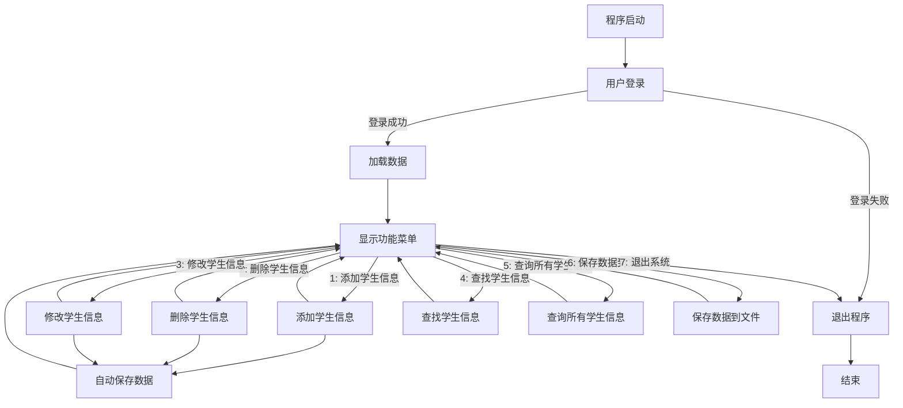

## 1. 需求

::: tabs

@tab img1


@tab img2


@tab img3


:::

## 2. 修改

::: code-tabs

@tab 原本代码

```python
import os  # 导入操作系统模块，用于文件操作

# 数据文件名
FILE = "data.txt"  # 定义保存学生信息的文件名

# 初始化 students 列表
students = []  # 用于存储学生信息的全局列表

# 检查文件是否存在，如果不存在则初始化文件
if not os.path.exists(FILE):  # 判断文件是否存在
    with open(FILE, "w", encoding="utf-8") as file:  # 如果文件不存在，则创建
        file.write(str(students))  # 写入空的学生列表

# 函数：加载数据
def load_data():
    """
    从文件中加载学生数据到全局列表 students
    """
    global students  # 声明使用全局变量
    with open(FILE, "r", encoding="utf-8") as file:  # 打开文件
        students = eval(file.read())  # 将文件内容解析为 Python 列表并赋值给 students

# 函数：保存数据
def save_data():
    """
    将全局列表 students 保存到文件
    """
    with open(FILE, "w", encoding="utf-8") as file:  # 以写入模式打开文件
        file.write(str(students))  # 将 students 列表转换为字符串写入文件

# 函数：登录验证
def login():
    """
    模拟用户登录功能
    """
    print("\n=== 用户登录 ===")  # 打印登录提示
    username = input("请输入用户名: ")  # 输入用户名
    password = input("请输入密码: ")  # 输入密码
    if username == "admin" and password == "123456":  # 验证用户名和密码
        print("登录成功！")  # 登录成功提示
        return True  # 返回登录成功状态
    else:
        print("用户名或密码错误，请重试！")  # 登录失败提示
        return False  # 返回登录失败状态

# 函数：显示菜单
def menu():
    """
    显示功能菜单
    """
    print("\n=== 功能菜单 ===")  # 打印菜单标题
    print("1. 添加学生信息")  # 选项 1
    print("2. 删除学生信息")  # 选项 2
    print("3. 修改学生信息")  # 选项 3
    print("4. 查找学生信息")  # 选项 4
    print("5. 查询所有学生信息")  # 选项 5
    print("6. 保存数据到文件")  # 选项 6
    print("7. 退出系统")  # 选项 7

# 函数：添加学生信息
def add_student():
    """
    添加新的学生信息
    """
    print("\n=== 添加学生信息 ===")  # 打印功能标题
    name = input("请输入学生姓名: ")  # 输入学生姓名
    age = int(input("请输入学生年龄: "))  # 输入学生年龄，并转换为整数
    gender = input("请输入学生性别: ")  # 输入学生性别
    phone = input("请输入学生手机号: ")  # 输入学生手机号
    address = input("请输入学生家庭住址: ")  # 输入学生家庭住址
    # 创建一个字典保存学生信息
    student = {"name": name, "age": age, "gender": gender, "phone": phone, "address": address}
    students.append(student)  # 将学生信息添加到全局列表
    print("学生信息添加成功！")  # 提示添加成功

# 函数：删除学生信息
def delete_student():
    """
    根据学生姓名删除学生信息
    """
    print("\n=== 删除学生信息 ===")  # 打印功能标题
    name = input("请输入要删除的学生姓名: ")  # 输入要删除的学生姓名
    for student in students:  # 遍历学生列表
        if student["name"] == name:  # 匹配姓名
            students.remove(student)  # 从列表中删除学生信息
            print("学生信息删除成功！")  # 提示删除成功
            return  # 退出函数
    print("未找到该学生信息！")  # 如果未找到学生信息，提示

# 函数：修改学生信息
def edit_student():
    """
    根据学生姓名修改学生信息
    """
    print("\n=== 修改学生信息 ===")  # 打印功能标题
    name = input("请输入要修改的学生姓名: ")  # 输入要修改的学生姓名
    for student in students:  # 遍历学生列表
        if student["name"] == name:  # 匹配姓名
            student["age"] = int(input("请输入新的年龄: "))  # 修改年龄
            student["gender"] = input("请输入新的性别: ")  # 修改性别
            student["phone"] = input("请输入新的手机号: ")  # 修改手机号
            student["address"] = input("请输入新的家庭住址: ")  # 修改家庭住址
            print("学生信息修改成功！")  # 提示修改成功
            return  # 退出函数
    print("未找到该学生信息！")  # 如果未找到学生信息，提示

# 函数：查找单个学生信息
def find_student():
    """
    根据学生姓名查找学生信息
    """
    print("\n=== 查找学生信息 ===")  # 打印功能标题
    name = input("请输入要查找的学生姓名: ")  # 输入要查找的学生姓名
    for student in students:  # 遍历学生列表
        if student["name"] == name:  # 匹配姓名
            print(student)  # 打印找到的学生信息
            return  # 退出函数
    print("未找到该学生信息！")  # 如果未找到学生信息，提示

# 函数：查询所有学生信息
def find_all_student():
    """
    查询并打印所有学生信息
    """
    print("\n=== 所有学生信息 ===")  # 打印功能标题
    for student in students:  # 遍历学生列表
        print(student)  # 打印每个学生信息

# 主函数：程序逻辑
def main():
    """
    主程序逻辑，包括登录、功能菜单显示及功能操作
    """
    if not login():  # 调用登录函数
        return  # 如果登录失败，退出程序

    load_data()  # 加载数据文件
    while True:  # 无限循环，等待用户输入功能编号
        menu()  # 显示功能菜单
        choice = input("请输入功能序号: ")  # 输入功能编号

        if choice == "1":  # 添加学生信息
            add_student()
        elif choice == "2":  # 删除学生信息
            delete_student()
        elif choice == "3":  # 修改学生信息
            edit_student()
        elif choice == "4":  # 查找学生信息
            find_student()
        elif choice == "5":  # 查询所有学生信息
            find_all_student()
        elif choice == "6":  # 保存数据到文件
            save_data()
            print("数据已保存！")  # 提示保存成功
        elif choice == "7":  # 退出程序
            print("退出系统，再见！")  # 提示退出
            break  # 跳出循环，结束程序
        else:
            print("输入错误，请重新输入！")  # 提示输入无效

# 程序入口
if __name__ == "__main__":
    main()  # 调用主函数
```

:::

### 2.1 代码存在问题

1. os 需要去除；
2. 文件写入需要去除 os；
3. 代码数据无法实时更新和存储；


## 3. 如何阅读代码逻辑

::: tabs

@tab 知识点1

1. 从 main 函数开始进行阅读代码；
2. Python 当中，函数一遇到 return 就结束！
3. 登陆系统：查询学生信息——>学生信息在哪里？「在文本文件里面」——所以，我们启动程序的时候，需要数据就必须：读取文件内容；「`loda_data()`」
4. 函数内部不能修改全局变量，如果需要修改则用 global
5. `file.read() 读取文件内容，eval() 函数将字符串转换为列表（TODO: 一次性读取全部内容，数据类型是字符串）`


:::


## 4. 代码详细注释

::: code-tabs

@tab Code1

```python
# 数据文件名
FILE = "data.txt"  # 定义保存学生信息的文件名

# 初始化 students 列表
students = []  # 用于存储学生信息的全局列表


# 函数：加载数据
def load_data():
    """
    从文件中加载学生数据到全局列表 students
    """
    global students  # 声明使用全局变量 students，以便在此函数中对其进行修改
    with open(FILE, "r", encoding="utf-8") as file:  # 使用 utf-8 编码模式以只读方式打开文件
        students = eval(file.read())  # 将文件内容（字符串）通过 eval() 转换为 Python 列表并赋值给 students
        # file.read() 是一次性读取整个文件的内容，将其作为字符串返回
        # eval() 函数可以将字符串解析为有效的 Python 表达式，此处用来将字符串格式的列表转换回 Python 列表


# 函数：保存数据
def save_data():
    """
    将全局列表 students 保存到文件
    """
    with open(FILE, "w", encoding="utf-8") as file:  # 以写入模式打开文件，写入时同样使用 utf-8 编码
        file.write(str(students))  # 将 students（Python 列表）转换为字符串后写入文件


# 函数：登录验证
def login():
    """
    模拟用户登录功能
    """
    print("\n=== 用户登录 ===")  # 打印登录提示信息，用于界面显示
    username = input("请输入用户名: ")  # 通过 input() 函数获取用户输入的用户名
    password = input("请输入密码: ")  # 通过 input() 函数获取用户输入的密码
    if (username == "admin") and (password == "123456"):  # 判断用户名和密码是否与预设的相匹配
        print("登录成功！")  # 如果匹配成功，打印登录成功提示
        return True  # 返回 True 表示登录成功
    else:
        print("用户名或密码错误，请重试！")  # 如果用户名或密码错误，打印提示信息
        return False  # 返回 False 表示登录失败


# 函数：显示菜单
def menu():
    """
    显示功能菜单
    """
    print("\n=== 功能菜单 ===")  # 打印菜单标题，\n 表示换行
    print("1. 添加学生信息")  # 打印功能编号 1
    print("2. 删除学生信息")  # 打印功能编号 2
    print("3. 修改学生信息")  # 打印功能编号 3
    print("4. 查找学生信息")  # 打印功能编号 4
    print("5. 查询所有学生信息")  # 打印功能编号 5
    print("6. 保存数据到文件")  # 打印功能编号 6
    print("7. 退出系统")  # 打印功能编号 7


# 函数：添加学生信息
def add_student():
    """
    添加新的学生信息
    """
    print("\n=== 添加学生信息 ===")  # 功能界面标题，\n 表示换行
    name = input("请输入学生姓名: ")  # 提示用户输入学生姓名，并用变量接收
    age = int(input("请输入学生年龄: "))  # 提示用户输入学生年龄，并将输入内容转换为 int 类型
    gender = input("请输入学生性别: ")  # 提示用户输入学生性别
    phone = input("请输入学生手机号: ")  # 提示用户输入学生手机号
    address = input("请输入学生家庭住址: ")  # 提示用户输入家庭住址
    
    # 创建一个字典保存学生信息
    student = {
        "name": name,      # 学生姓名
        "age": age,        # 学生年龄
        "gender": gender,  # 学生性别
        "phone": phone,    # 学生手机号
        "address": address # 学生家庭住址
    }
    
    students.append(student)  # 将新建的学生信息字典添加到全局列表 students 中
    print("学生信息添加成功！")  # 提示用户学生信息已添加

    # 在此处自动保存一次数据
    save_data()  # 调用保存函数，将数据保存到文件中
    print("学生信息已自动保存到文件。")  # 提示保存成功


# 函数：删除学生信息
def delete_student():
    """
    根据学生姓名删除学生信息
    """
    print("\n=== 删除学生信息 ===")  # 功能界面标题
    name = input("请输入要删除的学生姓名: ")  # 提示用户输入要删除的学生姓名
    for student in students:  # 遍历全局列表 students
        # TODO：得到学生列表中每个字典
        if student["name"] == name:  # 判断当前遍历到的学生姓名是否与输入的姓名相同
            students.remove(student)  # 从列表中删除该学生的信息
            print("学生信息删除成功！")  # 提示用户删除成功

            # 在此处自动保存一次数据
            save_data()  
            print("更新已自动保存到文件。")
            return  # 找到并删除后，直接 return 退出函数，不再继续遍历
    print("未找到该学生信息！")  # 如果循环结束还未找到匹配信息，则提示未找到


# 函数：修改学生信息
def edit_student():
    """
    根据学生姓名修改学生信息
    """
    print("\n=== 修改学生信息 ===")  # 功能界面标题
    name = input("请输入要修改的学生姓名: ")  # 提示用户输入要修改信息的学生姓名
    for student in students:  # 遍历学生列表
        if student["name"] == name:  # 如果找到匹配的学生姓名
            student["age"] = int(input("请输入新的年龄: "))  # 修改该学生年龄（转换为整数）
            student["gender"] = input("请输入新的性别: ")  # 修改该学生性别
            student["phone"] = input("请输入新的手机号: ")  # 修改该学生手机号
            student["address"] = input("请输入新的家庭住址: ")  # 修改该学生家庭住址
            print("学生信息修改成功！")  # 提示修改成功

            # 在此处自动保存一次数据
            save_data()
            print("更新已自动保存到文件。")
            return  # 修改完成后直接 return 退出函数
    print("未找到该学生信息！")  # 如果未找到匹配的姓名，则提示


# 函数：查找单个学生信息
def find_student():
    """
    根据学生姓名查找学生信息
    """
    print("\n=== 查找学生信息 ===")  # 功能界面标题
    name = input("请输入要查找的学生姓名: ")  # 提示用户输入要查找的学生姓名
    for student in students:  # 遍历学生列表
        if student["name"] == name:  # 如果匹配到学生姓名
            print(student)  # 打印该学生信息（字典格式）
            return  # 找到后退出函数
    print("未找到该学生信息！")  # 如果未找到，提示用户


# 函数：查询所有学生信息
def find_all_student():
    """
    查询并打印所有学生信息
    """
    print("\n=== 所有学生信息 ===")  # 功能界面标题
    for student in students:  # 遍历学生列表
        print(student)  # 打印每个学生的信息


# 主函数：程序逻辑
def main():
    """
    主程序逻辑，包括登录、功能菜单显示及功能操作
    """
    if not login():  # 调用登录函数，如果返回 False，则表示登录失败
        return  # 登录失败则退出 main 函数，不继续执行后续代码

    load_data()  # 如果登录成功，则先加载数据文件到全局 students 列表
    while True:  # 使用 while True 实现一个“循环菜单”，直到用户选择退出为止
        menu()  # 显示功能菜单
        choice = input("请输入功能序号: ")  # 提示用户输入菜单选项序号

        if choice == "1":  # 如果用户输入 "1"
            add_student()  # 调用添加学生信息函数
        elif choice == "2":  # 用户输入 "2"
            delete_student()  # 调用删除学生信息函数
        elif choice == "3":  # 用户输入 "3"
            edit_student()  # 调用修改学生信息函数
        elif choice == "4":  # 用户输入 "4"
            find_student()  # 调用查找单个学生信息函数
        elif choice == "5":  # 用户输入 "5"
            find_all_student()  # 调用查询所有学生信息函数
        elif choice == "6":  # 用户输入 "6"
            save_data()  # 调用保存数据函数
            print("数据已保存！")  # 提示保存成功
        elif choice == "7":  # 用户输入 "7"
            print("退出系统，再见！")  # 打印退出提示信息
            break  # 使用 break 跳出当前 while 循环，从而结束程序
            # TODO: break 只会结束这一层循环，因此这里用于退出主程序
        else:
            print("输入错误，请重新输入！")  # 当输入的选项不在 1~7 范围内时，提示输入错误


# # 程序入口
# if __name__ == "__main__":
#     main()  # 调用主函数

main()  # 在脚本结尾处直接调用 main 函数，启动程序

# print("这个文件：", __name__)
# 函数名+()
```

@tab Code2

```python
# -*- coding: utf-8 -*-
"""
此脚本主要实现学生信息管理系统，包括以下功能：
1. 模拟用户登录
2. 从文件中加载学生信息
3. 显示功能菜单
4. 添加、删除、修改、查找学生信息
5. 显示所有学生信息
6. 将学生信息保存到文件
7. 退出系统
"""

# 数据文件名，定义存储学生信息的文本文件路径
FILE = "data.txt"  # 用于保存和读取学生信息

# 初始化学生信息列表，作为全局变量使用
students = []  # 用来存储学生信息的列表，每个元素都是一个字典


def load_data():
    """
    函数功能：从文件中加载学生数据到全局列表 students

    逻辑说明：
    1. 使用 global students 声明 students 为全局变量，确保函数内的修改作用于全局范围。
    2. 用 open() 函数打开 FILE 指定的文件，模式为 "r"（只读），编码为 utf-8。
    3. 读取整个文件内容并使用 eval() 将字符串转换成 Python 对象（列表）。
    4. 将转换后的列表赋值给全局变量 students。
    
    注意：eval() 存在安全风险，若文件内容被恶意修改可能造成安全问题，在实际生产环境中需慎用。
    """
    global students  # 声明 students 为全局变量，让函数内部修改能影响外部
    with open(FILE, "r", encoding="utf-8") as file:  # 打开数据文件，编码设为 utf-8
        file_content = file.read()  # 一次性读取整个文件内容，返回字符串
        students = eval(file_content)  # 使用 eval() 将字符串内容转换成 Python 列表并赋值给 students
        # students 现在就是一个包含学生信息字典的列表


def save_data():
    """
    函数功能：将全局列表 students 中的学生信息保存到文件

    逻辑说明：
    1. 使用 open() 函数以写入模式（"w"）打开 FILE 文件。
    2. 将 students 列表转换为字符串（str()），并写入文件中。
    3. 关闭文件后数据即保存完毕。
    """
    with open(FILE, "w", encoding="utf-8") as file:  # 以写入模式打开文件，编码设为 utf-8
        file.write(str(students))  # 将 students 列表转换为字符串写入文件
        # 写入完成后会自动关闭文件


def login():
    """
    函数功能：模拟用户登录功能

    逻辑说明：
    1. 提示用户输入用户名和密码。
    2. 验证用户名是否为 "admin"，密码是否为 "123456"。
    3. 若匹配成功，返回 True；否则返回 False。
    4. 通过返回值在 main() 函数中决定是否继续执行程序。
    """
    print("\n=== 用户登录 ===")  # 提示界面信息
    username = input("请输入用户名: ")  # 读取用户输入的用户名
    password = input("请输入密码: ")    # 读取用户输入的密码
    
    # 判断用户名和密码是否匹配预设值
    if (username == "admin") and (password == "123456"):
        print("登录成功！")  # 打印成功提示
        return True          # 返回 True 表示登录通过
    else:
        print("用户名或密码错误，请重试！")  # 打印失败提示
        return False         # 返回 False 表示登录失败


def menu():
    """
    函数功能：显示系统功能菜单

    逻辑说明：
    1. 打印若干行提示，将可用功能编号及描述输出给用户。
    2. 用户可根据编号选择相应功能。
    """
    print("\n=== 功能菜单 ===")  # 菜单标题
    print("1. 添加学生信息")   # 选项 1
    print("2. 删除学生信息")   # 选项 2
    print("3. 修改学生信息")   # 选项 3
    print("4. 查找学生信息")   # 选项 4
    print("5. 查询所有学生信息") # 选项 5
    print("6. 保存数据到文件")  # 选项 6
    print("7. 退出系统")       # 选项 7


def add_student():
    """
    函数功能：添加新的学生信息

    逻辑说明：
    1. 依次让用户输入姓名、年龄、性别、手机号和家庭住址。
    2. 将这些信息封装到一个字典中。
    3. 将该字典添加到 students 列表中。
    4. 自动调用 save_data() 函数将最新数据保存到文件。
    """
    print("\n=== 添加学生信息 ===")  # 提示标题
    # 获取学生的各项信息
    name = input("请输入学生姓名: ")         # 用户输入学生姓名，字符串类型
    age = int(input("请输入学生年龄: "))      # 用户输入学生年龄，需转换为整数
    gender = input("请输入学生性别: ")       # 用户输入学生性别
    phone = input("请输入学生手机号: ")       # 用户输入手机号
    address = input("请输入学生家庭住址: ")    # 用户输入家庭住址
    
    # 使用字典结构保存学生信息
    student = {
        "name": name,
        "age": age,
        "gender": gender,
        "phone": phone,
        "address": address
    }
    students.append(student)  # 将新学生信息添加到全局 students 列表
    print("学生信息添加成功！")  # 提示添加成功

    # 自动保存数据到文件，防止程序意外退出导致数据丢失
    save_data()
    print("学生信息已自动保存到文件。")


def delete_student():
    """
    函数功能：根据学生姓名删除学生信息

    逻辑说明：
    1. 提示用户输入要删除的学生姓名。
    2. 遍历全局 students 列表，查找是否存在指定姓名的学生。
    3. 如果找到，则将其从列表中删除，并保存更新到文件。
    4. 如果找不到，打印提示信息。
    """
    print("\n=== 删除学生信息 ===")    # 功能提示
    name = input("请输入要删除的学生姓名: ")  # 用户输入想要删除的学生姓名
    
    # 遍历 students 列表，找出匹配的学生信息
    for student in students:
        # 判断当前遍历到的学生信息字典中的 "name" 是否为用户输入的姓名
        if student["name"] == name:
            students.remove(student)  # 从列表中删除这个学生信息
            print("学生信息删除成功！")  # 提示删除成功

            # 自动保存数据到文件
            save_data()
            print("更新已自动保存到文件。")
            return  # 找到后删除并返回，不再继续循环
    
    # 如果循环结束都没有找到对应的学生信息，则提示
    print("未找到该学生信息！")


def edit_student():
    """
    函数功能：根据学生姓名修改学生信息

    逻辑说明：
    1. 让用户输入需要修改的学生姓名。
    2. 在 students 列表中查找该姓名对应的学生信息。
    3. 如果找到，则让用户输入新的年龄、性别、手机号和家庭住址并更新。
    4. 保存更新后的数据到文件；如果找不到则提示未找到信息。
    """
    print("\n=== 修改学生信息 ===")   # 功能提示
    name = input("请输入要修改的学生姓名: ")  # 用户输入要修改信息的学生姓名

    # 遍历 students 列表，查找匹配的学生
    for student in students:
        if student["name"] == name:  # 找到匹配的学生姓名
            # 修改对应的信息
            student["age"] = int(input("请输入新的年龄: "))     
            student["gender"] = input("请输入新的性别: ")        
            student["phone"] = input("请输入新的手机号: ")        
            student["address"] = input("请输入新的家庭住址: ")    
            print("学生信息修改成功！")

            # 自动保存数据到文件
            save_data()
            print("更新已自动保存到文件。")
            return  # 修改完成后结束函数
    
    # 若未找到匹配的学生姓名
    print("未找到该学生信息！")


def find_student():
    """
    函数功能：根据学生姓名查找学生信息

    逻辑说明：
    1. 提示用户输入学生姓名。
    2. 遍历 students 列表，查找匹配的学生信息。
    3. 如果找到则打印该学生信息，如果找不到则提示用户。
    """
    print("\n=== 查找学生信息 ===")   # 功能提示
    name = input("请输入要查找的学生姓名: ")  # 用户输入要查找的学生姓名
    
    # 在全局 students 列表中查找
    for student in students:
        if student["name"] == name:  # 如果找到匹配的学生
            print(student)           # 打印学生信息字典
            return                  # 找到后退出函数
    print("未找到该学生信息！")       # 未找到匹配信息


def find_all_student():
    """
    函数功能：查询并打印所有学生信息

    逻辑说明：
    1. 遍历全局 students 列表。
    2. 将每一个学生信息字典打印到控制台。
    3. 如果列表为空，则什么也不会输出。
    """
    print("\n=== 所有学生信息 ===")   # 功能提示
    for student in students:  # 遍历学生列表
        print(student)        # 逐条打印学生信息字典


def main():
    """
    函数功能：主程序逻辑

    逻辑说明：
    1. 调用 login() 函数进行模拟登录，如果返回值为 False（表示登录失败），则直接退出函数。
    2. 如果登录成功，则调用 load_data() 函数从文件中加载现有的学生信息。
    3. 进入一个 while True 循环，用于显示菜单并等待用户输入选项。
    4. 根据用户输入的功能编号，调用对应的函数执行相关操作。
    5. 当用户输入“7”时，打印退出提示，并用 break 跳出循环，结束程序。
    6. 如输入无效编号，则提示用户重新输入。
    """
    if not login():  # 如果登录返回 False，则退出
        return       # 终止 main 函数

    load_data()  # 登录成功后，先加载数据到 students 列表
    while True:   # 进入无限循环，等待用户选择菜单选项
        menu()    # 显示功能菜单
        choice = input("请输入功能序号: ")  # 等待用户输入功能序号

        if choice == "1":
            add_student()        # 添加学生信息
        elif choice == "2":
            delete_student()     # 删除学生信息
        elif choice == "3":
            edit_student()       # 修改学生信息
        elif choice == "4":
            find_student()       # 查找单个学生信息
        elif choice == "5":
            find_all_student()   # 查询所有学生信息
        elif choice == "6":
            save_data()          # 保存数据到文件
            print("数据已保存！")
        elif choice == "7":
            print("退出系统，再见！")
            break                 # 结束循环
        else:
            print("输入错误，请重新输入！")  # 无效选项提示


# 如果需要在脚本被直接执行时运行主函数，通常会使用下面的逻辑：
# if __name__ == "__main__":
#     main()

# 直接调用 main() 函数用于测试或直接运行
main()

# print("这个文件：", __name__)
# 函数名+()

```

@tab 最后

```python
# -*- coding: utf-8 -*-
"""
此脚本主要实现学生信息管理系统，包括以下功能：
1. 模拟用户登录
2. 从文件中加载学生信息
3. 显示功能菜单
4. 添加、删除、修改、查找学生信息
5. 显示所有学生信息
6. 将学生信息保存到文件
7. 退出系统
"""

# 数据文件名，定义存储学生信息的文本文件路径
FILE = "data.txt"  # 用于保存和读取学生信息

# 初始化学生信息列表，作为全局变量使用
students = []  # 用来存储学生信息的列表，每个元素都是一个字典


def load_data():
    """
    函数功能：从文件中加载学生数据到全局列表 students

    逻辑说明：
    1. 使用 global students 声明 students 为全局变量，确保函数内的修改作用于全局范围。
    2. 用 open() 函数打开 FILE 指定的文件，模式为 "r"（只读），编码为 utf-8。
    3. 读取整个文件内容并使用 eval() 将字符串转换成 Python 对象（列表）。
    4. 将转换后的列表赋值给全局变量 students。
    
    注意：eval() 存在安全风险，若文件内容被恶意修改可能造成安全问题，在实际生产环境中需慎用。
    """
    global students  # 声明 students 为全局变量，让函数内部修改能影响外部
    with open(FILE, "r", encoding="utf-8") as file:  # 打开数据文件，编码设为 utf-8
        file_content = file.read()  # 一次性读取整个文件内容，返回字符串
        students = eval(file_content)  # 使用 eval() 将字符串内容转换成 Python 列表并赋值给 students
        # students 现在就是一个包含学生信息字典的列表


def save_data():
    """
    函数功能：将全局列表 students 中的学生信息保存到文件

    逻辑说明：
    1. 使用 open() 函数以写入模式（"w"）打开 FILE 文件。
    2. 将 students 列表转换为字符串（str()），并写入文件中。
    3. 关闭文件后数据即保存完毕。
    """
    with open(FILE, "w", encoding="utf-8") as file:  # 以写入模式打开文件，编码设为 utf-8
        file.write(str(students))  # 将 students 列表转换为字符串写入文件
        # 写入完成后会自动关闭文件


def login():
    """
    函数功能：模拟用户登录功能

    逻辑说明：
    1. 提示用户输入用户名和密码。
    2. 验证用户名是否为 "admin"，密码是否为 "123456"。
    3. 若匹配成功，返回 True；否则返回 False。
    4. 通过返回值在 main() 函数中决定是否继续执行程序。
    """
    print("\n=== 用户登录 ===")  # 提示界面信息
    username = input("请输入用户名: ")  # 读取用户输入的用户名
    password = input("请输入密码: ")    # 读取用户输入的密码
    
    # 判断用户名和密码是否匹配预设值
    if (username == "admin") and (password == "123456"):
        print("登录成功！")  # 打印成功提示
        return True          # 返回 True 表示登录通过
    else:
        print("用户名或密码错误，请重试！")  # 打印失败提示
        return False         # 返回 False 表示登录失败


def menu():
    """
    函数功能：显示系统功能菜单

    逻辑说明：
    1. 打印若干行提示，将可用功能编号及描述输出给用户。
    2. 用户可根据编号选择相应功能。
    """
    print("\n=== 功能菜单 ===")  # 菜单标题
    print("1. 添加学生信息")   # 选项 1
    print("2. 删除学生信息")   # 选项 2
    print("3. 修改学生信息")   # 选项 3
    print("4. 查找学生信息")   # 选项 4
    print("5. 查询所有学生信息") # 选项 5
    print("6. 保存数据到文件")  # 选项 6
    print("7. 退出系统")       # 选项 7


def add_student():
    """
    函数功能：添加新的学生信息

    逻辑说明：
    1. 依次让用户输入姓名、年龄、性别、手机号和家庭住址。
    2. 将这些信息封装到一个字典中。
    3. 将该字典添加到 students 列表中。
    4. 自动调用 save_data() 函数将最新数据保存到文件。
    """
    print("\n=== 添加学生信息 ===")  # 提示标题
    # 获取学生的各项信息
    name = input("请输入学生姓名: ")         # 用户输入学生姓名，字符串类型
    age = int(input("请输入学生年龄: "))      # 用户输入学生年龄，需转换为整数
    gender = input("请输入学生性别: ")       # 用户输入学生性别
    phone = input("请输入学生手机号: ")       # 用户输入手机号
    address = input("请输入学生家庭住址: ")    # 用户输入家庭住址
    
    # 使用字典结构保存学生信息
    student = {
        "name": name,
        "age": age,
        "gender": gender,
        "phone": phone,
        "address": address
    }
    students.append(student)  # 将新学生信息添加到全局 students 列表
    print("学生信息添加成功！")  # 提示添加成功

    # 自动保存数据到文件，防止程序意外退出导致数据丢失
    save_data()
    print("学生信息已自动保存到文件。")


def delete_student():
    """
    函数功能：根据学生姓名删除学生信息

    逻辑说明：
    1. 提示用户输入要删除的学生姓名。
    2. 遍历全局 students 列表，查找是否存在指定姓名的学生。
    3. 如果找到，则将其从列表中删除，并保存更新到文件。
    4. 如果找不到，打印提示信息。
    """
    print("\n=== 删除学生信息 ===")    # 功能提示
    name = input("请输入要删除的学生姓名: ")  # 用户输入想要删除的学生姓名
    
    # 遍历 students 列表，找出匹配的学生信息
    for student in students:
        # 判断当前遍历到的学生信息字典中的 "name" 是否为用户输入的姓名
        if student["name"] == name:
            students.remove(student)  # 从列表中删除这个学生信息
            print("学生信息删除成功！")  # 提示删除成功

            # 自动保存数据到文件
            save_data()
            print("更新已自动保存到文件。")
            return  # 找到后删除并返回，不再继续循环
    
    # 如果循环结束都没有找到对应的学生信息，则提示
    print("未找到该学生信息！")


def edit_student():
    """
    函数功能：根据学生姓名修改学生信息

    逻辑说明：
    1. 让用户输入需要修改的学生姓名。
    2. 在 students 列表中查找该姓名对应的学生信息。
    3. 如果找到，则让用户输入新的年龄、性别、手机号和家庭住址并更新。
    4. 保存更新后的数据到文件；如果找不到则提示未找到信息。
    """
    print("\n=== 修改学生信息 ===")   # 功能提示
    name = input("请输入要修改的学生姓名: ")  # 用户输入要修改信息的学生姓名

    # 遍历 students 列表，查找匹配的学生
    for student in students:
        if student["name"] == name:  # 找到匹配的学生姓名
            # 修改对应的信息
            student["age"] = int(input("请输入新的年龄: "))     
            student["gender"] = input("请输入新的性别: ")        
            student["phone"] = input("请输入新的手机号: ")        
            student["address"] = input("请输入新的家庭住址: ")    
            print("学生信息修改成功！")

            # 自动保存数据到文件
            save_data()
            print("更新已自动保存到文件。")
            return  # 修改完成后结束函数
    
    # 若未找到匹配的学生姓名
    print("未找到该学生信息！")


def find_student():
    """
    函数功能：根据学生姓名查找学生信息

    逻辑说明：
    1. 提示用户输入学生姓名。
    2. 遍历 students 列表，查找匹配的学生信息。
    3. 如果找到则打印该学生信息，如果找不到则提示用户。
    """
    print("\n=== 查找学生信息 ===")   # 功能提示
    name = input("请输入要查找的学生姓名: ")  # 用户输入要查找的学生姓名
    
    # 在全局 students 列表中查找
    for student in students:
        if student["name"] == name:  # 如果找到匹配的学生
            print(student)           # 打印学生信息字典
            return                  # 找到后退出函数
    print("未找到该学生信息！")       # 未找到匹配信息


def find_all_student():
    """
    函数功能：查询并打印所有学生信息

    逻辑说明：
    1. 遍历全局 students 列表。
    2. 将每一个学生信息字典打印到控制台。
    3. 如果列表为空，则什么也不会输出。
    """
    print("\n=== 所有学生信息 ===")   # 功能提示
    for student in students:  # 遍历学生列表
        print(student)        # 逐条打印学生信息字典


def main():
    """
    函数功能：主程序逻辑

    逻辑说明：
    1. 调用 login() 函数进行模拟登录，如果返回值为 False（表示登录失败），则直接退出函数。
    2. 如果登录成功，则调用 load_data() 函数从文件中加载现有的学生信息。
    3. 进入一个 while True 循环，用于显示菜单并等待用户输入选项。
    4. 根据用户输入的功能编号，调用对应的函数执行相关操作。
    5. 当用户输入“7”时，打印退出提示，并用 break 跳出循环，结束程序。
    6. 如输入无效编号，则提示用户重新输入。
    """
    if not login():  # 如果登录返回 False，则退出
        return       # 终止 main 函数

    load_data()  # 登录成功后，先加载数据到 students 列表
    while True:   # 进入无限循环，等待用户选择菜单选项
        menu()    # 显示功能菜单
        choice = input("请输入功能序号: ")  # 等待用户输入功能序号

        if choice == "1":  # 如果用户输入 "1"
            add_student()  # 调用添加学生信息函数
        elif choice == "2":  # 用户输入 "2"
            delete_student()  # 调用删除学生信息函数
        elif choice == "3":  # 用户输入 "3"
            edit_student()  # 调用修改学生信息函数
        elif choice == "4":  # 用户输入 "4"
            find_student()  # 调用查找单个学生信息函数
        elif choice == "5":  # 用户输入 "5"
            find_all_student()  # 调用查询所有学生信息函数
        elif choice == "6":  # 用户输入 "6"
            save_data()  # 调用保存数据函数
            print("数据已保存！")  # 提示保存成功
        elif choice == "7":  # 用户输入 "7"
            print("退出系统，再见！")  # 打印退出提示信息
            break  # 使用 break 跳出当前 while 循环，从而结束程序
            # TODO: break 只会结束这一层循环，因此这里用于退出主程序
        else:
            print("输入错误，请重新输入！")  # 当输入的选项不在 1~7 范围内时，提示输入错误


# 如果需要在脚本被直接执行时运行主函数，通常会使用下面的逻辑：
# if __name__ == "__main__":
#     main()

# 直接调用 main() 函数用于测试或直接运行
main()

# print("这个文件：", __name__)
# 函数名+()

```


:::

## 5. 讲解稿




各位好，今天我介绍一段用 Python 编写的“学生信息管理系统”示例代码。这个系统的主要功能包括：

1. 模拟用户登录
2. 从文件中加载学生信息
3. 显示功能菜单
4. 添加、删除、修改、查找学生信息
5. 显示所有学生信息
6. 将学生信息保存到文件
7. 最后退出系统

接下来，我将从整体逻辑到每一个关键函数，逐一为大家进行讲解。


### 一、整体架构

首先，这个代码有一个核心的“主函数”`main()`，它是整个程序的入口。程序最开始会让用户进行登录验证，如果登录失败，程序就退出；如果登录成功，则加载学生数据，并且在一个循环里，不断显示菜单，让用户去选择不同的功能，比如添加学生信息、删除、修改等等。

在程序退出时，或者在某些关键操作完成后，还会把最新的学生数据保存到文件中，以确保数据不丢失。

在代码开头，我们看到两个全局变量：

- `FILE = "data.txt"`：表示存储学生信息的文件名称。
- `students = []`：用于存储所有学生信息的全局列表，每一条学生信息都将以字典的形式保存在这个列表里。

这两行在整个脚本中非常关键，因为之后所有读写操作都是围绕 `FILE` 和 `students` 进行的。


### 二、函数解析

我们先来看看几个辅助函数的逻辑：

#### 1. `load_data()`

- 功能：从外部文件（data.txt）中读取学生信息并加载到全局列表 `students` 中。
- 逻辑：
    1. 用 `with open(FILE, "r", encoding="utf-8") as file:` 打开文件。
    2. 一次性读取所有内容到一个字符串里。
    3. 用 `eval()` 函数将这个字符串转换成 Python 列表，赋值给 `students`。
- 小提示：在实际生产环境，`eval()` 具有一定安全风险，应该替换成更安全的反序列化方法，比如 `json` 模块。

#### 2. `save_data()`

- 功能：将当前程序中的 `students` 列表写回到文件 `data.txt`，以便下次使用时能够读取到最新的数据。
- 逻辑：
    1. 以写入模式打开文件：`with open(FILE, "w", encoding="utf-8") as file:`
    2. 调用 `str(students)` 将列表转换成字符串。
    3. 写入文件后自动关闭。

通过 `load_data()` 和 `save_data()`，我们就实现了一个最基本的文件读写机制。


#### 3. `login()`

- 功能：简单的模拟登录验证。
- 逻辑：
    1. 提示用户输入用户名和密码。
    2. 程序中固定写死了用户名 `admin` 和密码 `123456`。
    3. 如果匹配成功，就返回 `True`；如果不匹配，就返回 `False`。
- 作用：这个功能看似简单，但给我们的系统增加了一个初步的安全验证流程，可以用于演示或测试。


#### 4. `menu()`

- 功能：打印出功能选项，让用户知道有哪些操作可以执行。
- 输出了 1~7 的选项，包括“添加学生信息”、“删除学生信息”、“修改学生信息”、“查找学生信息”、“查询所有学生信息”、“保存数据到文件”和“退出系统”。
- 这个函数本身没有任何逻辑运算，只是简单输出。它起到的作用是给用户一个界面指引，让用户选择他们想要执行的功能。


#### 5. `add_student()`

- 功能：添加新的学生信息。

- 逻辑：

    1. 先打印提示，如“`=== 添加学生信息 ===`”。

    2. 依次让用户输入姓名、年龄、性别、手机号和家庭住址。

    3. 将这些信息组合成一个字典，比如：

        ```python
        student = {
            "name": name,
            "age": age,
            "gender": gender,
            "phone": phone,
            "address": address
        }
        ```

    4. 把这个字典 `append` 到全局列表 `students` 里面。

    5. 最后调用 `save_data()` 自动保存。这样就可以避免一些意外导致的数据丢失。


#### 6. `delete_student()`

- 功能：根据姓名删除学生信息。
- 逻辑：
    1. 让用户输入想要删除的学生姓名。
    2. 在 `students` 列表里寻找是否有匹配的名字。
    3. 如果找到，就执行 `students.remove(student)`。
    4. 也同样调用 `save_data()` 保存更新后的数据。
    5. 如果遍历完都没找到，则提示“未找到该学生信息！”。


#### 7. `edit_student()`

- 功能：根据姓名修改学生信息。
- 逻辑：
    1. 用户输入要修改的学生姓名。
    2. 在 `students` 列表里寻找对应的记录。
    3. 找到后让用户输入新的年龄、性别、手机号、住址等，直接覆盖原来的字段。
    4. 同样也会调用 `save_data()`。
    5. 如果找不到，就提示“未找到该学生信息！”。


#### 8. `find_student()`

- 功能：根据姓名查找学生信息。
- 逻辑：
    1. 提示用户输入要查找的学生姓名。
    2. 遍历列表寻找对应名字，一旦找到就打印整条信息，然后 `return` 结束函数。
    3. 如果遍历完也没找到，就提示“未找到该学生信息！”。


#### 9. `find_all_student()`

- 功能：打印所有学生信息。
- 逻辑：
    1. 打印一个标题，比如“`=== 所有学生信息 ===`”。
    2. 用 `for student in students:` 遍历每一个学生信息并打印。
    3. 如果列表为空，就不会打印任何具体信息。


### 三、主函数 `main()`

接下来，我们看看最核心的 `main()` 函数。它负责整合和调度以上所有函数，让程序能够连续运转：

1. **登录**：先调用 `login()`，如果返回 `False`，说明验证失败，直接 `return`，不往下执行。
2. **加载数据**：登录成功后，马上调用 `load_data()`，把原先保存的学生信息读取进来。
3. 循环显示菜单：
    - 进入 `while True`，让程序保持一直运行，直到用户选择退出。
    - 先执行 `menu()`，打印出功能菜单供用户参考。
    - 用户输入功能序号，比如“1”就对应 `add_student()`，“2”对应 `delete_student()` 等等。
    - 如果输入不正确，则提示用户输入错误并让他重新输入。
4. **退出流程**：如果用户输入“7”，程序就打印“退出系统，再见！”，然后使用 `break` 跳出循环，函数执行完毕，程序也就结束了。

通过这个循环逻辑，整个学生信息管理系统就形成了一个可交互的菜单结构。用户可以反复执行添加、删除等操作，同时在每次增删改之后都会自动调用 `save_data()`，保证数据得以及时持久化。


### 四、运行与演示

如果我们直接在脚本结尾处写 `main()`，那么 Python 运行这个文件时，就会自动执行 `main()` 函数，开始登录和功能菜单的流程。
 在这份代码里，我们可以先在 `data.txt` 里留下一个空文件，也可以手动添加一些示例数据，以便在程序中看到更多演示效果。
 演示时，最简单的做法是：

1. 先登录（输入用户名 `admin`、密码 `123456`）
2. 程序提示“登录成功”
3. 加载数据文件中已有的学生信息（如果有的话）
4. 使用菜单选项，添加或删除学生，或者查找信息
5. 查看 `data.txt` 文件，确认数据是否成功写入或更新


### 五、总结

这份示例代码结构清晰、功能简单，适合初学者理解以下知识点：

- Python 的文件读写：`open(FILE, "r"/"w")`，`read()`，`write()` 等操作
- 列表和字典在实际应用中的配合使用
- 简单的文本序列化与反序列化（不过需要注意 `eval()` 的安全性）
- 函数之间的调用与数据共享，以及“主函数”在脚本中的调度作用

如果大家想进一步扩展，可以考虑：

1. 替换 `eval()` 为 JSON 模块进行数据存储，提高安全性和可读性。
2. 增加输入合法性校验，如检查年龄是否为数字、手机号的长度和格式等。
3. 增加多级菜单、权限管理、分页显示等更多功能，让系统更完善。

到这里，这个“学生信息管理系统”的讲解就结束了。希望能够帮助各位更好地理解 Python 的基本编程思路和函数调用逻辑。谢谢大家的观看，我们下次再见！


欢迎关注我公众号：AI悦创，有更多更好玩的等你发现！

::: details 公众号：AI悦创【二维码】


:::

::: info AI悦创·编程一对一

AI悦创·推出辅导班啦，包括「Python 语言辅导班、C++ 辅导班、java 辅导班、算法/数据结构辅导班、少儿编程、pygame 游戏开发、Linux、Web 全栈」，全部都是一对一教学：一对一辅导 + 一对一答疑 + 布置作业 + 项目实践等。当然，还有线下线上摄影课程、Photoshop、Premiere 一对一教学、QQ、微信在线，随时响应！微信：Jiabcdefh

C++ 信息奥赛题解，长期更新！长期招收一对一中小学信息奥赛集训，莆田、厦门地区有机会线下上门，其他地区线上。微信：Jiabcdefh

方法一：[QQ](http://wpa.qq.com/msgrd?v=3&uin=1432803776&site=qq&menu=yes)

方法二：微信：Jiabcdefh

:::


