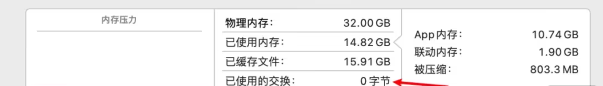

你好，我是悦创。

现在 m2 pro 都出了，主要是性能提升并不是很大，似乎 cpu 只有 10% 不到，而且我也用不上 GPU，为了升级 m2pro 要多花 3000 块钱，考虑再三还是放弃了，买了我的 m1pro 的 macbookpro，续航最强的 16寸版本。

# 为什么 16 寸

我在买电脑之前一直想象自己要买一个 14寸的笔记本，因为着实受不了这个重量。后来考虑到做设计和写代码比较需要大屏幕，再加上我不太可能外界屏幕（因为家里公司都没有外接显示器）也不打算配一个，因为我之前 16寸的 19款 MacBook Pro 的尺寸非常合适，所以最终考虑了三个多小时，还是选的 16寸。

对于 16寸和 14寸的选择，我的建议是：

- 写代码工作因为有的时候一行会比较长，较宽的屏幕更好展现

- 写代码 app 时右侧挂虚拟机，查看预览效果，所以较宽的屏幕更好展现

- 经常出差建议 macbookair 或者 14寸 pro

- 如果不打算外接显示器使用，建议酌情考虑 16寸

- 需要长续航选择16寸

---

# 我的这台机器

我选择了官翻机，一个是官翻机是支持14天无理由退货的，如果买到发现什么问题或者不喜欢还可以退掉。一个是官翻机从官网发货，快递走的空运也非常快（当然没有我淘宝店闪送快），一个是价格足够便宜（比淘宝店现在的还便宜）。还有一点是支持二十四期分期的。（这里建议一下，就是你即使可以全款付，如果是免息分期的话还是建议分期，毕竟也是白嫖一千多的分期手续费呢，而且分期算完价格如果凑不整的话还比全款便宜几块钱）

所以我的配置是

- M1 Pro Max
- 16寸
- 32G 内存
- 1TB 存储

价格两万五左右吧，这个也是考虑一方面内存真的不太够用了，之前 intel 下我的 16g 内存在日常使用占用满了不说，还吃了 10 个 G 的虚拟内存。

而换到 m1 之后我的内存中虚拟内存的占用为0。

