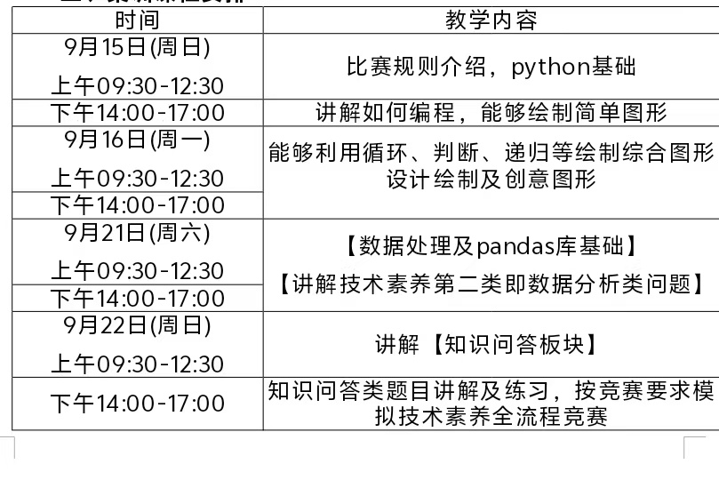
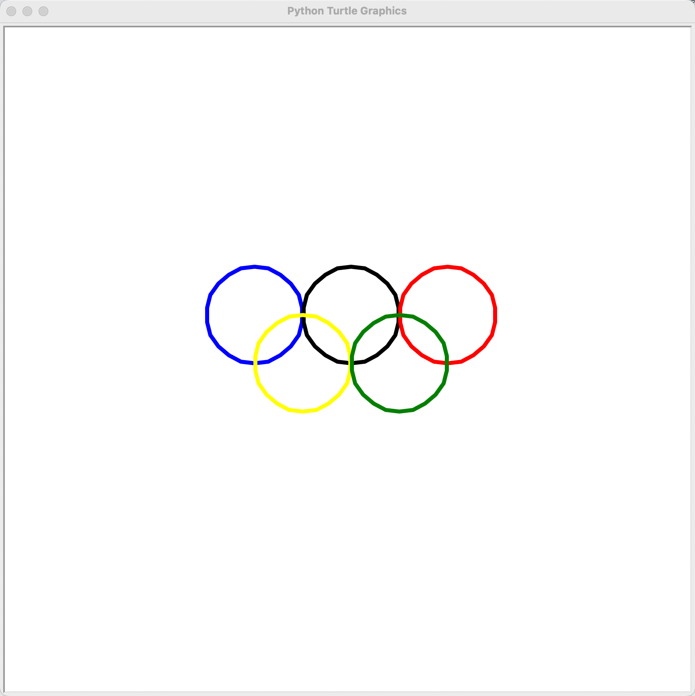
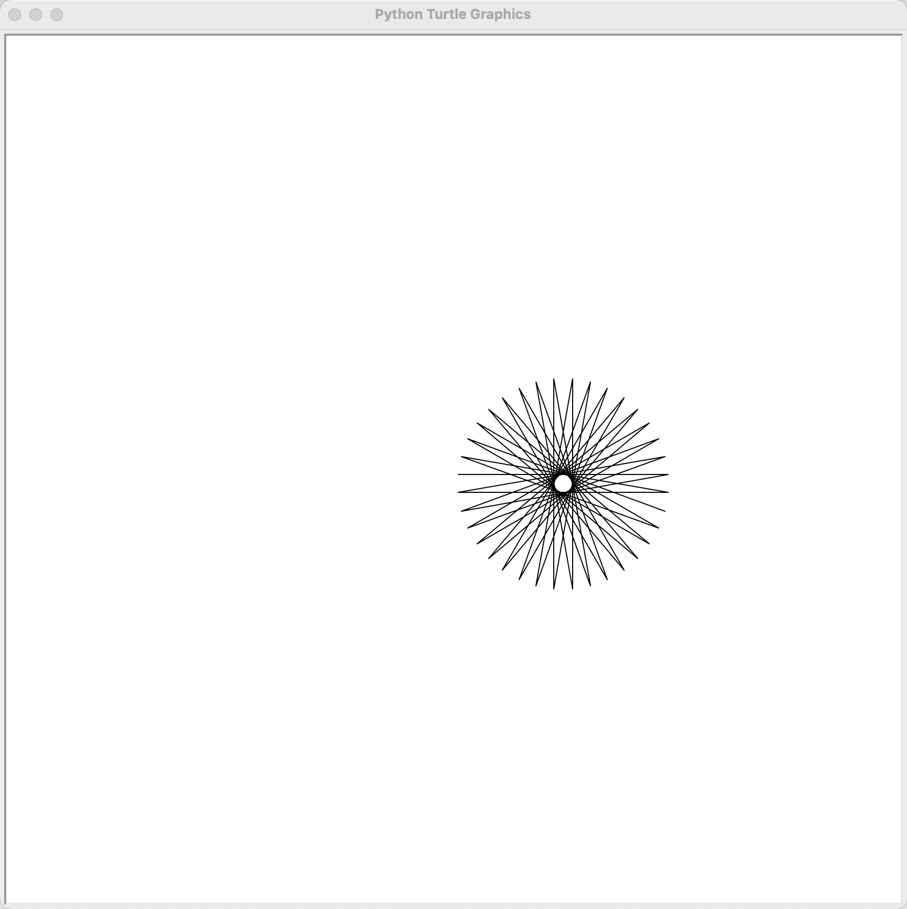
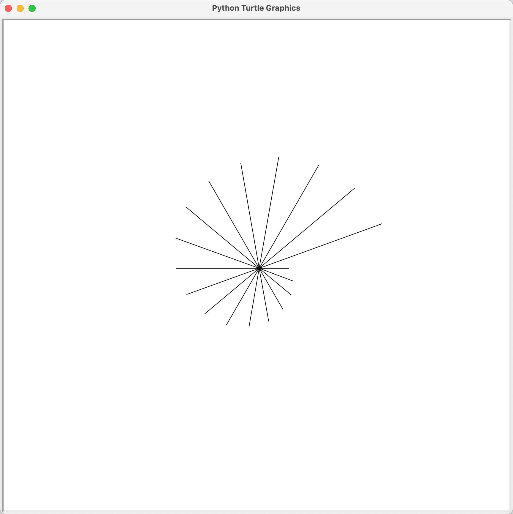

# 1. Message

- 考试日期📅：9月28日







- 在线画图：[https://bornforthis.cn/python/#/](https://bornforthis.cn/python/#/)


# 2. 试课

> 



<!-- tab 1. 晚间小练习 -->

## 1. 八色卡 base card

- 复现时间：**20分钟**

## 2. 要求说明

1. 按要求画出色卡对应图形的形状，做好边线条（如有）和填充颜色处理；（不考虑自动产生的箭头）
2. 长方形的长为100，宽为50；
3. 长方形从下到上，填充颜色代码分别是 `black`；`white`；`gray`；边缘线颜色都是 `black`；
4. 圆的半径是34；
5. 圆从左到右，填充颜色代码分别是 `(255,0,0)`；`(255,255,0)`；`(0,128,0)`；其中中间的圆外边缘线颜色代码是 `(128,128,128)`；
6. 五角星的间隔顶点的边长为68；
7. 五角星从下到上，颜色代码分别为 `(0,0,1)`；`(1,0.753,0.796)`；
8. A点坐标为 `(0,0)`；B点坐标为 `(200,32)`；C点坐标为 `(270,32)`；D点坐标为 `(340,32)`；E点坐标为 `(420,32)`；F点坐标为 `(420,126)`。

## 3. 图示

- 图中包含一个长方形、三个圆形、两个五角星以及各个点标记(A, B, C, D, E, F)和坐标轴。

<!-- endtab -->

<!-- tab 2. 笔记 -->

- `turtle.pensize(5)`  # 设置画笔的粗细为 5
- `turtle.pencolor('green')`  # 设置画笔颜色为绿色
- 思路：
    - 先实现效果
    - 然后再拆分空行，便于找规律
    - 发现重复代码（重复的逻辑代码）——loop（循环实现）
- 注意⚠️：
    - 列表创建语法不熟；
    - 变量命名不能和 Python 内置函数相同；
    - 函数使用要用 `()`，不是 `[]`；
    - 有点小粗心；

<!-- endtab -->

<!-- tab 3. Message -->

1. 复习
    1. for 循环
    2. `input()`
    3. point: 画图
        1. 皇冠
    4. 使用 turtle 的 circle 画出多边形

```python
import turtle as t
t.color('black','blue')
for i in range(12):
    t.begin_fill()
    t.circle(20+20*i,360,3)
    t.goto(0,0)
    t.left(15)
    t.end_fill()
```


<!-- endtab -->

<!-- tab 4.五环 -->









<!-- tab 1. 小宇代码-->

```python
import turtle as t
t.pensize(5)
t.pencolor('blak')
t.circle(60)
t.up()
t.goto(-120,0)
t.down()
t.pencolor('blue')
t.circle(60)
t.up()
t.goto(120,0)
t.down()
t.pencolor('red')
t.circle(60)
t.up()
t.goto(-60,-60)
t.down()
t.pencolor('yellow')
t.circle(60)
t.up()
t.goto(60,-60)
t.down()
t.pencolor('green')
t.circle(60)
```

<!-- endtab -->

<!-- tab 2. 原生代码-->

```python
import turtle  # 导入 turtle 模块

# 设置 turtle 的速度和画笔粗细
turtle.speed(2)  # 设置速度为 2
turtle.pensize(5)  # 设置画笔的粗细为 5

# 绘制第一个圆环（蓝色）
turtle.penup()  # 抬起画笔
turtle.goto(-120, 0)  # 移动到第一个圆环的位置
turtle.pendown()  # 放下画笔
turtle.pencolor('blue')  # 设置画笔颜色为蓝色
turtle.circle(60)  # 绘制半径为 60 的圆

# 绘制第二个圆环（黑色）
turtle.penup()  # 抬起画笔
turtle.goto(0, 0)  # 移动到第二个圆环的位置
turtle.pendown()  # 放下画笔
turtle.pencolor('black')  # 设置画笔颜色为黑色
turtle.circle(60)  # 绘制半径为 60 的圆

# 绘制第三个圆环（红色）
turtle.penup()  # 抬起画笔
turtle.goto(120, 0)  # 移动到第三个圆环的位置
turtle.pendown()  # 放下画笔
turtle.pencolor('red')  # 设置画笔颜色为红色
turtle.circle(60)  # 绘制半径为 60 的圆

# 绘制第四个圆环（黄色）
turtle.penup()  # 抬起画笔
turtle.goto(-60, -60)  # 移动到第四个圆环的位置
turtle.pendown()  # 放下画笔
turtle.pencolor('yellow')  # 设置画笔颜色为黄色
turtle.circle(60)  # 绘制半径为 60 的圆

# 绘制第五个圆环（绿色）
turtle.penup()  # 抬起画笔
turtle.goto(60, -60)  # 移动到第五个圆环的位置
turtle.pendown()  # 放下画笔
turtle.pencolor('green')  # 设置画笔颜色为绿色
turtle.circle(60)  # 绘制半径为 60 的圆

# 完成绘制，隐藏画笔箭头
turtle.hideturtle()
# 保持窗口打开，直到用户关闭
turtle.done()
```

<!-- endtab -->

<!-- tab 3. 使用循环-->

```python
import turtle  # 导入 turtle 模块

# 设置 turtle 的速度（2 代表较慢，范围是 0-10，数字越大速度越快）
turtle.speed(2)
# 设置画笔的粗细，单位为像素
turtle.pensize(5)

# 定义每个环的起始位置（相对于屏幕中心）
positions = [(-120, 0), (0, 0), (120, 0), (-60, -60), (60, -60)]
# 定义每个环的颜色，顺序为：蓝色、黑色、红色、黄色、绿色
colors = ['blue', 'black', 'red', 'yellow', 'green']

# 使用 zip 将位置和颜色结合起来，并进行迭代绘制五个环
for position, color in zip(positions, colors):
    turtle.penup()  # 抬起画笔，避免在移动过程中留下痕迹
    turtle.goto(position)  # 移动画笔到指定位置
    turtle.pendown()  # 放下画笔，准备开始绘制
    turtle.pencolor(color)  # 设置当前环的颜色
    turtle.circle(60)  # 绘制半径为 60 像素的圆

# 完成绘制，隐藏画笔箭头
turtle.hideturtle()
# 保持窗口打开，直到用户关闭
turtle.done()
```

<!-- endtab -->

<!-- tab 4. 小宇循环-->

```python
import turtle as t
t.pensize(5)
color=['blue','black','red','yellow','green']
positions=[(-120,0),(0,0),(120,0),(-60,-60),(60,-60)]
for i in range(5):
    t.up()
    t.goto(positions[i])
    t.down()
    t.pencolor(color[i])
    t.circle(60)
```


<!-- endtab -->



<!-- endtab -->

<!-- tab 5. 语法 -->

1. for 循环基础语法

```python
colors = ['red', 'yellow', 'blue', 'orange']
for detail in colors:
    print(detail)

for index in range(4):
    print(colors[index])
```

2. zip

```python
positions = [(-120, 0), (0, 0), (120, 0), (-60, -60), (60, -60)]
colors = ['blue', 'black', 'red', 'yellow', 'green']

zip_data = zip(positions, colors)
print(list(zip_data))

# ---output---
[((-120, 0), 'blue'), ((0, 0), 'black'), ((120, 0), 'red'), ((-60, -60), 'yellow'), ((60, -60), 'green')]
```



> 辅助理解 zip 大法！

<!-- tab 1. 多变量同时赋值 -->

```python
a, b = (1, 200)
print(a)
print(b)

# ---output---
1
200
```

<!-- endtab -->

<!-- tab 2. 循环 zip -->

```python
positions = [(-120, 0), (0, 0), (120, 0), (-60, -60), (60, -60)]
colors = ['blue', 'black', 'red', 'yellow', 'green']

zip_data = zip(positions, colors)

for data in zip_data:
    print(data)
    
# ---output---
((-120, 0), 'blue')
((0, 0), 'black')
((120, 0), 'red')
((-60, -60), 'yellow')
((60, -60), 'green')
```

<!-- endtab -->

<!-- tab 3. 进一步循环 -->

```python
import turtle

turtle.speed(2)
turtle.pensize(5)

positions = [(-120, 0), (0, 0), (120, 0), (-60, -60), (60, -60)]
colors = ['blue', 'black', 'red', 'yellow', 'green']

zip_data = zip(positions, colors)

for data in zip_data:
    position, color = data
    turtle.up()
    turtle.goto(position)
    turtle.down()
    turtle.pencolor(color)
    turtle.circle(60)
```

<!-- endtab -->

<!-- tab 4. 最终优化-->

```python
import turtle

turtle.speed(2)
turtle.pensize(5)

positions = [(-120, 0), (0, 0), (120, 0), (-60, -60), (60, -60)]
colors = ['blue', 'black', 'red', 'yellow', 'green']

zip_data = zip(positions, colors)

for position, color in zip_data:
    turtle.up()
    turtle.goto(position)
    turtle.down()
    turtle.pencolor(color)
    turtle.circle(60)
```

<!-- endtab -->



<!-- endtab -->



# 3. for 循环语法集训

> 



<!-- tab 1. 直接遍历列表 -->

```python
students_list = ["李雷", "韩梅梅", "马冬梅"]
for student in students_list:
    print(student)

# ---output---
李雷
韩梅梅
马冬梅
```

<!-- endtab -->

<!-- tab 2. range -->

- range(start, end, sep)
  - 默认从 0 开始
  - start: 开始的数
  - end: 结束的数(结束的数取不到)
  - sep: 间隔



<!-- tab 基础代码 -->

```python
for i in range(10):
    print(i)

# ---output---
0
1
2
3
4
5
6
7
8
9
```

<!-- endtab -->

<!-- tab 带有间隔 -->

```python
for i in range(0, 10, 2):
    print(i)

# ---output---
0
2
4
6
8
```

<!-- endtab -->

<!-- tab 输出奇数 -->

```python
for i in range(1, 10, 2):
    print(i)

# ---output---
1
3
5
7
9
```

<!-- endtab -->



<!-- endtab -->

<!-- tab 3. 通过索引遍历序列元素 -->

```python
student_list = ['李雷', '韩梅梅', '马冬梅']
for index in range(len(student_list)):
    print(student_list[index])

# ---output---
李雷
韩梅梅
马冬梅
```

<!-- endtab -->

<!-- tab 4. 小试牛刀 -->

操作如下列表，按要求输出目标结构：

- `student_list = ['李雷', '韩梅梅', '马冬梅']`

- 输出如下结果：

```python
st1_李雷
st2_韩梅梅
st3_马冬梅
```
- 代码：

```python
student_list = ['李雷', '韩梅梅', '马冬梅']
index = 1
for student in student_list:
    print('st' + str(index) + '_' + student)
    index += 1  # index = index + 1
```

<!-- endtab -->

<!-- tab 5. break 跳出循环 -->

```python
for i in range(10):
    print(i)
    if i > 5:
        break
```

```python
for i in range(10):
    if i > 5:
        break
    print(i)
```

```python
i = 0
while True:
    print(i)
    i = i + 1
    if i > 5:
        break
```

<!-- endtab -->

<!-- tab 6. 列表平方 -->

```python
numbers = [10, 2, 31, 4, 5, 6, 7, 8, 9, 10]
# 把列表里面的元素，平方放回去
print("操作之前:", numbers)
index = 0
for n in numbers:
    numbers[index] = n ** 2
    index += 1
    
print("平方之后:", numbers)
```

```python
numbers = [10, 2, 31, 4, 5, 6, 7, 8, 9, 10]
# 把列表里面的元素，平方放回去
print("操作之前:", numbers)

for index in range(len(numbers)):
    numbers[index] = numbers[index] ** 2

print("平方之后:", numbers)
```

<!-- endtab -->

<!-- tab 7. 将下面的代码改进 -->



<!-- tab 1. 目标图 -->

<!-- endtab -->

<!-- tab 2. 不使用 for -->

```python
import turtle

# 设置 turtle
t = turtle.Turtle()
t.speed(0)  # 设置速度为最快
turtle.bgcolor("white")  # 设置背景颜色
t.color("black")  # 设置画笔颜色

# 设置参数
angle = 170  # 旋转角度
line_length = 200  # 线的长度

# 逐步绘制图案
t.forward(line_length)
t.right(angle)

t.forward(line_length)
t.right(angle)

t.forward(line_length)
t.right(angle)

t.forward(line_length)
t.right(angle)

t.forward(line_length)
t.right(angle)

t.forward(line_length)
t.right(angle)

t.forward(line_length)
t.right(angle)

t.forward(line_length)
t.right(angle)

t.forward(line_length)
t.right(angle)

t.forward(line_length)
t.right(angle)

t.forward(line_length)
t.right(angle)

t.forward(line_length)
t.right(angle)

t.forward(line_length)
t.right(angle)

t.forward(line_length)
t.right(angle)

t.forward(line_length)
t.right(angle)

t.forward(line_length)
t.right(angle)

t.forward(line_length)
t.right(angle)

t.forward(line_length)
t.right(angle)

t.forward(line_length)
t.right(angle)

t.forward(line_length)
t.right(angle)

t.forward(line_length)
t.right(angle)

t.forward(line_length)
t.right(angle)

t.forward(line_length)
t.right(angle)

t.forward(line_length)
t.right(angle)

t.forward(line_length)
t.right(angle)

t.forward(line_length)
t.right(angle)

t.forward(line_length)
t.right(angle)

t.forward(line_length)
t.right(angle)

t.forward(line_length)
t.right(angle)

t.forward(line_length)
t.right(angle)

t.forward(line_length)
t.right(angle)

t.forward(line_length)
t.right(angle)

t.forward(line_length)
t.right(angle)

t.forward(line_length)
t.right(angle)

t.forward(line_length)
t.right(angle)

# 隐藏 turtle
t.hideturtle()

# 完成绘制
turtle.done()
```

<!-- endtab -->

<!-- tab 3. 改进 for 实现 -->
```python
import turtle

# Set up the turtle
t = turtle.Turtle()
t.speed(0)  # Set the drawing speed to the fastest
turtle.bgcolor("white")  # Set background color
t.color("black")  # Set pen color

# Draw the pattern
num_lines = 36  # Number of lines in the pattern
angle = 170     # Angle to turn the turtle
line_length = 200  # Length of each line

for _ in range(num_lines):
    t.forward(line_length)
    t.right(angle)

# Hide the turtle
t.hideturtle()

# Finish the drawing
turtle.done()
```
<!-- endtab -->



<!-- endtab -->

<!-- tab 8. 正五边形 -->
```python
import turtle as t

t.fd(200)
t.left(72)
t.fd(200)
t.left(72)
t.fd(200)
t.left(72)
t.fd(200)
t.left(72)
t.fd(200)
t.left(72)
t.done()
```
<!-- endtab -->

<!-- tab 9. 散射线 -->

<!-- tab 1. 效果图 -->

<!-- endtab -->
<!-- tab 2. 代码 -->
```python
import turtle

# 设置 turtle
t = turtle.Turtle()
t.speed(0)  # 设置速度为最快
turtle.bgcolor("white")  # 背景颜色
t.color("black")  # 画笔颜色

# 设置线的数量和角度
num_lines = 18  # 线的数量
initial_length = 50  # 初始线的长度
angle = 20  # 旋转的角度
length_increment = 10  # 每次增加的长度

# 逐条绘制线段
for i in range(num_lines):
    line_length = initial_length + i * length_increment  # 逐渐增加线的长度
    t.forward(line_length)
    t.backward(line_length)  # 返回起点
    t.right(angle)  # 旋转画笔

# 隐藏 turtle
t.hideturtle()

# 完成绘制
turtle.done()

```
```python
import turtle as t

for n in range(18):
    t.forward(100 + 20 * n)
    t.left(20)
    t.goto(0, 0)
# 隐藏 turtle
t.hideturtle()

# 完成绘制
t.done()
```
<!-- endtab -->

<!-- endtab -->

<!-- tab 10. 列表元素提取 -->
- 列表的索引：
  - 从左到右，下标从 0 开始；
  - 从右到左，下标从 -1 开始；
1. 提取单个元素

```python
numbers = ['a', 'b', 'c', 'd', 'e', 'f', 'g', 'h', 'i', 'j']
select = numbers[0]
print(select)

# 'd'
select = numbers[3]
print(select)

# 'j'(用三种方法实现)
print(numbers[8])
print(numbers[-1])
print(numbers[len(numbers) - 1])
```
2. 提取多个元素

```python
numbers = ['a', 'b', 'c', 'd', 'e', 'f', 'g', 'h', 'i', 'j']
select = numbers[0:3]
print(select)

# ['d', 'e', 'f', 'g']
select = numbers[3:7]
print(select)
```
<!-- endtab -->

<!-- tab 11.  -->

<!-- endtab -->




# 4. 练习



<!-- tab 1. 17日练习 -->

1. 简单



<!-- tab Question 1 -->

**题目：** 打印 1 到 10

> 用 for 循环打印从 1 到 10 的数字。
>
> 输出示例结果：
>
> ```python
> 1
> 2
> 3
> 4
> 5
> 6
> 7
> 8
> 9
> 10
> ```

<!-- endtab -->

<!-- tab Question 2 -->

<!-- endtab -->

<!-- tab Question 3 -->

<!-- endtab -->

<!-- tab Question 4 -->

<!-- endtab -->

<!-- tab Question 5 -->

<!-- endtab -->

<!-- tab Question 6 -->

<!-- endtab -->

<!-- tab Question 7 -->

<!-- endtab -->

<!-- tab Question 8 -->

<!-- endtab -->



2. 中等





3. 难





<!-- endtab -->

<!-- tab 2. 18日练习 -->

<!-- endtab -->

<!-- tab 3. 19日练习 -->

<!-- endtab -->











AI悦创·编程一对一

> AI悦创·推出辅导班啦，包括「Python 语言辅导班、C++ 辅导班、java 辅导班、算法/数据结构辅导班、少儿编程、pygame 游戏开发、Web、Linux」，全部都是一对一教学：一对一辅导 + 一对一答疑 + 布置作业 + 项目实践等。当然，还有线下线上摄影课程、Photoshop、Premiere 一对一教学、QQ、微信在线，随时响应！微信：Jiabcdefh
>
> C++ 信息奥赛题解，长期更新！长期招收一对一中小学信息奥赛集训，莆田、厦门地区有机会线下上门，其他地区线上。微信：Jiabcdefh
>
> 方法一：[QQ](http://wpa.qq.com/msgrd?v=3&uin=1432803776&site=qq&menu=yes)
>
> 方法二：微信：Jiabcdefh




