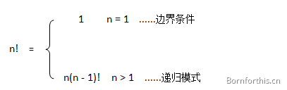

你好，我是悦创。

> 从前有座山，山里有座庙，庙里有个老和尚，正在给小和尚讲故事！故事是什么呢？『从前有座山，山里有座庙，庙里有个老和尚，正在给小和尚讲故事！故事是什么呢？』……

这也许是最经典（口耳相传）的童谣了，充分展现了自然语言的魅力及其无限可能性，可以永远以这种递归的方式继续下去。。。


俄文艺理论家车尔尼雪夫斯基曾说过：

> 艺术来源于生活，却又高于生活！

生活如此，编程世界亦如此 - 没有生活原形或者现象，何来程序创作的源头和灵感？正因此，Python 中出现了这样一种函数 - 递归函数。

大多数情况下，我们见到的是一个函数调用其他函数。除此之外，**函数还可以自我调用，这种类型的函数被称为递归函数。**


# 1. 递归函数

递归的一个视觉效果呈现 - 捧着画框的蒙娜丽莎：


递归（Recursion），在数学与计算科学中，是指在函数的定义中使用函数自身的方法。

在使用递归时，需要注意以下几点：

1. 递归就是在过程或函数里调用自身；
2. 边界调节：必须有一个明确的递归结束条件，称为递归出口。（确定递归到何时终止，也称为递归出口。）；
3. 递归模式：大问题是如何分解为小问题，也称递归体；

递归函数只有具备了这两个要素，才能在有限次计算后得出结果。

**注意：**切勿忘记递归出口，避免函数无限调用！

# 2. 典型的算法

## 2.1 阶乘

大多数学过数学、计算机科学或者读过编程相关书籍的人，想必都会遇到阶乘：

```bash
n! = 1 x 2 x 3 x ...... x n
```

也可以用递归方式定义：

```bash
n! = (n - 1)! x n
```



其中，`n >= 1`，并且 `0! = 1`。

由于简单、清晰，因此其常被用作递归的示例。

**PS：** 除阶乘以外，还有很多算法可以使用递归来处理，例如：斐波那契数列、汉诺塔等。

根据阶乘的定义，很容易就能写出求阶乘的递归算法。

### 2.1.1 迭代实现

使用基础的函数和 for 循环实现阶乘：

```python
In [1]: def factorial(n):
   ...:     result = 1 # 对于 0! = 1, 所以一开始就为 1
   ...:     for i in range(2, n+1): # 1. 对于阶乘, 0 或 1 开始是没有意义的，因为如果 n 是这两个数字的话，可以不用操作
   ...:         result *= i			# 2. 2 以前的数据是可以不用乘的（也就是 1）
   ...:     return result			# 3. range 是左闭右开的，所以 n 需要 +1
   ...:

In [2]: factorial(0)
Out[2]: 1

In [3]: factorial(1)
Out[3]: 1

In [4]: factorial(2)
Out[4]: 2

In [5]: factorial(3)
Out[5]: 6

In [6]: factorial(4)
Out[6]: 24

In [7]: factorial(5)
Out[7]: 120
```

开始时，result 为 1，进入 for 循环，对之前的结果累积乘以 i，直至 n。

### 2.1.2 递归实现

现在，来使用递归来实现，和数学定义一样优雅。

```python
In [4]:  def factorial(n):
   ...:     if n == 0 or n == 1:
   ...:        return 1  # 递归结束
   ...:     else:
   ...:        return n * factorial(n - 1) # 问题规模减1，递归调用
   ...:

In [5]: factorial(0)
Out[5]: 1

In [6]: factorial(1)
Out[6]: 1

In [7]: factorial(2)
Out[7]: 2

In [8]: factorial(3)
Out[8]: 6

In [9]: factorial(4)
Out[9]: 24

In [10]: factorial(5)
Out[10]: 120
```


当使用正整数调用 `factorial()` 时，会通过递减数字来递归地调用自己。

为了明确递归步骤，对 `5!` 进行过程分解：

```python
factorial(5)                        # 第 1 次调用使用 5
5 * factorial(4)                    # 第 2 次调用使用 4
5 * (4 * factorial(3))              # 第 3 次调用使用 3
5 * (4 * (3 * factorial(2)))        # 第 4 次调用使用 2
5 * (4 * (3 * (2 * factorial(1))))  # 第 5 次调用使用 1 
5 * (4 * (3 * (2 * 1)))             # 从第 5 次调用返回
5 * (4 * (3 * 2))                   # 从第 4 次调用返回
5 * (4 * 6)                         # 从第 3次调用返回
5 * 24                              # 从第 2 次调用返回
120                                 # 从第 1 次调用返回
```

当数字减少到 1 时，递归结束。

使用递归函数需要注意防止栈溢出。在计算机中，函数调用是通过栈（stack）这种数据结构实现的，每当进入一个函数调用，栈就会加一层栈帧，每当函数返回，栈就会减一层栈帧。由于栈的大小不是无限的，所以，递归调用的次数过多，会导致栈溢出。可以试试 factorial(1000)：

```python
Traceback (most recent call last):
  File "D:/Windows_Code/Tester/Lesson01_wxl/lesson02.py", line 8, in <module>
    r = factorial(1000)
  File "D:/Windows_Code/Tester/Lesson01_wxl/lesson02.py", line 5, in factorial
    return n * factorial(n - 1)  # 问题规模减1，递归调用
  File "D:/Windows_Code/Tester/Lesson01_wxl/lesson02.py", line 5, in factorial
    return n * factorial(n - 1)  # 问题规模减1，递归调用
  File "D:/Windows_Code/Tester/Lesson01_wxl/lesson02.py", line 5, in factorial
    return n * factorial(n - 1)  # 问题规模减1，递归调用
  [Previous line repeated 995 more times]
  File "D:/Windows_Code/Tester/Lesson01_wxl/lesson02.py", line 2, in factorial
    if n == 1 or n == 0:
RecursionError: maximum recursion depth exceeded in comparison
```

### 2.1.3 递归的优缺点

从“编程之美”的角度来看，引用一句伟大的计算机编程名言：

> To iterate is human,to recurse divine.
> 迭代者为人，递归者为神。
> – L. Peter Deutsch

**优点：**

1. 递归使代码看起来更加整洁、优雅；
2. 可以用递归将复杂任务分解成更简单的子问题；
3. 使用递归比使用一些嵌套迭代更容易；
4. 总之：递归函数的优点是定义简单，逻辑清晰。理论上，所有的递归函数都可以写成循环的方式，但循环的逻辑不如递归清晰。

**缺点：**

1. 递归的逻辑很难调试、跟进；
2. 递归调用的代价高昂（效率低），因为占用了大量的内存和时间。

## 2.2 高斯求和

典型的高斯求和问题，`1+2+3+4+…+99+100`，不使用递归的话，我们可以用循环，这么做：

```python
In [19]: def sum_number(n):
    ...:     total = 0
    ...:     for i in range(1, n+1):
    ...:         total += i
    ...:     return total
    ...:

In [20]: sum_number(100)
Out[20]: 5050
```

但如果使用递归函数来写，是这样的：

```python
In [21]: def sum_number(n):
    ...:     if n <= 0:
    ...:         return 0
    ...:     return n + sum_number(n-1)
    ...:

In [22]: sum_number(100)
Out[22]: 5050
```
**分析一下代码：**

- 当 n 小于等于 0 的时候，直接给出和值为 0，这句不能省。
- 当 n 大于 0 时，结果是 n 加上 `sum_number(n-1)` 。这里的 `sum_number(n-1)` 又是一次 `sum_number` 函数的调用，不过参数的值变成了 `n-1`。
- 要得 `sum_number(n)` 到的值就必须等待 `sum_number(n-1)` 的值被计算出来，同样要得到 `sum_number(n-1)` 的值必须等待 `sum_number(n-2)` 的值，如此一路推算下去，直到 `sum_number(0)`，因为 if 语句的存在，它不需要等待 `sum_number(-1)` 的计算了，而是直接给出结果 0。然后程序一路返回，直到回到最初的 `sum_number(n)`，并给出最终结果。

递归最核心的思想是：**每一次递归，整体问题都要比原来减小，并且递归到一定层次时，要能直接给出结果！**

## 2.3 斐波那契数列

斐波拉契数列，是这样的一个数列：`0、1、1、2、3、5、8、13、21、......`。

斐波拉契数列的核心思想是：从第三项起，每一项都等于前两项的和，即 `F(N) = F(N - 1) + F(N - 2) (N >= 2)` 并且规定 `F(0) = 0`，`F(1) = 1`

**要求：**利用递归算法获得指定项的斐波拉契数列。









AI悦创·编程一对一

> AI悦创·推出辅导班啦，包括「Python 语言辅导班、C++ 辅导班、java 辅导班、算法/数据结构辅导班、少儿编程、pygame 游戏开发、Web、Linux」，全部都是一对一教学：一对一辅导 + 一对一答疑 + 布置作业 + 项目实践等。当然，还有线下线上摄影课程、Photoshop、Premiere 一对一教学、QQ、微信在线，随时响应！微信：Jiabcdefh
>
> C++ 信息奥赛题解，长期更新！长期招收一对一中小学信息奥赛集训，莆田、厦门地区有机会线下上门，其他地区线上。微信：Jiabcdefh
>
> 方法一：[QQ](http://wpa.qq.com/msgrd?v=3&uin=1432803776&site=qq&menu=yes)
>
> 方法二：微信：Jiabcdefh



