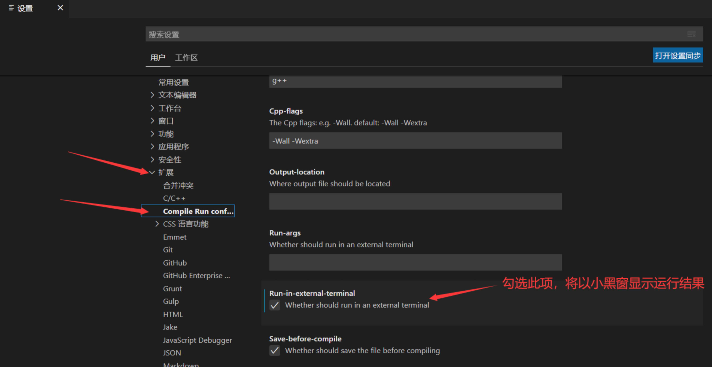
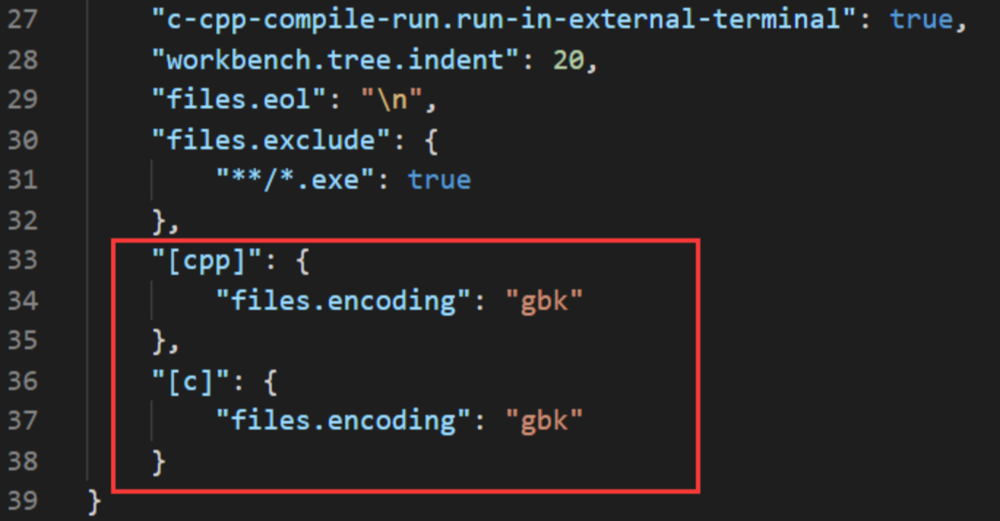

你好，我是悦创。

要在 Windows 上使用 VSCode 运行 C++ 程序，你需要进行一些环境配置，包括安装编译器、调试器以及配置 VSCode 的 C++ 扩展。以下是详细步骤。

# 1. 安装 C++ 编译器（MinGW）

## 1.1 安装 MinGW（GCC 编译器套件）

1. 前往 [MinGW-w64](https://www.mingw-w64.org/) 下载页面，下载最新版本的 MinGW 编译器。
2. 安装过程中选择默认选项，并记住安装路径（如 `C:\Program Files\mingw-w64` 或 `C:\mingw-w64`）。
3. 具体操作：
   1. 访问：[https://www.mingw-w64.org/downloads/](https://www.mingw-w64.org/downloads/)
   2. 找到：MinGW-W64-builds，Installation: [GitHub](https://github.com/niXman/mingw-builds-binaries/releases)
   3. 64 位系统下载：`x86_64-14.2.0-release-win32-seh-msvcrt-rt_v12-rev0.7z`
   4. 32 位系统下载：`i686-14.2.0-release-win32-dwarf-ucrt-rt_v12-rev0.7z`
   5. 上面文件名是当前最新版，如果你下载时，最新版变化了。可以自行选择或者留言给我。


## 1.2 配置环境变量

1. 右键点击 "此电脑" 或 "计算机" > 选择 "属性" > 点击 "高级系统设置" > 选择 "环境变量"。
2. 在 "系统变量" 中找到 `Path`，点击编辑。
3. 点击 `系统变量中` 的 `Path` 点击打开，接着：点击 "新建"，添加 MinGW 的 `bin` 目录路径。例如，如果你安装在 `C:\mingw-w64`，添加路径 `C:\mingw-w64\bin`。
4. 点击 "确定"，保存环境变量。
5. 打开 cmd 终端，输入 `gcc -v` 能够输出版本号，则证明安装成功！

# 2. 安装 VSCode 及 C++ 扩展

1. 前往 [VSCode官网](https://code.visualstudio.com/) 下载并安装 VSCode。
2. 插件：
   1. 打开 VSCode 后，点击左侧的扩展（Extensions）图标，搜索并安装 **C/C++** 扩展（由 Microsoft 提供）。可以识别出 `C/C++` 代码，支持调试功能。按 `Alt+Shift+F` 组合键可以格式化代码。
   2. `Chinese (Simplified)` (简体中文) Language Pack for Visual Studio Code，首次打开 VS Code 会提示安装此插件。如果英文比较好，可以不安装。
   3. `Code Runner`（不推荐）：该插件 和 `C/C++ Compile Run` 二选一。这个插件是很多教程里提到的代码运行插件，不仅能运行 C/C++。但是经过尝试，我发现它对 C/C++ 并不友好，比如默认运行结果无法执行输入（如 scanf 函数会卡住），只能修改设置为以终端运行。还有一些其他问题。
   4. `C/C++ Compile Run`: 一个专门用于编译运行、调试 C/C++ 代码的插件。打开 `.c` 或 `.cpp` 文件，按 F6 即可运行代码，运行结果显示在下方的终端区域。

如果需要像 DEV、Codeblocks 那样以小黑窗的形式显示运行结果，请点击【文件】⇒ 【首选项】⇒ 【设置】




# 3. 中文乱码问题

VS Code 默认文件编码时 UTF-8，这对大多数情况是没有问题的，却偏偏对 C/C++ 有问题。如果以 UTF-8 编码保存 C/C++ 代码，那么只能输出英文，另外使用不同的编辑器打开改代码时，中文注释也可能会乱码。

**解决方法:**

打开 VS Code，文件 ⇒ 首选项 ⇒ 设置，点击右侧图标，打开 `setting.json`。


在 `setting.json` 中添加两项:

```json
   "[cpp]": {
        "files.encoding": "gbk"
    },
    "[c]": {
        "files.encoding": "gbk"
    }
```



以后新建 `.c` 或 `.cpp` 文件时，将默认为 GBK 编码，中文不会乱码了。对于已经存在的文件，可以在编辑窗口点击右下角的编码切换为 GBK（如下图）。

# 4. 配置 VSCode 以运行 C++ 程序

## 4.1 创建项目文件夹

1. 创建一个新的文件夹作为 C++ 项目的工作目录。
2. 在 VSCode 中点击 "文件" > "打开文件夹"，选择刚创建的文件夹。


## 4.2 编写并运行 C++ 代码
1. 在 VSCode 中创建一个新的 C++ 文件（如 `main.cpp`）。
2. 编写 C++ 代码，例如：

```cpp
#include <iostream>

int main() {
    std::cout << "Hello, Bornforthis!" << std::endl;
    return 0;
}
```

3. 按 `Ctrl + Shift + B` 进行编译。
4. 按 `F5` 运行程序并进入调试模式。




**编写`tasks.json`（编译配置）：**

1. 按 `Ctrl + Shift + P`，输入 `tasks: configure task`，选择 **C/C++: g++.exe build active file**。
2. 系统会自动生成一个 `tasks.json` 文件。在这个文件中可以配置编译器和编译命令。默认的配置适用于单文件编译，如果需要调整，可以手动编辑。例如：

```json
{
    "version": "2.0.0",
    "tasks": [
        {
            "label": "build",
            "type": "shell",
            "command": "g++",
            "args": [
                "-g",
                "${file}",
                "-o",
                "${fileDirname}/${fileBasenameNoExtension}.exe"
            ],
            "group": {
                "kind": "build",
                "isDefault": true
            },
            "problemMatcher": ["$gcc"],
            "detail": "Generated task by VSCode."
        }
    ]
}
```

**编写`launch.json`（调试配置）：**
1. 按 `Ctrl + Shift + P`，输入 `Debug: open launch.json`，选择 **C++ (GDB/LLDB)**。
2. 生成的 `launch.json` 文件可以用来配置调试环境。示例：

```json
{
    "version": "0.2.0",
    "configurations": [
        {
            "name": "(gdb) Launch",
            "type": "cppdbg",
            "request": "launch",
            "program": "${fileDirname}/${fileBasenameNoExtension}.exe",
            "args": [],
            "stopAtEntry": false,
            "cwd": "${fileDirname}",
            "environment": [],
            "externalConsole": true,
            "MIMode": "gdb",
            "miDebuggerPath": "C:/mingw-w64/bin/gdb.exe", // 根据你的安装路径调整
            "setupCommands": [
                {
                    "description": "Enable pretty-printing for gdb",
                    "text": "-enable-pretty-printing",
                    "ignoreFailures": true
                }
            ],
            "preLaunchTask": "build",
            "internalConsoleOptions": "neverOpen",
            "logging": {
                "engineLogging": true
            }
        }
    ]
}
```










AI悦创·编程一对一

> AI悦创·推出辅导班啦，包括「Python 语言辅导班、C++ 辅导班、java 辅导班、算法/数据结构辅导班、少儿编程、pygame 游戏开发、Web、Linux」，全部都是一对一教学：一对一辅导 + 一对一答疑 + 布置作业 + 项目实践等。当然，还有线下线上摄影课程、Photoshop、Premiere 一对一教学、QQ、微信在线，随时响应！微信：Jiabcdefh
>
> C++ 信息奥赛题解，长期更新！长期招收一对一中小学信息奥赛集训，莆田、厦门地区有机会线下上门，其他地区线上。微信：Jiabcdefh
>
> 方法一：[QQ](http://wpa.qq.com/msgrd?v=3&uin=1432803776&site=qq&menu=yes)
>
> 方法二：微信：Jiabcdefh




