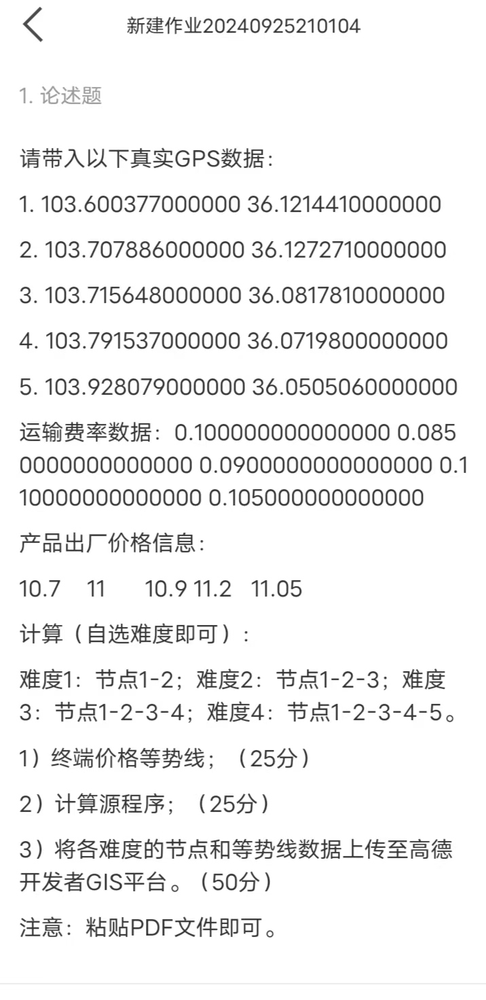

# 1. 背景



<!-- tab 图1 -->

<!-- endtab -->

<!-- tab 图2 -->

<!-- endtab -->


# 2. 题目








- **请带入以下真实 GPS 数据：**

1. 103.600377000000 36.1214410000000 
2. 103.707886000000 36.1272710000000  
3. 103.715648000000 36.0817810000000 
4. 103.791537000000 36.0719800000000  
5. 103.928079000000 36.0505060000000

- **运输费率数据：**

0.100000000000000 0.0850000000000000  
0.0900000000000000 0.110000000000000  
0.105000000000000

- **产品出厂价格信息：**

10.7  11  10.9  11.2  11.05

- **计算（自选难度即可）：**

- 难度1：节点1-2；
- 难度2：节点1-2-3；
- 难度3：节点1-2-3-4；  
- 难度4：节点1-2-3-4-5；

1. 终端价格等势线；（25分）  
2. 计算源程序；（25分）  
3. 将各难度的节点和等势线数据上传至高德开发者 GIS 平台。（50分）

**注意：粘贴 PDF 文件即可。**

# 3. 代码实现

## 3.1 终端价格等势线（25分）






```python
import math
import numpy as np
import matplotlib.pyplot as plt
import networkx as nx

# 定义地球半径
R = 6371  # 单位：公里

# 将度数转换为弧度
def deg2rad(deg):
    return deg * (math.pi / 180)

# 计算两点之间的距离
def haversine_distance(lat1, lon1, lat2, lon2):
    dlat = deg2rad(lat2 - lat1)
    dlon = deg2rad(lon2 - lon1)
    a = math.sin(dlat / 2)**2 + math.cos(deg2rad(lat1)) * math.cos(deg2rad(lat2)) * math.sin(dlon / 2)**2
    c = 2 * math.atan2(math.sqrt(a), math.sqrt(1 - a))
    distance = R * c
    return distance

# 节点信息
nodes = [
    {'id': 1, 'lat': 36.121441, 'lon': 103.600377, 'price': 10.70},
    {'id': 2, 'lat': 36.127271, 'lon': 103.707886, 'price': 11.00},
    {'id': 3, 'lat': 36.081781, 'lon': 103.715648, 'price': 10.90},
    {'id': 4, 'lat': 36.071980, 'lon': 103.791537, 'price': 11.20},
    {'id': 5, 'lat': 36.050506, 'lon': 103.928079, 'price': 11.05},
]

# 运输费率（对应节点之间）
edges = [
    {'from': 1, 'to': 2, 'rate': 0.10},
    {'from': 2, 'to': 3, 'rate': 0.085},
    {'from': 3, 'to': 4, 'rate': 0.09},
    {'from': 4, 'to': 5, 'rate': 0.11},
]

# 构建运输网络图
G = nx.Graph()
for node in nodes:
    G.add_node(node['id'], lat=node['lat'], lon=node['lon'], price=node['price'])

for edge in edges:
    from_node = next(node for node in nodes if node['id'] == edge['from'])
    to_node = next(node for node in nodes if node['id'] == edge['to'])
    distance = haversine_distance(
        from_node['lat'], from_node['lon'],
        to_node['lat'], to_node['lon']
    )
    cost = distance * edge['rate']
    G.add_edge(edge['from'], edge['to'], weight=cost)

# 定义经纬度范围
lat_min, lat_max = 36.00, 36.15
lon_min, lon_max = 103.50, 104.00

# 生成经纬度网格
lat_grid, lon_grid = np.meshgrid(
    np.arange(lat_min, lat_max, 0.005),
    np.arange(lon_min, lon_max, 0.005)
)

# 计算网格上每个点的终端价格
terminal_prices = np.zeros(lat_grid.shape)

for i in range(lat_grid.shape[0]):
    for j in range(lat_grid.shape[1]):
        lat = lat_grid[i, j]
        lon = lon_grid[i, j]
        # 计算从节点1到该点的运输成本
        distance_to_node1 = haversine_distance(lat, lon, nodes[0]['lat'], nodes[0]['lon'])
        transport_rate = 0.10  # 假设平均运输费率
        transport_cost = distance_to_node1 * transport_rate
        # 终端价格 = 出厂价格 + 运输成本
        terminal_price = nodes[0]['price'] + transport_cost
        terminal_prices[i, j] = terminal_price

# 绘制等势线
plt.figure(figsize=(10, 8))
cs = plt.contour(lon_grid, lat_grid, terminal_prices, levels=15, cmap='viridis')
plt.clabel(cs, inline=True, fontsize=8)
# 绘制节点
for node in nodes:
    plt.plot(node['lon'], node['lat'], 'ro')
    plt.text(node['lon'], node['lat'], f"节点{node['id']}", fontsize=9, ha='right')
plt.title('Terminal price equipotential line')
plt.xlabel('longitude')
plt.ylabel('latitude')
plt.colorbar(label='Terminal Price (RMB)')
plt.show()
```

## 3.2 计算源程序（25分）

```python
import math

# 定义地球半径
R = 6371  # 单位：公里


# 将度数转换为弧度
def deg2rad(deg):
    return deg * (math.pi / 180)


# 计算两点之间的距离
def haversine_distance(lat1, lon1, lat2, lon2):
    dlat = deg2rad(lat2 - lat1)
    dlon = deg2rad(lon2 - lon1)
    a = math.sin(dlat / 2) ** 2 + math.cos(deg2rad(lat1)) * math.cos(deg2rad(lat2)) * math.sin(dlon / 2) ** 2
    c = 2 * math.atan2(math.sqrt(a), math.sqrt(1 - a))
    distance = R * c
    return distance


# 节点信息
nodes = [
    {'id': 1, 'lat': 36.121441, 'lon': 103.600377, 'price': 10.70},
    {'id': 2, 'lat': 36.127271, 'lon': 103.707886, 'price': 11.00},
    {'id': 3, 'lat': 36.081781, 'lon': 103.715648, 'price': 10.90},
    {'id': 4, 'lat': 36.071980, 'lon': 103.791537, 'price': 11.20},
    {'id': 5, 'lat': 36.050506, 'lon': 103.928079, 'price': 11.05},
]

# 运输费率（对应节点之间）
transport_rates = [
    0.10,  # 节点1-2
    0.085,  # 节点2-3
    0.09,  # 节点3-4
    0.11  # 节点4-5
]

# 计算节点之间的距离和运输成本
distances = []
transport_costs = []
for i in range(len(nodes) - 1):
    node_a = nodes[i]
    node_b = nodes[i + 1]
    distance = haversine_distance(node_a['lat'], node_a['lon'], node_b['lat'], node_b['lon'])
    cost = distance * transport_rates[i]
    distances.append(distance)
    transport_costs.append(cost)

# 输出计算的距离和运输成本
for i in range(len(distances)):
    print(f"节点{nodes[i]['id']}-{nodes[i + 1]['id']}距离：{distances[i]:.3f}公里，运输成本：{transport_costs[i]:.3f}元")


# 计算各难度的终端价格
def calculate_terminal_price(difficulty_level):
    total_transport_cost = sum(transport_costs[:difficulty_level])
    terminal_price = nodes[0]['price'] + total_transport_cost
    return terminal_price


for level in range(1, 5):
    price = calculate_terminal_price(level)
    print(f"难度{level}的终端价格：{price:.3f}元")
```

## 3.3 将各难度的节点和等势线数据上传至高德开发者 GIS 平台（50分）


