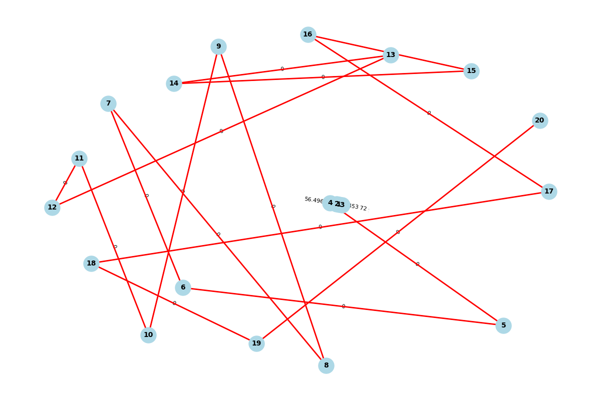
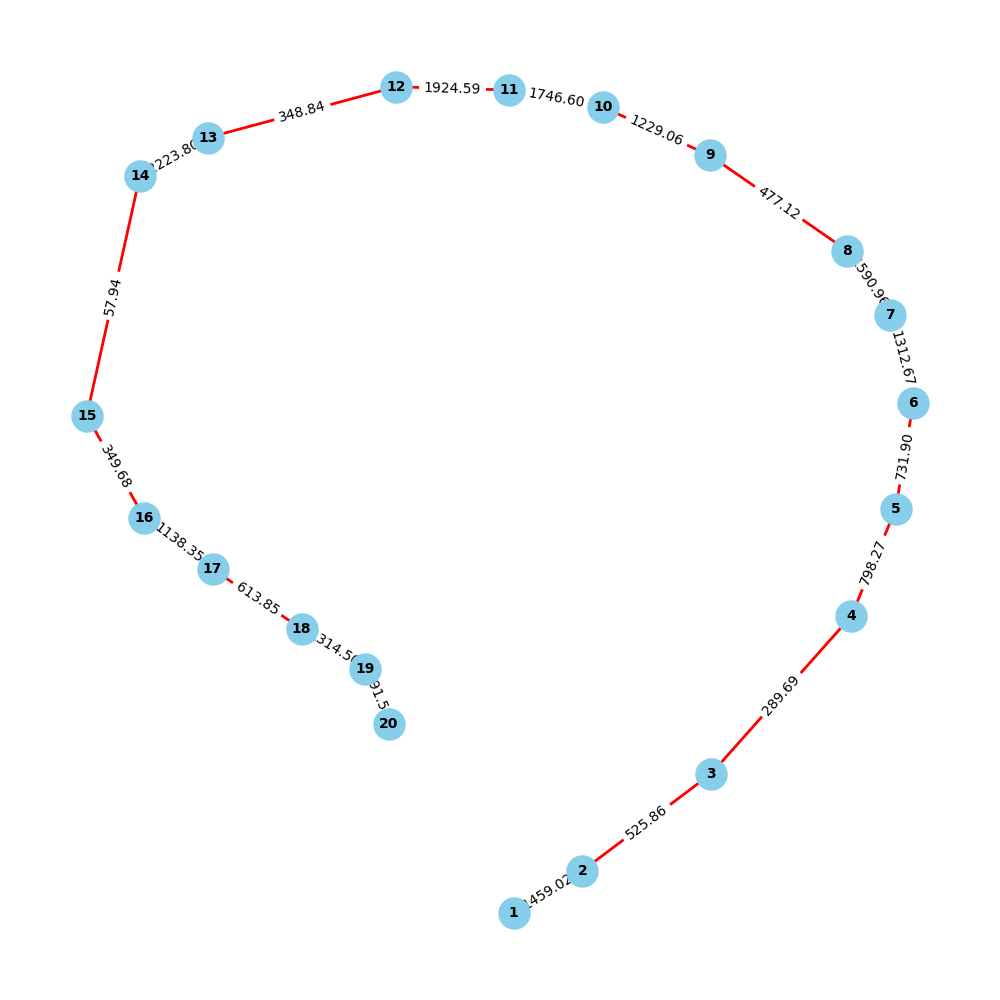

# 1. 简答题

计算后在此输入理论距离阵（20*20）节点的经纬度，节点1设为开始节点，节点20设为结束节点。(自行设定经纬度区间，并随机不等距划分为20个节点坐标，模板如下，将答案以 XLS文件粘贴即可!)

- [经纬度及邻接矩阵.xlsx](/static/PostsData/02-Python考试张雅欣/经纬度及邻接矩阵.xlsx)

**你们直接安装库和运行自己对应的代码即可！你们两个的代码都可以运行后会保存成一个 Excel 文件，具体如何提交自行操作。**

```python
pip install pandas geopy numpy
```



**鉴于你们零基础会运行报错，在此把运行结果 Excel 放在这里以供下载：**

- [经纬度及邻接矩阵.xlsx](/static/PostsData/02-Python考试张雅欣/经纬度_及_理论距离阵.xlsx)

<!-- tab 1. Zhang Solution -->
```python
import pandas as pd
import numpy as np
from geopy.distance import geodesic

# 定义经纬度范围，用于生成随机坐标
# 定义甘肃省的经纬度范围
latitude_range = (32.0, 42.0)  # 甘肃的纬度范围
longitude_range = (92.0, 108.0)  # 甘肃的经度范围

# 生成20个节点的随机经纬度
num_nodes = 20
# np.random.seed(43)  # 设置随机种子以保证结果可重复
latitudes = np.random.uniform(*latitude_range, num_nodes)
longitudes = np.random.uniform(*longitude_range, num_nodes)

# 创建 DataFrame 存储节点的经纬度信息
coordinates_df = pd.DataFrame({
    '节点': range(1, num_nodes + 1),
    '经度': longitudes,
    '纬度': latitudes
})

# 计算理论距离矩阵，使用 geodesic 函数计算两点间的地理距离
distance_matrix = np.zeros((num_nodes, num_nodes))

for i in range(num_nodes):
    for j in range(num_nodes):
        if i != j:
            # 计算距离，单位为公里
            distance_matrix[i, j] = geodesic((latitudes[i], longitudes[i]), (latitudes[j], longitudes[j])).kilometers

# 创建 DataFrame 存储距离矩阵，并添加节点标签
distance_matrix_df = pd.DataFrame(distance_matrix, index=range(1, num_nodes + 1), columns=range(1, num_nodes + 1))
distance_matrix_df.insert(0, '节点', range(1, num_nodes + 1))

# 将结果保存到 Excel 文件
output_path = '经纬度_及_理论距离阵.xlsx'
with pd.ExcelWriter(output_path) as writer:
    coordinates_df.to_excel(writer, sheet_name='经纬度', index=False)
    distance_matrix_df.to_excel(writer, sheet_name='理论距离阵', index=False)

print(f"文件已保存为：{output_path}")
```
<!-- endtab -->

<!-- tab 2. Yu Solution -->

**鉴于你们零基础会运行报错，在此把运行结果 Excel 放在这里以供下载：**

- [经纬度及邻接矩阵.xlsx](/static/PostsData/02-Python考试张雅欣/生成的经纬度及理论距离矩阵.xlsx)

```python
import numpy as np
import pandas as pd
import math

# 随机生成20个节点的经纬度坐标
np.random.seed(42)
num_nodes = 20
lat_lon_data = pd.DataFrame({
    '节点': range(1, num_nodes + 1),
    '经度': np.random.uniform(100, 120, num_nodes),
    '维度': np.random.uniform(30, 50, num_nodes)
})

# 使用Haversine公式计算理论距离阵（节点之间的直线距离）
def haversine(lon1, lat1, lon2, lat2):
    R = 6371  # 地球半径，单位为公里
    lon1, lat1, lon2, lat2 = map(math.radians, [lon1, lat1, lon2, lat2])
    dlon = lon2 - lon1 
    dlat = lat2 - lat1 
    a = math.sin(dlat/2)**2 + math.cos(lat1) * math.cos(lat2) * math.sin(dlon/2)**2
    c = 2 * math.asin(math.sqrt(a)) 
    return R * c

# 计算理论距离矩阵
theoretical_distance_matrix = np.zeros((num_nodes, num_nodes))
for i in range(num_nodes):
    for j in range(num_nodes):
        if i != j:
            lat1, lon1 = lat_lon_data.iloc[i][['维度', '经度']]
            lat2, lon2 = lat_lon_data.iloc[j][['维度', '经度']]
            theoretical_distance_matrix[i, j] = haversine(lon1, lat1, lon2, lat2)

theoretical_distance_df = pd.DataFrame(theoretical_distance_matrix, columns=range(1, num_nodes + 1), index=range(1, num_nodes + 1))

print("随机生成的经纬度坐标：")
print(lat_lon_data)
print("\n生成的理论距离矩阵：")
print(theoretical_distance_df)

# 将随机生成的经纬度和理论距离矩阵保存到Excel文件
with pd.ExcelWriter('生成的经纬度及理论距离矩阵.xlsx') as writer:
    lat_lon_data.to_excel(writer, sheet_name='经纬度', index=False)
    theoretical_distance_df.to_excel(writer, sheet_name='理论距离矩阵')

print("生成的经纬度和理论距离矩阵已保存为 '生成的经纬度及理论距离矩阵.xlsx'")
```
<!-- endtab -->

<!-- tab Other（无需查看） -->

**我的备份代码，无需关注！**

```python
import numpy as np
import pandas as pd
import math

# 随机生成20个节点的经纬度坐标
np.random.seed(42)
num_nodes = 20
lat_lon_data = pd.DataFrame({
    '节点': range(1, num_nodes + 1),
    '经度': np.random.uniform(100, 120, num_nodes),
    '维度': np.random.uniform(30, 50, num_nodes)
})

# 使用Haversine公式计算理论距离阵（节点之间的直线距离）
def haversine(lon1, lat1, lon2, lat2):
    R = 6371  # 地球半径，单位为公里
    lon1, lat1, lon2, lat2 = map(math.radians, [lon1, lat1, lon2, lat2])
    dlon = lon2 - lon1 
    dlat = lat2 - lat1 
    a = math.sin(dlat/2)**2 + math.cos(lat1) * math.cos(lat2) * math.sin(dlon/2)**2
    c = 2 * math.asin(math.sqrt(a)) 
    return R * c

# 计算理论距离矩阵
theoretical_distance_matrix = np.zeros((num_nodes, num_nodes))
for i in range(num_nodes):
    for j in range(num_nodes):
        if i != j:
            lat1, lon1 = lat_lon_data.iloc[i][['维度', '经度']]
            lat2, lon2 = lat_lon_data.iloc[j][['维度', '经度']]
            theoretical_distance_matrix[i, j] = haversine(lon1, lat1, lon2, lat2)

theoretical_distance_df = pd.DataFrame(theoretical_distance_matrix, columns=range(1, num_nodes + 1), index=range(1, num_nodes + 1))

print("随机生成的经纬度坐标：")
print(lat_lon_data)
print("\n生成的理论距离矩阵：")
print(theoretical_distance_df)
```

```python
import pandas as pd
import numpy as np
from geopy.distance import geodesic

# 定义经纬度范围，用于生成随机坐标
latitude_range = (30.0, 40.0)  # 例如中国区域的近似范围
longitude_range = (100.0, 110.0)

# 生成20个节点的随机经纬度
num_nodes = 20
np.random.seed(43)  # 设置随机种子以保证结果可重复
latitudes = np.random.uniform(*latitude_range, num_nodes)
longitudes = np.random.uniform(*longitude_range, num_nodes)

# 创建 DataFrame 存储节点的经纬度信息
coordinates_df = pd.DataFrame({
    '节点': range(1, num_nodes + 1),
    '经度': longitudes,
    '纬度': latitudes
})

# 计算理论距离矩阵，使用 geodesic 函数计算两点间的地理距离
distance_matrix = np.zeros((num_nodes, num_nodes))

for i in range(num_nodes):
    for j in range(num_nodes):
        if i != j:
            # 计算距离，单位为公里
            distance_matrix[i, j] = geodesic((latitudes[i], longitudes[i]), (latitudes[j], longitudes[j])).kilometers

# 创建 DataFrame 存储距离矩阵，并添加节点标签
distance_matrix_df = pd.DataFrame(distance_matrix, index=range(1, num_nodes + 1), columns=range(1, num_nodes + 1))
distance_matrix_df.insert(0, '节点', range(1, num_nodes + 1))

# 将结果保存到 Excel 文件
output_path = '经纬度_及_理论距离阵.xlsx'
with pd.ExcelWriter(output_path) as writer:
    coordinates_df.to_excel(writer, sheet_name='经纬度', index=False)
    distance_matrix_df.to_excel(writer, sheet_name='理论距离阵', index=False)

print(f"文件已保存为：{output_path}")
```
<!-- endtab -->


# 2. 论述题

在此输入以上理论距离矩阵和邻接矩阵的点乘结果，即节点的实际距离矩阵。(在下方粘贴XLS文件即可!)


<!-- tab 1. Zhang Solution -->

**鉴于你们零基础会运行报错，在此把运行结果 Excel 放在这里以供下载：**

- [经纬度及邻接矩阵.xlsx](/static/PostsData/02-Python考试张雅欣/节点_实际距离矩阵.xlsx)


```python
import pandas as pd
import numpy as np

# 读取第一题生成的文件
input_path = '经纬度_及_理论距离阵.xlsx'
distance_matrix_df = pd.read_excel(input_path, sheet_name='理论距离阵', index_col=0)

# 获取节点数量
num_nodes = distance_matrix_df.shape[0]

# 定义邻接矩阵，假设一些节点相邻关系 (这里仅为示例，你可以自行设定邻接关系)
adjacency_matrix = np.zeros((num_nodes, num_nodes))
# 示例: 假设节点 1 与节点 2、3 相邻，节点 2 与节点 4 相邻等
# 你可以根据实际需求来设置这些值
adjacency_matrix[0, 1] = adjacency_matrix[1, 0] = 1
adjacency_matrix[0, 2] = adjacency_matrix[2, 0] = 1
adjacency_matrix[1, 3] = adjacency_matrix[3, 1] = 1
# … 更多邻接关系的定义（这是一个示例）

# 将理论距离矩阵与邻接矩阵进行点乘，得到实际距离矩阵
actual_distance_matrix = distance_matrix_df.values * adjacency_matrix

# 将实际距离矩阵转换为 DataFrame 并保存
actual_distance_matrix_df = pd.DataFrame(actual_distance_matrix, index=range(1, num_nodes + 1), columns=range(1, num_nodes + 1))
actual_distance_matrix_df.insert(0, '节点', range(1, num_nodes + 1))

# 将结果保存到 Excel 文件
output_path_actual = '节点_实际距离矩阵.xlsx'
with pd.ExcelWriter(output_path_actual) as writer:
    actual_distance_matrix_df.to_excel(writer, sheet_name='实际距离矩阵', index=False)

print(f"文件已保存为：{output_path_actual}")
```
<!-- endtab -->

<!-- tab 2. Yu Solution -->

**鉴于你们零基础会运行报错，在此把运行结果 Excel 放在这里以供下载：**

- [经纬度及邻接矩阵.xlsx](/static/PostsData/02-Python考试张雅欣/节点实际距离矩阵.xlsx)

```python
import pandas as pd
import numpy as np

# 读取第一题生成的 Excel 文件
file_path = '生成的经纬度及理论距离矩阵.xlsx'
lat_lon_data = pd.read_excel(file_path, sheet_name='经纬度')
theoretical_distance_df = pd.read_excel(file_path, sheet_name='理论距离矩阵', index_col=0)

# 将理论距离矩阵转换为 numpy 数组
theoretical_distance_matrix = theoretical_distance_df.values
num_nodes = theoretical_distance_matrix.shape[0]

# 创建邻接矩阵，假设仅有部分节点相邻
adjacency_matrix = np.zeros((num_nodes, num_nodes))
np.random.seed(42)
for i in range(num_nodes - 1):
    adjacency_matrix[i, i + 1] = 1  # 假设节点 i 和 i+1 相邻
    adjacency_matrix[i + 1, i] = 1  # 保证矩阵对称性

# 计算实际距离矩阵，即理论距离矩阵和邻接矩阵的点乘
actual_distance_matrix = theoretical_distance_matrix * adjacency_matrix

# 将实际距离矩阵保存为新的 Excel 文件
actual_distance_df = pd.DataFrame(actual_distance_matrix, columns=range(1, num_nodes + 1), index=range(1, num_nodes + 1))

with pd.ExcelWriter('节点实际距离矩阵.xlsx') as writer:
    actual_distance_df.to_excel(writer, sheet_name='实际距离矩阵')

print("节点的实际距离矩阵已保存为 '节点实际距离矩阵.xlsx'")
```
<!-- endtab -->



# 3. 计算题

请列出 DJ 算法的逻辑伪代码。


<!-- tab 1. Zhang Solution -->

```python
算法 Dijkstra（G，源节点s）

输入：
- G：带权有向图（图的边权必须为非负值）
- s：源节点

输出：
- dist：从源节点 s 到其他各节点的最短路径距离
- prev：最短路径的前驱节点，用于重构路径

初始化：
1. 创建一个集合 S，包含所有节点的集合
2. 对每个节点 v ∈ V[G]：
   - 设置 dist[v] = ∞ （表示从源节点 s 到 v 的初始距离未知）
   - 设置 prev[v] = NULL （前驱节点初始化为 NULL）
3. 设置 dist[s] = 0 （源节点到自己的距离为0）

主循环：
4. 当 S 不为空时：
   a. 从集合 S 中找到距离 dist 最小的节点 u
   b. 从集合 S 中移除 u
   c. 对 u 的每个邻接节点 v：
      i. 计算从源节点 s 到节点 v 的距离：alt = dist[u] + weight(u, v)
      ii. 如果 alt < dist[v]：
          - 设置 dist[v] = alt
          - 设置 prev[v] = u

返回结果：
5. 返回 dist 和 prev，用于得出最短路径的距离和路径
```

<!-- endtab -->

<!-- tab 2. Yu Solution -->
```python
函数 Dijkstra(起始节点 s):
    初始化:
        设置一个字典 dist 用于记录从起始节点 s 到每个节点的最短距离
        将所有节点的初始距离设为无限大（∞），起始节点 s 的距离设为 0
        设置一个空的集合 visited 用于存储已确定最短路径的节点
        使用一个优先队列 min_heap，将起始节点 s 入队列，距离为 0

    while min_heap 非空:
        取出队列中距离最小的节点 u
        如果节点 u 已在 visited 中，跳过（continue）
        否则，将节点 u 添加到 visited 中

        for 每个与节点 u 相邻的节点 v:
            计算从 u 到 v 的距离 dist_u_v
            如果 dist[s][u] + dist_u_v < dist[s][v]:
                更新 dist[s][v] 为 dist[s][u] + dist_u_v
                将节点 v 及其更新后的距离入队 min_heap

    返回 dist 字典，表示从起始节点 s 到每个节点的最短路径距离
```
<!-- endtab -->

<!-- tab Other(无需查看👀) -->
```python
函数 Dijkstra(起始节点 S, 图 G):
    初始化距离字典 distance，将所有节点距离设置为∞
    设置起始节点 S 的距离 distance[S] 为 0
    创建一个空的优先队列 Q，用于存储节点和距离

    将 (0, S) 加入优先队列 Q  // (距离, 节点)

    当 Q 不为空时:
        当前节点 = 从 Q 中提取距离最小的节点
        
        如果 当前节点 的距离已经确定（被访问过）:
            跳过此节点
        
        标记 当前节点 为已访问
        
        对于 当前节点 的所有邻居节点 v:
            路径距离 = 当前节点的距离 + 当前节点到邻居节点 v 的距离
            
            如果 路径距离 < v 的当前最短距离 distance[v]:
                更新 distance[v] 为 路径距离
                将 (路径距离, v) 添加到 Q
                
    返回 distance 字典 // 其中包含起始节点到其他所有节点的最短路径距离
```
<!-- endtab -->



# 4. 资料题

请画出实际距离阵的网络图，并标出从节点1出发到节点20的的最短路径。(网络图粘贴在下方即可!)


<!-- tab 1. Zhang Solution -->



```python
import pandas as pd
import numpy as np
import networkx as nx
import matplotlib.pyplot as plt

# 读取实际距离矩阵
input_path_actual = '节点_实际距离矩阵.xlsx'
actual_distance_matrix_df = pd.read_excel(input_path_actual, sheet_name='实际距离矩阵', index_col=0)

# 创建无向图
G = nx.Graph()

# 添加节点
for i in range(len(actual_distance_matrix_df)):
    G.add_node(i + 1)

# 添加边，边的权重为距离
# 这里使用随机邻接关系保证图的连通性
for i in range(len(actual_distance_matrix_df)):
    for j in range(i + 1, len(actual_distance_matrix_df)):
        distance = actual_distance_matrix_df.iloc[i, j]
        if distance > 0 and np.random.rand() < 0.3:  # 用30%的概率添加边
            G.add_edge(i + 1, j + 1, weight=distance)

# 检查图是否连通
if not nx.is_connected(G):
    # 确保图连通性：找到连通分量并连接
    components = list(nx.connected_components(G))
    for k in range(1, len(components)):
        # 取前一个分量的第一个节点和当前分量的第一个节点连接
        node_a = list(components[k - 1])[0]
        node_b = list(components[k])[0]
        distance = actual_distance_matrix_df.iloc[node_a - 1, node_b - 1]
        G.add_edge(node_a, node_b, weight=distance)

# 检查节点 1 到节点 20 是否连通
if nx.has_path(G, 1, 20):
    # 计算从节点 1 到节点 20 的最短路径
    path = nx.dijkstra_path(G, source=1, target=20, weight='weight')

    # 绘制网络图
    pos = nx.spring_layout(G)  # 自动生成布局
    plt.figure(figsize=(12, 8))

    # 绘制所有节点和边
    nx.draw(G, pos, with_labels=True, node_size=500, node_color="lightblue", font_size=10, font_weight="bold")
    nx.draw_networkx_edge_labels(G, pos, edge_labels=nx.get_edge_attributes(G, 'weight'), font_size=8)

    # 将最短路径标出为红色
    path_edges = list(zip(path, path[1:]))
    nx.draw_networkx_edges(G, pos, edgelist=path_edges, edge_color='red', width=2)

    # 显示图形
    plt.title("实际距离矩阵的网络图及最短路径（节点1到节点20）")
    plt.show()
else:
    print("节点 1 到 节点 20 无法连通，请检查图的连接关系。")
```
<!-- endtab -->

<!-- tab 2. Yu Solution -->

**每次运行结果不一样**



```python
import pandas as pd
import numpy as np
import networkx as nx
import matplotlib.pyplot as plt

# 读取前面生成的实际距离矩阵
file_path = '节点实际距离矩阵.xlsx'
actual_distance_df = pd.read_excel(file_path, sheet_name='实际距离矩阵', index_col=0)

# 转换为 numpy 数组，构建图
actual_distance_matrix = actual_distance_df.values
num_nodes = actual_distance_matrix.shape[0]
G = nx.Graph()

# 添加节点和边
for i in range(num_nodes):
    for j in range(i + 1, num_nodes):
        if actual_distance_matrix[i, j] > 0:  # 仅添加有实际距离的边
            G.add_edge(i + 1, j + 1, weight=actual_distance_matrix[i, j])

# 使用 Dijkstra 算法找出从节点1到节点20的最短路径
start_node, end_node = 1, 20
shortest_path = nx.dijkstra_path(G, source=start_node, target=end_node)
path_edges = list(zip(shortest_path, shortest_path[1:]))

# 绘制网络图
plt.figure(figsize=(10, 10))
pos = nx.spring_layout(G)  # 采用 spring 布局
nx.draw(G, pos, with_labels=True, node_size=500, node_color="skyblue", font_size=10, font_weight="bold")
nx.draw_networkx_edges(G, pos, edgelist=path_edges, edge_color="red", width=2)  # 用红色标出最短路径
nx.draw_networkx_edge_labels(G, pos, edge_labels={(u, v): f"{G[u][v]['weight']:.2f}" for u, v in G.edges})

plt.title("节点实际距离阵网络图\n红色标记为从节点1到节点20的最短路径")
plt.show()
```
<!-- endtab -->



# 5. 分录题

请给出相关的 python 或者 matlab 程序代码！

**前面每题的代码就是本题的答案！**









AI悦创·编程一对一

> AI悦创·推出辅导班啦，包括「Python 语言辅导班、C++ 辅导班、java 辅导班、算法/数据结构辅导班、少儿编程、pygame 游戏开发、Web、Linux」，全部都是一对一教学：一对一辅导 + 一对一答疑 + 布置作业 + 项目实践等。当然，还有线下线上摄影课程、Photoshop、Premiere 一对一教学、QQ、微信在线，随时响应！微信：Jiabcdefh
>
> C++ 信息奥赛题解，长期更新！长期招收一对一中小学信息奥赛集训，莆田、厦门地区有机会线下上门，其他地区线上。微信：Jiabcdefh
>
> 方法一：[QQ](http://wpa.qq.com/msgrd?v=3&uin=1432803776&site=qq&menu=yes)
>
> 方法二：微信：Jiabcdefh



