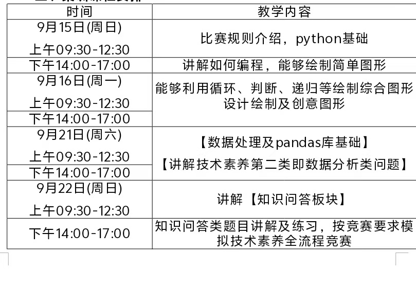
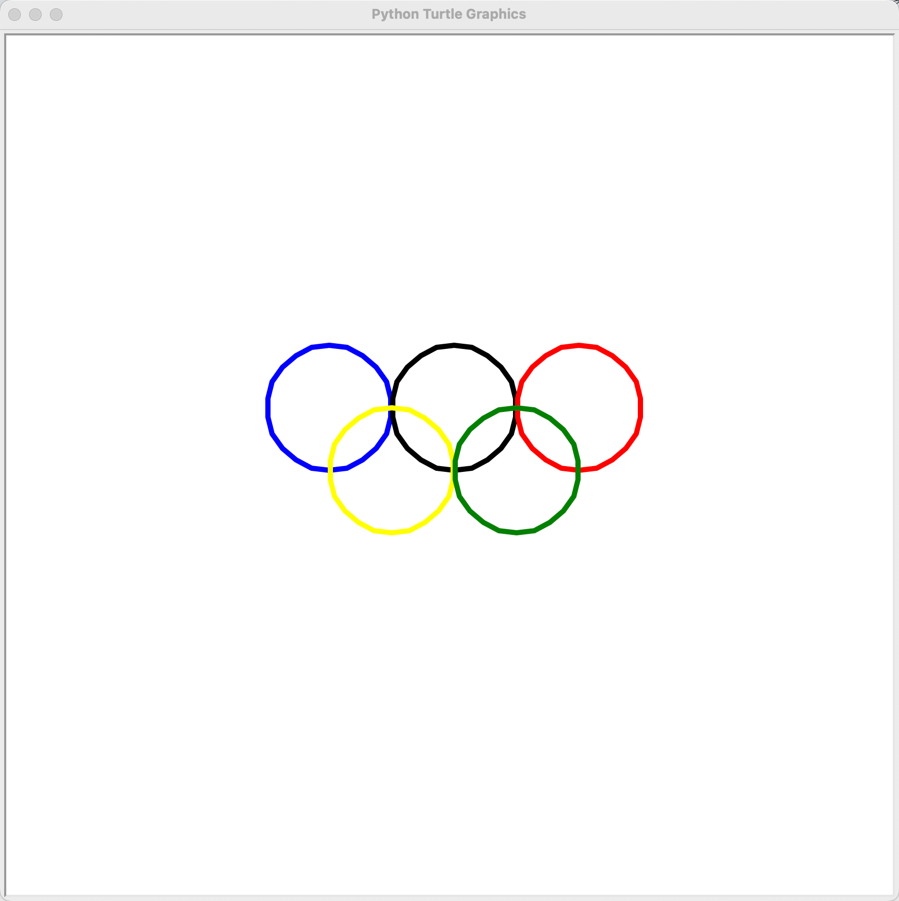
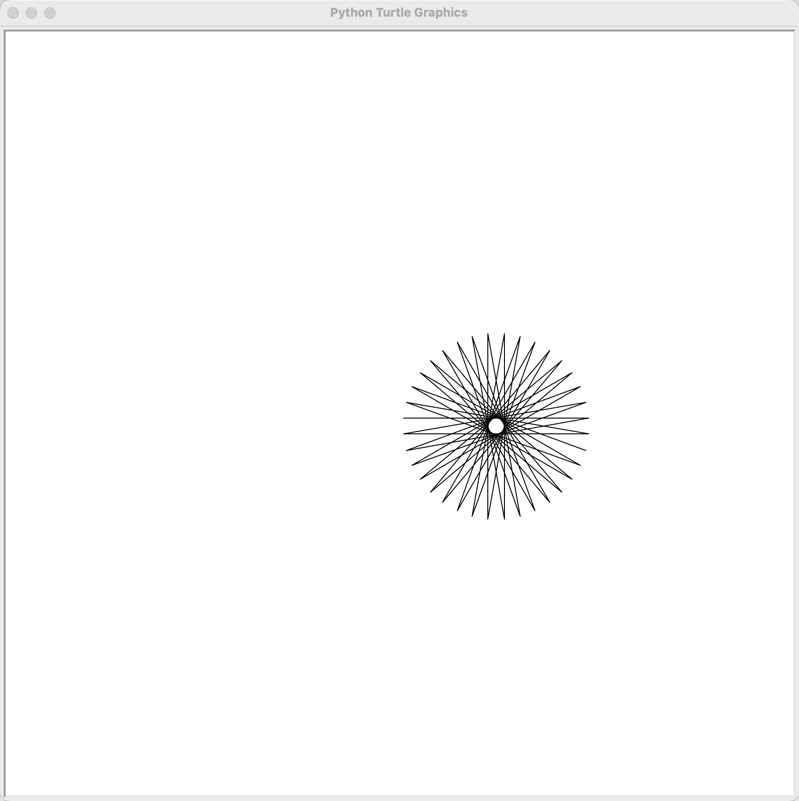
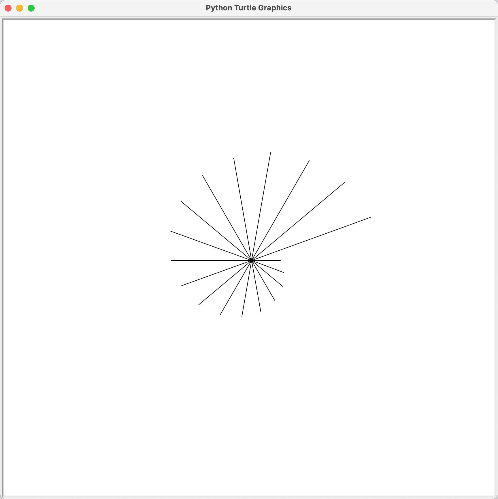
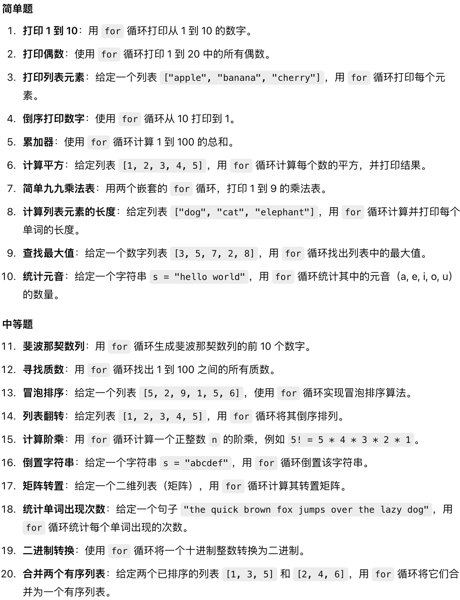
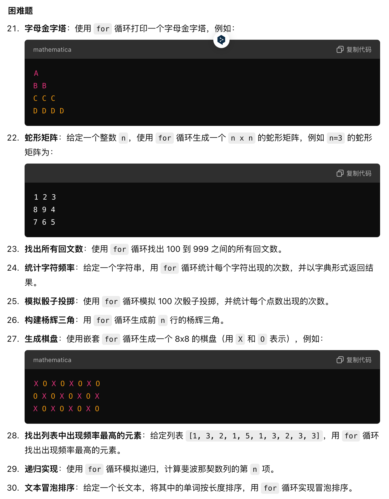
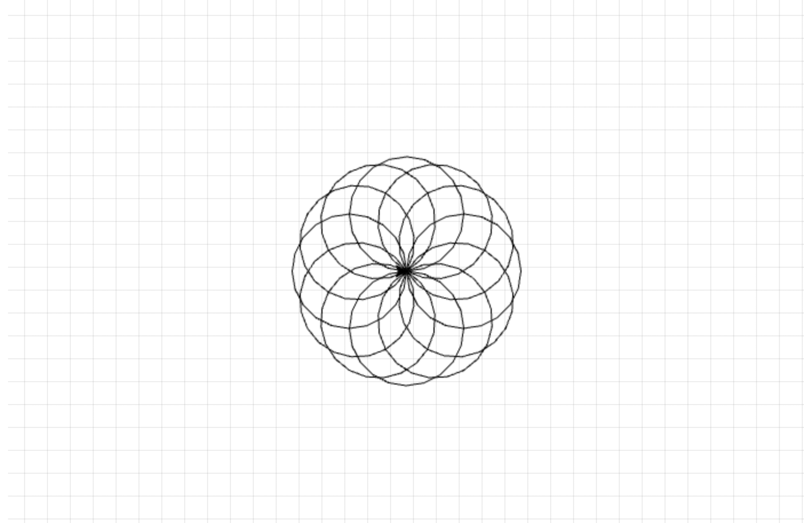
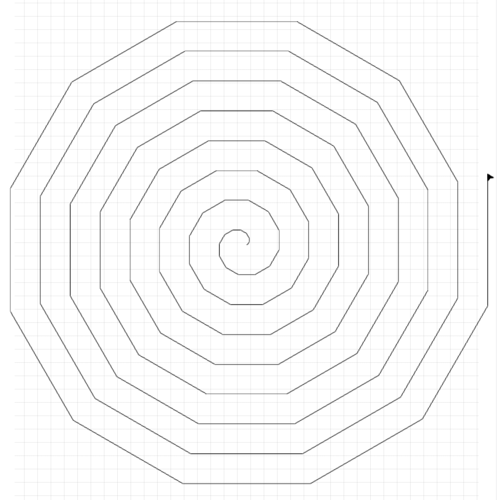

# 1. Message

- 考试日期📅：9月28日







- 在线画图：[https://bornforthis.cn/python/#/](https://bornforthis.cn/python/#/)


# 2. 试课

> 



<!-- tab 1. 晚间小练习 -->

## 1. 八色卡 base card

- 复现时间：**20分钟**

## 2. 要求说明

1. 按要求画出色卡对应图形的形状，做好边线条（如有）和填充颜色处理；（不考虑自动产生的箭头）
2. 长方形的长为100，宽为50；
3. 长方形从下到上，填充颜色代码分别是 `black`；`white`；`gray`；边缘线颜色都是 `black`；
4. 圆的半径是34；
5. 圆从左到右，填充颜色代码分别是 `(255,0,0)`；`(255,255,0)`；`(0,128,0)`；其中中间的圆外边缘线颜色代码是 `(128,128,128)`；
6. 五角星的间隔顶点的边长为68；
7. 五角星从下到上，颜色代码分别为 `(0,0,1)`；`(1,0.753,0.796)`；
8. A点坐标为 `(0,0)`；B点坐标为 `(200,32)`；C点坐标为 `(270,32)`；D点坐标为 `(340,32)`；E点坐标为 `(420,32)`；F点坐标为 `(420,126)`。

## 3. 图示

- 图中包含一个长方形、三个圆形、两个五角星以及各个点标记(A, B, C, D, E, F)和坐标轴。

<!-- endtab -->

<!-- tab 2. 笔记 -->

- `turtle.pensize(5)`  # 设置画笔的粗细为 5
- `turtle.pencolor('green')`  # 设置画笔颜色为绿色
- 思路：
    - 先实现效果
    - 然后再拆分空行，便于找规律
    - 发现重复代码（重复的逻辑代码）——loop（循环实现）
- 注意⚠️：
    - 列表创建语法不熟；
    - 变量命名不能和 Python 内置函数相同；
    - 函数使用要用 `()`，不是 `[]`；
    - 有点小粗心；

<!-- endtab -->

<!-- tab 3. Message -->

1. 复习
    1. for 循环
    2. `input()`
    3. point: 画图
        1. 皇冠
    4. 使用 turtle 的 circle 画出多边形

```python
import turtle as t
t.color('black','blue')
for i in range(12):
    t.begin_fill()
    t.circle(20+20*i,360,3)
    t.goto(0,0)
    t.left(15)
    t.end_fill()
```


<!-- endtab -->

<!-- tab 4.五环 -->









<!-- tab 1. 小宇代码-->

```python
import turtle as t
t.pensize(5)
t.pencolor('blak')
t.circle(60)
t.up()
t.goto(-120,0)
t.down()
t.pencolor('blue')
t.circle(60)
t.up()
t.goto(120,0)
t.down()
t.pencolor('red')
t.circle(60)
t.up()
t.goto(-60,-60)
t.down()
t.pencolor('yellow')
t.circle(60)
t.up()
t.goto(60,-60)
t.down()
t.pencolor('green')
t.circle(60)
```

<!-- endtab -->

<!-- tab 2. 原生代码-->

```python
import turtle  # 导入 turtle 模块

# 设置 turtle 的速度和画笔粗细
turtle.speed(2)  # 设置速度为 2
turtle.pensize(5)  # 设置画笔的粗细为 5

# 绘制第一个圆环（蓝色）
turtle.penup()  # 抬起画笔
turtle.goto(-120, 0)  # 移动到第一个圆环的位置
turtle.pendown()  # 放下画笔
turtle.pencolor('blue')  # 设置画笔颜色为蓝色
turtle.circle(60)  # 绘制半径为 60 的圆

# 绘制第二个圆环（黑色）
turtle.penup()  # 抬起画笔
turtle.goto(0, 0)  # 移动到第二个圆环的位置
turtle.pendown()  # 放下画笔
turtle.pencolor('black')  # 设置画笔颜色为黑色
turtle.circle(60)  # 绘制半径为 60 的圆

# 绘制第三个圆环（红色）
turtle.penup()  # 抬起画笔
turtle.goto(120, 0)  # 移动到第三个圆环的位置
turtle.pendown()  # 放下画笔
turtle.pencolor('red')  # 设置画笔颜色为红色
turtle.circle(60)  # 绘制半径为 60 的圆

# 绘制第四个圆环（黄色）
turtle.penup()  # 抬起画笔
turtle.goto(-60, -60)  # 移动到第四个圆环的位置
turtle.pendown()  # 放下画笔
turtle.pencolor('yellow')  # 设置画笔颜色为黄色
turtle.circle(60)  # 绘制半径为 60 的圆

# 绘制第五个圆环（绿色）
turtle.penup()  # 抬起画笔
turtle.goto(60, -60)  # 移动到第五个圆环的位置
turtle.pendown()  # 放下画笔
turtle.pencolor('green')  # 设置画笔颜色为绿色
turtle.circle(60)  # 绘制半径为 60 的圆

# 完成绘制，隐藏画笔箭头
turtle.hideturtle()
# 保持窗口打开，直到用户关闭
turtle.done()
```

<!-- endtab -->

<!-- tab 3. 使用循环-->

```python
import turtle  # 导入 turtle 模块

# 设置 turtle 的速度（2 代表较慢，范围是 0-10，数字越大速度越快）
turtle.speed(2)
# 设置画笔的粗细，单位为像素
turtle.pensize(5)

# 定义每个环的起始位置（相对于屏幕中心）
positions = [(-120, 0), (0, 0), (120, 0), (-60, -60), (60, -60)]
# 定义每个环的颜色，顺序为：蓝色、黑色、红色、黄色、绿色
colors = ['blue', 'black', 'red', 'yellow', 'green']

# 使用 zip 将位置和颜色结合起来，并进行迭代绘制五个环
for position, color in zip(positions, colors):
    turtle.penup()  # 抬起画笔，避免在移动过程中留下痕迹
    turtle.goto(position)  # 移动画笔到指定位置
    turtle.pendown()  # 放下画笔，准备开始绘制
    turtle.pencolor(color)  # 设置当前环的颜色
    turtle.circle(60)  # 绘制半径为 60 像素的圆

# 完成绘制，隐藏画笔箭头
turtle.hideturtle()
# 保持窗口打开，直到用户关闭
turtle.done()
```

<!-- endtab -->

<!-- tab 4. 小宇循环-->

```python
import turtle as t
t.pensize(5)
color=['blue','black','red','yellow','green']
positions=[(-120,0),(0,0),(120,0),(-60,-60),(60,-60)]
for i in range(5):
    t.up()
    t.goto(positions[i])
    t.down()
    t.pencolor(color[i])
    t.circle(60)
```


<!-- endtab -->



<!-- endtab -->

<!-- tab 5. 语法 -->

1. for 循环基础语法

```python
colors = ['red', 'yellow', 'blue', 'orange']
for detail in colors:
    print(detail)

for index in range(4):
    print(colors[index])
```

2. zip

```python
positions = [(-120, 0), (0, 0), (120, 0), (-60, -60), (60, -60)]
colors = ['blue', 'black', 'red', 'yellow', 'green']

zip_data = zip(positions, colors)
print(list(zip_data))

# ---output---
[((-120, 0), 'blue'), ((0, 0), 'black'), ((120, 0), 'red'), ((-60, -60), 'yellow'), ((60, -60), 'green')]
```



> 辅助理解 zip 大法！

<!-- tab 1. 多变量同时赋值 -->

```python
a, b = (1, 200)
print(a)
print(b)

# ---output---
1
200
```

<!-- endtab -->

<!-- tab 2. 循环 zip -->

```python
positions = [(-120, 0), (0, 0), (120, 0), (-60, -60), (60, -60)]
colors = ['blue', 'black', 'red', 'yellow', 'green']

zip_data = zip(positions, colors)

for data in zip_data:
    print(data)
    
# ---output---
((-120, 0), 'blue')
((0, 0), 'black')
((120, 0), 'red')
((-60, -60), 'yellow')
((60, -60), 'green')
```

<!-- endtab -->

<!-- tab 3. 进一步循环 -->

```python
import turtle

turtle.speed(2)
turtle.pensize(5)

positions = [(-120, 0), (0, 0), (120, 0), (-60, -60), (60, -60)]
colors = ['blue', 'black', 'red', 'yellow', 'green']

zip_data = zip(positions, colors)

for data in zip_data:
    position, color = data
    turtle.up()
    turtle.goto(position)
    turtle.down()
    turtle.pencolor(color)
    turtle.circle(60)
```

<!-- endtab -->

<!-- tab 4. 最终优化-->

```python
import turtle

turtle.speed(2)
turtle.pensize(5)

positions = [(-120, 0), (0, 0), (120, 0), (-60, -60), (60, -60)]
colors = ['blue', 'black', 'red', 'yellow', 'green']

zip_data = zip(positions, colors)

for position, color in zip_data:
    turtle.up()
    turtle.goto(position)
    turtle.down()
    turtle.pencolor(color)
    turtle.circle(60)
```

<!-- endtab -->



<!-- endtab -->



# 3. for 循环语法集训

> 



<!-- tab 1. 直接遍历列表 -->

```python
students_list = ["李雷", "韩梅梅", "马冬梅"]
for student in students_list:
    print(student)

# ---output---
李雷
韩梅梅
马冬梅
```

<!-- endtab -->

<!-- tab 2. range -->

- range(start, end, sep)
  - 默认从 0 开始
  - start: 开始的数
  - end: 结束的数(结束的数取不到)
  - sep: 间隔



<!-- tab 基础代码 -->

```python
for i in range(10):
    print(i)

# ---output---
0
1
2
3
4
5
6
7
8
9
```

<!-- endtab -->

<!-- tab 带有间隔 -->

```python
for i in range(0, 10, 2):
    print(i)

# ---output---
0
2
4
6
8
```

<!-- endtab -->

<!-- tab 输出奇数 -->

```python
for i in range(1, 10, 2):
    print(i)

# ---output---
1
3
5
7
9
```

<!-- endtab -->



<!-- endtab -->

<!-- tab 3. 通过索引遍历序列元素 -->

```python
student_list = ['李雷', '韩梅梅', '马冬梅']
for index in range(len(student_list)):
    print(student_list[index])

# ---output---
李雷
韩梅梅
马冬梅
```

<!-- endtab -->

<!-- tab 4. 小试牛刀 -->

操作如下列表，按要求输出目标结构：

- `student_list = ['李雷', '韩梅梅', '马冬梅']`

- 输出如下结果：

```python
st1_李雷
st2_韩梅梅
st3_马冬梅
```
- 代码：

```python
student_list = ['李雷', '韩梅梅', '马冬梅']
index = 1
for student in student_list:
    print('st' + str(index) + '_' + student)
    index += 1  # index = index + 1
```

<!-- endtab -->

<!-- tab 5. break 跳出循环 -->

```python
for i in range(10):
    print(i)
    if i > 5:
        break
```

```python
for i in range(10):
    if i > 5:
        break
    print(i)
```

```python
i = 0
while True:
    print(i)
    i = i + 1
    if i > 5:
        break
```

<!-- endtab -->

<!-- tab 6. 列表平方 -->

```python
numbers = [10, 2, 31, 4, 5, 6, 7, 8, 9, 10]
# 把列表里面的元素，平方放回去
print("操作之前:", numbers)
index = 0
for n in numbers:
    numbers[index] = n ** 2
    index += 1
    
print("平方之后:", numbers)
```

```python
numbers = [10, 2, 31, 4, 5, 6, 7, 8, 9, 10]
# 把列表里面的元素，平方放回去
print("操作之前:", numbers)

for index in range(len(numbers)):
    numbers[index] = numbers[index] ** 2

print("平方之后:", numbers)
```

<!-- endtab -->

<!-- tab 7. 将下面的代码改进 -->



<!-- tab 1. 目标图 -->

<!-- endtab -->

<!-- tab 2. 不使用 for -->

```python
import turtle

# 设置 turtle
t = turtle.Turtle()
t.speed(0)  # 设置速度为最快
turtle.bgcolor("white")  # 设置背景颜色
t.color("black")  # 设置画笔颜色

# 设置参数
angle = 170  # 旋转角度
line_length = 200  # 线的长度

# 逐步绘制图案
t.forward(line_length)
t.right(angle)

t.forward(line_length)
t.right(angle)

t.forward(line_length)
t.right(angle)

t.forward(line_length)
t.right(angle)

t.forward(line_length)
t.right(angle)

t.forward(line_length)
t.right(angle)

t.forward(line_length)
t.right(angle)

t.forward(line_length)
t.right(angle)

t.forward(line_length)
t.right(angle)

t.forward(line_length)
t.right(angle)

t.forward(line_length)
t.right(angle)

t.forward(line_length)
t.right(angle)

t.forward(line_length)
t.right(angle)

t.forward(line_length)
t.right(angle)

t.forward(line_length)
t.right(angle)

t.forward(line_length)
t.right(angle)

t.forward(line_length)
t.right(angle)

t.forward(line_length)
t.right(angle)

t.forward(line_length)
t.right(angle)

t.forward(line_length)
t.right(angle)

t.forward(line_length)
t.right(angle)

t.forward(line_length)
t.right(angle)

t.forward(line_length)
t.right(angle)

t.forward(line_length)
t.right(angle)

t.forward(line_length)
t.right(angle)

t.forward(line_length)
t.right(angle)

t.forward(line_length)
t.right(angle)

t.forward(line_length)
t.right(angle)

t.forward(line_length)
t.right(angle)

t.forward(line_length)
t.right(angle)

t.forward(line_length)
t.right(angle)

t.forward(line_length)
t.right(angle)

t.forward(line_length)
t.right(angle)

t.forward(line_length)
t.right(angle)

t.forward(line_length)
t.right(angle)

# 隐藏 turtle
t.hideturtle()

# 完成绘制
turtle.done()
```

<!-- endtab -->

<!-- tab 3. 改进 for 实现 -->
```python
import turtle

# Set up the turtle
t = turtle.Turtle()
t.speed(0)  # Set the drawing speed to the fastest
turtle.bgcolor("white")  # Set background color
t.color("black")  # Set pen color

# Draw the pattern
num_lines = 36  # Number of lines in the pattern
angle = 170     # Angle to turn the turtle
line_length = 200  # Length of each line

for _ in range(num_lines):
    t.forward(line_length)
    t.right(angle)

# Hide the turtle
t.hideturtle()

# Finish the drawing
turtle.done()
```
<!-- endtab -->



<!-- endtab -->

<!-- tab 8. 正五边形 -->
```python
import turtle as t

t.fd(200)
t.left(72)
t.fd(200)
t.left(72)
t.fd(200)
t.left(72)
t.fd(200)
t.left(72)
t.fd(200)
t.left(72)
t.done()
```
<!-- endtab -->

<!-- tab 9. 散射线 -->

<!-- tab 1. 效果图 -->

<!-- endtab -->
<!-- tab 2. 代码 -->
```python
import turtle

# 设置 turtle
t = turtle.Turtle()
t.speed(0)  # 设置速度为最快
turtle.bgcolor("white")  # 背景颜色
t.color("black")  # 画笔颜色

# 设置线的数量和角度
num_lines = 18  # 线的数量
initial_length = 50  # 初始线的长度
angle = 20  # 旋转的角度
length_increment = 10  # 每次增加的长度

# 逐条绘制线段
for i in range(num_lines):
    line_length = initial_length + i * length_increment  # 逐渐增加线的长度
    t.forward(line_length)
    t.backward(line_length)  # 返回起点
    t.right(angle)  # 旋转画笔

# 隐藏 turtle
t.hideturtle()

# 完成绘制
turtle.done()

```
```python
import turtle as t

for n in range(18):
    t.forward(100 + 20 * n)
    t.left(20)
    t.goto(0, 0)
# 隐藏 turtle
t.hideturtle()

# 完成绘制
t.done()
```
<!-- endtab -->

<!-- endtab -->

<!-- tab 10. 列表元素提取 -->
- 列表的索引：
  - 从左到右，下标从 0 开始；
  - 从右到左，下标从 -1 开始；
1. 提取单个元素

```python
numbers = ['a', 'b', 'c', 'd', 'e', 'f', 'g', 'h', 'i', 'j']
select = numbers[0]
print(select)

# 'd'
select = numbers[3]
print(select)

# 'j'(用三种方法实现)
print(numbers[8])
print(numbers[-1])
print(numbers[len(numbers) - 1])
```
2. 提取多个元素

```python
numbers = ['a', 'b', 'c', 'd', 'e', 'f', 'g', 'h', 'i', 'j']
select = numbers[0:3]
print(select)

# ['d', 'e', 'f', 'g']
select = numbers[3:7]
print(select)
```

3. 提取不连续的元素

```python
numbers = ['a', 'b', 'c', 'd', 'e', 'f', 'g', 'h', 'i', 'j']
select = numbers[0:9:2]
print(select)

select = numbers[1:10:2]
print(select)

numbers = ['a', 'b', 'c', 'd', 'e', 'f', 'g', 'h', 'i', 'j']
select = numbers[::2] # 如果是开头到结尾，就可以省略前两个
print(select)

select = numbers[1::2]
print(select)
```
<!-- endtab -->

<!-- tab 11. 作业 -->


<!-- endtab -->
<!-- tab 12. 答案 -->



<!-- tab 1. 简单题 -->

1. **打印 1 到 10**：用 for 循环打印从 1 到 10 的数字。
    ```python
    for i in range(1, 11):
        print(i)
    ```

2. **打印偶数**
    ```python
    for i in range(2, 21, 2):
        print(i)
    ```

3. **打印列表元素**
    ```python
    fruits = ["apple", "banana", "cherry"]
    for fruit in fruits:
        print(fruit)
    ```

4. **倒序打印数字**
    ```python
    for i in range(10, 0, -1):
        print(i)
    ```

5. **累加器**
    ```python
    total_sum = 0
    for i in range(1, 101):
        total_sum += i
    print(total_sum)
    ```

6. **计算平方**
    ```python
    numbers = [1, 2, 3, 4, 5]
    for number in numbers:
        print(number ** 2)
    ```

7. **简单九九乘法表**
    ```python
    for i in range(1, 10):
        for j in range(1, i + 1):
            print(f"{i} * {j} = {i * j}", end="  ")
        print()
    ```

8. **计算列表元素的长度**
    ```python
    words = ["dog", "cat", "elephant"]
    for word in words:
        print(len(word))
    ```

9. **查找最大值**
    ```python
    numbers = [3, 5, 7, 2, 8]
    max_value = numbers[0]
    for num in numbers:
        if num > max_value:
            max_value = num
    print(max_value)
    ```

10. **统计元音**
    ```python
    s = "hello world"
    vowels = "aeiou"
    count = 0
    for char in s:
        if char in vowels:
            count += 1
    print(count)
    ```
<!-- endtab -->

<!-- tab 2. 中等题 -->

1.  **斐波那契数列**
    ```python
    n = 10
    a, b = 0, 1
    for _ in range(n):
        print(a)
        a, b = b, a + b
    ```

2.  **寻找质数**
    ```python
    for num in range(2, 101):
        is_prime = True
        for i in range(2, int(num ** 0.5) + 1):
            if num % i == 0:
                is_prime = False
                break
        if is_prime:
            print(num)
    ```

3.  **冒泡排序**
    ```python
    arr = [5, 2, 9, 1, 5, 6]
    n = len(arr)
    for i in range(n):
        for j in range(0, n-i-1):
            if arr[j] > arr[j + 1]:
                arr[j], arr[j + 1] = arr[j + 1], arr[j]
    print(arr)
    ```

4.  **列表翻转**
    ```python
    lst = [1, 2, 3, 4, 5]
    reversed_list = []
    for i in range(len(lst)-1, -1, -1):
        reversed_list.append(lst[i])
    print(reversed_list)
    ```

5.  **计算阶乘**
    ```python
    n = 5
    factorial = 1
    for i in range(1, n + 1):
        factorial *= i
    print(factorial)
    ```

6.  **倒置字符串**
    ```python
    s = "abcdef"
    reversed_s = ""
    for char in s:
        reversed_s = char + reversed_s
    print(reversed_s)
    ```

7.  **矩阵转置**
    ```python
    matrix = [
        [1, 2, 3],
        [4, 5, 6],
        [7, 8, 9]
    ]
    transpose = [[0, 0, 0], [0, 0, 0], [0, 0, 0]]

    for i in range(len(matrix)):
        for j in range(len(matrix[0])):
            transpose[j][i] = matrix[i][j]
    
    print(transpose)
    ```

8.  **统计单词出现次数**
    ```python
    sentence = "the quick brown fox jumps over the lazy dog"
    words = sentence.split()
    word_count = {}
    for word in words:
        if word in word_count:
            word_count[word] += 1
        else:
            word_count[word] = 1
    print(word_count)
    ```

9.  **二进制转换**
    ```python
    decimal = 10
    binary = ""
    while decimal > 0:
        binary = str(decimal % 2) + binary
        decimal //= 2
    print(binary)
    ```

10. **合并两个有序列表**
    ```python
    list1 = [1, 3, 5]
    list2 = [2, 4, 6]
    merged_list = []
    i = j = 0

    while i < len(list1) and j < len(list2):
        if list1[i] < list2[j]:
            merged_list.append(list1[i])
            i += 1
        else:
            merged_list.append(list2[j])
            j += 1

    merged_list.extend(list1[i:])
    merged_list.extend(list2[j:])
    print(merged_list)
    ```
<!-- endtab -->

<!-- tab 3. 困难题 -->

1.  **字母金字塔**
    ```python
    n = 4
    for i in range(1, n + 1):
        print((chr(64 + i) + " ") * i)
    ```

2.  **蛇形矩阵**
    ```python
    n = 3
    matrix = [[0] * n for _ in range(n)]
    num = 1
    left, right, top, bottom = 0, n - 1, 0, n - 1

    while left <= right and top <= bottom:
        for i in range(left, right + 1):
            matrix[top][i] = num
            num += 1
        top += 1

        for i in range(top, bottom + 1):
            matrix[i][right] = num
            num += 1
        right -= 1

        for i in range(right, left - 1, -1):
            matrix[bottom][i] = num
            num += 1
        bottom -= 1

        for i in range(bottom, top - 1, -1):
            matrix[i][left] = num
            num += 1
        left += 1

    for row in matrix:
        print(row)
    ```

3.  **找出所有回文数**
    ```python
    for num in range(100, 1000):
        if str(num) == str(num)[::-1]:
            print(num)
    ```

4.  **统计字符频率**
    ```python
    s = "hello world"
    char_count = {}
    for char in s:
        if char in char_count:
            char_count[char] += 1
        else:
            char_count[char] = 1
    print(char_count)
    ```

5.  **模拟骰子投掷**
    ```python
    import random

    rolls = [0] * 6
    for _ in range(100):
        roll = random.randint(1, 6)
        rolls[roll - 1] += 1

    print(rolls)
    ```

6.  **构建杨辉三角**
    ```python
    n = 5
    triangle = []

    for i in range(n):
        row = [1] * (i + 1)
        for j in range(1, i):
            row[j] = triangle[i - 1][j - 1] + triangle[i - 1][j]
        triangle.append(row)

    for row in triangle:
        print(row)
    ```

7.  **生成棋盘**
    ```python
    size = 8
    for i in range(size):
        row = ""
        for j in range(size):
            if (i + j) % 2 == 0:
                row += "X "
            else:
                row += "O "
        print(row)
    ```

8.  **找出列表中出现频率最高的元素**
    ```python
    lst = [1, 3, 2, 1, 5, 1, 3, 2, 3, 3]
    count_dict = {}

    for num in lst:
        if num in count_dict:
            count_dict[num] += 1
        else:
            count_dict[num] = 1

    max_count = max(count_dict.values())
    most_frequent = [k for k, v in count_dict.items() if v == max_count]
    print(most_frequent)
    ```

9.  **递归实现**
    ```python
    n = 10
    fib_series =

 [0, 1]
    for i in range(2, n):
        next_num = fib_series[i - 1] + fib_series[i - 2]
        fib_series.append(next_num)

    print(fib_series[n - 1])
    ```

30. **文本冒泡排序**
    ```python
    text = "Sort these words by their length in ascending order"
    words = text.split()

    for i in range(len(words)):
        for j in range(0, len(words) - i - 1):
            if len(words[j]) > len(words[j + 1]):
                words[j], words[j + 1] = words[j + 1], words[j]

    print(" ".join(words))
    ```

这些代码涵盖了从简单的循环到更复杂的算法和数据结构操作，可以有效地帮助你理解和应用 `for` 循环。
<!-- endtab -->

<!-- endtab -->



# 4. 运算符复习

> 



<!-- tab 1. 算数运算符 -->

**算术运算符：** 用于算术计算。

| 运算符 | 描述                                   | 例子          |
| ------ | -------------------------------------- | ------------- |
| `+`    | 加法运算符                             | `1 + 1 = 2`   |
| `-`    | 减法运算符                             | `2 - 1 = 1`   |
| `*`    | 乘法运算符                             | `2 * 3 = 6`   |
| `/`    | 除法运算符                             | `9 / 3 = 3.0` |
| `**`   | 指数运算符                             | `2 ** 3 = 8`  |
| `%`    | 取余运算符，计算余数                   | `9 % 2 = 1`   |
| `//`   | 除法取整运算符，计算商并去除其小数部分 | `9 // 2 = 4`  |

> tips: 9 / 2 = 4......1

```python
odd_num = 0
even_num = 0
for i in range(101):
    if i % 2 == 0:
        even_num += i
    else:
        odd_num += i
print(odd_num)
print(even_num)
```

<!-- endtab -->

<!-- tab 2. 小试牛刀 -->

1. **假设你有一个两位的整数，我们需要通过以下规则产生两个新的数字：**

- 第一个新数字是原数字的两位数中的各个数字的和；
- 第二个新数字是原数字的反转（如原数字为 21，反转后的数字为 12）。

2. **示例：**

> 假设数字 `num` 为 91，那么你的代码应当输出两个数字：10（9和1的和）和19（91的反转）。
> 
> 假设数字 `num` 为 26，那么你的代码应当输出两个数字：8（2和6的和）和62（26的反转）。
> 
> 假设数字 `num` 为 18，那么你的代码应当输出两个数字：9（1和8的和）和81（18的反转）。

3. 代码

```python
# 给定输入数字
num = 91  # 示例输入，可以更改为其他两位数

# 计算数字的十位和个位
first_digit = num // 10  # 使用整除运算符（//）获取十位数字
second_digit = num % 10  # 使用模运算符（%）获取个位数字

# 计算两个数字的和
sum_of_digits = first_digit + second_digit  # 将十位和个位数字相加

# 反转数字
reversed_number = (second_digit * 10) + first_digit  # 将个位数字放到十位，十位数字放到个位来反转数字

# 将计算结果保存在变量result中
result = (sum_of_digits, reversed_number)

# 输出结果
print(result)
```

<!-- endtab -->

<!-- tab 3. 比较运算符 -->

- 比较运算符：比较值的大小

| 运算符 | 描述                                           | 例子            |
| ------ | ---------------------------------------------- | --------------- |
| `>`    | 判断第一个运算对象是否大于第二个运算对象       | `print(1 > 2)`  |
| `<`    | 判断第一个运算对象是否小于第二个运算对象       | `print(1 < 2)`  |
| `>=`   | 判断第一个运算对象是否大于或等于第二个运算对象 | `print(3 >= 3)` |
| `<=`   | 判断第一个运算对象是否小于或等于第二个运算对象 | `print(3 <= 4)` |
| `==`   | 判断两个运算对象是否相同                       | `print(2 == 2)` |
| `!=`   | 判断两个运算对象是否不相同                     | `print(2 != 1)` |

> 试一试上面的例子，看看会输出上面结果？

<!-- endtab -->

<!-- tab 4. break -->

在 Python 中，break 语句用于立即退出当前正在执行的循环，无论循环条件是否仍然为真。使用 break 可以提前结束循环，常用于当满足某个条件时不需要继续执行循环体的剩余部分。

注意：循环后的代码还是会继续执行的。

1. for 循环代码示例

```python
for i in range(10):
    print(i)
    if i > 5:
        break  # 循环遇到 break 就会结束
```

2. while 循环代码示例，下面程序输出什么结果呢？

```python
i = 0
while True:
    print(i)
    i = i + 1
    if i > 5:
        break
```
这段代码展示了一个无限循环（while True），它会一直执行，直到遇到 break 语句。这里，当变量 i 大于 5 时，循环会被中断。循环会打印从 0 到 5 的数字。

3. 循环之后有代码的情况

```python
for i in range(10):
    if i == 3:
        break
    print(i)
print('for 循环结束之后的代码，当你看见这句话时，表明这个 print 正常执行～')
```
<!-- endtab -->

<!-- tab 5. continue -->
continue 用于跳过当前循环的剩余部分，并直接进入下一次循环的判断。也就是说，当循环体内遇到 continue 语句时，会跳过该次循环中 continue 之后的代码，并直接进入下一次循环。

1. for 循环代码示例

```python
for i in range(1, 6):
    if i == 3:
        continue
    print(i)
```

在这个例子中，当 i 等于 3 时，continue 语句被触发，程序跳过了打印 3 的步骤，直接进入了下一次循环。因此输出中没有 3。


<!-- endtab -->

<!-- tab 6. 递归 -->

- [https://www.yuque.com/aiyuechuang/mzg6u8/hzpzzt?singleDoc](https://www.yuque.com/aiyuechuang/mzg6u8/hzpzzt?singleDoc)

<!-- endtab -->

<!-- tab 7. 函数 -->
```python
# 编写一个函数 sum_total ，实现用户传入两个整数参数，进行求和。
def sum_total(a, b, opt):
    if opt == '-':
        print(a + b)
    elif opt == '+':
        print(a + b)
    elif opt == '*':
        print(a * b)
    elif opt == '/':
        print(a / b)
    else:
        print("运算符错误")

```

<!-- endtab -->
<!-- tab 8. 函数作业 -->
以下是10道Python基础函数练习题，涵盖了函数定义、参数传递、返回值等基础知识：

1. **定义一个求和函数**  
   编写一个函数 `sum_numbers`，接受两个整数参数，返回它们的和。

   ```python
   def sum_numbers(a, b):
       # Your code here
       pass
   ```

2. **计算列表中元素的平均值**  
   定义一个函数 `average`，接受一个列表作为参数，返回列表中所有元素的平均值。

   ```python
   def average(numbers):
       # Your code here
       pass
   ```

3. **判断奇偶数**  
   编写一个函数 `is_even`，接受一个整数参数，返回 `True` 表示偶数，`False` 表示奇数。

   ```python
   def is_even(num):
       # Your code here
       pass
   ```

4. **字符串反转**  
   定义一个函数 `reverse_string`，接受一个字符串参数，返回该字符串的反转结果。

   ```python
   def reverse_string(s):
       # Your code here
       pass
   ```

5. **阶乘计算**  
   编写一个函数 `factorial`，接受一个正整数参数 `n`，返回 `n` 的阶乘。

   ```python
   def factorial(n):
       # Your code here
       pass
   ```

6. **检查质数**  
   定义一个函数 `is_prime`，接受一个正整数参数，返回 `True` 表示质数，`False` 表示合数。

   ```python
   def is_prime(num):
       # Your code here
       pass
   ```

7. **最大公约数**  
   编写一个函数 `gcd`，接受两个整数参数，返回它们的最大公约数。

   ```python
   def gcd(a, b):
       # Your code here
       pass
   ```

8. **列表中最大值**  
   定义一个函数 `find_max`，接受一个列表作为参数，返回列表中的最大值。

   ```python
   def find_max(numbers):
       # Your code here
       pass
   ```

9. **华氏温度转换为摄氏温度**  
   编写一个函数 `fahrenheit_to_celsius`，接受一个表示华氏温度的参数，返回对应的摄氏温度。

   ```python
   def fahrenheit_to_celsius(fahrenheit):
       # Your code here
       pass
   ```

10. **斐波那契数列**  
    定义一个函数 `fibonacci`，接受一个正整数参数 `n`，返回斐波那契数列的前 `n` 项。

   ```python
   def fibonacci(n):
       # Your code here
       pass
   ```
<!-- endtab -->


# 5. 函数与 return

> 


<!-- tab 1. 思路 -->
1. 先用基础语法实现；
2. 改写成 for 循环实现；（如果可以用循环的话）
3. 再改写成函数实现；
<!-- endtab -->



# 6. 递归

**递归就是在函数内部，自己调用自己；**

> 

- 参考课件：[Python 递归详解](/posts/3830981.html)


<!-- tab 1. 阶乘 -->
1. 求 n 的阶乘

- 直接使用循环实现：

```python
n = 9

total = 1
for i in range(1, n + 1):
    total *= i
print(total)
```

2. 递归实现

```python
def factorial(n):
    if n == 0 or n == 1:
        return 1
    else:
        return n * factorial(n-1)

print(factorial(9))
```
<!-- endtab -->

<!-- tab 2. 太阳花 -->
- **太阳花图案**： 使用 turtle 模块绘制一个太阳花图案，花瓣数量可以设置为 6 到 12 之间，颜色渐变。



```python
import turtle as t
t.speed(0)

def draw_flower(petals, radius):
    for _ in range(petals):
        t.circle(radius)
        t.left(360 / petals)

# 绘制花朵
draw_flower(12, 50)
t.done()
```
<!-- endtab -->


<!-- tab 3. 螺旋线条 -->


- **螺旋线条**： 利用递归或循环，绘制一个渐变的螺旋线条图形，随着线条变长，颜色从浅变深，线条逐渐变宽。

普通实现：

```python
import turtle as t

t.speed(0)
for i in range(100):
    t.forward(i * 2)
    t.left(30)
t.done()
```

递归实现：

```python
import turtle as t  # 导入 turtle 模块，并将其别名为 t

# 定义递归函数来绘制螺旋形
def draw_spiral(n, step=0):
    """
    递归绘制螺旋形图案。
    
    参数:
    n -- 剩余递归次数，控制绘图的步数
    step -- 当前前进的步数，用于计算每次向前移动的距离
    
    递归终止条件:
    当 n == 0 时停止递归，结束绘制
    """
    if n == 0:
        return  # 递归终止条件，当 n == 0 时结束递归
    # 每次向前移动的距离为 step * 2，随着 step 增加，移动距离增大
    t.forward(step * 2)
    # 向左转 30 度，形成螺旋效果
    t.left(30)
    # 递归调用自身，减少剩余的步数 n，增加当前步数 step
    draw_spiral(n - 1, step + 1)

# 初始化 turtle 设置
t.speed(0)  # 设置 turtle 绘图的速度为最快
# 调用递归函数开始绘制螺旋图案，初始值为 100 步
draw_spiral(100)
t.done()  # 结束 turtle 绘图窗口
```
<!-- endtab -->


<!-- tab 4. 五角星 -->
- 基本实现：

```python
import turtle as t

def draw_star(size):
    for _ in range(5):
        t.forward(size)
        t.right(144)


draw_star(100)
```

- 递归实现

```python
import turtle as t

def draw_star(size, edges=5):
    if edges > 0:
        t.forward(size)
        t.right(144)
        draw_star(size, edges - 1)

# 调用递归函数绘制五角星
draw_star(100)
```
<!-- endtab -->



# 7. 习题讲解

> 发布日期📅：


<!-- tab Question 1 -->

**题目说明:**

1. 16 个正六边形大小相同，边长为 50；24 个等边三角形大小相同，边长为 50；
2. 直线颜色代码为 "black"，正六边形颜色填充代码为 "red"，等边三角形颜色代码为 "blue"；
3. 程序有效使用变量来调用图形相关数据；
4. 程序中有效使用 for 循环语句的嵌套循环；

**思路：**

<!-- tab 1. 正六边形 -->

1. 正六边形内角和：720˚/6=120˚，所以 180˚ - 120˚ = 60˚。
2. 画出正六边形：

```python
import turtle as t

t.speed(0)  # 设置最快速度
# t.pendown()
t.forward(50)
t.left(60)
t.forward(50)
t.left(60)
t.forward(50)
t.left(60)
t.forward(50)
t.left(60)
t.forward(50)
t.left(60)
t.forward(50)
```

3. 改写成 for 循环

```python
import turtle as t

t.speed(0)  # 设置最快速度
# t.pendown()
for _ in range(6):
    t.forward(50)
    t.left(60)
```

4. 画出多个正六边形

**注意：**画出多个正多边形，需要得到两条线的高！


```python

```


<!-- endtab -->


**答案：**


<!-- endtab -->

<!-- tab Question 2 -->
<!-- endtab -->

<!-- tab Question 3 -->
<!-- endtab -->

<!-- tab Question 4 -->
<!-- endtab -->

<!-- tab Question 5 -->
<!-- endtab -->










AI悦创·编程一对一

> AI悦创·推出辅导班啦，包括「Python 语言辅导班、C++ 辅导班、java 辅导班、算法/数据结构辅导班、少儿编程、pygame 游戏开发、Web、Linux」，全部都是一对一教学：一对一辅导 + 一对一答疑 + 布置作业 + 项目实践等。当然，还有线下线上摄影课程、Photoshop、Premiere 一对一教学、QQ、微信在线，随时响应！微信：Jiabcdefh
>
> C++ 信息奥赛题解，长期更新！长期招收一对一中小学信息奥赛集训，莆田、厦门地区有机会线下上门，其他地区线上。微信：Jiabcdefh
>
> 方法一：[QQ](http://wpa.qq.com/msgrd?v=3&uin=1432803776&site=qq&menu=yes)
>
> 方法二：微信：Jiabcdefh




