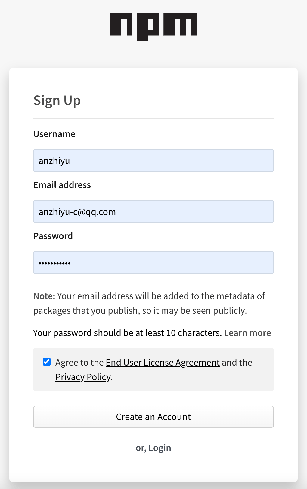
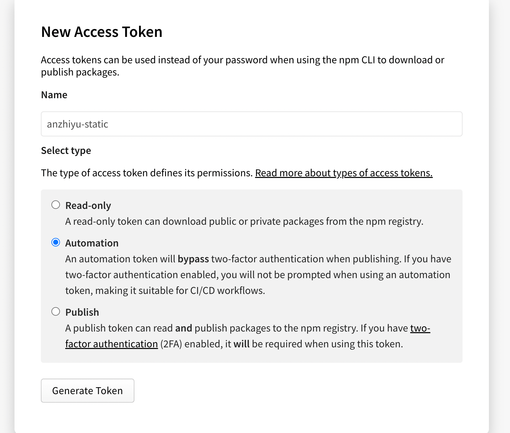

1. 首先需要注册一个 npm 的账号。访问 [npm 注册页面](https://www.npmjs.com/signup/)



2. 完成邮箱验证，注册完成后进入账号管理界面:头像->Account，拉倒最上方，你会看到 `You have not verified your email address` 字样的提示，点击以后按提示步骤验证你的邮箱。


3. 找到我们之前创建的图床仓库，在本地合适的位置把它 `clone` 下来。找个空文件夹打开终端输入

```bash
git clone git@github.com:[username]/[AssetsRepo].git
#或者
git clone https://github.com/[username]/[AssetsRepo].git
```

4. 在 clone 下来的 `[AssetsRepo]` 文件夹内打开终端，输入以下指令切换回原生源


```bash
npm config set registry https://registry.npmjs.org
```

5. 添加本地 npm 用户设置

```bash
# 仅第一次使用需要添加用户，之后会提示你输入你的npm账号密码以及注册邮箱
npm adduser
# 非第一次使用直接登录即可，之后会提示你输入你的npm账号密码以及注册邮箱
npm login
```

6. 运行 npm 初始化指令，把整个图床仓库打包，按照指示进行配置，注意需要事先确认你的包名没有和别人已发布的包重复，可以在 npm 官网搜索相应包名，搜不到就说明还没被占用。

```bash
npm init
```


最后会输出一段 `package.json`，请求确认，输入 `yes` 即可。

7. 然后输入发布指令，我们就可以把包发布到 `npm` 上了。

```bash
npm publish
```

8. `jsdelivr+npm` 的图片引用和 `jsdelivr+github` 很相似，例如我在 `[AssetsRepo]` 仓库里存放的 `/img/index.png` 

```bash
# jsDelivr+github链接
https://cdn.jsdelivr.net/gh/[GithubUserName]/[AssetsRepo]/img/index.png
# jsDelivr+npm链接
https://cdn.jsdelivr.net/npm/[NpmPackageName]/img/index.png
```

> 可以看到 Npm 只需要提供包名即可。这也是一开始要求包名不重复的原因之一

`jsDelivr+Npm` 依然有 100MB 的包大小限制，但是 NPM 有丰富的国内节点。可以挑选一个使用。个人推荐知乎的。没有大小限制，而且也很稳定。

```bash
【jsd出品，网宿国内节点】
https://cdn.jsdelivr.net/npm/:package@:version/:file
【unpkg 自建】
https://cdn.cbd.int/:package@:version/:file
```

当然你也可以利用 [unpkg](https://unpkg.com/) 自建。(UNPKG 是一个内容源自 npm 的全球快速 CDN。它部署在 cloudflare 上，在大陆地区访问到的是香港节点。所以速度也不错。)

```bash
https://unpkg.com/:package@:version/:file
```


9. 如果每次都要在本地进行 `npm publish` 的话，npm 的提交是整个包一起上传的，不存在增量更新，耗时不说，而且还往往需要架梯子才能正常上传。所以我们可以把它交给 github action 来完成。 
   - 在 [npm 官网](https://www.npmjs.com/) ->头像->`Access Tokens`->`Generate New Token`,勾选 `Automation` 选项，`Token` 只会显示这一次，之后如果忘记了就只能重新生成重新配置了。
    
      
      
     
     
     
     
   - 在 github 的 `[AssetsRepo]` 仓库设置项里添加一个名为 `NPM_TOKEN` 的 `secrets` ，把获取的 Npm 的 Access token 输入进去。
   
      
   
      
   
   - 在本地的 `[AssetsRepo]` 文件夹下新建 `[AssetsRepo]/.github/workflows/autopublish.yml`,
   
      ```yml
      name: Node.js Package
      # 监测图床分支，2020年10月后github新建仓库默认分支改为main，记得更改
      on:
        push:
          branches:
            - master
      
      jobs:
        publish-npm:
          runs-on: ubuntu-latest
          steps:
            - uses: actions/checkout@v2
            - uses: actions/setup-node@v1
              with:
                node-version: "12.x"
                registry-url: https://registry.npmjs.org/
            - run: npm publish
              env:
                NODE_AUTH_TOKEN: ${{secrets.npm_token}}
      ```
   
   - 在本地的 `[AssetsRepo]` 文件夹下打开终端，运行以下指令，上传新增内容至 github，即可触发部署。
   
      ```bash
      # 将更改提交
      git add .
      git commit -m "npm publish"
      # 更新package版本号
      npm version patch
      # 推送至github触发action
      git push
      ```




此处的四行指令顺序严格。

每次更新 npm 图床都需要先修改`[AssetsRepo]\package.json`里的`version`,也就是版本号。

而`npm version patch`即为更新 package.json 里的版本号的指令，效果是末尾版本号+1，例如`0.0.1=>0.0.2`、`1.1.3=>1.1.4`。免去了打开`package.json`再修改版本号的麻烦。（大版本更新还是需要手动改的）

更新 npm 图床务必要记得更新`package.json`里的版本号！


