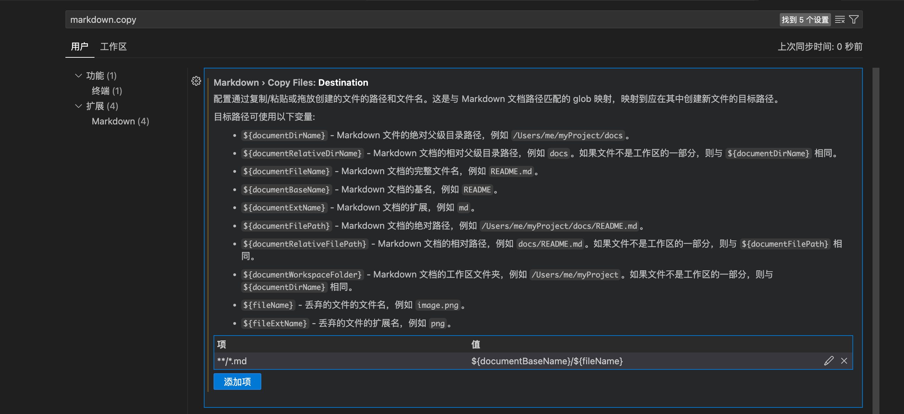

你好，我是悦创。

我这个人求稳，不管是用付费的云存储也好，还是图床也好，比如那个什么去不图床，挺垃圾的。是不是给我 50x 出错。也找不到售后啥的就不说了。

我还是喜欢把文章和图片存储在本地然后发布，经过研究发现 hexo 支持在文章同路径下创建同名文件夹就可以实现，这里就不细讲了。有兴趣的可以查看 [hexo 官网](https://hexo.io/zh-cn/docs/asset-folders#%E4%BD%BF%E7%94%A8-Markdown-%E5%B5%8C%E5%85%A5%E5%9B%BE%E7%89%87)

推荐阅读📖：[Hexo 图片设置相对路径](https://bornforthis.cn/blog/hexo/03-image-asset.html)

# 开始配置

VS Code 内的 markdown 编辑器应该算是比较好用的，但是有一个问题一直困扰着我，就是在编辑 markdown 文件时，粘贴图片的位置问题。

默认情况下，VS Code 会将粘贴的图片放在 markdown 文件的同级目录下，这样会导致 markdown 文件的目录结构变得非常混乱，不利于管理。就算管理，还得手动去移动、重命名非常麻烦。

其实只需要简单的设置一下，就可以解决这个问题。

1. 在 VS Code 中，按下 `Ctrl + ,`，打开设置界面。
2. 在搜索框中输入 `markdown.copy`, 找到 `Markdown> Copy Files:Destination`
3. 新增配置项 key 为 "`**/*.md`" , value 为 你的目标路径。比如我想将图片放在 `assets` 目录下 markdown 文件同名的目录下，那么我就可以设置为 `assets/${documentBaseName}/${fileName}`， 其中 `${documentBaseName}` 代表 markdown 文件的文件名，`${fileName}` 代表图片的文件名。
4. 上面第三点，其实是比较推荐的。但是我需要符合 hexo，所以我配置如下：`**/*.md:${documentBaseName}/${fileName}`。
5. 保存设置即可。







AI悦创·编程一对一

> AI悦创·推出辅导班啦，包括「Python 语言辅导班、C++ 辅导班、java 辅导班、算法/数据结构辅导班、少儿编程、pygame 游戏开发、Web、Linux」，全部都是一对一教学：一对一辅导 + 一对一答疑 + 布置作业 + 项目实践等。当然，还有线下线上摄影课程、Photoshop、Premiere 一对一教学、QQ、微信在线，随时响应！微信：Jiabcdefh
>
> C++ 信息奥赛题解，长期更新！长期招收一对一中小学信息奥赛集训，莆田、厦门地区有机会线下上门，其他地区线上。微信：Jiabcdefh
>
> 方法一：[QQ](http://wpa.qq.com/msgrd?v=3&uin=1432803776&site=qq&menu=yes)
>
> 方法二：微信：Jiabcdefh



