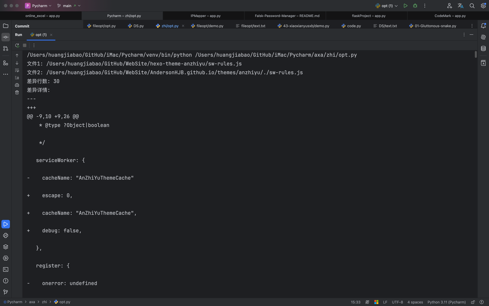

# 1. 背景

你好，我是悦创。

最近呢，新建了这个 hexo 博客生活网站，对就是这么计划和想的。结果......除了说说，文章都是技术类文章，实属草率了。因为技术类我写了太多太多。主要在这个网站：[https://bornforthis.cn/Memoirs.html](https://bornforthis.cn/Memoirs.html)，但是主网站文章太多，每次发布要 1h 左右，这个网站发布可以做到“实时”。

用了 hexo 的安知鱼主题，魔改了一部分。如果直接一键覆盖是可以做到升级，但是自身魔改的就会消失。

估计很多魔改的小伙伴，一开始魔改就做好了不升级或者小魔改不修改源码，进行升级。

我比较贪心，想要实现自己魔改，又能实时跟随大佬开源进行升级，这样就可以实时更新和修复 bug。

这时想到使用 Python 编写实现小程序，进行对比文件夹内不同的部分。选择把不同的部分进行覆盖升级，达到无损升级。

待定：「想法还没确认」对于无损升级的核心就是：自己修改过的进行手动修改，对于自己没有修改过的进行一键覆盖。对比效果使用命令行显示或者

目前，先找出不同，手动修改。

# 2. 代码实现


<!-- tab V0.1 -->

1. 实现初步代码，运行效果如下：







2. 我感觉很不直观，准备继续改进最后的显示效果；

```python
import os
import filecmp
import difflib

def compare_files(file1, file2):
    """
    比较两个文件内容并返回差异行数。
    
    :param file1: 第一个文件路径
    :param file2: 第二个文件路径
    :return: 返回差异的行数和差异详细信息
    """
    with open(file1, 'r', encoding='utf-8') as f1, open(file2, 'r', encoding='utf-8') as f2:
        file1_lines = f1.readlines()
        file2_lines = f2.readlines()
    
    diff = difflib.unified_diff(file1_lines, file2_lines, lineterm='')
    diff_list = list(diff)
    
    # 统计不同的行数
    diff_count = len([line for line in diff_list if line.startswith('- ') or line.startswith('+ ')])
    
    return diff_count, diff_list

def compare_directories(dir1, dir2, ignore_files=None, ignore_dirs=None):
    """
    比较两个目录中的所有文件，忽略指定的文件和文件夹。
    
    :param dir1: 第一个目录路径
    :param dir2: 第二个目录路径
    :param ignore_files: 要忽略的文件列表
    :param ignore_dirs: 要忽略的文件夹列表
    :return: 返回不同文件的列表和差异信息
    """
    if ignore_files is None:
        ignore_files = []
    if ignore_dirs is None:
        ignore_dirs = []
    
    diff_results = []
    
    # 遍历第一个目录中的所有文件和文件夹
    for root, dirs, files in os.walk(dir1):
        relative_path = os.path.relpath(root, dir1)
        
        # 如果该目录在忽略列表中，跳过
        if any(os.path.commonpath([root]) == os.path.commonpath([os.path.join(dir1, ig)]) for ig in ignore_dirs):
            continue
        
        # 过滤掉忽略的文件夹
        dirs[:] = [d for d in dirs if d not in ignore_dirs]
        
        for file in files:
            if file in ignore_files:
                continue
            
            file1 = os.path.join(root, file)
            file2 = os.path.join(dir2, relative_path, file)
            
            # 如果文件不存在或文件内容不同
            if os.path.exists(file2) and not filecmp.cmp(file1, file2, shallow=False):
                diff_count, diff_lines = compare_files(file1, file2)
                diff_results.append({
                    'file1': file1,
                    'file2': file2,
                    'diff_count': diff_count,
                    'diff_lines': diff_lines
                })
            elif not os.path.exists(file2):
                diff_results.append({
                    'file1': file1,
                    'file2': file2,
                    'diff_count': '文件不存在',
                    'diff_lines': []
                })
    
    # 再遍历第二个目录中的所有文件和文件夹
    for root, dirs, files in os.walk(dir2):
        relative_path = os.path.relpath(root, dir2)
        
        if any(os.path.commonpath([root]) == os.path.commonpath([os.path.join(dir2, ig)]) for ig in ignore_dirs):
            continue
        
        # 过滤掉忽略的文件夹
        dirs[:] = [d for d in dirs if d not in ignore_dirs]
        
        for file in files:
            if file in ignore_files:
                continue
            
            file2 = os.path.join(root, file)
            file1 = os.path.join(dir1, relative_path, file)
            
            # 如果文件只在第二个目录中存在
            if not os.path.exists(file1):
                diff_results.append({
                    'file1': file1,
                    'file2': file2,
                    'diff_count': '文件不存在',
                    'diff_lines': []
                })
    
    return diff_results

# 测试
dir1 = "/path/to/dir1"
dir2 = "/path/to/dir2"
ignore_files = ["ignore_file.txt"]  # 忽略的文件
ignore_dirs = ["ignore_dir"]        # 忽略的文件夹

differences = compare_directories(dir1, dir2, ignore_files, ignore_dirs)

# 输出不同文件及其行数
for diff in differences:
    print(f"文件1: {diff['file1']}")
    print(f"文件2: {diff['file2']}")
    print(f"差异行数: {diff['diff_count']}")
    if diff['diff_lines']:
        print("差异详情:")
        for line in diff['diff_lines']:
            print(line)
    print("=" * 40)
```

---

上面代码部分文件会报错：编码错误，使用下面的代码即可：

```python
import os
import filecmp
import difflib


def compare_files(file1, file2):
    """
    比较两个文件内容并返回差异行数，处理不同的编码。

    :param file1: 第一个文件路径
    :param file2: 第二个文件路径
    :return: 返回差异的行数和差异详细信息
    """
    try:
        with open(file1, 'r', encoding='utf-8', errors='ignore') as f1, open(file2, 'r', encoding='utf-8',
                                                                             errors='ignore') as f2:
            file1_lines = f1.readlines()
            file2_lines = f2.readlines()
    except UnicodeDecodeError as e:
        print(f"无法解码文件: {file1} 或 {file2}, 错误: {e}")
        return 0, []  # 返回0行差异，空的差异详情

    diff = difflib.unified_diff(file1_lines, file2_lines, lineterm='')
    diff_list = list(diff)

    # 统计不同的行数
    diff_count = len([line for line in diff_list if line.startswith('- ') or line.startswith('+ ')])

    return diff_count, diff_list


def compare_directories(dir1, dir2, ignore_files=None, ignore_dirs=None):
    """
    比较两个目录中的所有文件，忽略指定的文件和文件夹。

    :param dir1: 第一个目录路径
    :param dir2: 第二个目录路径
    :param ignore_files: 要忽略的文件列表
    :param ignore_dirs: 要忽略的文件夹列表
    :return: 返回不同文件的列表和差异信息
    """
    if ignore_files is None:
        ignore_files = []
    if ignore_dirs is None:
        ignore_dirs = []

    diff_results = []

    # 遍历第一个目录中的所有文件和文件夹
    for root, dirs, files in os.walk(dir1):
        relative_path = os.path.relpath(root, dir1)

        # 如果该目录在忽略列表中，跳过
        if any(os.path.commonpath([root]) == os.path.commonpath([os.path.join(dir1, ig)]) for ig in ignore_dirs):
            continue

        # 过滤掉忽略的文件夹
        dirs[:] = [d for d in dirs if d not in ignore_dirs]

        for file in files:
            if file in ignore_files:
                continue

            file1 = os.path.join(root, file)
            file2 = os.path.join(dir2, relative_path, file)

            # 如果文件不存在或文件内容不同
            if os.path.exists(file2) and not filecmp.cmp(file1, file2, shallow=False):
                diff_count, diff_lines = compare_files(file1, file2)
                diff_results.append({
                    'file1': file1,
                    'file2': file2,
                    'diff_count': diff_count,
                    'diff_lines': diff_lines
                })
            elif not os.path.exists(file2):
                diff_results.append({
                    'file1': file1,
                    'file2': file2,
                    'diff_count': '文件不存在',
                    'diff_lines': []
                })

    # 再遍历第二个目录中的所有文件和文件夹
    for root, dirs, files in os.walk(dir2):
        relative_path = os.path.relpath(root, dir2)

        if any(os.path.commonpath([root]) == os.path.commonpath([os.path.join(dir2, ig)]) for ig in ignore_dirs):
            continue

        # 过滤掉忽略的文件夹
        dirs[:] = [d for d in dirs if d not in ignore_dirs]

        for file in files:
            if file in ignore_files:
                continue

            file2 = os.path.join(root, file)
            file1 = os.path.join(dir1, relative_path, file)

            # 如果文件只在第二个目录中存在
            if not os.path.exists(file1):
                diff_results.append({
                    'file1': file1,
                    'file2': file2,
                    'diff_count': '文件不存在',
                    'diff_lines': []
                })

    return diff_results


# 测试
dir1 = "/Users/huangjiabao/GitHub/WebSite/hexo-theme-anzhiyu"
dir2 = "/Users/huangjiabao/GitHub/WebSite/AndersonHJB.github.io/themes/anzhiyu"
ignore_files = ["ignore_file.txt"]  # 忽略的文件
ignore_dirs = ["ignore_dir"]  # 忽略的文件夹

differences = compare_directories(dir1, dir2, ignore_files, ignore_dirs)

# 输出不同文件及其行数
for diff in differences:
    print(f"文件1: {diff['file1']}")
    print(f"文件2: {diff['file2']}")
    print(f"差异行数: {diff['diff_count']}")
    if diff['diff_lines']:
        print("差异详情:")
        for line in diff['diff_lines']:
            print(line)
    print("=" * 40)
```
<!-- endtab -->

<!-- tab V0.2 -->
<!-- endtab -->
