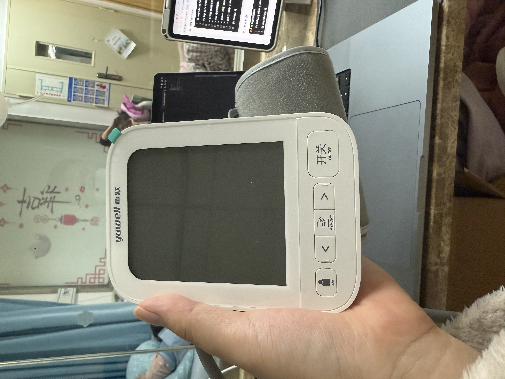
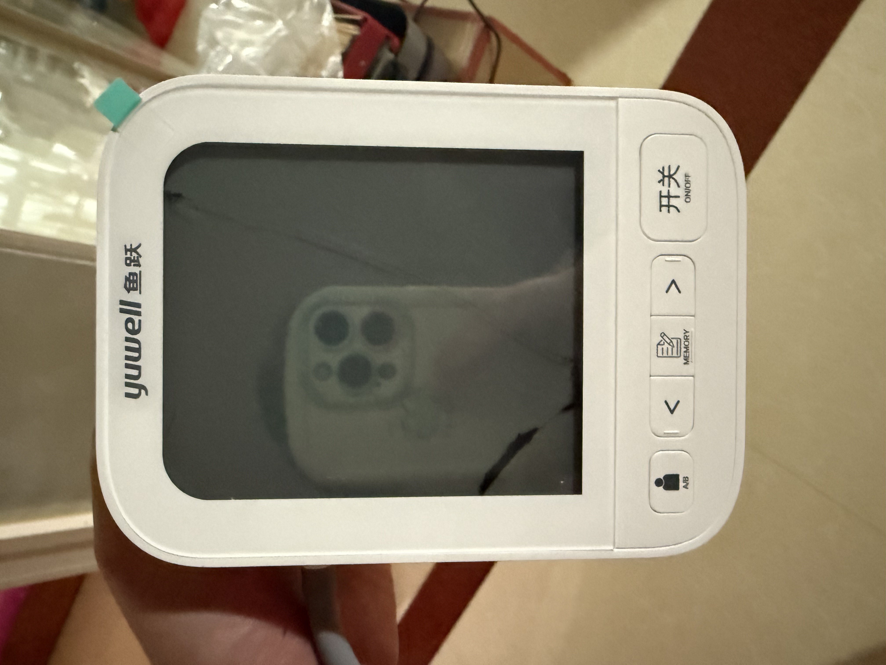
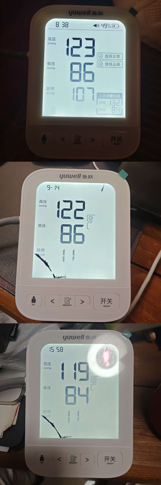
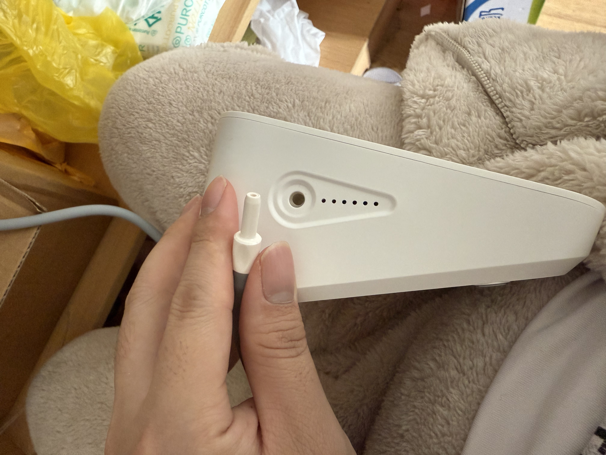
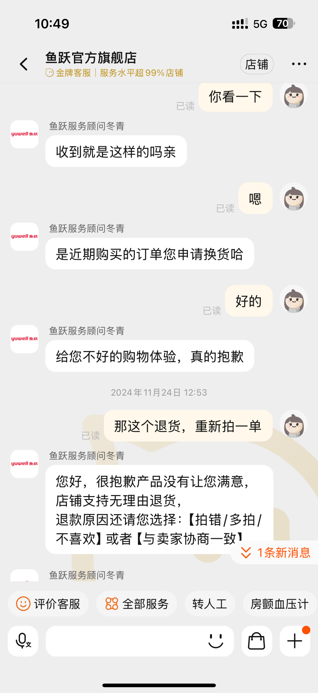

## 血压

你好，我是悦创。

因为孕期血压有时不平稳，被医生判定：孕期高血压。为此，买了一个血压仪进行测量。





购买血压仪之初，我们最在意的便是：什么牌子？此时，我就想起了学医的博士朋友，我特地去请教了一下：





最终买了一个，起初用的还不错，每次测量血压都是我亲自操作，操作起来整体还是挺方便的。方便的同时，也容易坏～

为什么容易坏呢？因为不耐摔，一次我在写代码，就想着老婆自己拿出来血压仪给我，结果给我的是一款战损版：





难以想象，这时刚买没多久的血压仪吗？

突然啪的一声，我惊奇一身冷汗，什么声音？

三步并作两步，走到妻子面前。

我就这么一拿它就掉了，妻子这么说着，我也这么听着。我们不能直接拿着绑在手臂的那端，是会掉落的。这个是插拔式的，这样还容易坏，我耐心的细说着：





随之，我就想着还没过 7 天无理由，去找找淘宝客服看看👀，能不能退换货。——我真是个大聪明「内心想着」





真是太聪明了，当然也离不开卖家的优质售后服务。「在开心的同时，有时候也不要忘记思索一下，为何成功。而不是飘～」

因为，血压偏高，一直说：血压控制好的话，最多到 39 周，那时候要么催要买剖。一开始，我们一直没怎么放在心上，一直坚信着自己可以顺产下来并且血压确实只是临界，并没有特别的异常或者有其它的伴随症状（貌似有些许水肿吧）

其实医生本身也很纠结😐：





我们想着，再等等，只要血压平稳就没事。

不过一直等着，我们也了解到妊辰器高血压顺产是有危险的，开了无数次的家庭会议。最终，我们决定先去住院观察，等到 39周。发出微信后，这时黄艳医生也问我们：是要 VIP 还是普通单人间呢？

单人间环境比较安静，适合观察和休息♨️，但是贵一天 **350元/天** 。多人间便宜，一天 **110** 但是没那么安静。对于别人走路发出的啪啪啪的声音，都觉得吵的老婆来说，肯定得安静才能控制好血压和休息好。怎么说呢，该花还是得花。

虽然，妻子一直觉得提前住院没什么用。提前住院，对于后期血压控制或者其它“突发情况”（比如：发动）处理会比较稳妥，我耐心的解释着。虽然我不厌其烦的解释着，妻子一如既往的“固执”这让我很是头疼🤕。

我陪着妻子，在不大不小的走廊里散步，看见医院的结算器。就想着，看看今天的六千多缴费，花在哪里了。真是一看不知道，一看吓一跳～

在医院的第一个晚上，太热——>太冷

## 试着和产科医生“谈恋爱”

## 送锦旗？

从随口一句，从几十块到上百块，只要一瞬间～

## 顺其自然

Tips：**船到桥头自然直**

