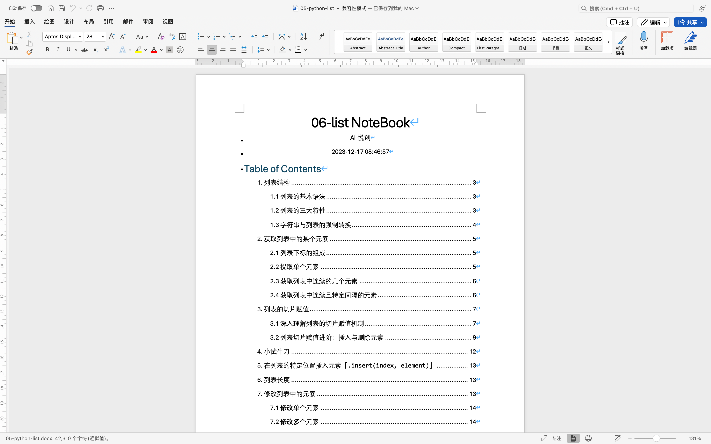
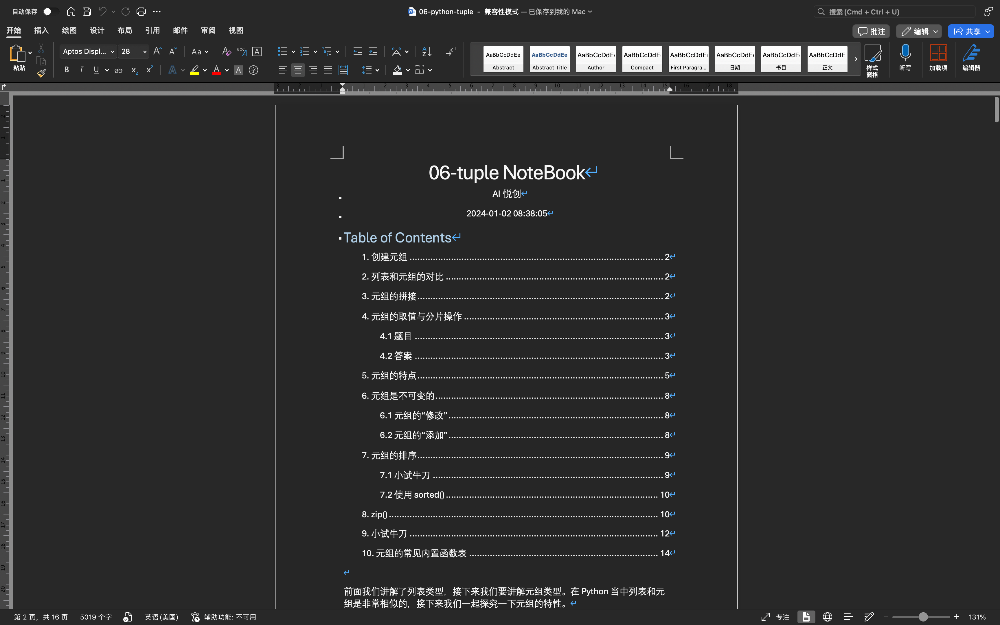
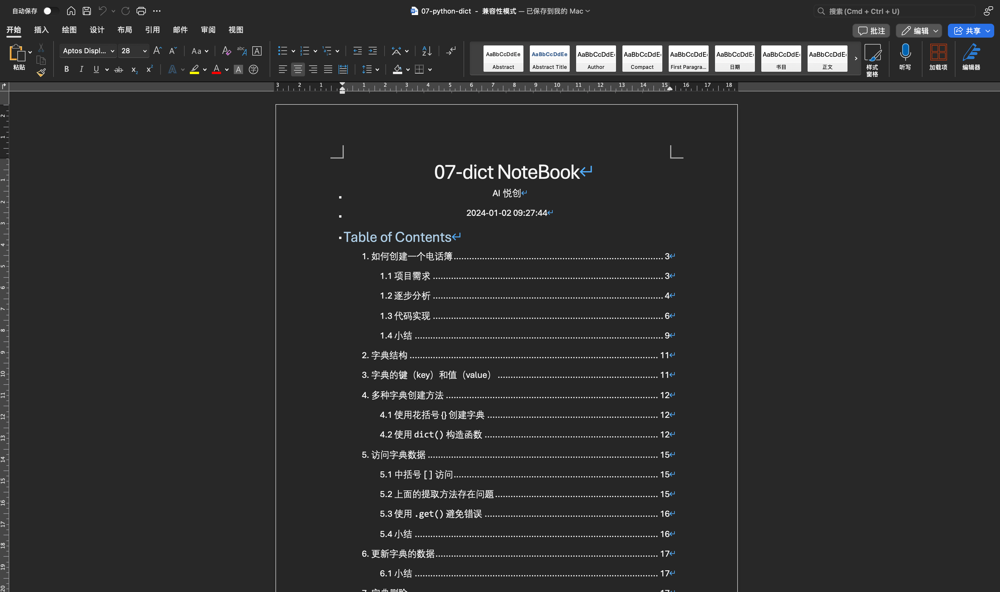

你好，我是悦创。



<!-- timeline 2025-03-21 12:56:49 -->

列表书稿修改完成，word 58页，改了许久，是心血。





<!-- endtimeline -->

<!-- timeline 2025-03-21 12:58:08 -->

开始元组的修改，看看我要改多久吧。元组比较少，应该会比较快！

祝贺我吧，我今天写完了元组的书稿 2025-03-21 23:01:06。



- 2025-03-22 12:35:39：元组中的最后一题出成列表，马上修改了；



<!-- endtimeline -->

<!-- timeline 2025-03-22 07:49:20 -->

字典开始编写，看看要写多久。争取今天写出来！

<!-- endtimeline -->

<!-- timeline 2025-03-25 12:21:27 -->

字典还没写完，但是今天估计差不多。写着写着想着列表补充讲解 17.1 map() 函数，补充完成。继续努力💪
<!-- endtimeline -->

<!-- timeline 2025-03-26 22:40:00 -->
啊啊啊啊啊啊，字典终于写完了！撒了泡尿，回来记录时间！



<!-- endtimeline -->
<!-- timeline 2025-03-26 22:44:27 -->
开始集合，应该会快不少吧？
<!-- endtimeline -->








AI悦创·编程一对一

> AI悦创·推出辅导班啦，包括「Python 语言辅导班、C++ 辅导班、java 辅导班、算法/数据结构辅导班、少儿编程、pygame 游戏开发、Web、Linux」，全部都是一对一教学：一对一辅导 + 一对一答疑 + 布置作业 + 项目实践等。当然，还有线下线上摄影课程、Photoshop、Premiere 一对一教学、QQ、微信在线，随时响应！微信：Jiabcdefh
>
> C++ 信息奥赛题解，长期更新！长期招收一对一中小学信息奥赛集训，莆田、厦门地区有机会线下上门，其他地区线上。微信：Jiabcdefh
>
> 方法一：[QQ](http://wpa.qq.com/msgrd?v=3&uin=1432803776&site=qq&menu=yes)
>
> 方法二：微信：Jiabcdefh


