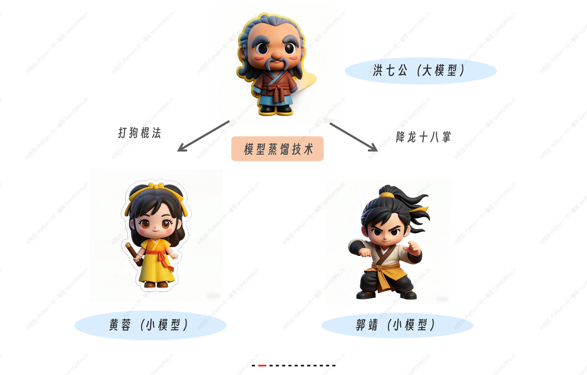
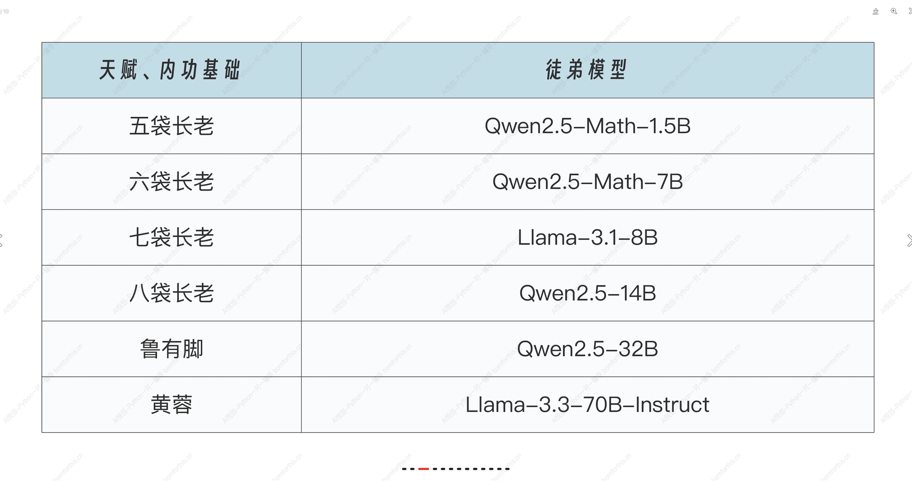
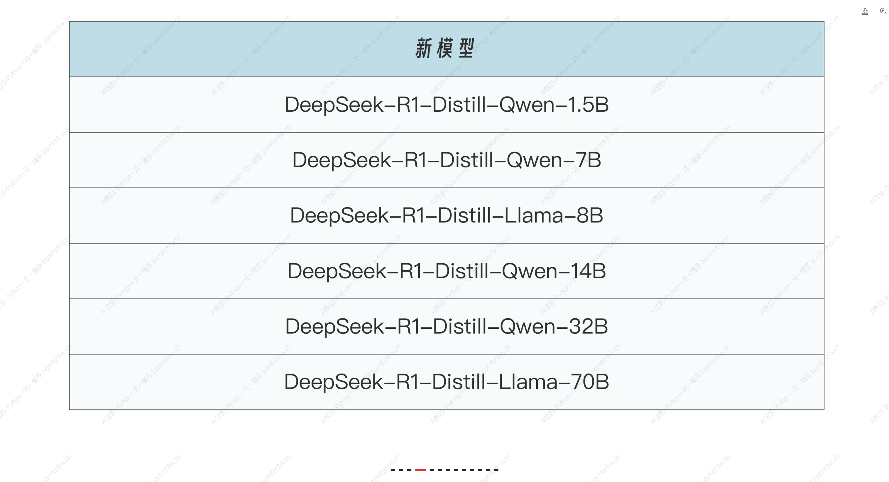

你好，我是悦创。

飞雪连天射白鹿，笑书神侠倚碧鸳。金庸老先生的著作人物众多，武学精妙绝伦，剧情跌宕起伏，非常吸引人。我在上大学时，曾经两天时间就读完了《射雕英雄传》。

恰逢最近 DeepSeek 模型爆火，“模型蒸馏”这个专业名词也频繁出现在大众视野，所以在前置课程里面，我想先借着《射雕英雄传》里的人物，来聊聊“模型蒸馏”。不过你不用担心它过于深奥，作为应用开发者，我们只要知道它大致的原理就足够了。

## 蒸馏是什么？

在《射雕英雄传》中，洪七公是江湖上人人敬仰的北丐，武功高强，见识广博，内力深厚，就像大模型，经过了海量数据的训练，拥有强大的知识储备和计算能力。然而，大模型的训练和部署成本极高，就像洪七公的武功，不是人人都能轻易学会的。

但洪七公总要收徒传艺，将丐帮武学传承下去。因此他需要将武功用“浓缩”的方式交给徒弟，在保证一定精度的同时，**大幅降低对于内力（GPU）的要求**，例如，他将打狗棒法传给了黄蓉，将降龙十八掌传给了郭靖等等，这便是模型蒸馏技术。

黄蓉等小模型，虽然武功不及洪七公，但是胜在没有洪七公这么大的江湖名望（部署和推理成本低），因此对付三流的沙通天、灵智上人之类的小卡拉米时，没有江湖前辈欺负后辈的心理包袱。

以 DeepSeek 发布的六个蒸馏模型为例，满血版 671B 参数量的 DeepSeek R1 就是洪七公，而洪七公针对不同尺寸的徒弟模型进行武功蒸馏，这些徒弟模型包括：

经过蒸馏后便得到了新模型：

总之，每个徒弟的资质、水平不一样，基础素质越高的，能力越强，越能从师父身上学到更多的东西，也就越接近师父的水平。

洪七公教徒弟的方法，是他先演示一遍，然后让徒弟跟着模仿一遍。但洪七公不会让徒弟死记硬背，而是会交给他们**思维方式**，让他们自己感受内力的流动，做到招式随心而发。在模型蒸馏中，思维方式有一个专业名称，叫**做软标签，软标签并不是直接告诉小模型“这是对的”，而是通过大模型的输出，给出每个类别的概率分布**。小模型通过学习这些概率分布，能够理解不同类别之间的微妙区别。

徒弟们在拜入洪七公门下时，都有自己的武功根基，因此在学习洪七公的武功时，会有一些自己的想法，这被称之为硬标签。在实际蒸馏过程中，徒弟要尽可能学习师父的本领，但是又不能和自己原本的内功冲突，导致走火入魔。因此需要在软硬标签间寻找一个标准，得到标准后，进行反复训练，直到纯熟，此时徒弟就出师了。

OK，以上就是关于模型蒸馏的一点白话解读，对于做应用开发的我们来讲，不需要深究其中的原理，只需要大概了解，会用即可。







AI悦创·编程一对一

> AI悦创·推出辅导班啦，包括「Python 语言辅导班、C++ 辅导班、java 辅导班、算法/数据结构辅导班、少儿编程、pygame 游戏开发、Web、Linux」，全部都是一对一教学：一对一辅导 + 一对一答疑 + 布置作业 + 项目实践等。当然，还有线下线上摄影课程、Photoshop、Premiere 一对一教学、QQ、微信在线，随时响应！微信：Jiabcdefh
>
> C++ 信息奥赛题解，长期更新！长期招收一对一中小学信息奥赛集训，莆田、厦门地区有机会线下上门，其他地区线上。微信：Jiabcdefh
>
> 方法一：[QQ](http://wpa.qq.com/msgrd?v=3&uin=1432803776&site=qq&menu=yes)
>
> 方法二：微信：Jiabcdefh


