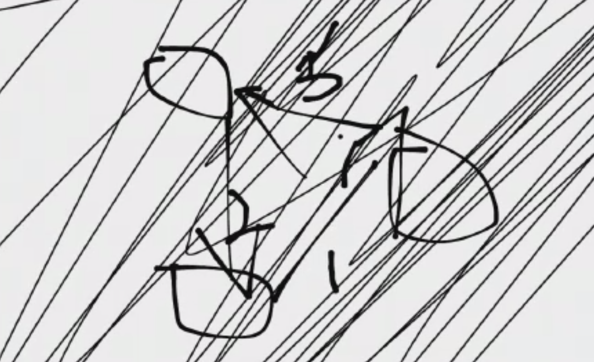
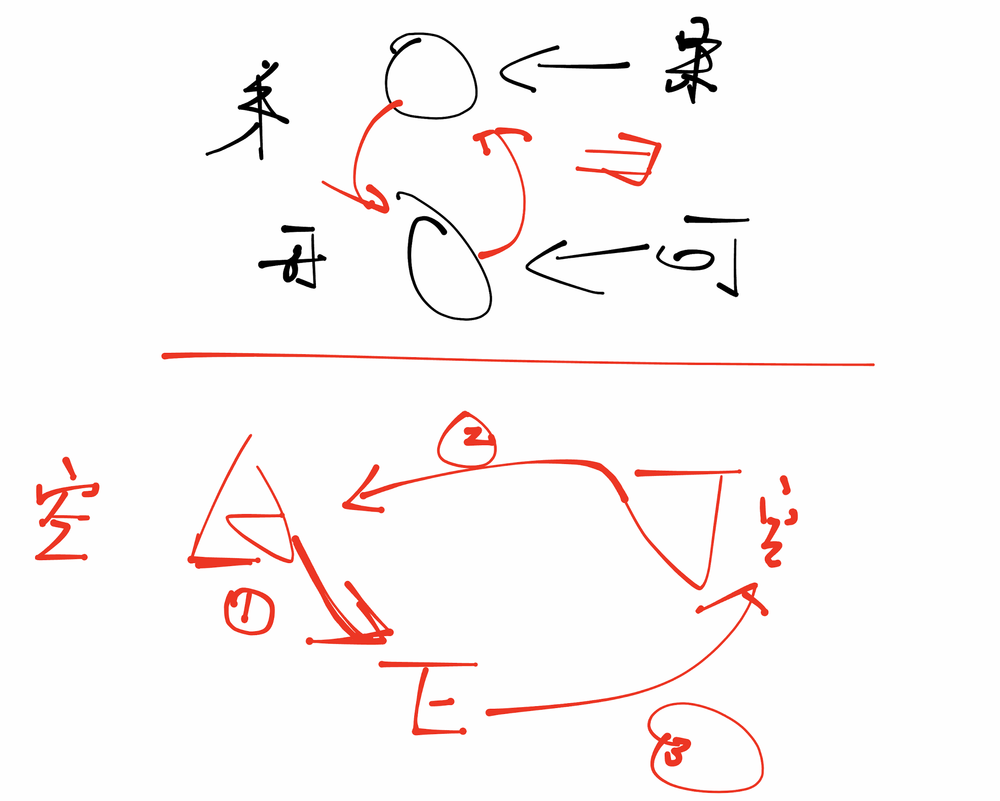
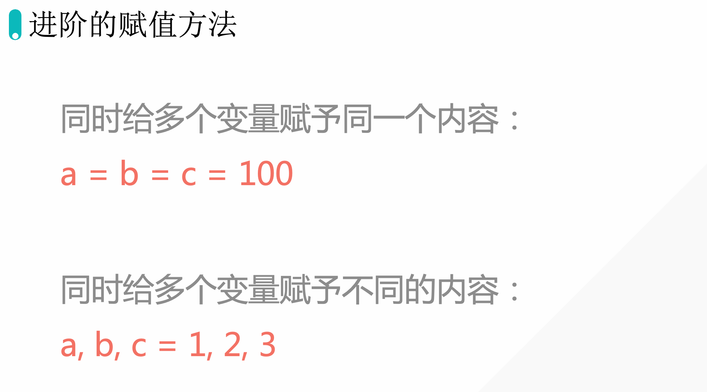
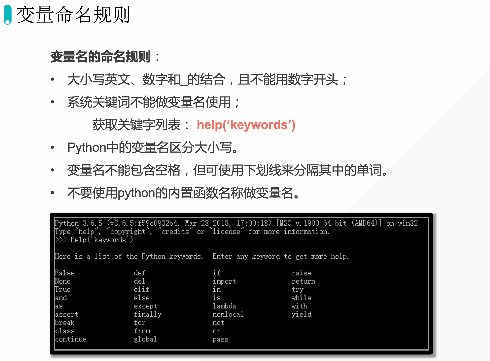
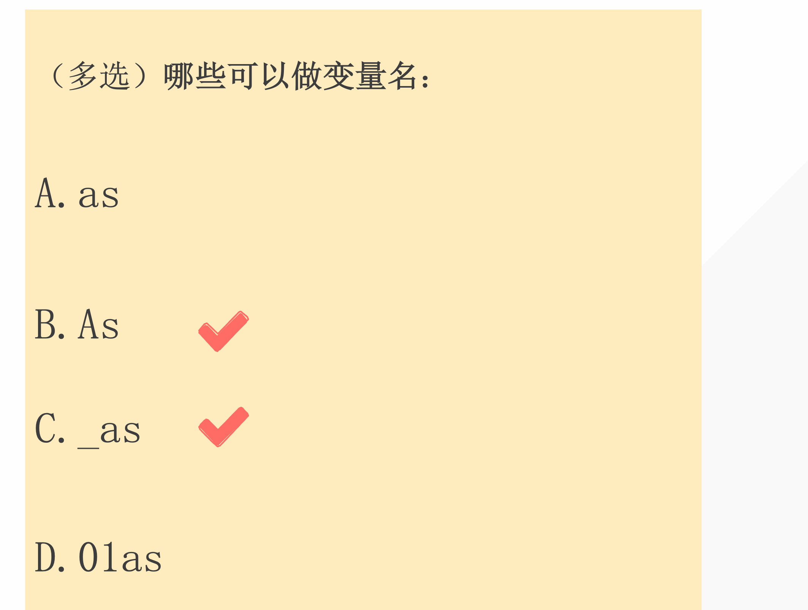
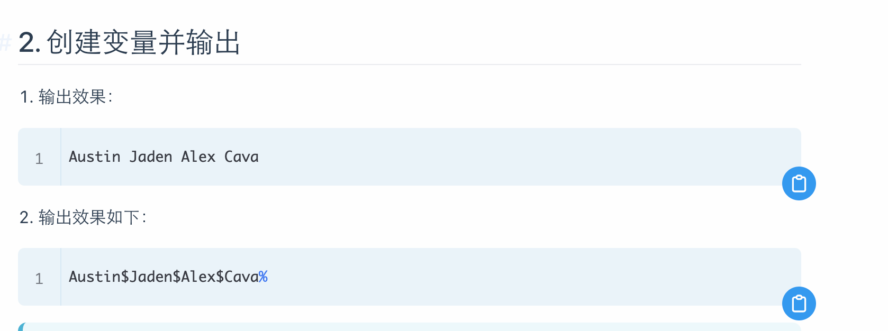

## 1. 作业讲解

题目链接：[https://bornforthis.cn/column/py/basequestion/special_variabl.html](https://bornforthis.cn/column/py/basequestion/special_variabl.html)






## 2. 同时给多个变量赋予相同的值




```python
Austin = "可乐"
Jaden = "果汁"

Austin, Jaden = Jaden, Austin
print(Austin, Jaden)
```

## 变量的命名规则

```python
Name = "aiyc"
name = "look"
print(Name)

user_name = "aiyc"

# print(help("keywords"))
# as = "aiyc"
# As = "aiyc"

# print = "aiyc"
# print(print)
# 01username = "aiyc"
u1s1e1r121name1212122121 = "aiyc"
```




## 练习



## 作业




## 课后反馈

1. 
1. 

欢迎关注我公众号：AI悦创，有更多更好玩的等你发现！

::: details 公众号：AI悦创【二维码】


:::

::: info AI悦创·编程一对一

AI悦创·推出辅导班啦，包括「Python 语言辅导班、C++ 辅导班、java 辅导班、算法/数据结构辅导班、少儿编程、pygame 游戏开发」，全部都是一对一教学：一对一辅导 + 一对一答疑 + 布置作业 + 项目实践等。当然，还有线下线上摄影课程、Photoshop、Premiere 一对一教学、QQ、微信在线，随时响应！微信：Jiabcdefh

C++ 信息奥赛题解，长期更新！长期招收一对一中小学信息奥赛集训，莆田、厦门地区有机会线下上门，其他地区线上。微信：Jiabcdefh

方法一：[QQ](http://wpa.qq.com/msgrd?v=3&uin=1432803776&site=qq&menu=yes)

方法二：微信：Jiabcdefh

:::


