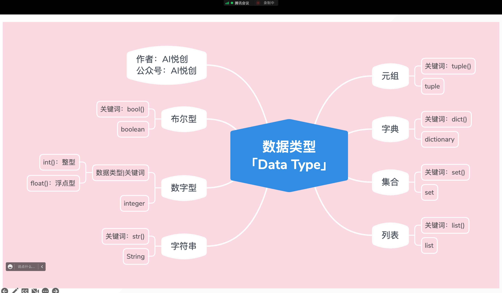
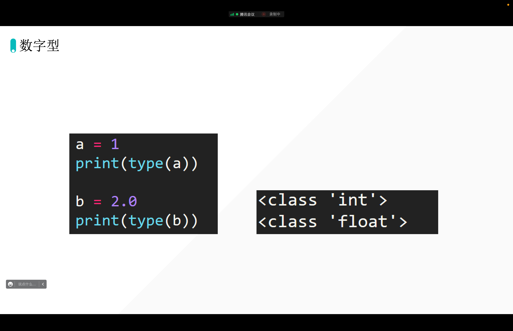
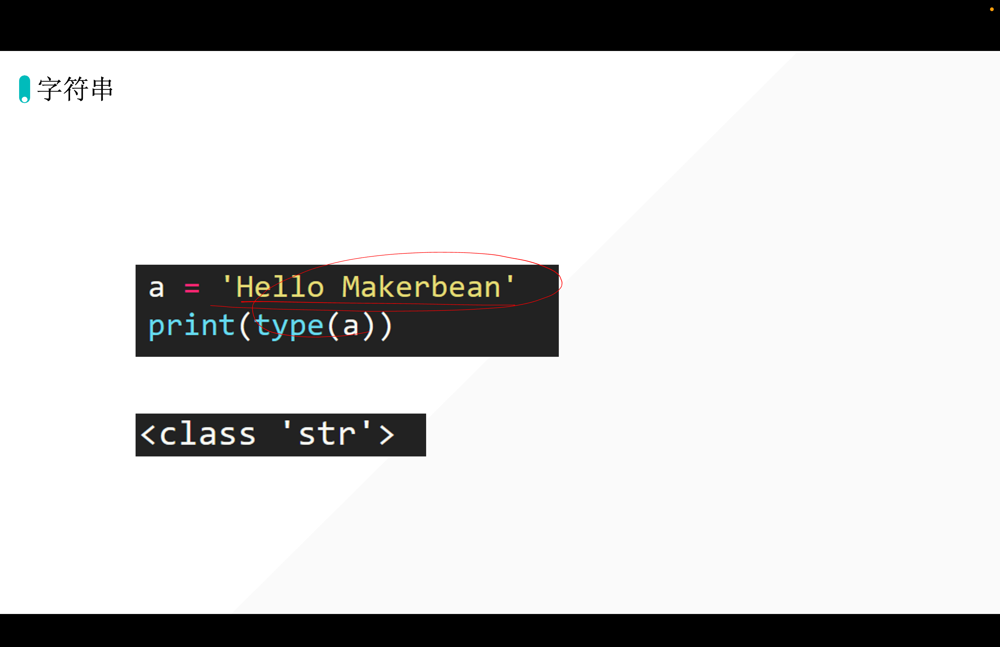
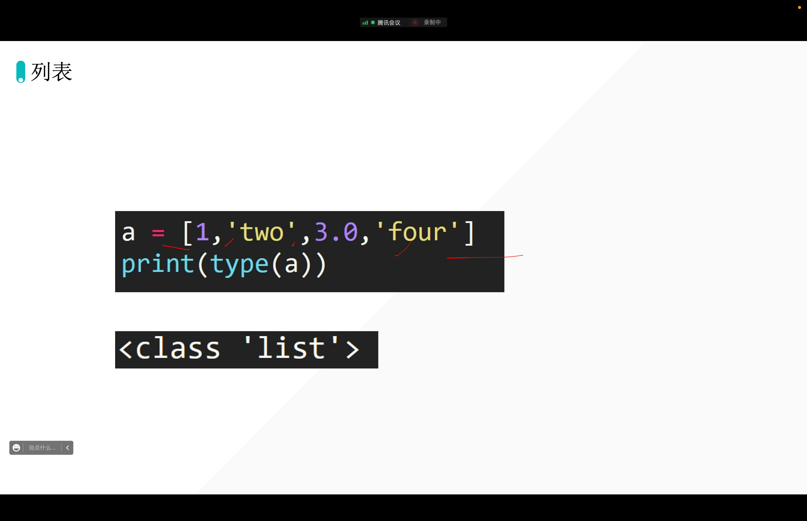
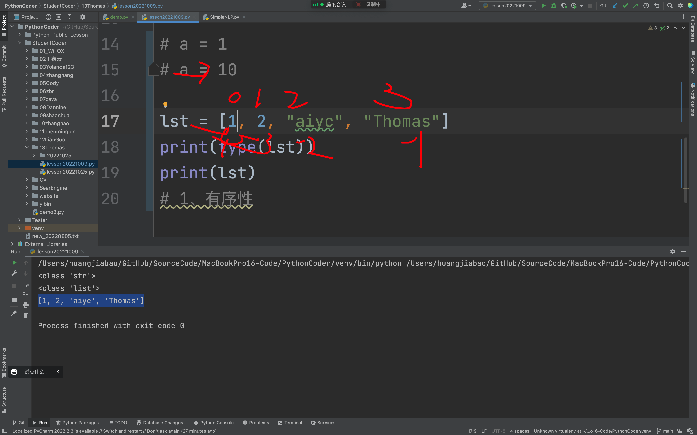
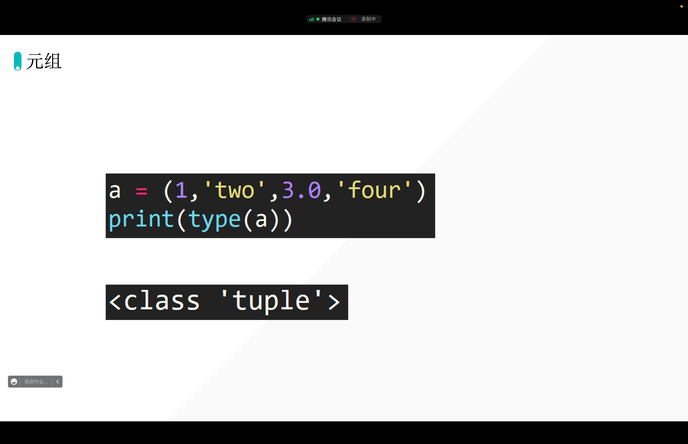
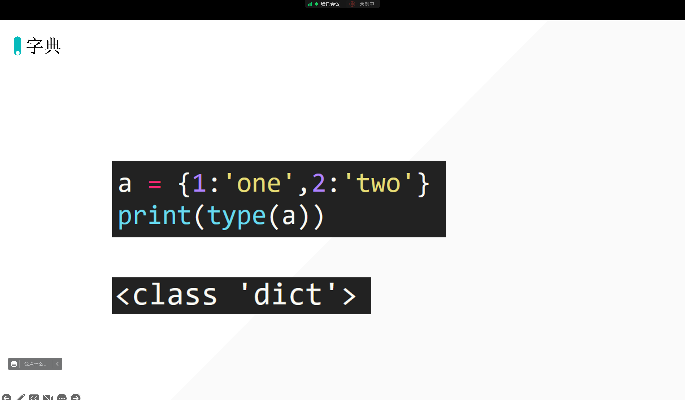

## Python有哪些数据类型呢？







```python
# -*- coding: utf-8 -*-
# @Time    : 2022/10/9 17:46
# @Author  : AI悦创
# @FileName: lesson20221009.py
# @Software: PyCharm
# @Blog    ：https://bornforthis.cn/
s = "Hello aiyuechuangodododdodde"
print(type(s))
# 三大特性
# 1、有序性：从左到右 0 开始。从右到左-1开始
# 2. 不可变性 不可变指的是：在代码运行当中不可以被改变
# 3. 任意数据类型，你键盘可以输入的任何字符，都可以放在字符串中

# a = 1
# a = 10
```







## 字典的创建



```python
# dict
# s = {value1, value2, value3, value4, value5, value6}
# d = {"key1": "value1", "key2": "value2"}
```


## 评价

1. 状态很不错；
2. 对于之前的知识比较牢固；「比如网站启动的命令等」
3. 关于电脑的问题：有可能是系统升级导致的，最近苹果新系统比较不稳定，当然可以升级，以后升级系统后，可以检查一下编程环境噢。这样咱可以提前解决啦。
4. 

欢迎关注我公众号：AI悦创，有更多更好玩的等你发现！

::: details 公众号：AI悦创【二维码】


:::

::: info AI悦创·编程一对一

AI悦创·推出辅导班啦，包括「Python 语言辅导班、C++ 辅导班、java 辅导班、算法/数据结构辅导班、少儿编程、pygame 游戏开发」，全部都是一对一教学：一对一辅导 + 一对一答疑 + 布置作业 + 项目实践等。当然，还有线下线上摄影课程、Photoshop、Premiere 一对一教学、QQ、微信在线，随时响应！微信：Jiabcdefh

C++ 信息奥赛题解，长期更新！长期招收一对一中小学信息奥赛集训，莆田、厦门地区有机会线下上门，其他地区线上。微信：Jiabcdefh

方法一：[QQ](http://wpa.qq.com/msgrd?v=3&uin=1432803776&site=qq&menu=yes)

方法二：微信：Jiabcdefh

:::


