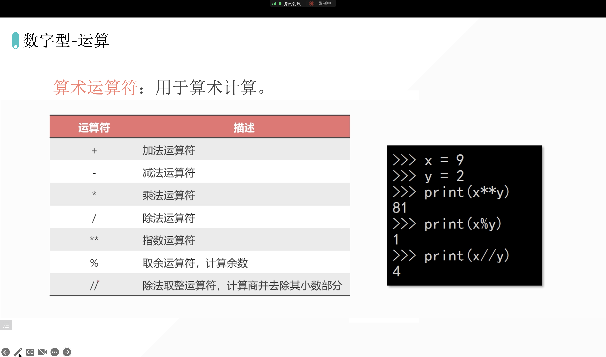
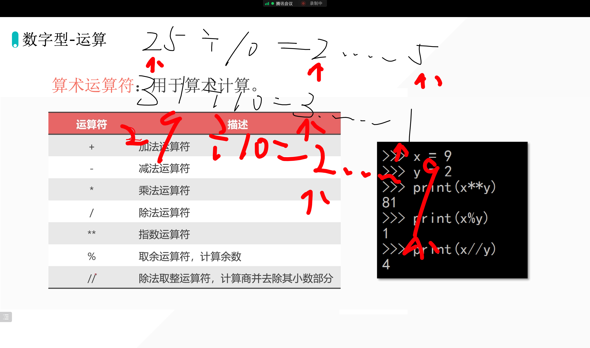
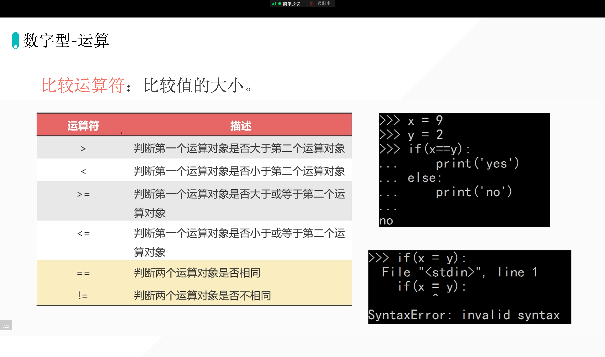
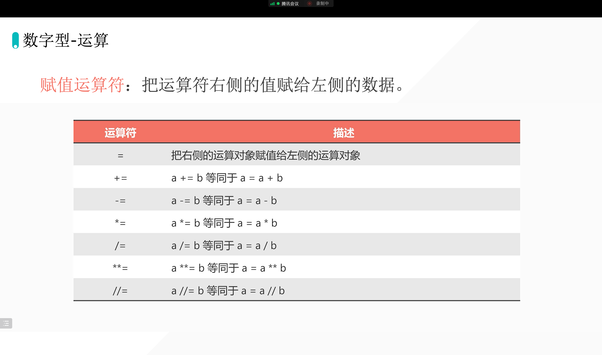

## 1. 数字型的特点

```python
num1 = 1
num2 = 2
result = num1 + num2
print(result)  # 3
```

```python
num1 = 1
num2 = 2
result = num1 + num2
print(result)  # 3

num1 = 1
num2 = 2.0
result = num1 + num2
print(result)  # 3.0

num1 = 1
num2 = 2.0
result = num1 - num2
print(result)  # -1.0

num1 = 1
num2 = 2
result = num1 - num2
print(result)  # -1

num1 = 1
num2 = 2
result = num1 * num2
print(result)  # 2

num1 = 1.0
num2 = 2
result = num1 * num2
print(result)  # 2.0

num1 = 1.0
num2 = 2
result = num1 / num2
print(result)  # 0.5

num1 = 9
num2 = 3
result = num1 / num2
print(result)  # 3.0
# 其中有一个数据是浮点数，最后的结果也就是浮点数「优先级最高」
# 除法涉及精度问题，所以最后的结果就是浮点型
```

## 运算符



### 运算符练习

- **Question1**
    - 任意 100 以内的两位数整数；
    - 拆分个位和十位，并分别输出。
    - 个位和十位交换位置。
    - 个位和十位求和。
    - 举一个例子🌰：
        - 整数 16
        - 个位：6
        - 十位：1
        - 16 -> 61
        - 1 + 6 = 7

---



```python
num = 59
shiwei = num // 10
gewei = num % 10
print("geiwei", gewei)
print("shiwei", shiwei)

r = gewei * 10 + shiwei
print(r)
print(gewei, shiwei)  # 同时输出多个变量，同时输出多个数据

add = gewei + shiwei
print(add)
```

## 比较运算符



## 运算符优化



```python
a = 1
a = a + 10
print(a)
# 等价于
a = 1
a += 10
print(a)
```

```python
a = 1
a = a - 10
print(a)
# 等价于
a = 1
a -= 10
print(a)
```


## 评价

1. 状态很不错；
2. 对于之前的知识比较牢固；「比如网站启动的命令等」
3. 关于电脑的问题：有可能是系统升级导致的，最近苹果新系统比较不稳定，当然可以升级，以后升级系统后，可以检查一下编程环境噢。这样咱可以提前解决啦。

---

1. 多用变量的思维想问题；
2. 利用编程解放劳动力量呀～

欢迎关注我公众号：AI悦创，有更多更好玩的等你发现！

::: details 公众号：AI悦创【二维码】


:::

::: info AI悦创·编程一对一

AI悦创·推出辅导班啦，包括「Python 语言辅导班、C++ 辅导班、java 辅导班、算法/数据结构辅导班、少儿编程、pygame 游戏开发」，全部都是一对一教学：一对一辅导 + 一对一答疑 + 布置作业 + 项目实践等。当然，还有线下线上摄影课程、Photoshop、Premiere 一对一教学、QQ、微信在线，随时响应！微信：Jiabcdefh

C++ 信息奥赛题解，长期更新！长期招收一对一中小学信息奥赛集训，莆田、厦门地区有机会线下上门，其他地区线上。微信：Jiabcdefh

方法一：[QQ](http://wpa.qq.com/msgrd?v=3&uin=1432803776&site=qq&menu=yes)

方法二：微信：Jiabcdefh

:::


