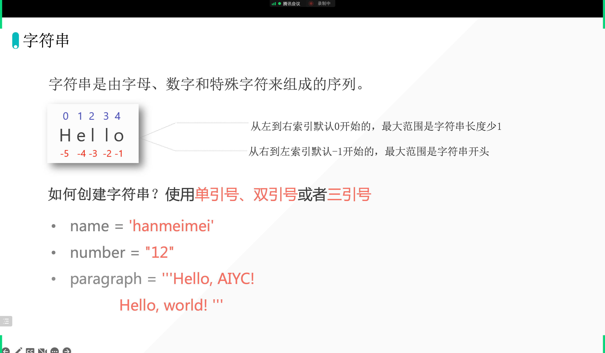
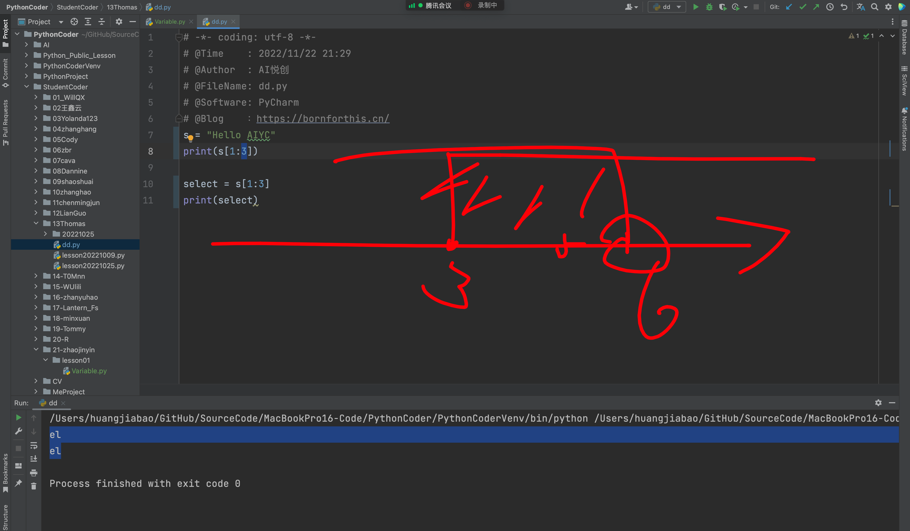

## 字符串定义



## 字符串为什么会有三种创建方法

1. 单双引号混用：

```python
s = "I'm lilei."
print(s)
```

2. 多种引号混用，支持多行文本，原样输出：

```python
s = """During a keynote speech at PyCon US 2022, Anaconda’s CEO Peter Wang unveiled quite a surprising project — PyScript. It is a JavaScript framework that allows users to create Python applications in the browser using a mix of Python and standard HTML. The project’s ultimate goal is to allow a much wider audience (for example, front-end developers) to benefit from the power of Python and its various libraries (statistical, ML/DL, etc.).

The key thilss''''''ngs to know about PyScript
Allows us to use Python and its vast ecosystem of libraries (including numpy, pandas, scikit-learn) from within the browser.
By using environment management users can decide which packages and files are available when running the page’s code."""

print(s)
```

## 查看字符串长度

```python
s = """During a keynote speech at PyCon US 2022, Anaconda’s CEO Peter Wang unveiled quite a surprising project — PyScript. It is a JavaScript framework that allows users to create Python applications in the browser using a mix of Python and standard HTML. The project’s ultimate goal is to allow a much wider audience (for example, front-end developers) to benefit from the power of Python and its various libraries (statistical, ML/DL, etc.).

The key thilss''''''ngs to know about PyScript
Allows us to use Python and its vast ecosystem of libraries (including numpy, pandas, scikit-learn) from within the browser.
By using environment management users can decide which packages and files are available when running the page’s code."""

print(len(s))
```

## 字符串的数据提取

### 提取单个字符

```python
s = "Hello AIYC"
print(s[0])

select = s[0]
print(select)
```

输出：

```python
H
H
```

### 提取多个字符

```python
s = "Hello AIYC"
print(s[1:3])

select = s[1:3]
print(select)
```

输出：

```python
el
el
```



### 提取有间隔/切片的数据

```python
s = "1234567890"
print(s[0:len(s):2])
print(s[0:len(s):2])
```

输出：

```python
13579
```

### 倒序

```python
s = "1234567890"
print(s[::-1])
```

输出：

```python
0987654321
```

> `s[::-1]`  前面两个省略了什么数据？


## 评价

1. 状态很不错；
2. 对于之前的知识比较牢固；「比如网站启动的命令等」
3. 关于电脑的问题：有可能是系统升级导致的，最近苹果新系统比较不稳定，当然可以升级，以后升级系统后，可以检查一下编程环境噢。这样咱可以提前解决啦。

---

1. 多用变量的思维想问题；
2. 利用编程解放劳动力量呀～

欢迎关注我公众号：AI悦创，有更多更好玩的等你发现！

::: details 公众号：AI悦创【二维码】


:::

::: info AI悦创·编程一对一

AI悦创·推出辅导班啦，包括「Python 语言辅导班、C++ 辅导班、java 辅导班、算法/数据结构辅导班、少儿编程、pygame 游戏开发」，全部都是一对一教学：一对一辅导 + 一对一答疑 + 布置作业 + 项目实践等。当然，还有线下线上摄影课程、Photoshop、Premiere 一对一教学、QQ、微信在线，随时响应！微信：Jiabcdefh

C++ 信息奥赛题解，长期更新！长期招收一对一中小学信息奥赛集训，莆田、厦门地区有机会线下上门，其他地区线上。微信：Jiabcdefh

方法一：[QQ](http://wpa.qq.com/msgrd?v=3&uin=1432803776&site=qq&menu=yes)

方法二：微信：Jiabcdefh

:::


