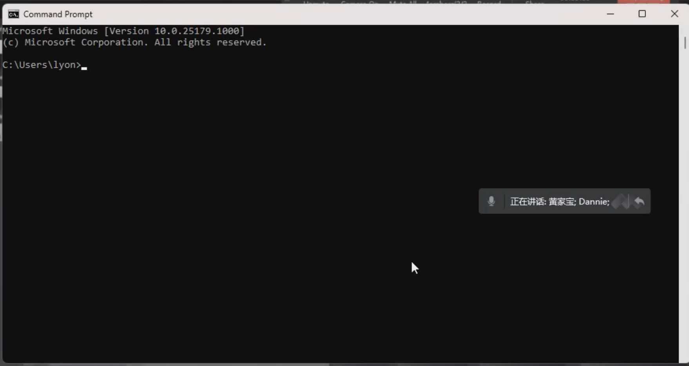
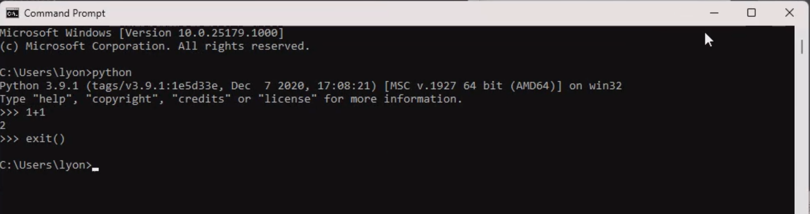

[[toc]]

## 02-Python 环境搭建「下」「Dannie」

## 1. 软件介绍

1. Pycharm：用来编写 Python 代码
2. 钉钉：用来你上课直播给 AI悦创「你在哪个屏幕编写代码，你就共享哪个屏幕」；
3. 腾讯会议：用来听我上课，看我屏幕。「一般来说放在另一屏幕来观看」
4. ConEmu：命令行，用来替代微软自带的 cmd，更好用、功能更强大。
    1. 微软图标 + R
    2. 输入：cmd

我们把它称为命令行：

可以输入：`python` try，输入：1 + 1，exit() 退出。

5. Snipaste：更强大的截图软件，退出 esc。Alt + 1：截图、`Alt + ·`：贴图。

