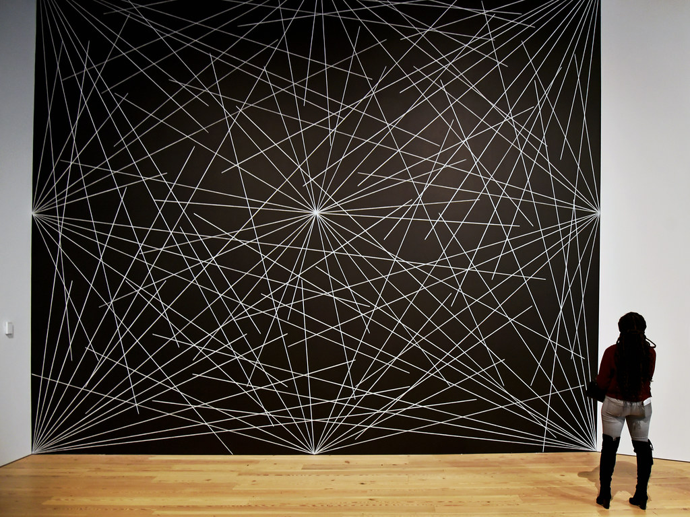

- [Project-4-Review-Exercises-Creative-Coding-Fall-2022-Section-E.pdf](/1v1/04-TommyTian/02-PROJECT-4-REVIEW-EXERCISES/Project-4-Review-Exercises-Creative-Coding-Fall-2022-Section-E.pdf)

## Brief: 

> 短暂的

From drawing primitives, variables, functions, conditionals, loops, arrays, classes, HTML/CSS/DOM, Data/API to Machine Learning, weʼve covered a lot in our class so far! 

> 从绘制原语，变量，函数，条件，循环，数组，类，HTML/CSS/DOM，数据/API到机器学习，到目前为止，我们已经在我们的课程中涵盖了很多!

For the next few weeks, you will be implementing a series of exercises to review these concepts in preparation for your final project of the semester! 

> 在接下来的几周里，你们将进行一系列的练习来复习这些概念，为本学期的期末项目做准备!

**(30%) Sol LeWitt Wall Drawing : Functions, Loops, Random – Recreate Sol LeWittʼs Wall Drawing 289. 24 lines from the center, 12 lines from the midpoint of each of the sides, and 12 lines from each corner.** 

> (30%) Sol LeWitt壁画:函数，循环，随机-重建Sol LeWitt的壁画289从中间起24行，每边的中点起12行，每角起12行。



- Create three functions, that uses the count parameter to draw random lines of that given count. (hint: Use loops and random() in these functions) 

> 创建三个函数，使用 count 参数绘制给定计数的随机行。(提示:在这些函数中使用循环和 `random()`)

1. drawCenterLines(count) 

> drawCenterLines(计数)

2. drawCornerLines(count) 

> drawCornerLines(计数)

3. drawSideLines(count ) 

> drawSideLines(计数)

- In your setup(), call these three functions, but set count to be 24 for the centerLines, and 12 for the cornerLines and sideLines.

> 在 setup() 中，调用这三个函数，但将 count 设置为中心线为24，边线和边线为12。

**(30%) 10 Second Timer : Variables, conditional, DOM** 

> (30%) 10秒定时器:变量，条件，DOM

- Use variables, round(), millis(), text() to display the remaining time in seconds rounded to two decimal points. 

> 使用变量round()、millis()、text()以秒为单位四舍五入到小数点两位显示剩余时间。

- Use an if statement to determine when the time is up, and display a different text (ex. “timeʼs up!”) 

> 使用if语句确定时间到的时间，并显示不同的文本(例如“time ' s up!”)

- Use a DOM button for resetting the timer 

> 使用DOM按钮重置计时器

**(40%) 100 Interactive Green Faces : Object Oriented Programming + Interactivity**

> (40%) 100个交互式绿色面:面向对象编程+互动性

For this exercise, we will add some interactivity to the grid of 100 green faces we made for the second quiz: https://openprocessing.org/sketch/1726521

> 对于这个练习，我们将为第二个测试(https://openprocessing.org/sketch/1726521)制作的100个绿色面孔网格添加一些交互性

1) Update the Face class so that when a mouse hovers over it, (hint: use dist() to find the distance between the mouse position and the face position) 

> 更新Face类，以便当鼠标悬停在它上面时(提示:使用dist()查找鼠标位置和脸位置之间的距离)

a) it wiggles / update the x and y value by some small random value between -1 and 1 

> A)它通过-1到1之间的一个小的随机值来摆动/更新x和y值

b) the face with the mouse over it changes its faceColor to yellow (when the mouse is not over the face, the face should return to its original color) 

> b)将鼠标放在上面的脸的faceColor变为黄色(当鼠标没有放在上面时，脸应该恢复到原来的颜色)

2) Update the mouseReleased function so that when a mouse clicks on it, 

> 2)更新mouserrelease函数，当鼠标点击它时，

a) it plays a sound 

> A)它播放一个声音

b) it is removed from the list of faces / should not be drawn anymore (hint: use splice()) 

> B)它从面列表中删除/不应该再被绘制(提示:使用splice())

**Due Date: Wednesday, November 23 (11:59pm)** 

>  截止日期:11月23日星期三(晚上11:59)

Submission Form: https://forms.gle/ro8jWXyUrbvhjC4c7 

> 投稿表格:https://forms.gle/ro8jWXyUrbvhjC4c7

```html
<!DOCTYPE html>
<html lang="en">
<head>
    <meta charset="UTF-8">
    <title>10 Second Timer</title>
    <style>
        #timer {
            display: block;
            position: relative;
            width: 200px;
            margin: 5% auto;
            padding: 5% auto;
            text-align: center;
        }

        button {
            display: block;
            width: 100px;
            height: 10%;
            margin: 5% auto;
            border: solid 3px black;
            background-color: white;
            font-size: 24px;
        }
    </style>
    <script src="https://cdnjs.cloudflare.com/ajax/libs/jquery/3.5.1/jquery.min.js"></script>
</head>
<body>
    <h1 id="timer">Time's Up!</h1>
    <button type="button" onclick="restart()">Restart</button>
    <script>
        let lefttime = 10;
        let clear;
        let start;
        // 该setTimeout()方法在几毫秒后调用一个函数。
        function restart() {
            start = setTimeout(countdown, 1000);
            if (lefttime <= 0) {
                lefttime = 10;
                start;
            } else {
                // lefttime--;
                lefttime = lefttime - 1;
                setTimeout(countdown, 1000)
            }
        }

        function countdown() {
            $("#timer").html(lefttime);
            if (lefttime <= 0) {
                $("#timer").html("Time's Up!");


            } else {
                lefttime = lefttime - 1;
                setTimeout(countdown, 1000)
            }
        }
    </script>
</body>
</html>
```

欢迎关注我公众号：AI悦创，有更多更好玩的等你发现！

::: details 公众号：AI悦创【二维码】


:::

::: info AI悦创·编程一对一

AI悦创·推出辅导班啦，包括「Python 语言辅导班、C++ 辅导班、java 辅导班、算法/数据结构辅导班、少儿编程、pygame 游戏开发」，全部都是一对一教学：一对一辅导 + 一对一答疑 + 布置作业 + 项目实践等。当然，还有线下线上摄影课程、Photoshop、Premiere 一对一教学、QQ、微信在线，随时响应！微信：Jiabcdefh

C++ 信息奥赛题解，长期更新！长期招收一对一中小学信息奥赛集训，莆田、厦门地区有机会线下上门，其他地区线上。微信：Jiabcdefh

方法一：[QQ](http://wpa.qq.com/msgrd?v=3&uin=1432803776&site=qq&menu=yes)

方法二：微信：Jiabcdefh

:::


