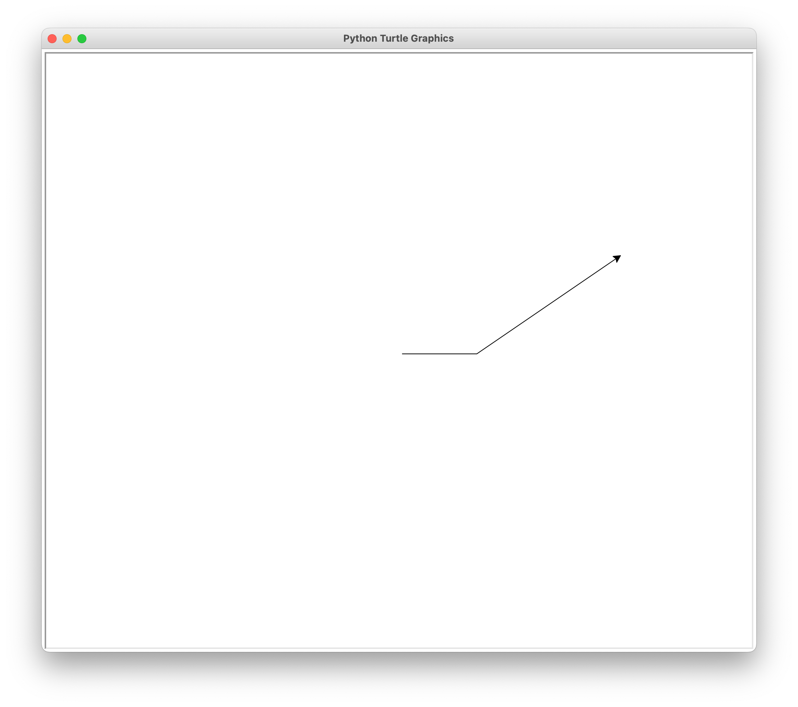
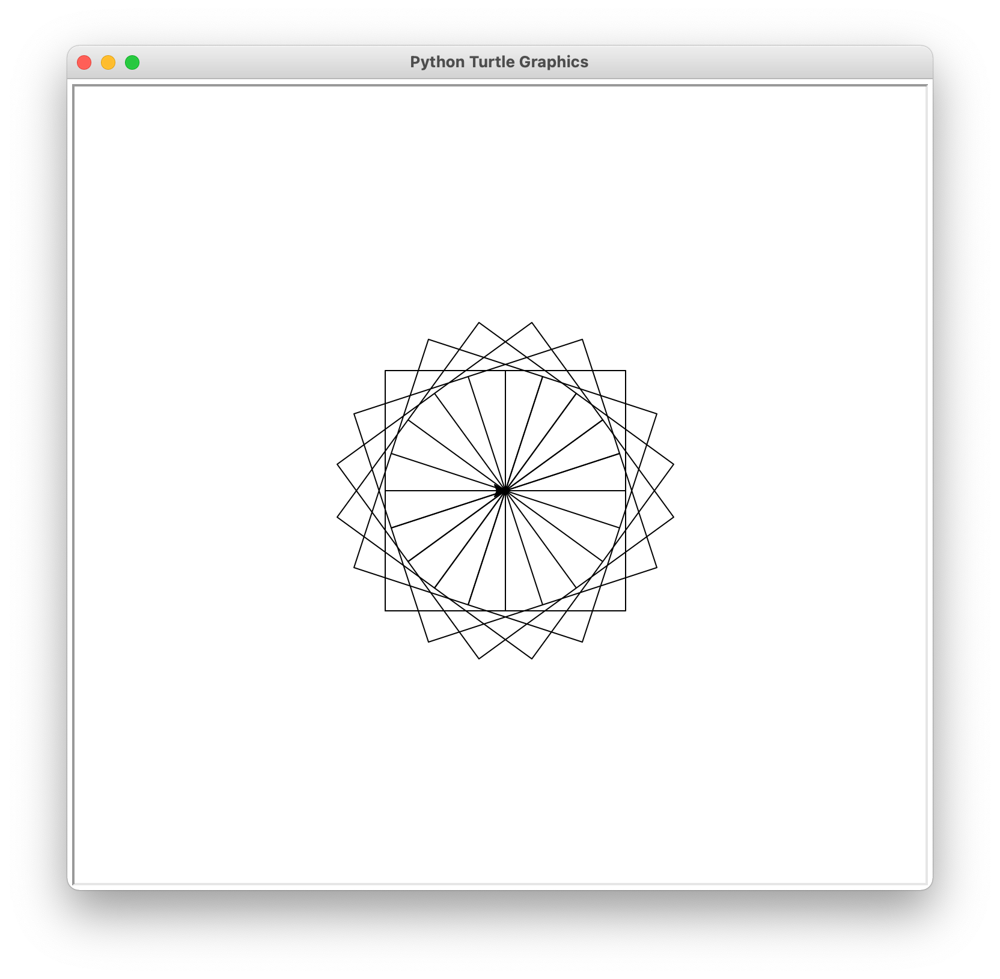
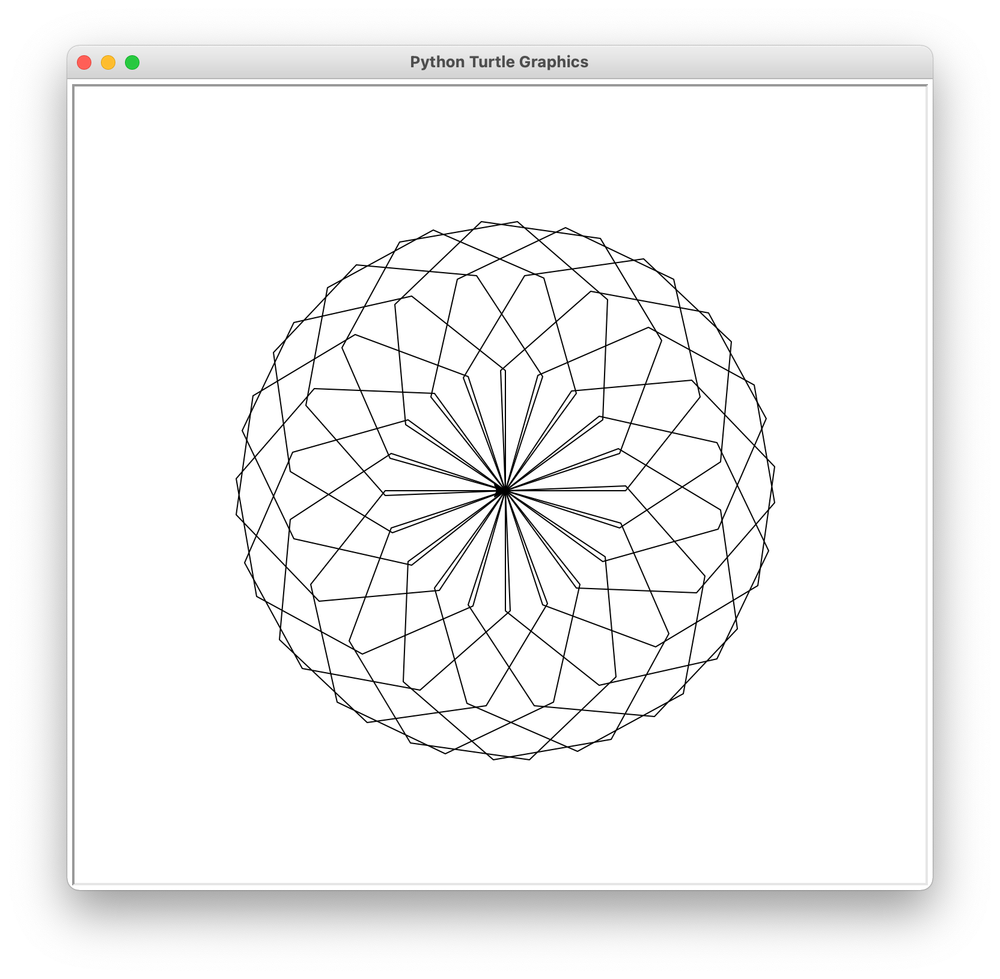

## NYU Tandon School of Engineering

> 纽约大学坦顿工程学院

Due: 1159pm, Thursday, March 3rd, 2023

> 截止时间:2023年3月3日星期四晚上11 ~ 59分

Submission instructions 

> 提交说明

1.  You should submit your homework on Gradescope. 

> 你应该在Gradescope上提交作业。

2.  For this assignment you should turn in 4 separate .py files named according to the following pattern:

    hw4_q1.py, hw4_q2.py, etc. 

> 对于这个任务，你应该提交4个独立的.py文件，按照以下模式命名:
> Hw4_q1.py, hw4_q2.py等。

3. Each Python file you submit should contain a header comment block as follows:

> 你提交的每个Python文件都应该包含一个头注释块，如下所示:

```python
"""
Author: [Your name here]
Assignment / Part: HW4 - Q1 (etc.)
Date due: 2023-03-02, 11:59pm
I pledge that I have completed this assignment without
collaborating with anyone else, in conformance with the
NYU School of Engineering Policies and Procedures on
Academic Misconduct.
"""
```

No late submissions will be accepted. 

> 逾期提交的资料恕不受理。

**REMINDER**: Do not use any Python structures that we have not learned in class. 

> 提醒:不要使用任何我们在课堂上没有学过的Python结构。

For this specific assignment, you may use everything we have learned up to, and including, variables, types, mathematical and boolean expressions, user IO (i.e. print() and input()), number systems, and the math /random modules, selection statements (i.e. if, elif, else), and for- and while-loops. Please reach out to us if you're at all unsure about any instruction or whether a Python structure is or is not allowed.

> 对于这个特定的赋值，你可以使用我们学到的所有东西，包括变量、类型、数学和布尔表达式、用户IO(即print()和input())、数字系统和数学/随机模块、选择语句(即if、elif、else)以及For -和while-循环。如果您不确定任何指令或Python结构是否被允许，请与我们联系。

Do not use, for example, user-defined functions (except for main() if your instructor has covered it during lecture), string methods, file i/o, exception handling, dictionaries, lists, tuples, and/or object-oriented programming. 

> 例如，不要使用用户定义的函数(main()除外，如果你的导师在课堂上讲过)、字符串方法、文件i/o、异常处理、字典、列表、元组和/或面向对象编程。

Failure to abide by any of these instructions will make your submission subject to point deductions. 

> 如不遵守上述任何一项规定，您的投稿将被扣分。

Problems 

1. (s)rewoP ehT toG ev'I (**hw4_q1.py**) 
2. Tamako Market (**hw4_q2.py**) 
3. Must be funny in the rich man's world (**hw4_q3.py**) 
4. A Little Imagination Goes A Long Way In Fez (**hw4_q4.py**) 

## Question 1: (s)rewoP ehT toG ev'I

> 皇后会随遇而安，不会有事的

The task is similar to last week's lab question, which was to print the powers of the a user-input number up until a certain limit (which the user will also determine). Write a problem that will do this, but will only print the **even** (i.e. 2, 4, 6, etc.) powers, and will do so **backwards**. 

> 该任务类似于上周的实验问题，即打印用户输入的数字的幂，直到某个限制(用户也将确定)。编写一个这样做的问题，但只打印**偶数**(即2、4、6等)幂，并将**向后**。

For example:

::: code-tabs#python

@tab en

```python
Please enter a positive integer to serve as the base: 7
Please enter a positive integer to serve as the highest power: 13
7 ^ 12 = 13841287201
7 ^ 10 = 282475249
7 ^ 8 = 5764801
7 ^ 6 = 117649
7 ^ 4 = 2401
7 ^ 2 = 49
7 ^ 0 = 1
```

@tab zh

```python
请输入一个正整数作为基数:7
请输入一个正整数作为最高幂:13
7 ^ 12 = 13841287201
7 ^ 10 = 282475249
7 ^ 8 = 5764801
7 ^ 6 = 117649
7 ^ 4 = 2401
7 ^ 2 = 49
7 ^ 0 = 1
```

:::

Here's the kick, though: you may not assume that the user will enter whole-number values; they can also enter floating-point values. Your program should keep asking the user to enter both of these values until they are **positive, non-zero, whole-number values**:

> 但问题在于:你不能假设用户会输入整数;他们也可以输入浮点值。你的程序应该一直要求用户输入这两个值，直到它们是正的、非零的、整数的值。

::: code-tabs#python

@tab en

```python
Please enter a positive integer to serve as the base: 4.5
Invalid value for the base (4.5). Please enter a positive integer to serve as
the base: -5
Invalid value for the base (-5.0). Please enter a positive integer to serve as
the base: 4
Please enter a positive integer to serve as the highest power: -4
Invalid value for the base (-4.0). Please enter a positive integer to serve as
the base: 4.0
4 ^ 4 = 256
4 ^ 2 = 16
4 ^ 0 = 1
```

@tab zh

```python
请输入一个正整数作为基数:4.5
底为无效值(4.5)。请输入一个正整数作为
底数:-5
底值无效(-5.0)。请输入一个正整数作为
底数:4
请输入一个正整数作为最高幂:-4
底值无效(-4.0)。请输入一个正整数作为
基础:4.0
4 ^ 4 = 256
4 ^ 2 = 16
4 ^ 0 = 1
```

:::

The format of your user input prompts and warning messages does not need to look the same as ours, but when you print out the powers, it must be in a `base ^ power = answer` format. 

> 您的用户输入提示和警告消息的格式不需要与我们的格式相同，但当您打印出幂时，它必须是 `base ^ power = answer` 格式。

```python
while True:
    base = input("Please enter a positive integer to serve as the base:")
    if not base.isdigit() and base.count(".") == 1:
        print("Invalid value for the base (" + str(base) + ").", end="")
        continue

    if not int(base) > 0:  # 要不要 >=  ?
        continue
    else:
        base = int(base)
        break

while True:
    power = input("Please enter a positive integer to serve as the highest power:")
    if not power.isdigit() and power.count(".") == 1:
        print("Invalid value for the power (" + str(power) + ").", end="")
        continue
    if not int(power) > 0:  # 要不要 >=  ?
        continue
    else:
        power = int(power)
        break

if power % 2 == 1:
    power -= 1
for p in range(power, -1, -2):
    print(str(base) + "^" + str(p) + "=" + str(base + p))
```

> 还需要优化，输入 -1 这种数字的情况。
>
> 不能使用 continue，break

## Question 2: Tamako Market 

> 问题2:Tamako市场

In this program, we're going to use Python to calculate how many mochi we can make using a certain amount of ingredients. A basic recipe for a batch of 24 pieces of daifuku mochi calls for: 

> 在这个程序中，我们将使用Python来计算使用一定数量的配料可以做多少麻糬。24块大福麻糬的基本食谱包括:

- 3 cups of sweet rice flour (mochiko) 

> 3杯甜米粉(mochiko)

- 1.5 cups of sugar

> 1.5杯糖

- 2 cups of cornstarch 

> 2杯玉米淀粉

- 1 cup of red bean paste (anko) 

> 一杯红豆沙(anko)

Your program will work is as follows:

> 您的程序将工作如下:

1. The user will enter a certain amount of mochiko, sugar, cornstarch, and anko in grams. 

> 用户将输入一定数量的麻糬、糖、玉米淀粉和安可，单位为克。

2. The program will then convert those gram amounts to cups (1 cup = 220g). 

> 然后程序将这些克数转换为杯子(1杯= 220克)。

3. The program will then calculate how many batches of daifuku mochi can be made with this quantity of ingredients. 

> 然后程序将计算出用这些原料可以制作多少批次的大福麻糬。

A sample program execution could look like this:

> 示例程序执行如下所示:

::: code-tabs#python

@tab en

```python
Enter an amount (g) of mochiko: 2500
Enter an amount (g) of sugar: 3400
Enter an amount (g) of cornstarch: 5000
Enter an amount (g) of anko: 3200
With this amount of ingredients, you can make 3 batch(es) of 24 mochi.
```

@tab zh

```python
输入mochiko的数量(g): 2500
输入糖的量(g): 3400
输入玉米淀粉的量(g): 5000
输入anko: 3200的数量(g)
用这些原料，你可以做3批24个麻糬。
```

:::

For this problem, you can assume that the user will always enter positive numerical values. 

> 对于这个问题，您可以假设用户总是输入正数值。

```python
# -*- coding: utf-8 -*-
# @Time    : 2023/3/2 11:35
# @Author  : AI悦创
# @FileName: q2.py
# @Software: PyCharm
# @Blog    ：https://bornforthis.cn/
Mochiko_per_cup = 220.0
Sugar_per_cup = 220.0
Cornstarch_per_cup = 220.0
Anko_per_cup = 220.0

Mochiko_per_batch = 3.0
Sugar_per_batch = 1.5
Cornstarch_per_batch = 2.0
Anko_per_batch = 1.0

grams_mochiko = float(input("Enter an amount (g) of mochiko: "))
grams_sugar = float(input("Enter an amount (g) of sugar: "))
grams_cornstarch = float(input("Enter an amount (g) of cornstarch: "))
grams_anko = float(input("Enter an amount (g) of anko: "))

cups_mochiko = grams_mochiko / Mochiko_per_cup
cups_sugar = grams_sugar / Sugar_per_cup
cups_cornstarch = grams_cornstarch / Cornstarch_per_cup
cups_anko = grams_anko / Anko_per_cup

batches = min(cups_mochiko / Mochiko_per_batch, cups_sugar / Sugar_per_batch, cups_cornstarch / Cornstarch_per_batch,
              cups_anko / Anko_per_batch)

print(f"With this amount of ingredients, you can make {int(batches)} batch(es) of 24 mochi.")
```

Here's how the program works:

- First, we define some conversion factors for the various ingredients. We assume that 1 cup of each ingredient weighs 220 grams.
- Next, we define how much of each ingredient is needed for one batch of 24 mochi.
- The program then asks the user to enter the amount of each ingredient in grams.
- The program converts those gram amounts to cups by dividing by the appropriate conversion factor.
- Finally, the program calculates how many batches can be made with the given amount of ingredients, by dividing the amount of each ingredient by the amount needed for one batch, and taking the minimum of those values. We use the `min` function to account for the fact that we can only make as many batches as we have enough of the scarcest ingredient.
- The program then prints out the result in the requested format, using an f-string to insert the number of batches.

**必须大于等于基本的一个数据！**

```python
MOCHIKO_PER_CUP = 220
SUGAR_PER_CUP = 220
CORNSTARCH_PER_CUP = 220
ANKO_PER_CUP = 220
BATCH_SIZE = 24

# Get input from user
while True:
    try:
        mochiko_grams = float(input("Enter an amount (g) of mochiko: "))
        sugar_grams = float(input("Enter an amount (g) of sugar: "))
        cornstarch_grams = float(input("Enter an amount (g) of cornstarch: "))
        anko_grams = float(input("Enter an amount (g) of anko: "))
        if mochiko_grams >= MOCHIKO_PER_CUP and sugar_grams >= SUGAR_PER_CUP and cornstarch_grams >= CORNSTARCH_PER_CUP and anko_grams >= ANKO_PER_CUP:
            break
        else:
            print("Error: not enough ingredients to make at least one batch of mochi.")
    except ValueError:
        print("Error: invalid input. Please enter a positive numerical value.")

# Convert grams to cups
mochiko_cups = mochiko_grams / MOCHIKO_PER_CUP
sugar_cups = sugar_grams / SUGAR_PER_CUP
cornstarch_cups = cornstarch_grams / CORNSTARCH_PER_CUP
anko_cups = anko_grams / ANKO_PER_CUP

# Calculate number of batches
batches = min(mochiko_cups // 3, sugar_cups // 1.5, cornstarch_cups // 2, anko_cups // 1)
print(f"With this amount of ingredients, you can make {batches} batch(es) of {BATCH_SIZE} mochi.")
```

## Question 3: Must be funny in the rich man's world 

> 问题3:在富人的世界里一定很有趣

Let's say that you are tasked with writing the final money counter program for a Monopoly-like video game. If you don't know what Monopoly is, don't worry; all you need to know is that at the end of each game of Monopoly game, all of the players will have a certain amount of money, and the person with the most amount of money wins (kind of a terrible concept)

> 假设你的任务是为一款类似《大富翁》的电子游戏编写最后的货币计数器程序。如果你不知道什么是大富翁，别担心;你所需要知道的是，在大富翁游戏的每一局结束时，所有的玩家都有一定数量的钱，钱最多的人赢(有点可怕的概念)

So, your task is to write a program that 

> 你的任务是写一个程序

1. Asks the user how many players will be playing in this round of Monopoly. This value must be a positive, non-zero integer, but you can assume that the user will never enter a float value.

> 询问用户有多少玩家会参加这一轮的大富翁游戏。这个值必须是一个正的、非零的整数，但是可以假设用户永远不会输入浮点值

2. Once they do so, each player will enter the values of each of their properties/assets. You can assume that these will always be positive numerical values or the characters "DONE" when they are finished. 

> 一旦他们这样做了，每个玩家将输入他们每个属性/资产的价值。您可以假设当它们完成时，这些将始终是正数值或字符“DONE”。

3. Once a player enters all the values, the game will print out the sum of the assets' values. 

> 一旦玩家输入了所有的值，游戏就会打印出资产价值的总和。

4. The program repeats steps 2 and 3 until all players have been accounted for.

> 程序重复第2步和第3步，直到所有玩家都被计算在内。

5. At the very end, the program will print a congratulatory message to the winner. You don't have to worry about two players getting the same score

> 在最后，程序将打印祝贺获胜者的信息。你不必担心两个玩家得到相同的分数

Here's a sample execution. Yours doesn't need to look exactly like hours, but it must interact with, and show the same information to, the users:

> 下面是一个示例执行。你的时间不需要看起来完全一样，但它必须与用户交互，并向用户显示相同的信息:

::: code-tabs#python

@tab en

```python
How many players played this round? -5
Invalid input. How many players played this round? 3
Enter the value of a property/asset, or DONE to finish: 0.45
Enter the value of a property/asset, or DONE to finish: 23.56
Enter the value of a property/asset, or DONE to finish: DONE 
Player 1 has 24.01 dollars.
Enter the value of a property/asset, or DONE to finish: 3.78
Enter the value of a property/asset, or DONE to finish: 3000 
Enter the value of a property/asset, or DONE to finish: 34.87
Enter the value of a property/asset, or DONE to finish: 3
Enter the value of a property/asset, or DONE to finish: DONE
Player 2 has 3041.65 dollars.
Enter the value of a property/asset, or DONE to finish: 40
Enter the value of a property/asset, or DONE to finish: DONE
Player 3 has 40.0 dollars.
Congratulations, player 2! You won with $3041.65!
```

@tab zh

```python
这一轮有多少人参加?5
无效的输入。这一轮有多少人参加?3.
输入属性/资产的值，或者DONE来完成:0.45
输入属性/资产的值，或者DONE来完成:23.56
输入属性/资产的值，或DONE以完成:DONE
参与人1有24.01元。
输入属性/资产的值，或者DONE来完成:3.78
输入属性/资产的值，或DONE以完成:3000
输入属性/资产的值，或者DONE来完成:34.87
输入属性/资产的值，或者DONE来完成:3
输入属性/资产的值，或DONE以完成:DONE
参与人2有3041.65元。
输入属性/资产的值，或DONE以完成:40
输入属性/资产的值，或DONE以完成:DONE
参与人3有40元。
恭喜你，玩家2!你以3041.65美元获胜!
```

:::

## Problem 4: A Little Imagination Goes A Long Way In Fez

Note: This program will make use a module we don't officially cover in class called Turtle Graphics, or **turtle**. In some IDEs, such as PyCharm and VS Code, turtle sometimes doesn't work quite as it should (if at all). If this happens to you, feel free to use IDLE for this problem, or this website. If you do use the site, though, make sure to erase the starter code they provide and to save often to avoid potentially losing your work. All screenshots of sample behaviour below were taken using IDLE

> 注意:这个程序将使用一个我们在课堂上没有正式介绍的模块，称为Turtle Graphics，或 **Turtle **。在一些ide中，如PyCharm和VS Code, turtle有时不能像它应该的那样工作(如果有的话)。如果这种情况发生在您身上，请随意使用IDLE来解决这个问题，或者使用这个网站。但是，如果您确实使用该网站，请确保删除他们提供的初始代码并经常保存，以避免可能丢失您的工作。下面示例行为的所有截图都是使用IDLE拍摄的

Turtle graphics is, basically, easy to use. The only two functions you need from it are `forward(distance)` and `left(angle)` which, as you can imagine, make turtle go forward by a certain distance and turn left by a certain angle. The following code, for example:

> 基本上，Turtle图形很容易使用。你所需要的唯一两个函数是forward(距离)和left(角度)，正如你所想象的，它们使turtle向前移动一定距离，向左旋转一定角度。下面的代码，例如:

```python
import turtle
turtle.forward(100)
turtle.left(34.4)
turtle.forward(234)
```

Results in the following turtle window:

> 结果如下龟窗口:



### Figure 1

Figure 1: turtle moving 100 pixels in its starting orientation ("east"), turning 34.4 degrees counter-clockwise, and then moving 234 pixels forward. 

> 图1:海龟在起始方向(“东”)移动100像素，逆时针旋转34.4度，然后向前移动234像素。

That's all you need to know. Now, for the problem. 

> 这就是你需要知道的。现在来看问题。

---

Moroccan mosaic, a.k.a. Zellij (**الزلیج**), is a form of Islamic art and one of the main characteristics of Moroccan architecture. It consists of geometrically patterned mosaics, used to ornament walls, ceilings, fountains, floors, pools and tables. Each mosaic is a tile-work made from individually chiseled geometric tiles set into a plaster base. 

> 摩洛哥马赛克，又名Zellij (**الزلیج**)，是伊斯兰艺术的一种形式，也是摩洛哥建筑的主要特色之一。它由几何图案的马赛克组成，用于装饰墙壁、天花板、喷泉、地板、游泳池和桌子。每幅马赛克作品都是由单独雕刻的几何瓷砖镶嵌在石膏底座上制成的。

We can draw simple ones using turtle:

> 我们可以使用turtle绘制简单的图形:



### Figure 2

Figure 2: An example of drawing a mosaic using 20 squares. 

> 图2:一个用20个正方形绘制马赛克的例子。

We achieve this effect by telling turtle to draw a regular polygon (e.g. pentagon, hexagon, etc.) and repeat and rotate this shape several times to create a circular pattern/mosaic. 

> 我们通过告诉turtle绘制一个正多边形(例如，五边形，六边形等)并重复和旋转该形状几次来创建圆形图案/马赛克来实现此效果。

Write a program that will ask the user for an integer representing the shape of the polygon you would like to use for your pattern. 

> 编写一个程序，要求用户输入一个整数，表示您想用于图案的多边形的形状。

Here's an example using 7 as input:

> 下面是一个使用7作为输入的例子:



### Figure 3

Figure 3: An example of drawing a mosaic using 20 heptagons. 

> 图3:一个使用20个七边形绘制马赛克的例子。

A couple of things to help you here: 

> 这里有几件事可以帮助你:

- You may assume that the final number of polygons needed to draw a Zellij is set to 20. 

> 您可以假设绘制Zellij所需的最终多边形数量设置为20。

- The inner angle of an n-polygon is equal to 360 / n. 

> n多边形的内角等于360 / n。

- The angle between two polygons is equal to 360 divided by the final number of polygons.

> 两个多边形之间的夹角等于360除以最终的多边形数。

```python
import turtle
sides = int(input(":>>>"))
for j in range(1, 21):
    for i in range(1, sides + 1):
        turtle.forward(100)
        turtle.left(360 / sides)
    turtle.left(360 / 20)
turtle.done()
```


::: details 公众号：AI悦创【二维码】


:::

::: info AI悦创·编程一对一

AI悦创·推出辅导班啦，包括「Python 语言辅导班、C++ 辅导班、java 辅导班、算法/数据结构辅导班、少儿编程、pygame 游戏开发、Web、Linux」，全部都是一对一教学：一对一辅导 + 一对一答疑 + 布置作业 + 项目实践等。当然，还有线下线上摄影课程、Photoshop、Premiere 一对一教学、QQ、微信在线，随时响应！微信：Jiabcdefh

C++ 信息奥赛题解，长期更新！长期招收一对一中小学信息奥赛集训，莆田、厦门地区有机会线下上门，其他地区线上。微信：Jiabcdefh

方法一：[QQ](http://wpa.qq.com/msgrd?v=3&uin=1432803776&site=qq&menu=yes)

方法二：微信：Jiabcdefh

:::


