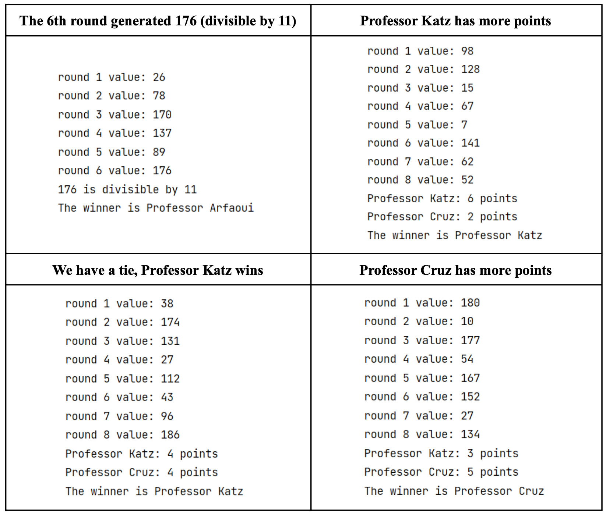
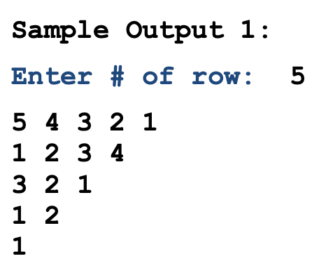
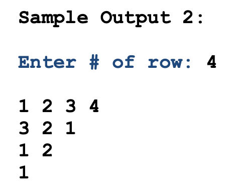

## 6) Programming: Game Night.

> 6)编程:Game Night

**Professor Katz, Professor Cruz, and Professor Arfaoui are playing a game. The game has 8 rounds, and in each round, a random integer between 1 (inclusive) and 200 (exclusive) is generated.**

> Katz教授，Cruz教授和Arfaoui教授在玩一个游戏。游戏共8轮，每轮生成1(含)到200(不含)之间的随机整数

- **If this integer is divisible by 11, the game ends immediately and Professor Arfaoui wins.**

> 如果这个整数能被11整除，游戏立即结束，Arfaoui教授获胜

- **Otherwise:**

> 否则:

- If this integer is between1(inclusive) and 100 (exclusive), Professor Katzgets a point.

> 如果这个整数介于1(包含)和100(不包含)之间，卡茨教授就得一分。

- **If this integer is between 100 (inclusive) and 200 (exclusive),Professor Cruzgets a point. Whoever has the most points at the end of the game wins; ties will go to Professor Katz.**

> 如果这个整数在100(含)和200(不含)之间，cruz教授得一分。在比赛结束时，得分最多的人获胜;卡茨教授将获得桂冠

**Your task is to write a program that will simulate the game. The program should also print the generated values, the scoreboard and the name of the winner.**

> 你的任务是编写一个模拟游戏的程序。程序还应该打印生成的值、记分牌和获胜者的名字。

**Below are a few sample runs of our program:**



### 答案

```python
import random

# 初始化分数
scoreboard = {
    'Professor Katz': 0,
    'Professor Cruz': 0,
    'Professor Arfaoui': 0
}

# 模拟 8 轮游戏
for round in range(1, 9):
    # 生成随机数
    number = random.randint(1, 199)

    # 判断是否能被 11 整除
    if number % 11 == 0:
        scoreboard['Professor Arfaoui'] += 1
        print(f"Round {round}: {number}, Professor Arfaoui wins!")
        break

    # 判断是哪个教授得分
    if number < 100:
        scoreboard['Professor Katz'] += 1
    else:
        scoreboard['Professor Cruz'] += 1

    # 打印当前分数和生成的随机数
    print(f"Round {round}: {number}, {scoreboard}")

# 判断哪个教授获胜
winner = max(scoreboard, key=scoreboard.get)
print(f"The winner is {winner} with {scoreboard[winner]} points!")
```

这是一个典型的模拟程序，它通过循环生成随机数并更新分数，直到游戏结束。在每个回合结束时，程序打印当前回合的随机数和分数，并判断游戏是否结束。最后，程序打印获胜者和他们的得分。

```python
import random
katz = 0
cruz = 0
condition = True
times = 0
while times < 8 and condition:
    value = random.randint(1, 199)
    times += 1
    print("round", times, "value:", value)
    if value % 11 == 0:
        print(value, "is divisible by 11")
        print("The winner is Professor Arfaoui")
        condition = False
    elif value % 11 != 0:
        if 1 <= value < 100:
            katz += 1
        elif 100 <= value < 200:
            cruz += 1
print("Professor Katz:", katz, "points")
print("Professor Cruz:", cruz, "points")
if katz > cruz:
    print("The winner is Professor Katz")
elif cruz > katz:
    print("The winner is Professor Cruz")
```

```python
import random
katz = 0
cruz = 0
condition = True
times = 0
while times < 8 and condition:
    value = random.randint(1, 199)
    times += 1
    print("round", times, "value:", value)
    if value % 11 == 0:
        print(value, "is divisible by 11")
        print("The winner is Professor Arfaoui")
        condition = False
    elif value % 11 != 0:
        if 1 <= value < 100:
            katz += 1
        elif 100 <= value < 200:
            cruz += 1
if condition == True:
    print("Professor Katz:", katz, "points")
    print("Professor Cruz:", cruz, "points")
    if katz > cruz:
        print("The winner is Professor Katz")
    elif cruz > katz:
        print("The winner is Professor Cruz")
```


## Question 6

Write a program that prompts a row number and print out the pattern in a zig-zag way. If the leading number of the row is odd, the row displays numbers in a decreasing sequence, starting from the leading number to 1. If the leading number of the row is even, the row displays numbers in an increasing sequence, starting from 1 to the leading number. Assume the input is always a valid positive integer.

> 编写一个程序，提示行号，并以之字形打印出模式。如果该行的前导为奇数，该行将按照从前导到1的递减顺序显示数字。如果该行的前导为偶数，则该行按照从1到前导的递增顺序显示数字。假设输入总是一个有效的正整数。





> 在这里，“前导”指的是一个数字的最高位。例如，数字 123 的前导是 1，数字 456789 的前导是 4。在题目中，需要判断输入的行数的前导数字是奇数还是偶数，以确定打印数字的方式。

```python
row = int(input("Enter # of row: "))
for r in range(row, 0, -1):
    if r % 2 == 0:
        line = ""
        for j in range(1, r + 1):
            line += str(j) + " "
        print(line, end="")
    else:
        line = ""
        for j in range(r, 0, -1):
            line += str(j) + " "
        print(line, end="")
    print()
```


::: details 公众号：AI悦创【二维码】


:::

::: info AI悦创·编程一对一

AI悦创·推出辅导班啦，包括「Python 语言辅导班、C++ 辅导班、java 辅导班、算法/数据结构辅导班、少儿编程、pygame 游戏开发、Web、Linux」，全部都是一对一教学：一对一辅导 + 一对一答疑 + 布置作业 + 项目实践等。当然，还有线下线上摄影课程、Photoshop、Premiere 一对一教学、QQ、微信在线，随时响应！微信：Jiabcdefh

C++ 信息奥赛题解，长期更新！长期招收一对一中小学信息奥赛集训，莆田、厦门地区有机会线下上门，其他地区线上。微信：Jiabcdefh

方法一：[QQ](http://wpa.qq.com/msgrd?v=3&uin=1432803776&site=qq&menu=yes)

方法二：微信：Jiabcdefh

:::


