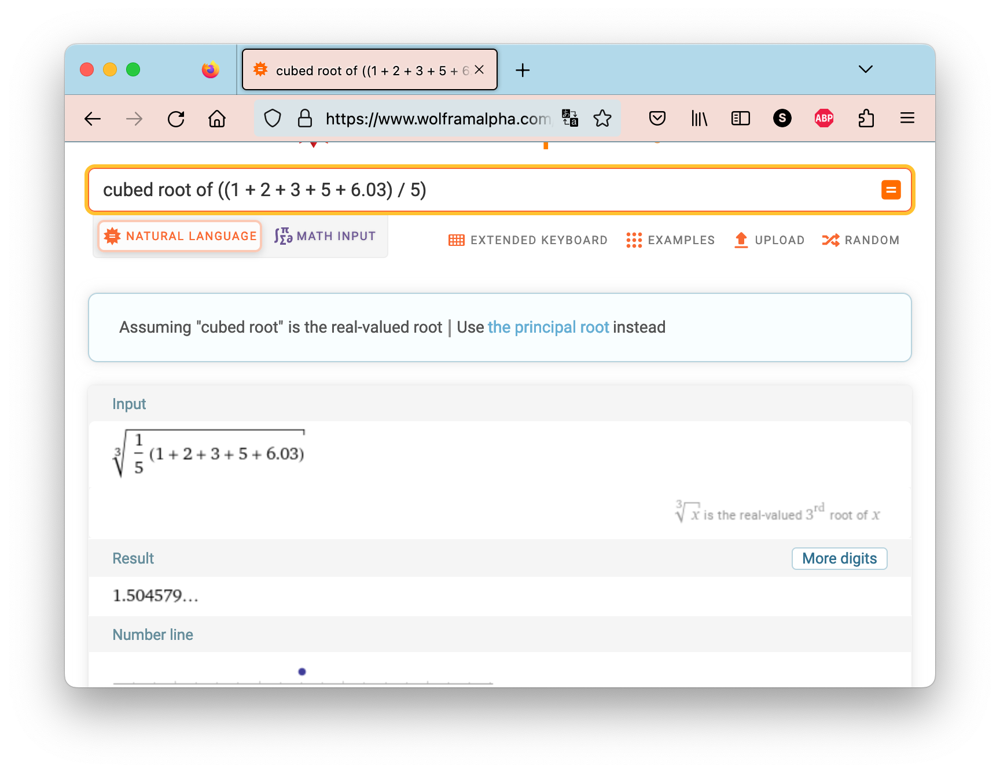

::: warning 

代码中有可能忘记 file close 记得 close

:::

NYU Tandon School of Engineering 

CS-UY 1114 Spring 2023 

Due: 1159pm, April 6th, 2023 

Submission instructions 

1. You should submit your homework on Gradescope. 
2. For this assignment you should turn in 3 separate `.py` files named according to the following pattern:`hw7_q1.py`, `hw7_q2.py`, etc. 
3. Each Python file you submit should contain a header comment block as follows:

```python
"""
Author: [Your name here]
Assignment / Part: HW7 - Q1 (etc.)
Date due: 2023-04-06, 11:59pm
I pledge that I have completed this assignment without
collaborating with anyone else, in conformance with the
NYU School of Engineering Policies and Procedures on
Academic Misconduct.
"""
```

**No late submissions will be accepted.** 

> 不接受迟交的作业。

REMINDER: Do not use any Python structures that we have not learned in class. 

> 提醒：不要使用我们在课堂上没有学过的任何 Python 结构。

For this specific assignment, you may use everything we have learned up to, **and including**, variables, types, mathematical and boolean expressions, user IO (i.e. `print()` and `input()`), number systems, and the `math` / `random` modules, selection statements (i.e. `if`, `elif`, `else`), and `for`- and `while-loops`. Please reach out to us if you're at all unsure about any instruction or whether a Python structure is or is not allowed. 

> 对于这个特定的作业，你可以使用我们学过的所有内容，包括变量、类型、数学和布尔表达式、用户输入输出（即print()和input()）、数字系统、数学/随机模块、选择语句（如if，elif，else）以及for循环和while循环。如果你对任何指令或Python结构是否允许使用有任何疑虑，请随时联系我们。

Do **not** use, for example, dictionaries, lists, tuples, and/or object-oriented programming.

> 例如，不要使用字典、列表、元组和/或面向对象编程。

Failure to abide by any of these instructions will make your submission subject to point deductions. 

> 翻译：如果不遵守这些指示中的任何一条，您的作业可能会被扣分。

## Problems 

1. Read Between The Words (**hw7_q1.py**) 
2. The Root Of This Problem Is That It's Average (**hw7_q2.py**) 
3. Damage Report (**hw7_q3.py**) 

## Problem 1: Read Between The Words 

>  问题1：阅读文字之间

Write a function `get_word_count()` that will accept the address of a `txt` file (a string) and will returns the number of words contained in this file. Any one of these files may look like the following (let's call it `voltaire.txt`):

> 编写一个名为 `get_word_count()` 的函数，该函数接受一个 txt 文件地址（一个字符串），并返回该文件中包含的单词数量。这些文件中的任何一个可能如下所示（我们称之为 voltaire.txt）：

```
Italy had a Renaissance, and Germany had a Reformation, but France had
Voltaire; he was for his country both Renaissance and Reformation, and half the
Revolution. 
He was first and best in his time in his conception and writing of history, in
the grace of his poetry, in the charm and wit of his prose, in the range of his
thought and his influence.
His spirit moved like a flame over the continent and the century, and stirs a
million souls in every generation.
```

The following code:

```python
def main():
    count = get_word_count("voltaire.txt") # assumes txt file is in same directory
    print(f"This file has {count} word(s).")
main()
```

Would thus print out:

```python
This file has 84 word(s).
```

Here are some things to keep in mind:

> 以下是一些需要注意的事项：

1. You may not assume that this file exists. If it doesn't, your program should print a warning message to the user of your choice and then return 0. 「你不能假设这个文件一定存在。如果不存在，你的程序应该向用户打印一个你选择的警告信息，然后返回 0。」
2.  You can ignore punctuation here. That is, `"Hello, World!"` contains 2 words. 「在这里你可以忽略标点符号。也就是说，`"Hello, World!"`包含2个单词。」
3. You may not use the `split()` method in this problem, as it results in the creation of a `list` object, which we have not covered yet. 「在这个问题中，你不能使用`split()`方法，因为它会创建一个`list`对象，而我们还没有学习这个知识点。」
4. You may assume that the last character of every line in the file will either be a non-whitespace character or a newline character `'/n'`. 「您可以假设文件中每一行的最后一个字符要么是非空白字符，要么是换行符`'/n'`。」

**Hint: The title of this problem.** 

> 提示：本问题的标题。

### Answer

::: tabs

@tab 1

```python
def get_word_count(file_path):
    try:
        with open(file_path, "r") as file:
            word_count = 0
            in_word = False

            for line in file:
                for char in line:
                    if char.isspace() or char == '\n':
                        if in_word:
                            word_count += 1
                            in_word = False
                    else:
                        in_word = True

            if in_word:
                word_count += 1

            return word_count
    except FileNotFoundError:
        print(f"Warning: The file '{file_path}' does not exist.")
        return 0

def main():
    count = get_word_count("voltaire.txt")
    print(f"This file has {count} word(s).")

if __name__ == "__main__":
    main()
```

@tab 2

```python
def get_word_count(filename: str) -> int:
    try:
        with open(filename, "r") as voltaire:
            word_count = 0
            for line in voltaire:
                word = ""
                for char in line:
                    if char.isspace() or char == "\n":
                        if word:  # Check if word is not empty
                            word_count += 1
                            word = ""
                    else:
                        word += char
                
                if word:  # Check if there is a word at the end of the line
                    word_count += 1

        return word_count
    except FileNotFoundError as err:
        print(f"Error: {err}")
        return 0


def main():
    count = get_word_count("voltaire.txt")  # assumes txt file is in same directory
    print(f"This file has {count} word(s).")

main()
```

@tab 3

```python
def get_word_count(filename: str):
    try:
        voltaire = open(filename, "r")
        line = voltaire.readline()
        word_count = 0
        while line:
            line = line.strip()
            line = line.replace(",", " ")
            line = line.replace(".", " ")
            line = line.replace(";", " ")
            line = line.replace("!", " ")
            word = ""
            for char in line:
                if char.isspace() or char == "\n":
                    if word:
                        word_count += 1
                    # print(word)
                    word = ""
                else:
                    word += char
            if word:
                word_count += 1

            line = voltaire.readline()
        print(word_count)
    except FileNotFoundError as err:
        return err


def main():
    count = get_word_count("voltaire.txt")  # assumes txt file is in same directory
    # print(f"This file has {count} word(s).")
    print(count)


main()
```

@tab 4

```python
def get_word_count(filename: str) -> int:
    try:
        with open(filename, "r") as voltaire:
            word_count = 0
            for line in voltaire:
                line = line.strip()
                line = line.replace(",", " ")
                line = line.replace(".", " ")
                line = line.replace(";", " ")
                line = line.replace("!", " ")

                word = ""
                for char in line:
                    if char.isspace() or char == "\n":
                        if word:  # Check if word is not empty
                            word_count += 1
                            word = ""
                    else:
                        word += char

                if word:  # Check if there is a word at the end of the line
                    word_count += 1

        return word_count
    except FileNotFoundError as err:
        print(f"警告：{err}")
        return 0

def main():
    count = get_word_count("voltaire.txt")  # assumes txt file is in same directory
    print(f"This file has {count} word(s).")

main()
```

在每一行的末尾添加 `if word:` 检查的目的是确保正确地处理行尾的单词。

在循环中，当遇到空格或换行符时，程序会将当前`word`变量的内容计入 `word_count`。但是，当循环到达行末尾时，可能仍然有一个不完整的单词（即最后一个单词）存储在 `word` 变量中，此时循环已经结束，因此不会再遇到空格或换行符。此时，如果不进行额外的检查，程序会遗漏该行的最后一个单词。

通过在循环结束后添加 `if word:` 检查，我们可以确保在处理完一行后，`word` 变量中的任何剩余单词都被正确地计入 `word_count`。如果在行末尾有一个单词，`word`变量将包含该单词的字符。在这种情况下，`if word:` 条件为真，我们将最后一个单词计入`word_count`。如果 `word` 为空（没有剩余的单词），则 `if word:` 条件为假，不会增加 `word_count`。

这个检查可以确保所有的单词，包括每行的最后一个单词，都被正确地计算。

让我们以一个简单的例子来说明为什么需要`if word:`检查。

假设我们有一个名为 `example.txt` 的文件，其中包含以下内容：

```python
Hello, World!
This is an example.
```

当我们的程序处理这个文件时，它会按行读取。在处理第一行（`Hello, World!`）时，循环将遇到以下字符：

```
Hello, World!
```

在处理这一行时，我们会遇到逗号和感叹号，将它们替换为空格。所以现在我们有：

```
Hello  World 
This is an example 
```

循环将逐个字符地检查这些字符。

在第一行遇到空格时，`word` 变量将包含"Hello"，所以我们将单词计数加1。但是，在循环结束时，我们会剩下一个单词"World"，它没有后面的空格或换行符，因此在循环内部不会将其计入 `word_count`。

这就是为什么我们需要在循环结束后添加 `if word:` 检查。在这个例子中，当循环结束时，`word` 变量将包含"World"。由于 `word` 非空，`if word:` 条件为真，所以我们将最后一个单词计入 `word_count`。这样，我们就不会遗漏这一行的最后一个单词。

同样的逻辑适用于处理第二行（`This is an example.`）时。在循环结束时，`word`变量将包含"example"，我们需要通过`if word:`检查将其计入`word_count`。

:::


## Problem 2: The Root Of This Problem Is That It's Average

> 问题2：这个问题的根源在于它的平均性

Write a function `get_root_of_average()` that will accept a string parameter representing a `txt` file containing a series of numbers, such as the following (let's call this file `numbers.txt`):

> 编写一个`get_root_of_average()`函数，它将接受一个表示包含一系列数字的`txt`文件的字符串参数，如下所示（我们称这个文件为`numbers.txt`）：

```python
1 2 3 NULL 5 6.03
```

Your function will also accept an integer parameter, `root`. What it will then do is calculate and return the `root`- root of the average of all the numbers in the file.

> 您的函数还将接受一个整数参数`root`。接下来它将计算并返回文件中所有数字平均值的`root`次方根。

```python
def main():
    cubed_root = get_root_of_average("numbers.txt", 3)
    print(cubed_root)
main()
```

Output:

```python
WARNING: Could not cast 'NULL' into a float.
1.5036945962049748
```

Sanity check: 

> 合理性检查：




**Figure 1**: Using **WolframAlpha** to confirm the result. Because of floating-point precision, your result may vary a little, like it does with mine. 

> **图 1**：使用 **WolframAlpha** 来确认结果。由于浮点精度的原因，您的结果可能会有一些变化，就像我的一样。

Here are some things to keep in mind:

> 请注意以下几点：

1. You may not assume that this file exists. If it doesn't, your program should print a warning message to the user of your choice and then return 0.「您不能假设此文件存在。如果不存在，您的程序应向您选择的用户打印一个警告消息，然后返回0。」
2.  If the user chooses not to enter a root argument, your function should default to the square root.「如果用户选择不输入根参数，您的函数应默认为平方根。」
3.  If your program runs into a non-numerical value, print a warning message (like the one above) and continue onto the next number. Do not count it as an occurance of a number. 「如果您的程序遇到非数字值，请打印一条警告消息（如上面的示例），然后继续处理下一个数字。不要将其视为数字出现的次数。」
4. You may not use the `split()` method in this problem, as it results in the creation of a list object, which we have not covered yet. 「在这个问题中，您不能使用`split()`方法，因为它会导致创建一个列表对象，而我们尚未涉及这部分内容。」
5. You may assume that the file only has one line, but that line may not contain any actual numbers. Watch our for the potential of dividing by zero when calculating the average in this case. If it happens, simply return 0「您可以假设文件只有一行，但是这一行可能不包含任何实际的数字。在这种情况下计算平均值时，注意避免除以零的可能性。如果发生这种情况，只需返回0。」

::: tabs

@tab 1

```python
import math


def get_root_of_average(filename: str, root: int = 2):
    # 尝试打开文件
    try:
        with open(filename, "r") as file:
            line = file.readline()
            total = 0  # 计算总和
            count = 0  # 计算数字个数

            number = ""  # 用于保存字符构成的数字字符串
            for char in line:
                # 如果字符是空格，则处理之前的字符组成的数字字符串
                if char.isspace():
                    if number:
                        try:
                            # 尝试将数字字符串转换为浮点数，并累加到总和
                            total += float(number)
                            count += 1
                        except ValueError:
                            # 如果转换失败，打印警告消息
                            print(f"WARNING: Could not cast '{number}' into a float.")
                        number = ""
                else:
                    # 如果字符不是空格，将其添加到数字字符串
                    number += char

            # 处理最后一个字符后的数字字符串
            if number:
                try:
                    total += float(number)
                    count += 1
                except ValueError:
                    print(f"WARNING: Could not cast '{number}' into a float.")

            # 如果没有数字（即count为0），为避免除以零，返回0
            if count == 0:
                return 0

            # 计算平均值
            average = total / count
            # 计算root次方根并返回
            return math.pow(average, 1 / root)

    # 如果文件不存在，打印警告消息并返回0
    except FileNotFoundError:
        print("WARNING: The specified file does not exist.")
        return 0


# 主函数，调用get_root_of_average函数并打印结果
def main():
    cubed_root = get_root_of_average("numbers.txt", 3)
    print(cubed_root)


main()
```

在这个代码中，我们首先导入 `math` 模块以使用其提供的数学函数。`get_root_of_average ` 函数接受一个文件名参数 `filename` 和一个可选的整数参数 `root`。如果未提供 `root` 参数，将使用默认值 2（平方根）。

首先，尝试使用 `with` 语句打开文件。这将确保在操作完成后自动关闭文件。然后逐字符读取文件的每一行。我们使用 `number` 变量来保存字符构成的数字字符串。

当遇到空格时，我们尝试将 `number` 转换为浮点数并将其累加到 `total`。如果转换失败（遇到非数字值），则打印警告消息。在处理完字符后，我们需要处理最后一个字符后的数字字符串。

在处理完所有字符后，我们检查是否有数字（即 `count` 是否为 0）。如果没有数字，为避免除以零，返回 0。如果有数字，我们计算平均值并使用 `math.pow` 函数计算 `root` 次方根。最后返回计算结果。

`main` 函数用于调用 `get_root_of_average` 函数并打印结果。

@tab 2

```python
import math


def get_root_of_average(filename: str, root: int = 2):
    # 尝试打开文件
    try:
        file = open(filename, "r")
        line = file.readline()
        total = 0  # 计算总和
        count = 0  # 计算数字个数

        number = ""  # 用于保存字符构成的数字字符串
        for char in line:
            # 如果字符是空格，则处理之前的字符组成的数字字符串
            if char.isspace():
                if number:
                    try:
                        # 尝试将数字字符串转换为浮点数，并累加到总和
                        total += float(number)
                        count += 1
                    except ValueError:
                        # 如果转换失败，打印警告消息
                        print(f"WARNING: Could not cast '{number}' into a float.")
                    number = ""
            else:
                # 如果字符不是空格，将其添加到数字字符串
                number += char

        # 处理最后一个字符后的数字字符串
        if number:
            try:
                total += float(number)
                count += 1
            except ValueError:
                print(f"WARNING: Could not cast '{number}' into a float.")

        # 如果没有数字（即count为0），为避免除以零，返回0
        if count == 0:
            return 0

        # 计算平均值
        average = total / count
        # 计算root次方根并返回
        return math.pow(average, 1 / root)

    # 如果文件不存在，打印警告消息并返回0
    except FileNotFoundError:
        print("WARNING: The specified file does not exist.")
        return 0


# 主函数，调用get_root_of_average函数并打印结果
def main():
    cubed_root = get_root_of_average("numbers.txt", 3)
    print(cubed_root)


main()
```

@tab 优化

```python
import math

def process_number(number: str, total: float, count: int):
    if number:
        try:
            total += float(number)
            count += 1
        except ValueError:
            print(f"WARNING: Could not cast '{number}' into a float.")
    return total, count

def get_root_of_average(filename: str, root: int = 2):
    try:
        with open(filename, "r") as file:
            line = file.readline()
            total = 0
            count = 0

            number = ""
            for char in line:
                if char.isspace():
                    total, count = process_number(number, total, count)
                    number = ""
                else:
                    number += char

            total, count = process_number(number, total, count)

            if count == 0:
                return 0

            average = total / count
            return math.pow(average, 1 / root)

    except FileNotFoundError:
        print("WARNING: The specified file does not exist.")
        return 0

def main():
    cubed_root = get_root_of_average("numbers.txt", 3)
    print(cubed_root)

main()
```

我们将处理数字字符串的逻辑提取到一个名为 `process_number` 的辅助函数中。这个函数接受一个字符串 `number`，以及两个用于累加的值 `total` 和 `count`。我们在这个函数内部尝试将数字字符串转换为浮点数并累加，如果遇到非数字值，打印警告消息。最后，返回更新后的 `total` 和 `count`。

在 `get_root_of_average` 函数中，我们使用 `process_number` 函数来简化代码。现在，当遇到空格时，我们只需调用 `process_number` 函数，而无需在主逻辑中编写相同的代码。我们还在循环结束后调用 `process_number` 函数以处理最后一个字符后的数字字符串。这使得整个代码更简洁、易读。

:::

## Problem 3: Damage Report 

> 问题3：损害报告

Let's say we are a computational biologist, and we have this (potentially very large) DNA sequence that we want to use for analysis. As is the case with most data, this strain has a few components that are missing or corrupted. 

> 假设我们是一名计算生物学家，我们有一个（可能非常大的）DNA序列，我们想用于分析。就像大多数数据一样，这个菌株中有一些部分是缺失或损坏的。

You are given two things: 

> 给定两个事物：

- **A DNA Sequence** (str): A sequence of nucleotides (`'A'`, `'C'`, `'T'`, and `'G'`) whose integrity may be compromised by corrupted characters. 「DNA序列（str）：由核苷酸（`'A'`，`'C'`，`'T'`和`'G'`）组成的序列，其完整性可能会受到损坏字符的影响。」
- **The Name Of A File** (str): This file contains a series of numbers, one on each line. These numbers represent indices where the DNA sequence is expected to be corrupted. 「文件名称（str）：该文件包含一系列数字，每行一个。这些数字表示DNA序列预计会出现损坏的位置索引。」

Your goal here is not to actually fix the DNA sequence at the locations that the file contains, but rather to make sure that the locations within the file are valid. A valid location/index is one that: 

> 你的目标不是实际修复文件所包含位置上的 DNA 序列，而是确保文件中的位置是有效的。有效的位置/索引应该满足以下条件：

1. Is an integer.「是一个整数。」
2.  Is an integer smaller than the length of the DNA sequence.「是一个小于DNA序列长度的整数。」

What we're going to do is create an error report for each one of the lines in the indices file. For example, let's say our sequence is:

> 我们要做的是为索引文件中的每一行创建一个错误报告。例如，假设我们的序列为：

```python
"ACTGC AXT"
```

And our indices file looks like this: 

> 我们的索引文件如下所示：

```python
5
20
7.0
```

This file is telling us that at locations 5, 20, and 7.0, there is a corruption in the DNA sequence. The two problems with this file are that:

> 该文件告诉我们，在位置5、20和7.0处，DNA序列存在损坏。该文件存在两个问题：

- `20` is out of range.「`20` 超出了范围。」
- `7.0` cannot be casted into an `int`. 「`7.0` 无法转换为 `int`。」

Your function, `create_error_log()` would accept the DNA sequence and the name of the indices file, and generate a report (i.e. a `txt` file called `error_log.txt`) of which indices are not valid. Your report must look like this:

> 你的函数 `create_error_log()` 将接受DNA序列和索引文件名称，并生成一份报告（即名为 `error_log.txt` 的 `txt` 文件），其中包含哪些索引无效。你的报告必须如下所示：

```python
INDEXERROR at LINE 2: The value read, 20, is larger than the sequence length of
9.
VALUEERROR at LINE 3: The value read, '7.0', cannot be casted into an integer
to be used as an index.
```

This is a small example using a very short file. Your function must work for a file containing any number of lines. 

> 这只是一个使用非常短的文件的小例子。你的函数必须适用于包含任意行数的文件。

As usual, you may not assume that the file referenced by the second parameter exists. If this ends up being the case, your error log should simply include the line:

> 与往常一样，你不能假定第二个参数引用的文件存在。如果事实是这样，你的错误日志应该只包括以下行：

```python
FILENOTFOUNDERROR: The file specified was not found or could not be opened.
```

A sample call to this function might look like this:

> 调用这个函数的示例可能如下所示：

```python
def main():
    create_error_log("ACTGC AXT", 'indices.txt')
main()
```

### Answer

思路讲解：

1. 首先，我们需要读取指定的索引文件，并处理可能出现的文件未找到错误。
2. 对于文件中的每一行，我们需要判断其是否为一个有效的索引。有效的索引需要满足以下条件：
    - 可以转换为整数。
    - 索引小于DNA序列的长度。
3. 如果某一行无法转换为整数，我们将添加一个VALUEERROR消息到错误列表中。
4. 如果某一行的索引大于或等于DNA序列的长度，我们将添加一个INDEXERROR消息到错误列表中。
5. 最后，将错误列表中的所有错误消息写入到名为error_log.txt的文件中。

::: tabs

@tab 1

```python
import os

def create_error_log(dna_sequence, file_name):
    error_log = "error_log.txt"
    dna_length = len(dna_sequence)
    errors = []

    try:
        with open(file_name, 'r') as indices_file:
            lines = indices_file.readlines()
            for line_num, line in enumerate(lines, start=1):
                try:
                    index = int(line.strip())
                    if index >= dna_length:
                        errors.append(f"INDEXERROR at LINE {line_num}: The value read, {index}, is larger than the sequence length of {dna_length}.")
                except ValueError:
                    errors.append(f"VALUEERROR at LINE {line_num}: The value read, '{line.strip()}', cannot be casted into an integer to be used as an index.")
    except FileNotFoundError:
        errors.append("FILENOTFOUNDERROR: The file specified was not found or could not be opened.")
    
    with open(error_log, 'w') as error_file:
        error_file.write('\n'.join(errors))

def main():
    create_error_log("ACTGC AXT", 'indices.txt')

main()
```

@tab 2

```python
import os

def create_error_log(dna_sequence, file_name):
    # Define the error log file name
    error_log = "error_log.txt"
    # Calculate the length of the DNA sequence
    dna_length = len(dna_sequence)
    # Create an empty list to store error messages
    errors = []

    # Use a try-except block to handle the case when the file is not found
    try:
        # Open the indices file in read mode
        with open(file_name, 'r') as indices_file:
            # Read all lines from the file
            lines = indices_file.readlines()
            # Iterate through the lines, keeping track of the line number
            for line_num, line in enumerate(lines, start=1):
                # Use a try-except block to handle cases where the line cannot be converted to an integer
                try:
                    # Convert the line to an integer and remove any leading/trailing whitespace
                    index = int(line.strip())
                    # Check if the index is larger or equal to the length of the DNA sequence
                    if index >= dna_length:
                        # Add an error message to the errors list
                        errors.append(f"INDEXERROR at LINE {line_num}: The value read, {index}, is larger than the sequence length of {dna_length}.")
                except ValueError:
                    # Add a value error message to the errors list if the line cannot be converted to an integer
                    errors.append(f"VALUEERROR at LINE {line_num}: The value read, '{line.strip()}', cannot be casted into an integer to be used as an index.")
    # If the file is not found, add a FILENOTFOUNDERROR message to the errors list
    except FileNotFoundError:
        errors.append("FILENOTFOUNDERROR: The file specified was not found or could not be opened.")
    
    # Open the error log file in write mode
    with open(error_log, 'w') as error_file:
        # Write the errors to the error log file, separated by new lines
        error_file.write('\n'.join(errors))

def main():
    create_error_log("ACTGC AXT", 'indices.txt')

main()
```

@tab 3

```python
import os

def create_error_log(dna_sequence, file_name):
    # 定义错误日志文件名
    error_log = "error_log.txt"
    # 计算DNA序列的长度
    dna_length = len(dna_sequence)
    # 创建一个空列表，用于存储错误信息
    errors = []

    # 使用 try-except 块处理找不到文件的情况
    try:
        # 以读模式打开索引文件
        with open(file_name, 'r') as indices_file:
            # 从文件中读取所有行
            lines = indices_file.readlines()
            # 遍历行，同时记录行号
            for line_num, line in enumerate(lines, start=1):
                # 使用 try-except 块处理无法将行转换为整数的情况
                try:
                    # 将行转换为整数并删除任何前导/尾部空格
                    index = int(line.strip())
                    # 检查索引是否大于或等于DNA序列的长度
                    if index >= dna_length:
                        # 将错误信息添加到 errors 列表中
                        errors.append(f"INDEXERROR at LINE {line_num}: The value read, {index}, is larger than the sequence length of {dna_length}.")
                except ValueError:
                    # 如果行无法转换为整数，则将值错误信息添加到 errors 列表中
                    errors.append(f"VALUEERROR at LINE {line_num}: The value read, '{line.strip()}', cannot be casted into an integer to be used as an index.")
    # 如果找不到文件，则将 FILENOTFOUNDERROR 消息添加到 errors 列表中
    except FileNotFoundError:
        errors.append("FILENOTFOUNDERROR: The file specified was not found or could not be opened.")
    
    # 以写模式打开错误日志文件
    with open(error_log, 'w') as error_file:
        # 将 errors 列表中的错误信息写入错误日志文件，用换行符分隔
        error_file.write('\n'.join(errors))

def main():
    create_error_log("ACTGC AXT", 'indices.txt')

main()
```

这段代码实现了一个函数，用于检查指定的索引文件中哪些行是无效的，并将无效行的错误信息写入一个名为 `error_log.txt` 的文件中。通过逐行读取索引文件并检查每行是否满足有效索引的条件，将不满足条件的行记录到错误列表中。最后，将错误列表中的所有错误信息写入到 `error_log.txt` 文件中。

@tab not use list

```python
import os

def create_error_log(dna_sequence, file_name):
    # 定义错误日志文件名
    error_log = "error_log.txt"
    # 计算DNA序列的长度
    dna_length = len(dna_sequence)

    # 以写模式打开错误日志文件
    with open(error_log, 'w') as error_file:
        # 使用 try-except 块处理找不到文件的情况
        try:
            # 以读模式打开索引文件
            with open(file_name, 'r') as indices_file:
                # 遍历行，同时记录行号
                for line_num, line in enumerate(indices_file, start=1):
                    # 使用 try-except 块处理无法将行转换为整数的情况
                    try:
                        # 将行转换为整数并删除任何前导/尾部空格
                        index = int(line.strip())
                        # 检查索引是否大于或等于DNA序列的长度
                        if index >= dna_length:
                            # 将错误信息写入错误日志文件
                            error_file.write(f"INDEXERROR at LINE {line_num}: The value read, {index}, is larger than the sequence length of {dna_length}.\n")
                    except ValueError:
                        # 如果行无法转换为整数，则将值错误信息写入错误日志文件
                        error_file.write(f"VALUEERROR at LINE {line_num}: The value read, '{line.strip()}', cannot be casted into an integer to be used as an index.\n")
        # 如果找不到文件，则将 FILENOTFOUNDERROR 消息写入错误日志文件
        except FileNotFoundError:
            error_file.write("FILENOTFOUNDERROR: The file specified was not found or could not be opened.\n")

def main():
    create_error_log("ACTGC AXT", 'indices.txt')

main()
```

@tab not use with open

```python
import os

def create_error_log(dna_sequence, file_name):
    # 定义错误日志文件名
    error_log = "error_log.txt"
    # 计算DNA序列的长度
    dna_length = len(dna_sequence)

    # 以写模式打开错误日志文件
    error_file = open(error_log, 'w')
    # 使用 try-except 块处理找不到文件的情况
    try:
        # 以读模式打开索引文件
        indices_file = open(file_name, 'r')
        # 遍历行，同时记录行号
        for line_num, line in enumerate(indices_file, start=1):
            # 使用 try-except 块处理无法将行转换为整数的情况
            try:
                # 将行转换为整数并删除任何前导/尾部空格
                index = int(line.strip())
                # 检查索引是否大于或等于DNA序列的长度
                if index >= dna_length:
                    # 将错误信息写入错误日志文件
                    error_file.write(f"INDEXERROR at LINE {line_num}: The value read, {index}, is larger than the sequence length of {dna_length}.\n")
            except ValueError:
                # 如果行无法转换为整数，则将值错误信息写入错误日志文件
                error_file.write(f"VALUEERROR at LINE {line_num}: The value read, '{line.strip()}', cannot be casted into an integer to be used as an index.\n")
        # 关闭索引文件
        indices_file.close()
    # 如果找不到文件，则将 FILENOTFOUNDERROR 消息写入错误日志文件
    except FileNotFoundError:
        error_file.write("FILENOTFOUNDERROR: The file specified was not found or could not be opened.\n")
    # 关闭错误日志文件
    error_file.close()

def main():
    create_error_log("ACTGC AXT", 'indices.txt')

main()
```

@tab no use enumerate

```python
import os

def create_error_log(dna_sequence, file_name):
    # 定义错误日志文件名
    error_log = "error_log.txt"
    # 计算DNA序列的长度
    dna_length = len(dna_sequence)

    # 以写模式打开错误日志文件
    error_file = open(error_log, 'w')
    # 使用 try-except 块处理找不到文件的情况
    try:
        # 以读模式打开索引文件
        indices_file = open(file_name, 'r')
        # 初始化行号
        line_num = 1
        # 逐行遍历索引文件
        line = indices_file.readline()
        while line:
            # 使用 try-except 块处理无法将行转换为整数的情况
            try:
                # 将行转换为整数并删除任何前导/尾部空格
                index = int(line.strip())
                # 检查索引是否大于或等于DNA序列的长度
                if index >= dna_length:
                    # 将错误信息写入错误日志文件
                    error_file.write(f"INDEXERROR at LINE {line_num}: The value read, {index}, is larger than the sequence length of {dna_length}.\n")
            except ValueError:
                # 如果行无法转换为整数，则将值错误信息写入错误日志文件
                error_file.write(f"VALUEERROR at LINE {line_num}: The value read, '{line.strip()}', cannot be casted into an integer to be used as an index.\n")
            
            # 读取下一行并递增行号
            line = indices_file.readline()
            line_num += 1

        # 关闭索引文件
        indices_file.close()
    # 如果找不到文件，则将 FILENOTFOUNDERROR 消息写入错误日志文件
    except FileNotFoundError:
        error_file.write("FILENOTFOUNDERROR: The file specified was not found or could not be opened.\n")
    # 关闭错误日志文件
    error_file.close()

def main():
    create_error_log("ACTGC AXT", 'indices.txt')

main()
```


:::


::: details 公众号：AI悦创【二维码】


:::

::: info AI悦创·编程一对一

AI悦创·推出辅导班啦，包括「Python 语言辅导班、C++ 辅导班、java 辅导班、算法/数据结构辅导班、少儿编程、pygame 游戏开发、Web、Linux」，全部都是一对一教学：一对一辅导 + 一对一答疑 + 布置作业 + 项目实践等。当然，还有线下线上摄影课程、Photoshop、Premiere 一对一教学、QQ、微信在线，随时响应！微信：Jiabcdefh

C++ 信息奥赛题解，长期更新！长期招收一对一中小学信息奥赛集训，莆田、厦门地区有机会线下上门，其他地区线上。微信：Jiabcdefh

方法一：[QQ](http://wpa.qq.com/msgrd?v=3&uin=1432803776&site=qq&menu=yes)

方法二：微信：Jiabcdefh

:::


