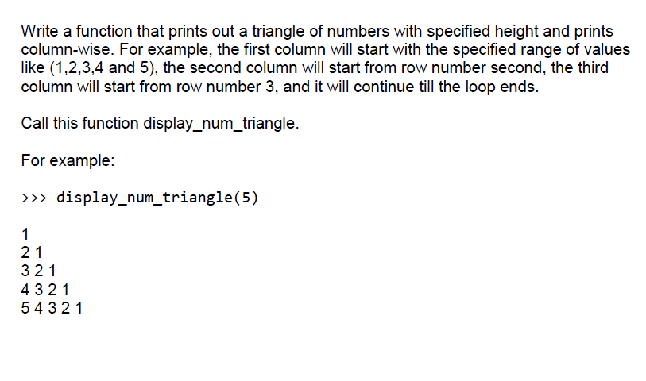

1. (12pts; 2 pts each), Evaluate the following expressions with the given variables & their values and print the output. Be sure to follow the order of operations. If an error would occur, write "error".

> (12分;用给定的变量及其值计算以下表达式，并打印输出。一定要遵循操作的顺序。如果会出现错误，则写“error”。

```python
num = 10
sum = 100
max = 100
final = 6
amount = 2
bird = "Parrot"
animal = "panther"
panther = "animal"
first = True
second = False
```

| Expression                       | Output                                |
| -------------------------------- | ------------------------------------- |
| `print(max ** 1 - sum + 7)`      |                                       |
| `print(final / amount * 2 ** 2)` | `Final / amount * 4 = 6 / 2 * 4 =12 ` |


```python
for number in range(3, 7):
    if number % 3 == 0:
        counter = 0
        while counter < number:
            print(counter, end="->")
            counter += 1
        print(counter)
    else:
        print("SKIP")
```

Write a function that prints out a triangle with specified height and character type. Call this function display_triangle. Assume that the height passed in is greater than 1. For example: 

```python
>>> display_triangle(‘#’, 3) 
  #
 ###
#####
```

```python
def display_triangle(char, height):
    if height < 2:
        print("Height must be greater than 1.")
        return

    for i in range(height):
        spaces = " " * (height - i - 1)
        chars = char * (2 * i + 1)
        print(spaces + chars)
```

这是一个用 Python 编写的名为 `display_triangle` 的函数，它接受一个字符和一个高度作为参数，并打印出指定高度和字符类型的三角形。代码中包含了详细的注释，以便于理解每一步的功能。

```python
# 定义一个名为 display_triangle 的函数，接受两个参数：一个字符 char 和一个高度 height。
def display_triangle(char, height):
    # 如果 height 小于 2，则打印出一个错误信息，并提前结束函数。
    if height < 2:
        print("Height must be greater than 1.")
        return

    # 使用 for 循环遍历从 0 到 height-1 的整数（共 height 个）。
    for i in range(height):
        # 计算每行前面需要添加的空格数，这取决于当前行号（i）与总高度（height）之间的关系。
        # 当前行 i 距离顶部的行数越多，空格数越少。
        spaces = " " * (height - i - 1)

        # 计算每行需要打印的字符数。每行的字符数是一个奇数，可以通过公式 2 * i + 1 计算得到。
        chars = char * (2 * i + 1)

        # 拼接空格和字符，然后打印出每一行。
        print(spaces + chars)
```

当我们想要打印一个由字符组成的等腰三角形时，需要考虑两个方面：每行字符的数量以及每行开头的空格数量。我们先来详细解释一下空格的规律。

假设我们有一个高度为 `height` 的等腰三角形，我们从 0 开始计数行号，即第一行的行号为 0，第二行的行号为 1，依此类推。对于每一行，我们需要在字符之前添加一定数量的空格，以使三角形居中对齐。

观察三角形的空格规律，我们可以得出以下结论：

1. 当行号为 0（即顶部行）时，空格数量为 `height - 1`。
2. 当行号逐渐增加时，空格数量逐渐减少。
3. 当行号为 `height - 1`（即底部行）时，空格数量为 0。

我们可以用以下公式计算每行空格的数量：`空格数量 = height - 行号 - 1`。这个公式可以确保随着行号的增加，空格数量逐渐减少，从而使得三角形居中对齐。

例如，当高度 `height` 为 3 时：

- 行号为 0 时：空格数量 = 3 - 0 - 1 = 2，输出结果为：` #`
- 行号为 1 时：空格数量 = 3 - 1 - 1 = 1，输出结果为：` ###`
- 行号为 2 时：空格数量 = 3 - 2 - 1 = 0，输出结果为：`#####`

通过这种方式，我们可以确保在每行字符之前正确添加空格，从而得到一个居中对齐的等腰三角形。

---

Write a function that prints out a triangle of numbers with specified height and printscolumn-wise. For example, the first column will start with the specified range of valueslike (1,2,3,4 and 5), the second column will start from row number second, the thirdcolumn will start from row number 3, and it will continue till the loop ends. Call this function display._ num_ triangle. For example. >>> display_num triangle(5) 1 2 1 3 2 1 4 3 2 1 5 4 3 2 1



首先，我们来解释这个问题的思路。我们需要编写一个函数，用于打印一个数字三角形。三角形的高度由参数给定，而每一列的数字按照从大到小的顺序排列。例如，当高度为 5 时，我们需要打印以下三角形：

```python
1
2 1
3 2 1
4 3 2 1
5 4 3 2 1
```

为了实现这个功能，我们可以使用两个嵌套的循环。外层循环用于遍历每一行，而内层循环用于遍历每一列。接下来，我们详细注释这个函数的代码：

```python
def display_num_triangle(height):
    # 外层循环：从1到height（包含height）
    for row in range(1, height + 1):
        # column_start变量存储每一列的起始数字，它从当前行号开始
        column_start = row
        
        # 内层循环：从1到当前行号（包含行号）
        for col in range(1, row + 1):
            # 使用end=" "参数，使得print函数在打印数字后不换行，而是添加一个空格
            print(column_start, end=" ")
            # 在每次内层循环中，将column_start递减1
            column_start -= 1
        
        # 在每行末尾，使用print函数添加一个换行符
        print()

# 示例用法：
display_num_triangle(5)
```


```python
s = 'the 167 20 lazy 210 brown 78 87 2 fox 245 123'
lst = s.split()
acc = 0
for elem in lst:
    if elem.isdigit():
        acc += int(elem)
print(acc)


acc = 0
for elem in lst:
    try:
        acc += int(elem)
    except:
        pass
print(acc)
```


::: details 公众号：AI悦创【二维码】


:::

::: info AI悦创·编程一对一

AI悦创·推出辅导班啦，包括「Python 语言辅导班、C++ 辅导班、java 辅导班、算法/数据结构辅导班、少儿编程、pygame 游戏开发、Web、Linux」，全部都是一对一教学：一对一辅导 + 一对一答疑 + 布置作业 + 项目实践等。当然，还有线下线上摄影课程、Photoshop、Premiere 一对一教学、QQ、微信在线，随时响应！微信：Jiabcdefh

C++ 信息奥赛题解，长期更新！长期招收一对一中小学信息奥赛集训，莆田、厦门地区有机会线下上门，其他地区线上。微信：Jiabcdefh

方法一：[QQ](http://wpa.qq.com/msgrd?v=3&uin=1432803776&site=qq&menu=yes)

方法二：微信：Jiabcdefh

:::


