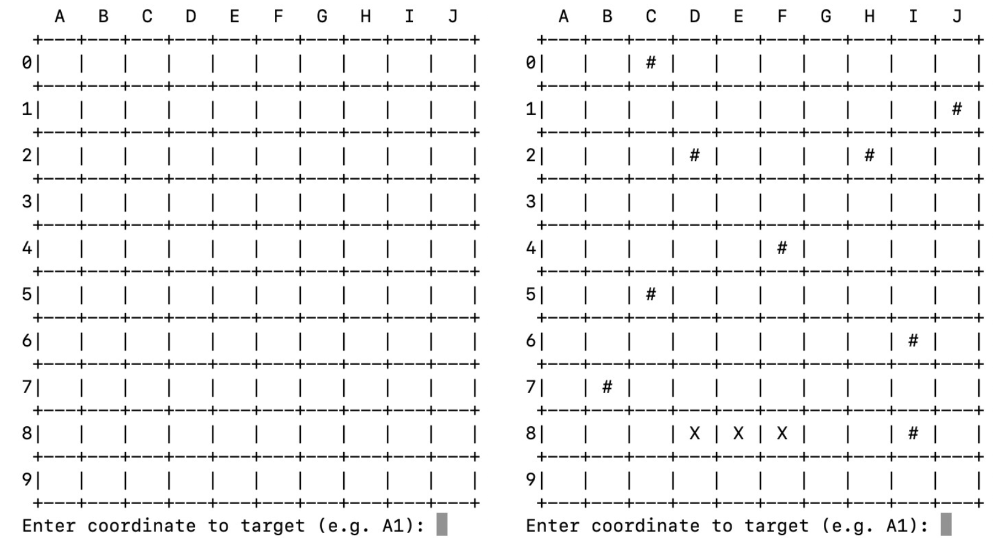
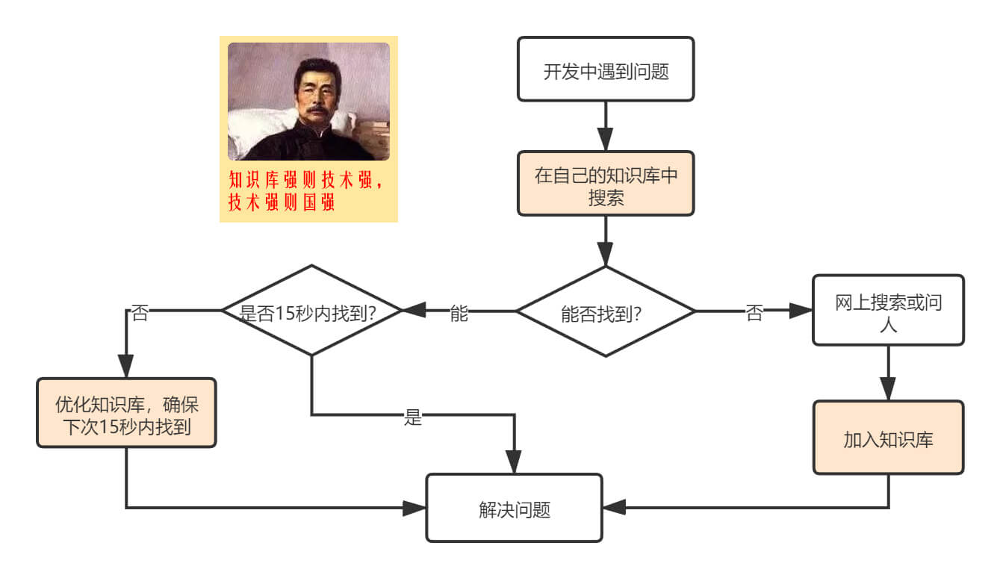

- [Assignment3_ Battleship.pdf](/1v1/06-KAI/12-Assignment3-Battleship/Assignment3Battleship.pdf)

## Assignment 5: Battleship

**Introduction to Computer Science**

> 计算机科学概论

**Due by on 11/30 by Midnight**

> 截止日期是11月30日午夜

## 1 Code of Conduct

> 1行为准则

All assignments are graded, meaning we expect you to adhere to the academic integrity standards of NYU. To any confusion regarding this, we will briefly state what is and isn’t allowed when working on an assignment.

> 所有的作业都是分级的，这意味着我们希望你遵守纽约大学的学术诚信标准。为了避免混淆，我们将简要说明在做作业时什么是允许的，什么是不允许的。

Any document and program code that you submit must be fully written by yourself. You can, of course, discuss work with fellow students, as long as these discussions are restricted to general solution techniques. Put differently, these discussions should not be about concrete code you are writing, nor about specific results you wish to submit. When discussing an assignment with others, this should never lead to you possessing the complete or partial solution of others, regardless of whether the solution is in paper or digital form, and independent of who made the solution. That means, you are also not allowed to possess solutions by someone from a different year or course or someone from another university, or code from the Internet, etc. This also implies that there is never a reason to share your code with fellow students, and that there is no valid reason to publish your code online in any form.

> 您提交的任何文档和程序代码都必须完全由您自己编写。当然，您可以与同学讨论工作，只要这些讨论仅限于一般的解决方案技术。换句话说，这些讨论不应该是关于您正在编写的具体代码，也不应该是关于您希望提交的具体结果。当与他人讨论一项任务时，这绝不应该导致你拥有他人的全部或部分解决方案，无论解决方案是纸质的还是数字的形式，也不应与解决方案是谁制定的无关。这意味着，你也不允许拥有来自不同年级、不同课程或其他大学的人的解决方案，或来自互联网的代码，等等。这也意味着永远没有理由和同学们分享你的代码，也没有正当的理由以任何形式在网上发布你的代码。

Every student is responsible for the work they submit. If there is any doubt during the grading about whether a student created the assignment themselves (e.g. if the solution matches that of others), we reserve the option to let the student explain why this is the case. In case doubts remain, or we decide to directly escalate the issue, the suspected violations will be reported to the academic administration according to the policies of NYU (see https://cs.nyu.edu/home/undergrad/policy.html).

> 每个学生都要对他们提交的作业负责。如果在评分过程中对学生是否自己创建作业有任何疑问(例如，解决方案是否与他人的解决方案匹配)，我们保留让学生解释原因的选项。如果仍有疑问，或我们决定直接升级问题，将根据纽约大学的政策，向学术管理报告可疑的违规行为(见https://cs.nyu.edu/home/undergrad/policy.html)。

## 2 Introduction

> 2介绍

Battleship (also Battleships or Sea Battle) is a guessing game for two players. It is known worldwide as a pencil and paper game which dates from World War I was published by various companies as a pad-and-pencil game in the 1930s, and was released as a plastic board game by Milton Bradley in 1967.

> 《战列舰》(也叫《战列舰》或《海战》)是两名玩家的猜谜游戏。它作为一款纸笔游戏而闻名于世，最早可追溯到第一次世界大战，20世纪30年代由多家公司发行，最初是一款纸笔游戏，1967年由米尔顿·布拉德利作为一款塑料桌游发行。

The goal of this assignment is to implement a simplified version of the Battleship game in Java. This will give you practice in working with **arrays** and **multidimensional arrays**, loops, methods, etc. Additionally, it is a good exercise in decomposing a larger problem into smaller and more manageable parts using **methods**.

> 本次作业的目标是用Java实现一个简化版的《战舰》游戏。这将使您练习使用数组和多维数组、循环、方法等。此外，使用方法将较大的问题分解为更小的、更易于管理的部分是一种很好的练习。

The Battleship game is played on a two-dimensional board. The board is typically square (usually 10x10 cells) and the individual cells in the grid are identified by letters and numbers. In this simplified version of Battleship, only one player plays against the computer. At the start of the game, the computer secretly places one (hidden) ship with the size of 4 cells/ blocks on the board in a random location and with a random orientation, either horizontally or vertically. As the location of the ship is concealed from the player, the goal of the player is to "destroy" the ship with the least number of guesses. Hereby, the player takes turns by entering a coordinate of the target cell. If it is a hit, the cell is marked by an 'X', otherwise by a '#' for a miss. When all cells of the ship are guessed by the player, the ship is sunk and the game is won.

> 《战舰》游戏是在一个二维棋盘上进行的。板子通常是正方形的(通常是10x10个单元格)，网格中的单个单元格由字母和数字标识。在这个简化版的《战舰》中，只有一个玩家与电脑对抗。在游戏开始时，电脑秘密地将4个单元/块大小的船放置在随机位置和随机方向(水平或垂直)上。因为船只的位置是隐藏在玩家面前的，所以玩家的目标是用最少的猜测次数“摧毁”船只。在此，玩家轮流输入目标单元格的坐标。如果击中，则用“X”标记单元格，否则用“#”表示失败。当玩家猜中所有单元格时，船就沉没了，游戏就赢了。

Figure 1 shows an example of the Battleship game on a 10x10 grid.

> 图1显示了《战舰》游戏在10x10网格上的例子。



Figure 1: Example output after the start of the game and after multiple turns with 3 hits at D8, E8, F8

> 图1:游戏开始后和多次回合后的输出示例，在D8, E8, F8处有3次命中

## 3 Implementation

> 3实现

The implementation of this game mainly consists of two phases:

> 本游戏的实施主要包括两个阶段:

## Initialization:

> 初始化:

At the start of the game, an (empty) board is created, where columns are identified by a letter and rows by a number (see Figure 1). The computer then randomly places a ship on the board, where the location of the ship is described by a random row, column, and orientation. As the ship occupies a number of consecutive cells on the board, the random row and column is used as the first cell of the ship and then extends either vertically (down) or horizontally (right) based on the length of the ship. In order to randomly select a row, column, and orientation of the ship, use the Math.random() methods. When drawing random numbers for the first cell of the ship, make sure that a) the row and column is within the board dimensions and b) the ship can actually be placed completely within the board dimensions, i.e. no cell of the ship exceeds the board dimensions.

> 在游戏开始时，会创建一个(空的)棋盘，其中的列由字母标识，行由数字标识(见图1)。然后，计算机随机地将一艘船放置在棋盘上，船的位置由随机的行、列和方向描述。由于船在板上占据了许多连续的单元格，因此随机行和列被用作船的第一个单元格，然后根据船的长度垂直(向下)或水平(右)扩展。为了随机选择船的行、列和方向，请使用Math.random()方法。当为船的第一个单元格绘制随机数时，确保a)行和列在板尺寸内，b)船实际上可以完全放置在板尺寸内，即船的任何单元格都不能超过板尺寸。

As the location of the ship is concealed from the user, you have to find a solution to store the cells that are occupied by the ship without revealing them to the player, for example use another board that holds the locations of the ship which is not shown to the user and only used to verify a hit or miss. After creating the board, the board should be printed on the screen so that the user gets an idea on how the board looks like.

> 随着船的位置从用户隐藏,你必须找到一个解决方案来存储细胞所占领的船没有透露他们的球员,例如使用另一个董事会,这艘船的位置没有显示给用户,仅用于验证了小姐或创建董事会后,董事会应打印在屏幕上,用户将获得一个想法关于董事会的样子。

Please note the board dimensions and the size of the ship are declared as constant (global) variables and that the program dynamically creates a board based on these values. In other words, do not "hardcode" the board dimensions, size of the ship, etc. This allows you to easily change these values without modifying multiple lines of your code. The code snippet below shows an example of the first lines of your code:

> 请注意，板尺寸和船的大小被声明为常量(全局)变量，程序根据这些值动态创建一个板。换句话说，不要“硬编码”板尺寸，船的大小等。这允许您轻松地更改这些值，而无需修改多行代码。下面的代码片段显示了代码的第一行示例:

```java
final int SHIP_SIZE = 4; // constant for the size of 的大小为常量
the ship final int DIMENSION = 10; // constant for the  的常数
size of the board (square) // create the board
// randomly place the ship. Use Math.random() to return an int 
random numbers // display the board
```

## Game phase:

> 比赛阶段:

After creating the board, the player is asked to make a guess by entering a coordinate (location) within the board. The coordinate consists of the column (a letter) followed by the row (a digit). For example, valid coordinates are B4, C1, A6, etc. Notice that the column letter is case-sensitive that the input clearly describes the format of the expected input. In case the player enters an invalid input or an invalid coordinate, the program informs the player about this and asks for a new coordinate. Examples for invalid input are AB, A 6, 1A, 32, A;5, etc. or coordinates out of the board dimensions.

> 在创建棋盘后，玩家需要通过输入棋盘内的坐标(位置)进行猜测。坐标由列(一个字母)和行(一个数字)组成。例如，有效坐标是B4、C1、A6等。请注意列字母区分大小写，输入清楚地描述了期望输入的格式。如果玩家输入了一个无效的输入或一个无效的坐标，程序会通知玩家这一点并要求一个新的坐标。无效输入的例子有AB, a6, 1A, 32, A;5等，或者板外尺寸的坐标。

After a valid user input, the program places the guess on the board, where a hit is denoted as an 'X' and a miss as a '#'. The program must also maintain a score indicating the number of guesses (1 point for each guess whether it’s a hit or a miss). After each turn, the program must check if the game is won, i.e. the entire ship is sunk (all the four pieces of the ship were found). If so, the program must inform the user that the game is over, and display the score (Number of guesses). Otherwise, the board should be printed reflecting the updated cells and ask for another input. Before printing the updated board. So, you can assume that the player will keep playing until all of the four pieces of the ship are discovered (which could take a minimum 4 or maximum of 100 guesses). Obviously, 4 guess is a much better score than a 100.

> 在有效的用户输入之后，程序将猜测结果放在黑板上，命中的表示为“X”，未命中的表示为“#”。该程序还必须保持一个分数，表示猜测的次数(无论猜对与否，每猜一次都得1分)。在每个回合后，程序必须检查游戏是否获胜，即整个船被击沉(船的所有四个部件都被找到)。如果是，程序必须通知用户游戏结束，并显示分数(猜测次数)。否则，板应打印反映更新单元格和要求另一个输入。在打印更新后的电路板之前。所以，你可以假设玩家会一直玩下去，直到发现船的所有四个部件(这可能需要最少4次或最多100次猜测)。显然，猜4次比100分要好得多。

## 3 Grading

| Description                                                  | Score (/20) |
| ------------------------------------------------------------ | ----------- |
| Initialization of the board<br />初始化单板                  | 2           |
| Printing of the board and board labels, as depicted in Figure 1<br />印刷的纸板和纸板标签，如图1所示 | 2           |
| Randomly placing the ship<br />随机放置船只                  | 3           |
| Checking for invalid user input (letter followed by number)<br />检查无效的用户输入(后跟数字的字母) | 2           |
| Checking for invalid input (repetitive guesses of same cell, out of board, etc)<br />检查无效输入(重复猜测相同单元格、脱板等) | 2           |
| Updating the board cells based on user input<br />根据用户输入更新板单元格 | 2           |
| Detecting end of the game: When the ship is sank (when user find all of the 4 pieces of the ship).<br />检测游戏结束:当船沉没时(当用户发现船的所有4块碎片)。 | 3           |
| Displaying a correct score after a win (when all the 4 pieces of the ship are found).<br />在获胜后显示正确的分数(当船的4个部件都找到时)。 | 2           |
| Terminate the game after a win.<br />获胜后终止游戏。        | 1           |
| Usage of comments and readability of code (style, variable naming, using methods, etc.)<br />注释的使用和代码的可读性(样式、变量命名、使用方法等) | 1           |

## 4 Submission

**Please note: Your submission must have set the board dimensions to 10x10 and the ship length to 4 cells.**

he deadline of this assignment is due b**y 11/30 by** midnight via Brightspace. You can

directly submit your .java file on Brightspace. Submissions via are not accepted. Late submissions will be penalized by 10% per class and it will not be accepted after 3 classes past the due date. Note that your solution must work using Java and without any syntax errors. In case your code does not work using Java, your submission will not be graded.

**Extra Credit for excellent innovative solutions and added technical feature!**

## 备课

::: code-tabs#java

@tab 1. 棋盘生成初探

```java
/**
 * @ClassName: Battleship
 * @Description: TODO
 * @Author: AndersonHJB
 * @date: 2022/11/29 23:20
 * @Version: V1.0
 * @Blog: https://bornforthis.cn
 */

import java.util.ArrayList;

public class Battleship {
    public static void main(String[] args) {
        ArrayList<Character> row_char = new ArrayList<Character>();
        ArrayList<Integer> col_int = new ArrayList<Integer>();
        char ch = 'A';
        for (int i = 0; i < 10; i++) {
            row_char.add((char) ch++);
            col_int.add(i);
        }
        System.out.println(row_char);
        System.out.println(col_int);
        // 方法2
//        char[] row_char1 = new char[]{'A', 'B', 'C', 'D', 'E', 'F', 'G', 'H', 'I', 'J'};
//        System.out.println(row_char1);
        String header = "\t";
        for (int i = 0; i < 10; i++) {
            header += row_char.get(i) + "\t";
//            System.out.print("\t" + row_char.get(i) + "\t");
        }
        System.out.println(header);

        String line_template = "  +";
        for (int i = 0; i < 10; i++) {
            line_template += "---+";
        }
        System.out.println(line_template);

        String col_template = " 0|\t  |";
        for (int i = 0; i < 10; i++) {
            col_template += "\t  |";
        }
        System.out.println(col_template);
        // TODO:>>>System.out.println(" 0|\t  |\t  |\t  |\t  |\t  |\t  |\t  |\t  |\t  |\t  |");

        // TODO:>>>待优化，多个循环可以组合；
    }
}
```

@tab 2. 列棋盘实现

```java
/**
 * @ClassName: Battleship
 * @Description: TODO
 * @Author: AndersonHJB
 * @date: 2022/11/29 23:20
 * @Version: V1.0
 * @Blog: https://bornforthis.cn
 */
/*
[A, B, C, D, E, F, G, H, I, J]
[0, 1, 2, 3, 4, 5, 6, 7, 8, 9]
	A	B	C	D	E	F	G	H	I	J
  +---+---+---+---+---+---+---+---+---+---+
 0|	  |	  |	  |	  |	  |	  |	  |	  |	  |	  |
 1|	  |	  |	  |	  |	  |	  |	  |	  |	  |	  |
 2|	  |	  |	  |	  |	  |	  |	  |	  |	  |	  |
 3|	  |	  |	  |	  |	  |	  |	  |	  |	  |	  |
 4|	  |	  |	  |	  |	  |	  |	  |	  |	  |	  |
 5|	  |	  |	  |	  |	  |	  |	  |	  |	  |	  |
 6|	  |	  |	  |	  |	  |	  |	  |	  |	  |	  |
 7|	  |	  |	  |	  |	  |	  |	  |	  |	  |	  |
 8|	  |	  |	  |	  |	  |	  |	  |	  |	  |	  |
 9|	  |	  |	  |	  |	  |	  |	  |	  |	  |	  |
*/

import java.util.ArrayList;

public class Battleship {
    public static void main(String[] args) {
        ArrayList<Character> row_char = new ArrayList<Character>();
        ArrayList<Integer> col_int = new ArrayList<Integer>();
        char ch = 'A';
        for (int i = 0; i < 10; i++) {
            row_char.add((char) ch++);
            col_int.add(i);
        }
        System.out.println(row_char);
        System.out.println(col_int);
        // 方法2
//        char[] row_char1 = new char[]{'A', 'B', 'C', 'D', 'E', 'F', 'G', 'H', 'I', 'J'};
//        System.out.println(row_char1);
        String header = "\t";
        for (int i = 0; i < 10; i++) {
            header += row_char.get(i) + "\t";
//            System.out.print("\t" + row_char.get(i) + "\t");
        }
        System.out.println(header);

        String line_template = "  +";
        for (int i = 0; i < 10; i++) {
            line_template += "---+";
        }
        System.out.println(line_template);

        for (int j = 0; j < 10; j++) {
//            String col_template = " 0|\t  |";
            String col_template = " " + j + "|\t  |";
            for (int i = 0; i < 9; i++) {
                col_template += "\t  |";
            }
            System.out.println(col_template);
        }
        // TODO:>>>System.out.println(" 0|\t  |\t  |\t  |\t  |\t  |\t  |\t  |\t  |\t  |\t  |");

        // TODO:>>>待优化，多个循环可以组合；
    }
}
```

@tab 3. 棋盘生成

```java
/**
 * @ClassName: Battleship
 * @Description: TODO
 * @Author: AndersonHJB
 * @date: 2022/11/29 23:20
 * @Version: V1.0
 * @Blog: https://bornforthis.cn
 */

import java.util.ArrayList;

public class Battleship {
    public static void main(String[] args) {
        ArrayList<Character> row_char = new ArrayList<Character>();
        ArrayList<Integer> col_int = new ArrayList<Integer>();
        char ch = 'A';
        for (int i = 0; i < 10; i++) {
            row_char.add((char) ch++);
            col_int.add(i);
        }
//        System.out.println(row_char);
//        System.out.println(col_int);
        // 方法2
//        char[] row_char1 = new char[]{'A', 'B', 'C', 'D', 'E', 'F', 'G', 'H', 'I', 'J'};
//        System.out.println(row_char1);
        String header = "\t";
        for (int i = 0; i < 10; i++) {
            header += row_char.get(i) + "\t";
//            System.out.print("\t" + row_char.get(i) + "\t");
        }
        System.out.println(header);

        String line_template = "  +";
        for (int i = 0; i < 10; i++) {
            line_template += "---+";
        }
//        System.out.println(line_template);

        for (int j = 0; j < 10; j++) {
//            String col_template = " 0|\t  |";
            String col_template = " " + j + "|\t  |";
            for (int i = 0; i < 9; i++) {
                col_template += "\t  |";
            }
            System.out.println(line_template);
            System.out.println(col_template);
        }
        System.out.println(line_template);
        System.out.println("Enter coordinate to target (e.g. A1):");
        // TODO:>>>System.out.println(" 0|\t  |\t  |\t  |\t  |\t  |\t  |\t  |\t  |\t  |\t  |");

        // TODO:>>>待优化，多个循环可以组合；
    }
}
```

@tab 4. 数组生成棋盘

```java
package Test;

/**
 * @ClassName: Test2
 * @Description: TODO
 * @Author: AndersonHJB
 * @date: 2022/12/1 18:15
 * @Version: V1.0
 * @Blog: https://bornforthis.cn
 */
public class Test2 {
    public static void main(String[] args) {
        char[] row_char = new char[]{'A', 'B', 'C', 'D', 'E', 'F', 'G', 'H', 'I', 'J'};
//        String header = "\t";
        String header = "    ";
        for (int i = 0; i < 10; i++) {
            header += row_char[i] + "\t";
//            System.out.print("\t" + row_char.get(i) + "\t");
        }
        System.out.println(header);
        // 创建数组
        String[][] grid = new String[10][10];
        String row_line = "  +";
        for (int i = 0; i < 10; i++) {
            row_line += "---+";
        }
        System.out.println(row_line);

        for (int row = 0; row < 10; row++) {
            for (int col = 0; col < 10; col++) {
                grid[row][col] = "   |";
            }
        }

        for (int i = 0; i < 10; i++) {
            String col_line = "|";
            for (int j = 0; j < 10; j++) {
                col_line += grid[i][j];
            }
            System.out.println(" " + i + col_line);
            System.out.println(row_line);
        }
    }
}
```

@tab 5. 输出

```java
    A   B   C   D   E   F   G   H   I   J	
  +---+---+---+---+---+---+---+---+---+---+
 0|   |   |   |   |   |   |   |   |   |   |
  +---+---+---+---+---+---+---+---+---+---+
 1|   |   |   |   |   |   |   |   |   |   |
  +---+---+---+---+---+---+---+---+---+---+
 2|   |   |   |   |   |   |   |   |   |   |
  +---+---+---+---+---+---+---+---+---+---+
 3|   |   |   |   |   |   |   |   |   |   |
  +---+---+---+---+---+---+---+---+---+---+
 4|   |   |   |   |   |   |   |   |   |   |
  +---+---+---+---+---+---+---+---+---+---+
 5|   |   |   |   |   |   |   |   |   |   |
  +---+---+---+---+---+---+---+---+---+---+
 6|   |   |   |   |   |   |   |   |   |   |
  +---+---+---+---+---+---+---+---+---+---+
 7|   |   |   |   |   |   |   |   |   |   |
  +---+---+---+---+---+---+---+---+---+---+
 8|   |   |   |   |   |   |   |   |   |   |
  +---+---+---+---+---+---+---+---+---+---+
 9|   |   |   |   |   |   |   |   |   |   |
  +---+---+---+---+---+---+---+---+---+---+
```

@tab 6. 数组生成棋盘「2」

```java
package Test;

/**
 * @ClassName: Griad
 * @Description: TODO
 * @Author: AndersonHJB
 * @date: 2022/12/1 11:50
 * @Version: V1.0
 * @Blog: https://bornforthis.cn
 */
public class Griad {
    public static void main(String[] args) {
        char[] row_char = new char[]{'A', 'B', 'C', 'D', 'E', 'F', 'G', 'H', 'I', 'J'};
        String header = "\t";
        for (int i = 0; i < 10; i++) {
            header += row_char[i] + "\t";
//            System.out.print("\t" + row_char.get(i) + "\t");
        }
        System.out.println(header);
        // 创建数据
        String[][] grad = new String[21][10];
        for (int row = 0; row < 21; row++) {
            if (row % 2 == 0) {
                for (int col = 0; col < 10; col++) {
                    grad[row][col] = "+---";
                }
            } else {
                for (int col = 0; col < 10; col++) {
                    grad[row][col] = "\t  |";
                }
            }
        }
        int index = 0;
        for (int row = 0; row < grad.length; row++) {

            String row_line = "  ";  // 2 space

//            String col_line = " 0|";  // 2 space

            if (row % 2 == 0) {
                for (int col = 0; col < grad[0].length; col++) {
                    row_line += grad[row][col];
//                    index++;
                }
                System.out.print(row_line + "+");
            } else {
                String col_line = " " + (index++) + "|";  // 2 space
                for (int col = 0; col < grad[0].length; col++) {
                    col_line += grad[row][col];
//                    index++;
                }
                System.out.print(col_line);
//                ++index;

            }
            System.out.println();
        }
    }


}
```

:::

## 答案

::: code-tabs#java

@tab Battleship.java

```java
import java.util.HashMap;
import java.util.Scanner;
import java.util.regex.Pattern;

public class Battleship {
    public static Scanner reader = new Scanner(System.in);
    private static HashMap<String, Integer> letterToInt = new HashMap<>();
    public static final String REGEX_POSITION = "[A-Z]{1}\\d{1}";

    public static void main(String[] args) {
        System.out.println("JAVA BATTLESHIP");
        initData();
        System.out.println("\n玩家请准备:");
        Player userPlayer = new Player();
        setup(userPlayer);
    }

    /**
     * 初始化横坐标
     */
    private static void initData() {

        letterToInt.put("A", 0);
        letterToInt.put("B", 1);
        letterToInt.put("C", 2);
        letterToInt.put("D", 3);
        letterToInt.put("E", 4);
        letterToInt.put("F", 5);
        letterToInt.put("G", 6);
        letterToInt.put("H", 7);
        letterToInt.put("I", 8);
        letterToInt.put("J", 9);
    }

    /**
     * 开始游戏
     *
     * @param player 游戏玩家
     */
    private static void setup(Player player) {
//        player.getPlayerGrid().printShips(); //输出所有船的位置
        player.getPlayerGrid().printStatus(); //输出状态
        System.out.println();
        int counter = 0;
        for (int i = 0; i < player.getShips().length; i++) {
            int row = -1;
            int col = -1;
            String inputPosition = "";
            while (!player.isAllHitDown()) {
                System.out.print("请输入战舰的坐标(范围：A1-J9): ");
                inputPosition = reader.next();
                if (inputPosition.length() == 2) {
                    if (Pattern.matches(REGEX_POSITION, inputPosition)) {
                        String rows = inputPosition.substring(1, 2);
                        String cols = inputPosition.substring(0, 1);
                        row = Integer.parseInt(rows);
                        counter++;
                        if (row >= 0 && row <= 9 && letterToInt.containsKey(cols)) // 输入检查
                        {
                            col = letterToInt.get(cols);
                            isLocationHasShip(row, col, player);
                        } else {
                            System.out.println("========================");
                            System.out.println("  坐标托板！请重新输入");
                            System.out.println("========================");
                        }
                        player.getPlayerGrid().printStatus();
                    } else {
                        System.out.println();
                        System.out.println("输入坐标异常请重新输入!");
                        System.out.println();
                    }

                } else {
                    System.out.println();
                    System.out.println("输入坐标异常请重新输入!");
                    System.out.println();
                }
            }
            System.out.println();
        }
        player.getPlayerGrid().printStatus();
        System.out.printf("游戏结束！ 恭喜你成功找到所有船！获得满分 %d 分!", counter);
    }

    /**
     * 判断是否击中战舰
     *
     * @param row    战舰横坐标
     * @param col    战舰纵坐标
     * @param player 玩家
     */
    private static void isLocationHasShip(int row, int col, Player player) {
        if (player.getPlayerGrid().getStatus(row, col) == Location.UNGUESSED) {
            if (player.getPlayerGrid().hasShip(row, col)) {
                player.getPlayerGrid().markHit(row, col);
                System.out.println();
                System.out.println("恭喜你！！击中战舰！！");
                System.out.println();
            } else {
                player.getPlayerGrid().markMiss(row, col);
            }
        } else {
            System.out.println();
            System.out.println("此坐标已经输入过！！请重新输入坐标");
            System.out.println();

        }
    }


}
```

@tab Grid.java

```java
/**
 * 玩家面板类
 */
public class Grid {
    /**
     * 战舰坐标
     */
    private Location[][] grid;


    // 行数和列数
    public static final int NUM_ROWS = 10;
    public static final int NUM_COLS = 10;

    public Grid() {
        grid = new Location[NUM_ROWS][NUM_COLS];
        for (int row = 0; row < grid.length; row++) {
            for (int col = 0; col < grid[row].length; col++) {
                Location tempLoc = new Location();
                grid[row][col] = tempLoc;
            }
        }
    }

    public void markHit(int row, int col) {
        grid[row][col].markHit();
    }

    /**
     * 判断整个战舰是否都被击中
     *
     * @param row     战舰横坐标
     * @param col     战舰纵坐标
     * @param shipDir 战舰方向
     * @param square  战舰长度
     * @return
     */
    public boolean isShipHitDown(int row, int col, int shipDir, int square) {
        boolean flag = true;
        boolean[] hits = new boolean[square];
        if (shipDir == 0) // Hortizontal
        {
            for (int i = col; i < col + square; i++) {
                hits[i - col] = getStatus(row, i) == Location.HIT;
            }
        } else {
            for (int i = row; i < row + square; i++) {
                hits[i - row] = getStatus(i, col) == Location.HIT;
            }
        }
        for (boolean hit : hits) {
            flag = flag & hit;
        }
        return flag;
    }


    public Location getLccationInfo(int row, int col) {
        return grid[row][col];
    }

    public void markMiss(int row, int col) {
        grid[row][col].markMiss();
    }

    public void setStatus(int row, int col, int status) {
        grid[row][col].setStatus(status);
    }

    public int getStatus(int row, int col) {
        return grid[row][col].getStatus();
    }

    public boolean alreadyGuessed(int row, int col) {
        return !grid[row][col].isUnguessed();
    }

    public void setShip(int row, int col, boolean val) {
        grid[row][col].setShip(val);
    }

    public boolean hasShip(int row, int col) {
        return grid[row][col].hasShip();
    }

    public Location get(int row, int col) {
        return grid[row][col];
    }

    public int numRows() {
        return NUM_ROWS;
    }

    public int numCols() {
        return NUM_COLS;
    }

    public void printStatus() {
        generalPrintMethod(0);
    }

    public void printShips() {
        generalPrintMethod(1);
    }


    public void addShip(Ship s, int shipIndex) {
        int row = s.getRow();
        int col = s.getCol();
        int length = s.getLength();
        int dir = s.getDirection();

        if (!(s.isDirectionSet()) || !(s.isLocationSet()))
            throw new IllegalArgumentException("ERROR! Direction or Location is unset/default");

        // 0 - hor; 1 - ver
        if (dir == 0) // Hortizontal
        {

            for (int i = col; i < col + length; i++) {
//                System.out.println("DEBUG: Hortizontal row = " + row + "; col = " + i);
                grid[row][i].setShip(true);
                grid[row][i].setLengthOfShip(length);
                grid[row][i].setDirectionOfShip(dir);
                grid[row][i].setShipIndex(shipIndex);
            }
        } else if (dir == 1) // Vertical
        {
            for (int i = row; i < row + length; i++) {
//                System.out.println("DEBUG: Vertical row = " + row + "; col = " + i);
                grid[i][col].setShip(true);
                grid[i][col].setLengthOfShip(length);
                grid[i][col].setDirectionOfShip(dir);
                grid[i][col].setShipIndex(shipIndex);
            }
        }
    }

    /**
     * 绘制战舰所在面板
     *
     * @param type 0 绘制当前状态, 1 绘制战舰
     */
    private void generalPrintMethod(int type) {
        System.out.println();
        System.out.print("  ");
        int endLetterForLoop = (NUM_COLS - 1) + 65;
        //绘制每列的坐标系
        for (int i = 65; i <= endLetterForLoop; i++) {
            char theChar = (char) i;
            System.out.print("  " + theChar + "  ");
        }
        System.out.println();
        //绘制每一行数据
        for (int i = 0; i < NUM_ROWS; i++) {
            int loop = 2;
            if (i == NUM_ROWS - 1) {
                loop = 3;
            }
            for (int h = 0; h < loop; h++) {
                if (h == 0) {//绘制分割线
                    System.out.print("  ");
                    for (int t = 1; t <= NUM_COLS; t++) {
                        if (t == NUM_COLS)
                            System.out.print("+----+");
                        else
                            System.out.print("+----");
                    }
                    System.out.println();
                } else if (h == 1) {
                    //绘制战舰所在方格
                    System.out.print(i + " |");//每行第一个字母

                    for (int j = 0; j < NUM_COLS; j++) {
                        if (type == 0) // type == 0; 猜测状态
                        {
                            if (grid[i][j].isUnguessed())
                                System.out.print("    |");
                            else if (grid[i][j].checkMiss())
                                System.out.print(" #  |");
                            else if (grid[i][j].checkHit())
                                System.out.print(" X  |");
                        } else if (type == 1) // type == 1; 战舰
                        {
                            if (grid[i][j].hasShip()) {
                                System.out.print(" D  |");
                            } else if (!(grid[i][j].hasShip())) {
                                System.out.print("    |");
                            }

                        }
                    }
                    System.out.println();
                } else {
                    //绘制分割线
                    System.out.print("  ");
                    for (int t = 1; t <= NUM_COLS; t++) {
                        if (t == NUM_COLS)
                            System.out.print("+----+");
                        else
                            System.out.print("+----");
                    }
                    System.out.println();
                }
            }

        }
    }

}
```

@tab Location.java

```java
/**
 * 面板坐标属性
 */
public class Location {
    public static final int UNGUESSED = 0;
    public static final int HIT = 1;
    public static final int MISSED = 2;
    private int shipIndex = -1;//记录是第几支船

    private boolean hasShip;
    private int status;
    private int lengthOfShip;
    private int directionOfShip;

    public int getShipIndex() {
        return shipIndex;
    }

    public void setShipIndex(int shipIndex) {
        this.shipIndex = shipIndex;
    }

    public Location() {
        status = 0;
        hasShip = false;
        lengthOfShip = -1;
        directionOfShip = -1;
    }

    public boolean checkHit() {
        if (status == HIT)
            return true;
        else
            return false;
    }

    public boolean checkMiss() {
        if (status == MISSED)
            return true;
        else
            return false;
    }

    // 这个格子是否被猜过?
    public boolean isUnguessed() {
        if (status == UNGUESSED)
            return true;
        else
            return false;
    }

    public void markHit() {
        setStatus(HIT);
    }

    public void markMiss() {
        setStatus(MISSED);
    }

    public boolean hasShip() {
        return hasShip;
    }

    public void setShip(boolean val) {
        this.hasShip = val;
    }

    public void setStatus(int status) {
        this.status = status;
    }

    public int getStatus() {
        return status;
    }

    public int getLengthOfShip() {
        return lengthOfShip;
    }

    public void setLengthOfShip(int val) {
        lengthOfShip = val;
    }

    public int getDirectionOfShip() {
        return directionOfShip;
    }

    public void setDirectionOfShip(int val) {
        directionOfShip = val;
    }
}
```

@tab Player.java

```java
public class Player {
    /**
     * 战舰的数量
     */
    private static final int NUM_OF_SHIPS = 1;
    /**
     * 战舰的长度
     */
    private static final int NUM_OF_SHIPS_SQUARE = 4;

    /**
     * 所有战舰
     */
    public Ship[] ships;
    /**
     * 玩家面板
     */
    public Grid playerGrid;

    public Player() {
        playerGrid = new Grid();
        initShip();
    }

    /**
     * 初始化战舰
     */
    private void initShip() {
        ships = new Ship[NUM_OF_SHIPS];
        for (int i = 0; i < NUM_OF_SHIPS; i++) {
            Ship tempShip = new Ship(NUM_OF_SHIPS_SQUARE);
            int rdir = Math.random() > 0.5 ? 1 : 0;
            tempShip.setDirection(rdir);
            tempShip.setGuess(false);
            if (rdir == 0) {//横向
                while (true) {
                    int range = Grid.NUM_ROWS - NUM_OF_SHIPS_SQUARE - 1;
                    int shipStartPosCols = Randomizer.nextInt(0, range);
                    int star = Grid.NUM_COLS - 1;
                    int shipStartPosRow = Randomizer.nextInt(0, star);
                    if (!playerGrid.hasShip(shipStartPosRow, shipStartPosCols)) {
                        tempShip.setLocation(shipStartPosRow, shipStartPosCols);
                        break;
                    }
                }

            } else {
                while (true) {
                    int range = Grid.NUM_COLS - NUM_OF_SHIPS_SQUARE - 1;
                    int shipStartPosRow = Randomizer.nextInt(0, range);
                    int star = Grid.NUM_ROWS - 1;
                    int shipStartPosCols = Randomizer.nextInt(0, star);
                    if (!playerGrid.hasShip(shipStartPosRow, shipStartPosCols)) {
                        tempShip.setLocation(shipStartPosRow, shipStartPosCols);
                        break;
                    }

                }

            }
//            System.out.println(i+ "  "+tempShip.toString());
            playerGrid.addShip(tempShip, i);
            ships[i] = tempShip;

        }
    }

    public Ship[] getShips() {
        return ships;
    }

    public void setShips(Ship[] ships) {
        this.ships = ships;
    }

    public Grid getPlayerGrid() {
        return playerGrid;
    }

    public void setPlayerGrid(Grid playerGrid) {
        this.playerGrid = playerGrid;
    }

    /**
     * 是否击中所有战舰
     *
     * @return
     */
    public boolean isAllHitDown() {
        int counter = 0;
        boolean[] hits = new boolean[ships.length];
        boolean flag = true;
        for (Ship ship : ships) {
            boolean shipDown = playerGrid.isShipHitDown(ship.getRow(), ship.getCol(), ship.getDirection(), ship.getLength());
            flag = flag & shipDown;

        }
        return flag;
    }
}
```

@tab Randomizer.java

```java

import java.util.*;

public class Randomizer {

    public static Random theInstance = null;

    public Randomizer() {

    }

    public static Random getInstance() {
        if (theInstance == null) {
            theInstance = new Random();
        }
        return theInstance;
    }

    public static boolean nextBoolean() {
        return Randomizer.getInstance().nextBoolean();
    }

    public static boolean nextBoolean(double probability) {
        return Randomizer.nextDouble() < probability;
    }

    public static int nextInt() {
        return Randomizer.getInstance().nextInt();
    }

    public static int nextInt(int n) {
        return Randomizer.getInstance().nextInt(n);
    }

    public static int nextInt(int min, int max) {
        return min + Randomizer.nextInt(max - min + 1);
    }

    public static double nextDouble() {
        return Randomizer.getInstance().nextDouble();
    }

    public static double nextDouble(double min, double max) {
        return min + (max - min) * Randomizer.nextDouble();
    }


}
```

@tab Ship.java

```java
/**
 * 战舰类
 */
public class Ship {

    private int row;
    private int col;
    private int length;
    private int direction;
    private boolean isGuess;

    public static final int UNSET = -1;
    public static final int HORIZONTAL = 0;
    public static final int VERTICAL = 1;

    public Ship(int length) {
        this.length = length;
        this.row = -1;
        this.col = -1;
        this.direction = UNSET;
    }

    public boolean isGuess() {
        return isGuess;
    }

    public void setGuess(boolean guess) {
        isGuess = guess;
    }

    public boolean isLocationSet() {
        if (row == -1 || col == -1)
            return false;
        else
            return true;
    }

    public boolean isDirectionSet() {
        if (direction == UNSET)
            return false;
        else
            return true;
    }

    public void setLocation(int row, int col) {
        this.row = row;
        this.col = col;
    }

    public void setDirection(int direction) {
        if (direction != UNSET && direction != HORIZONTAL && direction != VERTICAL)
            throw new IllegalArgumentException("船的方向异常. 必须设置为 -1, 0, 或者 1");
        this.direction = direction;
    }

    public int getRow() {
        return row;
    }

    public int getCol() {
        return col;
    }

    public int getLength() {
        return length;
    }

    public int getDirection() {
        return direction;
    }

    private String directionToString() {
        if (direction == UNSET)
            return "UNSET";
        else if (direction == HORIZONTAL)
            return "HORIZONTAL";
        else
            return "VERTICAL";
    }

    public String toString() {
        return "Ship: " + getRow() + ", " + getCol() + " with length " + getLength() + " and direction " + directionToString();
    }
}
```

:::




欢迎关注我公众号：AI悦创，有更多更好玩的等你发现！


::: details 公众号：AI悦创【二维码】


:::

::: info AI悦创·编程一对一

AI悦创·推出辅导班啦，包括「Python 语言辅导班、C++ 辅导班、java 辅导班、算法/数据结构辅导班、少儿编程、pygame 游戏开发」，全部都是一对一教学：一对一辅导 + 一对一答疑 + 布置作业 + 项目实践等。当然，还有线下线上摄影课程、Photoshop、Premiere 一对一教学、QQ、微信在线，随时响应！微信：Jiabcdefh

C++ 信息奥赛题解，长期更新！长期招收一对一中小学信息奥赛集训，莆田、厦门地区有机会线下上门，其他地区线上。微信：Jiabcdefh

方法一：[QQ](http://wpa.qq.com/msgrd?v=3&uin=1432803776&site=qq&menu=yes)

方法二：微信：Jiabcdefh

:::

