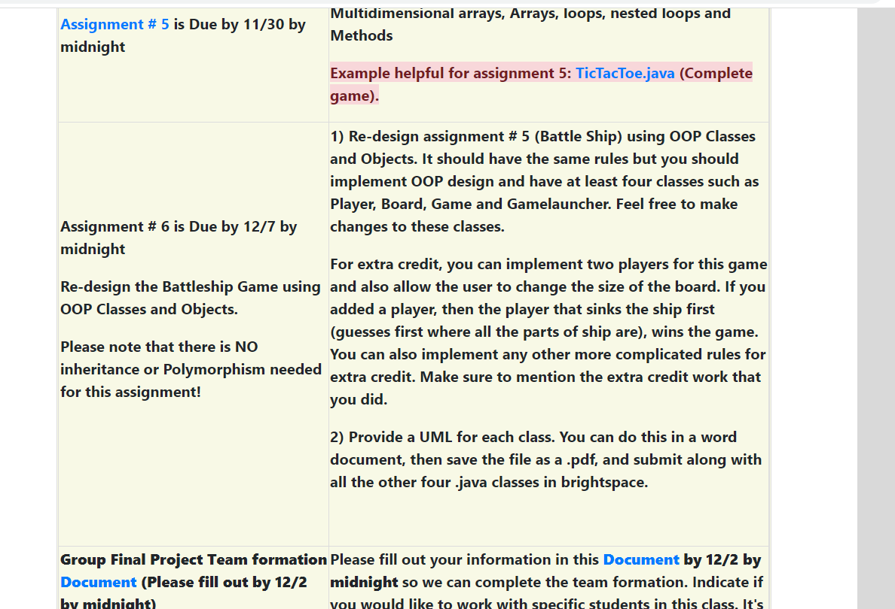

# Assignment # 6 is Due by 12/7 by midnight

> 第六次作业要在12月7日午夜前交

Re-design the Battleship Game using OOP Classes and Objects.

> 使用OOP类和对象重新设计战舰游戏。

Please note that there is NO inheritance or Polymorphism needed for this assignment!

> 请注意，此分配不需要继承或多态性!

Re-design assignment # 5 (Battle Ship) using OOP Classes and Objects. It should have the same rules but you should implement OOP design and have at least four classes such as Player, Ship, Game and Battleship. Feel free to make changes to these classes.

> 使用 OOP 类和对象重新设计作业# 5(战舰)。它应该有相同的规则，但你应该实现 OOP 设计，并至少有 4 个类，如 Player, Ship, Game 和 Gamelauncher。请随意对这些类进行更改。

For extra credit, you can implement two players for this game and also allow the user to change the size of the board. If you added a player, then the player that sinks the ship first (guesses first where all the parts of ship are), wins the game. You can also implement any other more complicated rules for extra credit. Make sure to mention the extra credit work that you did.

> 为了获得额外学分，你可以在游戏中设置两名玩家，并允许用户改变棋盘的大小。如果你添加了一个玩家，那么最先击沉船的玩家(先猜测船的所有部分在哪里)就赢得了游戏。你也可以执行其他更复杂的规则来获得额外学分。一定要提到你做的额外学分作业。

2) Provide a UML for each class. You can do this in a word document, then save the file as a .pdf, and submit along with all the other four .java classes in brightspace.

> 为每个类提供一个UML。您可以在word文档中完成此操作，然后将该文件保存为.pdf格式，并与brightspace中的其他四个.java类一起提交。

欢迎关注我公众号：AI悦创，有更多更好玩的等你发现！

::: details 公众号：AI悦创【二维码】

:::

::: info AI悦创·编程一对一

AI悦创·推出辅导班啦，包括「Python 语言辅导班、C++ 辅导班、java 辅导班、算法/数据结构辅导班、少儿编程、pygame 游戏开发」，全部都是一对一教学：一对一辅导 + 一对一答疑 + 布置作业 + 项目实践等。当然，还有线下线上摄影课程、Photoshop、Premiere 一对一教学、QQ、微信在线，随时响应！微信：Jiabcdefh

C++ 信息奥赛题解，长期更新！长期招收一对一中小学信息奥赛集训，莆田、厦门地区有机会线下上门，其他地区线上。微信：Jiabcdefh

方法一：[QQ](http://wpa.qq.com/msgrd?v=3&uin=1432803776&site=qq&menu=yes)

方法二：微信：Jiabcdefh

:::

