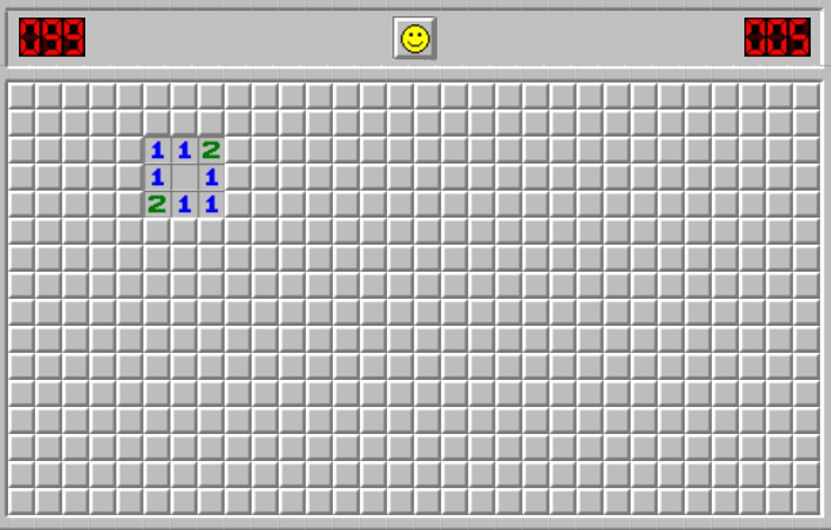
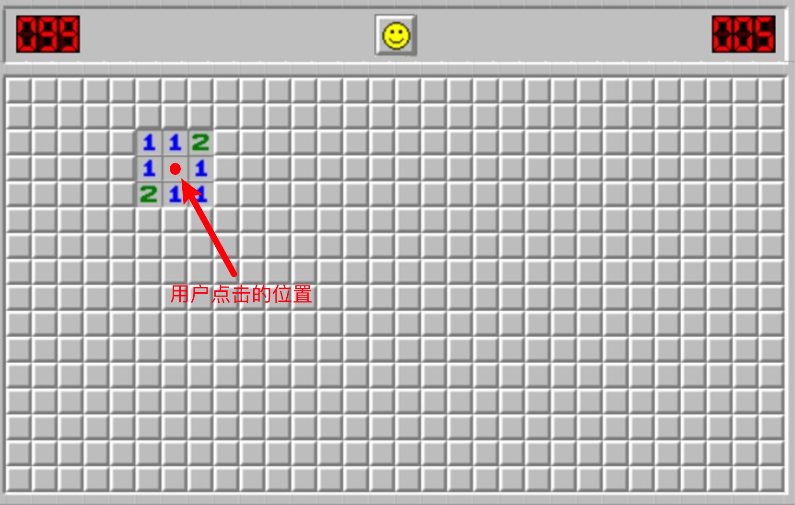
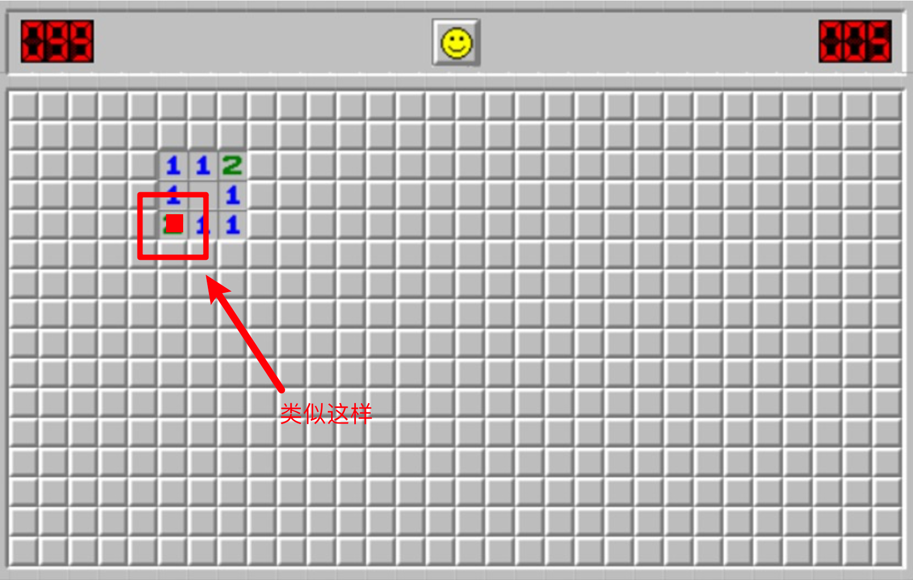

## 注意点

- [FinalProject.pdf](/1v1/06-KAI/15-group-hw/FinalProject.pdf)

<PDF url="/1v1/06-KAI/15-group-hw/FinalProject.pdf" />


## 扫雷

1. 设定一个扫雷的棋盘，类似战舰需求；
    1. 棋盘格大小：max：10x10
    2. 可以支持用户自定义；
    3. 扫雷，未扫雷的部分用星号表示
2. 随机生成雷的坐标；
    1. 用户设置的棋盘大的话，雷多一些；
    2. 用户设置的棋盘小，雷少一些；
3. 玩家输入坐标来操作游戏；
4. 输赢判断：一个玩家或两个玩家，轮流扫雷，看谁活到最后。「不排除平局情况」
5. 分数板：比分显示
6. OOP 开发

图标：

- 未扫到就是数字
- 扫到炸弹就是 x

## Design and implement an OOP video graphic game using Processing!

> 设计和实现一个面向对象的视频图形游戏使用Processing!

## Important deadlines

Only one submission from one team is needed- team leader should submit the files needed by the due date!

> 每队只需要提交一份文件，由领队提交截止日期需要!

Please note that all deadlines are strict and there will be no extensions!

请注意，所有的截止日期都是严格的，不会延期!

Make sure to upload a .zip folder with all the required items for the complete game by each deadline (by midnight) on Bright space! 

> 确保上传一个 `.zip` 文件夹，其中包含完整游戏所需的所有项目每个截止日期(午夜)在光明空间!

- Project proposal due via Bright Space: 12/7th, by midnight (No extensions)!

> 项目提案通过Bright Space提交:12月7日午夜前(不得延期)!

- Weekly report due by 12/12 by midnight (a pdf file with all the finished code of the game. Make sure to have the design done, two classes and a simple play working of your game).

> 每周报告应在12月12日午夜之前提交(pdf文件，其中包含所有完成的代码游戏。确保设计完成，两个类和一个简单的游戏工作你的游戏)。

Project Final Submission due via Bright Space on 12/17th, by midnight: Make sure to zip all the files (The complete game with all files needed for this assignment. Include the UML for all classes as a .pdf, responsibilities for each team members (.pdf), and include also any extra credit such as added classes above 3 class (3 classes is the minimum required classes for the project), if you included sound files or if you created your own images and so on. Make sure that all images and sound files are small files, otherwise it will slow the game. The zip folder should be submitted to bright space by the due date.

> 项目最终提交必须在12月17日午夜前通过Bright Space:确保压缩所有文件(完整的游戏和本次作业所需的所有文件)。包括所有类的UML为.pdf，每个团队成员的职责(.pdf)，并包括任何额外的学分，如添加类超过3类(3类是项目的最低要求类)，如果你包括声音文件或如果你创建自己的图像等等。确保所有图像和声音文件都是小文件，否则会减慢游戏速度。zip文件夹应在截止日期前提交给明亮空间。

## Code of Conduct

> 行为准则

All assignments are graded, meaning we expect you to adhere to the academic integrity standards of NYU. To avoid any confusion regarding this, we will briefly state what is and isn’t allowed when working on an assignment.

> 所有的作业都是评分的，这意味着我们希望你坚持学术诚信 NYU 的标准。为了避免混淆，我们将简要说明什么是，什么不是
> 在完成任务时允许。

Any document and program code that you submit must be fully written by yourself. You can, of course, discuss your work with fellow students, as long as these discussions are restricted to general solution techniques. Put differently, these discussions should not be about concrete code you are writing, nor about specific results you wish to submit. When discussing an assignment with others, this should never lead to you possessing the complete or partial solution of others, regardless of whether the solution is in paper or digital form, and independent of who made the solution. That means, you are also not allowed to possess solutions by someone from a different year or course, by someone from another university, or code from the Internet, etc. This also implies that there is never a valid reason to share your code with fellow students, and that there is no valid reason to publish your code online in any form. Every student is responsible for the work they submit. If there is any doubt during the grading about whether a student created the assignment themselves (e.g. if the solution matches that of others), we reserve the option to let the student explain why this is the case. In case doubts remain, or we decide to directly escalate the issue, the suspected violations will be reported to the academic administration according to the policies of NYU (see https://cs.nyu.edu/home/undergrad/policy.html).

> 您提交的任何文件和程序代码必须完全由您自己编写。你可以当然，与同学讨论你的工作，只要这些讨论仅限于通解技术。换句话说，这些讨论不应该是关于具体代码的你在写作，也不是关于你希望提交的具体结果。讨论任务时对于其他人，这绝不能导致你拥有其他人的全部或部分解决方案，不管解决方案是纸质的还是数字的，也不管谁制作的解决方案。这意味着，你也不允许拥有来自不同领域的人的解年份或课程，来自其他大学的人，或来自互联网的代码，等等。这也暗示永远没有一个有效的理由与同学共享您的代码，并且存在没有理由以任何形式在网上发布你的代码。
> 每个学生都要对他们提交的作业负责。如果在评分过程中有任何疑问
> 关于学生是否自己做了作业(例如，解决方案是否与之匹配
> )，我们保留让学生解释为什么会这样的选择。以防怀疑
> 留下，或者我们决定直接升级问题，可疑的违规行为将被报告给
> 根据纽约大学的政策进行学术管理(见
> https://cs.nyu.edu/home/undergrad/policy.html)。

## Project Objectives

> 项目目标

The final project should be a synthesis of what you have learned over the course of the semester using OOP and Processing to produce a game. You should display a solid grasp on the programming constructs we have covered, and build something that you are excited about. This is probably the first time in the course that you can do whatever you would like to do, instead of doing what you were told to do. This project will give you practice in working with OOP design and implantation, designing Graphical User Interfaces (GUI), and many other concepts we learned this semester. Additionally, it is a good exercise in decomposing larger problems into smaller and more manageable parts.

> 期末作业应该是你这学期所学内容的综合使用 OOP 和 Processing 来制作游戏。你应该表现出扎实的把握我们已经介绍过的编程结构，并构建您感兴趣的东西。这可能是这门课上第一次你可以做任何你想做的事，而不是我让你做什么就做什么。这个项目将让你练习使用面向对象的设计和植入，设计图形用户界面(GUI)，以及许多其他概念这学期学的。此外，这是一个很好的练习，可以将更大的问题分解为更小更易于管理的部件。

A word of advice: choose a game that you enjoy playing yourself as you will be “engaged” to it for a few weeks. Also, it should be a game you are capable of developing yourself and would allow you to improve your programming skills whilst being implemented. The game should neither be trivial nor very difficult. A good example of a game idea is the popular Snake Game (You can make modifications): https://iq.opengenus.org/snake-game-java/ Or similar to the complete game that will be shown in class using processing. 

> 给你一个建议:选择一款你自己喜欢玩的游戏，因为你会“投入”其中几个星期。此外，它应该是一款你能够自己开发的游戏
> 允许您在实现的同时提高您的编程技能。游戏不应该不要太琐碎，也不要太难。关于游戏理念的一个典型例子便是流行的《Snake game》修改):https://iq.opengenus.org/snake-game-java/ 或者类似于将在课堂上展示的使用处理的完整游戏。

The projects should be pursued in groups of three (same group as you have now) and you should clearly mention the group members and the group name (i.e., team 1) in the project proposal. You are not allowed to switch partners after this week! If you are having problems with your group, please report these problems asap to us as this is very important to the success of your group. If you wait to last minute, then we will not be able to help you and your grade will be affected. 

> 项目应以三人一组进行(与你现在的小组相同)，你应在项目建议中清楚地提及小组成员和小组名称(即小组1)。这周之后你就不能换舞伴了!如果你的小组有问题，请尽快向我们报告，因为这对你的小组的成功非常重要。如果你等到最后一刻，我们将无法帮助你，你的成绩将会受到影响。

## Game Requirements: 

比赛要求:

- Use Processing/Java

> 使用处理/ Java

- Keyboard and/or mouse interaction (events)

> 键盘和/或鼠标交互(事件)

- Object-oriented programming to create appropriate Classes/objects for the game (minimum of 3 classes which includes the main class (file) with setup() and draw()). Use as many features of OOP such as inheritance (One class inheritance from a super class) and composition (object contains another object). 

> 面向对象编程为对象创建适当的类/对象游戏(至少3个类，包括主类(文件)和setup()画())。使用尽可能多的OOP特性，例如继承(一个类从超类继承)和组合(对象包含另一个对象)。

- A score/result indicating the performance of the player or a win/lose indication

> 表示玩家表现或输赢的分数/结果

- A complete level or a set of challenges that the player can play

> 玩家可以体验的完整关卡或一系列挑战

- Use images

> 使用图片

- Sound (optional, extra credit)

> 声音(可选，额外学分)

## The project consists of the following (there should be ONLY one submission per group by the team leader):

项目由以下内容组成(每组只能提交一次团队领导):

1) Project Proposal due on Saturday 12/7th by 11:55pm via Bright Space (You will get feedback/comments by the 8th from the graders via Bright Space):

> 项目提案应于12月7日星期六晚上11:55通过Bright Space提交(您将通过Bright Space获得第八届评分员的反馈/评论):

- A project proposal of a game of your choice in written form (as a pdf and a max of 2 pages). 

> 你选择的一款游戏的书面项目提案(pdf格式，最多2页)。

- Provide a name for your game and indicate the names and emails of all of your team members.

> 为你的游戏提供一个名称，并注明所有你的名字和电子邮件团队成员。

- The proposal should provide a brief description (one or two sentences) of your idea (Game). Include a list of features you plan to integrate into the game. This is to provide an idea of the game (It doesn’t have to be very detailed or perfect). The list of features and strategy of the game (win, or lose) and you should also include responsibilities of each group member and the deadlines as well for each task.

> 提案应该提供一个简短的描述(一到两句话)想法(游戏)。包括你计划整合到游戏中的功能列表。这是为了提供游戏理念(游戏邦注:不需要非常详细完美的)。列出游戏的功能和策略(输赢)，你应该这么做也包括每个小组成员的职责和截止日期每个任务。

- To support your idea, you can include a mock design/screenshot/drawing of your proposed game.

> 为了支持你的想法，你可以包含一个模拟设计/截图/绘图你提议的游戏。

- You should also provide a UML diagram for each class you plan to integrate in the game. You can make changes to classes later on. The UML for all classes can be included in this proposal or in a separate pdf (outside of the two-page proposal required from above).

> 您还应该为计划集成到的每个类提供一个UML图游戏。您可以稍后对类进行更改。所有类的UML可以是包含在本提案中或单独的PDF中(在两页提案之外)以上要求)。

- You should be planning on meeting at least 4 times per week for a few hours. Make sure that you are integrating the game with each change (daily). Make copies of the game as mistakes happen. 

> 你们应该计划每周至少见面4次，每次几个小时。使确保你将游戏与每一个改变(每天)整合在一起。复印当错误发生时，比赛就开始了。

- The project proposal must be submitted via Bright Space (see due date below). You will receive feedback on your proposal by the evening of the next day.

> 项目建议书必须通过Bright Space提交(截止日期如下)。你会在第二天晚上收到关于你提案的反馈。

2) Team weekly report due on Saturday 12/12th by 11:55pm via Bright Space:

> 2)团队周报应于周六12/12日晚上11:55通过Bright Space提交:

- The design of the game, strategy and at least two classes should be done. You should have 70% of the functionality of the game done and also you should have a working game (simple play mode of the game). Zip all the files and submit via Bright space along with the .pdf report from below.

> 游戏设计，策略和至少两个职业应该完成。你你是否应该完成70%的游戏功能工作游戏(游戏的简单游戏模式)。压缩所有文件，并提交通过明亮的空间以及下面的。pdf报告。

- Weekly report as a .PDF: The weekly report (a .pdf) should Include previous information provided in the project proposal again such as the names and emails of all of your team members, the name of the project, brief description of the game and strategies (win and lose), scores, previous responsibilities and future responsibility/contribution of each member, the UML of all of your classes.

> 周报(.PDF格式):周报(.PDF格式)应包括以前的项目建议书中再次提供的信息，如姓名和电子邮件你的所有团队成员，项目名称，游戏简要描述还有策略(输赢)、分数、以前的责任和未来每个成员的责任/贡献，所有类的UML。

- You should be planning on meeting at least 4 times per week for a few hours. Make sure that you are integrating the game with each change (daily). Make copies of the game as mistakes happen. 

> 你们应该计划每周至少见面4次，每次几个小时。使确保你将游戏与每一个改变(每天)整合在一起。复印当错误发生时，比赛就开始了。

- The project proposal must be submitted via Bright Space (see due date below). You will receive feedback on your proposal by the evening of the next day.

> 项目建议书必须通过Bright Space提交(截止日期如下)。你会在第二天晚上收到关于你提案的反馈。

3) Project Final Submission due via BrightSpace (one submission by the team leader) on December 17, by midnight):

> 3)通过BrightSpace提交项目最终报告(团队提交一份)领导人)12月17日午夜):

- Game Requirements: 

> 比赛要求:

- Use Processing/Java

> 使用处理/ Java

- Keyboard and/or mouse interaction (events)

> 键盘和/或鼠标交互(事件)

- Object-oriented programming to create appropriate Classes/objects for the game (minimum of 3 classes)

> 面向对象编程为对象创建适当的类/对象游戏(最少3个班级)

- A score/result indicating the performance of the player or a win/lose indication

> 表示玩家表现或输赢的分数/结果

- A complete level or a set of challenges that the player can play

> 玩家可以体验的完整关卡或一系列挑战

- Please note that there will be no extension!

> 请注意，没有延期!

## Submission

The submission should include your presentation and all files required to run your project and/or reproduce your results. The code itself should also be clearly documented. In addition, a sample screenshot should be submitted that adequately represents what the project is about. Also, one submission on Bright Space per group is sufficient (By the team leader).

> 提交应包括您的演示文稿和运行您的项目和/或所需的所有文件重现你的结果。代码本身也应该被清晰地记录下来。另外，一个样品
> 提交的截图应该充分代表项目的内容。此外,一个每组在Bright Space提交作品即可(由组长提交)。

In summary, we look at:

> 总的来说，我们看看:

- Code structure, style and documentation

> 代码结构、样式和文档

- Proper use of OOP design and implementation for classes, and objects.

> 对类和对象正确使用OOP设计和实现。

- No sudden crashes or apparent bugs

> 没有突然崩溃或明显的bug

- Overall game design and graphics

> 整体游戏设计和图像

- Complexity of the project (strategy of the game)

> 项目的复杂性(游戏策略)

- Clean design for the Game (Graphic user Interface).

清晰的游戏设计(图形用户界面)。

- Submit a final weekly report with team member reconstitutes, extra credit, UML and final description for the game and strategy used and scores.

> 提交一份包含团队成员重组、额外学分、UML和最终报告的最终周报游戏描述，使用的策略和分数。

Please submit a zip file containing all files of your assignment to Bright Space. Submissions via email are not accepted. Late submissions will NOT be accepted.

> 请将包含所有作业文件的zip文件提交给Bright Space。提交通过不接受电子邮件。迟交的资料恕不受理。

Note that your solution must work using Pressing/Java. In case your code does not work, your submission will not be graded.

> 注意，您的解决方案必须使用Pressing/Java工作。如果你的代码不工作，你的提交将不会被评分。

## Grading

Extra credit for added features!

> 附加功能的额外学分!

| Criterion                                                    | Points (Total: 15) |
| ------------------------------------------------------------ | ------------------ |
| Project proposal submission <br />项目建议书提交             | 2                  |
| Weekly reports: one due on the 12th and one is due during the final submission by the 17th. The weekly report should be a .pdf and should include responsibilities(contributions) of members, UML, along with all the completed game files.)<br />周报:一份12号交，一份在最后提交的时候交<br/>17。每周报告应该是。pdf格式，并且应该包括<br/>成员的责任(贡献)，UML，以及所有完成的游戏<br/>文件。) | 2                  |
| Program clarity, comments, style and elegance of solution<br />程序清晰，注释，风格和优雅的解决方案 | 1                  |
| Final Submission (complete OOP design: classes and objects, game interaction, game design, strategy and technical features, scores, level of complexity of the game, creativity and innovation)<br />最终提交(完整的面向对象设计:类和对象，游戏交互，<br/>游戏设计、策略和技术特点、分数、复杂程度<br/>游戏、创意和创新) | 10                 |

Extra Credit: There will be up to 5 extra credits for added features such as providing multiple levels, providing more than 3 classes, adding sound, and so on. Make sure to include all of the extra credit features in the final weekly report when.

> 额外学分:增加的功能，如提供多个额外学分，最多可获得5个额外学分关卡，提供3个以上的职业，添加声音等等。确保包括所有的
> 额外的学分出现在最后的周报中。


::: details 代码

## Code

```java
/**
 * @ClassName: SetUpMine
 * @Description: TODO
 * @Author: AndersonHJB
 * @date: 2022/12/10 23:22
 * @Version: V1.0
 * @Blog: https://bornforthis.cn
 * <p>
 * 命令行扫雷游戏（简易版排行榜）
 * 作者：AndersonHJB
 * <p>
 * 命令行扫雷游戏（简易版排行榜）
 * 作者：AndersonHJB
 */

import java.util.Scanner;

public class Main {
    public static void main(String[] args) {
        //排行榜记录排名
        final int[] firstGoal = {0};
        final int[] secondGoal = {0};
        final int[] thirdGoal = {0};

        class SetUpMine {
            int mineNum = 15;//雷的数量
            int length = 9;//地图的大小
            String[][] user = new String[length + 2][length + 2];//玩家看到的界面
            int[][] mine = new int[length + 2][length + 2];//存储雷的位置
            int mineCount = 0;//初始化地图时统计雷的数量
            boolean b = false;//是否结束初始化地图

            public void SetUp() {
                //标记序号
                for (int i = 0; i <= length; i++) {
                    //将序号数字1转换为1加上空格组成的字符串
                    user[i][0] = Integer.toString(i) + ' ';
                    user[0][i] = Integer.toString(i) + ' ';
                    mine[i][0] = i;
                    mine[0][i] = i;
                }
                //埋雷
                for (int i = 1; i <= length && !b; i++) {
                    for (int j = 1; j <= length; j++) {
                        mine[i][j] = Math.random() > 0.5 ? -1 : 0;
                        if (mine[i][j] == -1)
                            mineCount++;
                        if (b = mineCount == mineNum)
                            break;
                    }
                }
                //用户看到的雷被隐藏的界面
                for (int i = 1; i <= length; i++) {
                    for (int j = 1; j <= length; j++) {
                        user[i][j] = "* ";
                    }
                }

                /*标记九宫格内每个非雷的格子周围雷的数量
                 *   i为行数；
                 *   j为列数；
                 */
                for (int i = 1; i <= length; i++) {
                    for (int j = 1; j <= length; j++) {
                        if (mine[i][j] != -1) {
                            if (mine[i - 1][j - 1] == -1)
                                mine[i][j]++;
                            if (mine[i - 1][j] == -1)
                                mine[i][j]++;
                            if (mine[i - 1][j + 1] == -1)
                                mine[i][j]++;
                            if (mine[i][j - 1] == -1)
                                mine[i][j]++;
                            if (mine[i][j + 1] == -1)
                                mine[i][j]++;
                            if (mine[i + 1][j - 1] == -1)
                                mine[i][j]++;
                            if (mine[i + 1][j] == -1)
                                mine[i][j]++;
                            if (mine[i + 1][j + 1] == -1)
                                mine[i][j]++;
                        }
                    }
                }
            }
        }


        //用户开始界面
        System.out.println("************命令行扫雷游戏************");
        System.out.println("*************1.开始游戏***************");
        System.out.println("*************2.排行榜***************");
        System.out.println("*************3.退出游戏***************");
        System.out.println("请输入您选择的序号，以回车键结束：");
        Scanner kb = new Scanner(System.in);
        final int[] beginNum = {kb.nextInt()};


        class paly1 {
            public void play1start() {
                SetUpMine set = new SetUpMine();//创建成员内部类SetUpMine（埋雷）的对象
                set.SetUp();//埋雷

                //显示用户所看到的地图
                UserLook((SetUpMine) set);

                int x = 0;//用户选择的纵坐标
                int y = 0;//用户选择的横坐标
                int userGoal = -1;//用户分数
                while (set.mine[x][y] != -1) {
                    userGoal++;//每次循环用户分数加1
                    System.out.println("请输入您要选择的位置坐标，以空格分隔，第一个为纵坐标，第二个为横坐标，以回车键确认：");
                    x = kb.nextInt();
                    y = kb.nextInt();
                    set.user[x][y] = Integer.toString(set.mine[x][y]) + ' ';
                    UserLook((SetUpMine) set);
                }
                if (set.mine[x][y] == -1) {
                    System.out.println("你输了！！！");
                    System.out.println("您的总分为：" + userGoal);
                    thirdGoal[0] = userGoal;
                    beginNum[0] = 2;
                }
                if (userGoal == set.length * set.length - set.mineNum) {
                    System.out.println("你赢了");
                }
            }


            /**
             * 用户看到界面的隐藏符号*号和用户选择的坐标符号的替换
             * @param set
             * 省去部分重复操作
             *
             * for (int i = 0; i <= set.length; i++) {
             *     for (int j = 0; j <= set.length; j++) {
             *
             *        }
             * }
             *
             */
            public void UserLook(SetUpMine set) {
                for (int i = 0; i <= set.length; i++) {
                    for (int j = 0; j <= set.length; j++) {
                        System.out.print(set.user[i][j]);
                        if (j == set.length)
                            System.out.println();
                    }
                }
            }
        }


        class GoalList {
            public void playGoalList() {

                int temp;//临时交换变量
                if (firstGoal[0] < secondGoal[0]) {
                    temp = firstGoal[0];
                    firstGoal[0] = secondGoal[0];
                    secondGoal[0] = temp;
                }
                if (firstGoal[0] < thirdGoal[0]) {
                    temp = firstGoal[0];
                    firstGoal[0] = thirdGoal[0];
                    thirdGoal[0] = temp;
                }
                if (secondGoal[0] < thirdGoal[0]) {
                    temp = secondGoal[0];
                    secondGoal[0] = thirdGoal[0];
                    thirdGoal[0] = temp;
                }
                System.out.println("最高分：" + firstGoal[0]);
                System.out.println("第二名：" + secondGoal[0]);
                System.out.println("第三名：" + thirdGoal[0]);
            }
        }


        //选择1开始游戏
        while (beginNum[0] == 1) {
            paly1 start = new paly1();
            start.play1start();
            GoalList list = new GoalList();
            list.playGoalList();
            System.out.println("按1继续游戏");
            beginNum[0] = kb.nextInt();

        }

        //选择2排行榜
        if (beginNum[0] == 2) {
            GoalList list = new GoalList();
            list.playGoalList();
            System.out.println("输入1开始游戏");
            beginNum[0] = kb.nextInt();
            if (beginNum[0] == 1) {
                paly1 start = new paly1();
                start.play1start();
            }

        }

        //选择3退出游戏
        if (beginNum[0] == 3) {
            System.out.println("您已经退出游戏！！！");
        }

        if (beginNum[0] == 2) {
            GoalList list = new GoalList();
            list.playGoalList();
        }
    }
}
```

:::

---

## 重构

在别人的代码基础上改

## 改成什么样子

和扫雷的规则比较接近



以这个棋盘格为例，我点击的格子是画红的区域，画红区域周围的数字代表周围的格子有几个炸弹。





比如 左右下角的 2 代表：在这个格子周围 3x3 的区域内有两个炸弹（这个数字是 2 的方格为 3x3 的区域的的中心）。同样 右下角的1代表以这个1为中心它周围 3x3 的方格里有1个炸弹。

## 用户交互模式

用户输入坐标，来进行交互，实现这个逻辑 or 功能。

- 用户输入坐标，扫到雷 `X` 游戏结束。
- 没有扫到雷，显示 3x3 周围的数字。

## 特殊事项

我们只显示以所选的格子为中心 周边 3x3 的格子里的数字， 就像是上图选了标红点的方块后只显示它

- 上面112那三个格和红点左右的11 和红点下面的211。

如果选中的方格周围 3x3 里有个别的格子周围 3x3 里没有地雷的画那么点开这个格子后 数字应该为 0，如果这个格子周围 3x3 有 1 个炸弹的话那么点开这个格子后 所显示的数字应该是1。

反之亦然。

## 要做的是

在他们的那个代码逻辑上 尽量不要大改棋盘。实现这个效果

<VidStack src="/1v1/06-KAI/15-group-hw/demo.mp4" />

欢迎关注我公众号：AI悦创，有更多更好玩的等你发现！


::: details 公众号：AI悦创【二维码】


:::

::: info AI悦创·编程一对一

AI悦创·推出辅导班啦，包括「Python 语言辅导班、C++ 辅导班、java 辅导班、算法/数据结构辅导班、少儿编程、pygame 游戏开发」，全部都是一对一教学：一对一辅导 + 一对一答疑 + 布置作业 + 项目实践等。当然，还有线下线上摄影课程、Photoshop、Premiere 一对一教学、QQ、微信在线，随时响应！微信：Jiabcdefh

C++ 信息奥赛题解，长期更新！长期招收一对一中小学信息奥赛集训，莆田、厦门地区有机会线下上门，其他地区线上。微信：Jiabcdefh

方法一：[QQ](http://wpa.qq.com/msgrd?v=3&uin=1432803776&site=qq&menu=yes)

方法二：微信：Jiabcdefh

:::

