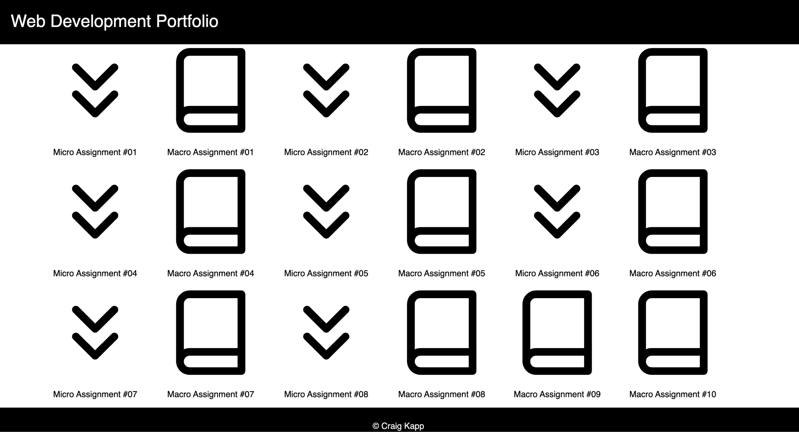
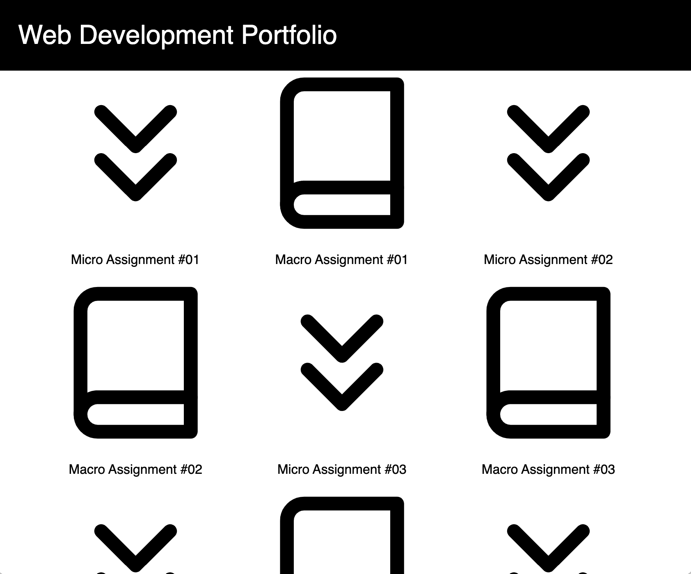
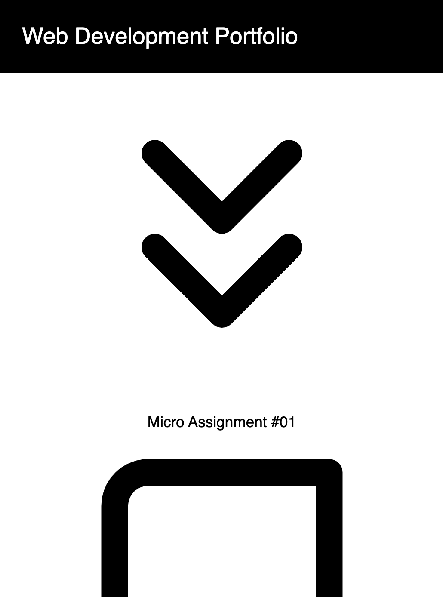
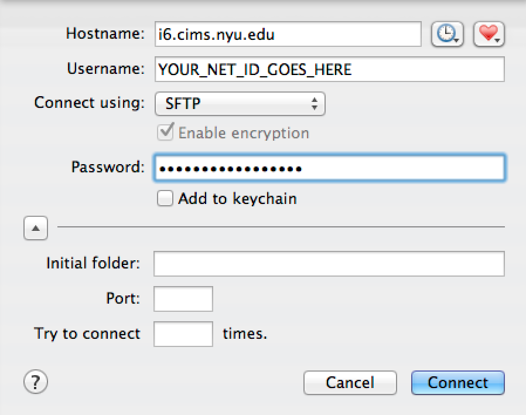
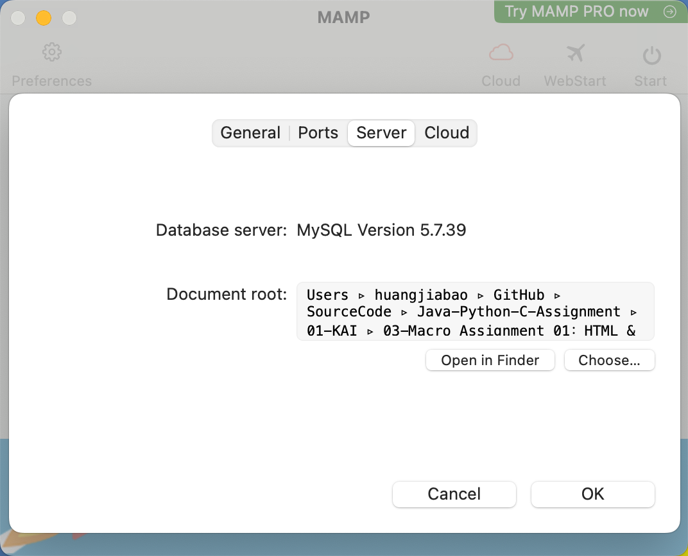

# Macro Assignment 01: HTML & CSS Hello, World

- [https://cs.nyu.edu/courses/spring23/CSCI-UA.0061-001/assignment01.php](https://cs.nyu.edu/courses/spring23/CSCI-UA.0061-001/assignment01.php)

For your first assignment you will be spending some time setting up a website that will be used to document your work and serve as your digital portfolio in this class. This page will require you to use your HTML & CSS skills to create a static page that is functional as well as visually appealing. Here’s how to get started!

> 对于你的第一个作业，你将花一些时间建立一个网站，用于记录你的工作，并作为你在这门课上的数字作品集。这个页面将要求您使用 HTML 和 CSS 技能来创建一个静态页面，它是功能性的以及视觉上的吸引力。这里是如何开始的!

## Step 1: Installing a Local Web Server

> 步骤1:安装本地 Web 服务器

This semester we will be working with a number of dynamic web technologies, including JavaScript and PHP. As you may recall from a previous web development class, most of these dynamic techniques are only accessible when they are run on a page being served through a web server (i.e. a page will work fine if you publish it to the i6 server, but if you just double click on the file on your local computer and open it in a browser it appears "broken")

> 本学期我们将学习一些动态网页技术，包括 JavaScript 和 PHP。你可能还记得在之前的网页开发课程中，大多数动态技术只有在通过 web 服务器提供服务的页面上运行时才能访问(例如，如果你将页面发布到i6服务器上，那么页面将正常工作，但如果你在本地计算机上双击文件并在浏览器中打开它，它将显示“坏了”)

In order to get around this issue you will be installing a "development environment" on your own computer that will emulate a local web server. This technique will give you full access to all of JavaScript's capabilities, even those that require your page to be published to a server. It will also give you full access to a host of back-end scripting environments (Python, PHP, etc) right from your computer.

> 为了解决这个问题，你将在你自己的计算机上安装一个“开发环境”来模拟本地web服务器。这种技术可以让您完全访问JavaScript的所有功能，甚至包括那些需要将页面发布到服务器上的功能。它还可以让您从计算机上完全访问大量的后端脚本环境(Python, PHP等)。

Here's how to get started:

> 下面是如何开始的:

- First, open up your computer's file explorer and navigate to your Documents folder (Mac) or My Documents folder (PC)

> 首先，打开电脑的文件资源管理器，找到“文档”文件夹(Mac)或“我的文档”文件夹(PC)

- In this folder create a new folder called 'MAMP'. Inside of the 'MAMP' folder create another folder named 'webdev'.

> 在这个文件夹中创建一个名为“MAMP”的新文件夹。在'MAMP'文件夹中创建另一个名为'webdev'的文件夹。

- Next, visit the MAMP download page at [https://www.mamp.info/en/](https://www.mamp.info/en/) - click the Free Download button

> 接下来，访问 MAMP 下载页面[https://www.mamp.info/en/](https://www.mamp.info/en/) -点击免费下载按钮

- Select your operating system and download the MAMP & MAMP Pro package. Note that this will download a "free" and a "paid" version of the software. **We will only be using the free version in this class**.

> 选择您的操作系统并下载MAMP & MAMP Pro包。请注意，这将下载软件的“免费”和“付费”版本。我们在这门课上只使用免费版本。

- Install MAMP once your download completes

> 下载完成后立即安装MAMP

- Next, launch MAMP (looks like a small circle with an elephant in the center). Note that you want to launch MAMP (the free version), not MAMP Pro. On a Mac the free version is stored in your Applications folder and inside a sub-folder named MAMP. When you do this a control console will appear, and a browser window may pop up.

> 接下来，启动MAMP(看起来像一个小圆圈，中间有一头大象)。注意，您要启动的是MAMP(免费版)，而不是MAMP Pro。在Mac上，免费版本存储在应用程序文件夹和名为MAMP的子文件夹中。当你这样做的时候，一个控制台将会出现，一个浏览器窗口可能会弹出。

- Click on the Preferences button (looks like a gear). Then navigate over to "Server". Find the area labeled "Document Root" and click the "choose"button.

> 点击Preferences按钮(看起来像一个齿轮)。然后导航到“服务器”。找到标记为“文档根”的区域，并单击“选择”按钮。

- Navigate to where you want to store all of your files. Find the 'MAMP' folder you created at the beginning of this process and set it as your document root.

> 导航到要存储所有文件的位置。找到在此过程开始时创建的“MAMP”文件夹，并将其设置为文档根目录。

- Click on the Ports menu and make sure that MAMP is running on port 8888. If for some reason MAMP fails to run you can come back here and change the port number to something else. Any number above 8888 should work unless another program on your computer is using that port (you may need to experiment a little to find a usable port) -- but on most computers port 8888 works just fine.

> 单击Ports菜单并确保MAMP在端口8888上运行。如果由于某种原因MAMP无法运行，您可以返回这里并将端口号更改为其他端口号。任何高于8888的数字都可以工作，除非计算机上的另一个程序正在使用该端口(您可能需要进行一些实验以找到可用的端口)，但在大多数计算机上，端口8888工作正常。

- On PCs running Windows 10 - select the PHP menu and select PHP version 7.x (any version 7 PHP that is available.) There seems to be an issue with the latest version of PHP, but this slightly older version works.

> 在运行Windows 10的pc上-选择PHP菜单并选择PHP版本7。x(任何可用的7版PHP。)最新版本的PHP似乎有一个问题，但这个稍旧的版本可以工作。

- Finally click the "Start Servers" button to have MAMP begin listening for traffic on your desired port.

> 最后单击“Start Servers”按钮，让MAMP开始监听所需端口上的流量。

- Now you can place files into this folder on your hard drive as you would with any other file. These files will be accessible to you via your own personal web server at the following URL: [http://localhost:8888](http://localhost:8888/) as long as your MAMP server is running on your computer. Note that you may need to change the '8888' value in the URL if you changed the port # when setting up MAMP.

> 现在，您可以将文件放置到硬盘驱动器上的这个文件夹中，就像放置任何其他文件一样。只要您的计算机上运行着MAMP服务器，您就可以通过您自己的个人web服务器访问这些文件，地址如下:http://localhost:8888。注意，如果您在设置MAMP时更改了端口#，则可能需要更改URL中的'8888'值。

- Important note: if you are using a backup program on your computer such as iCloud or OneDrive you may have issues with MAMP during the second half of the semester as these programs can block MAMP's Apache server from accessing the files in your MAMP folder. One solution to this is to move your MAMP folder to a spot on your computer's hard drive that is not being actively backed up by iCloud or OneDrive.

::: info 重要提示

重要提示:如果你在你的电脑上使用备份程序，如 iCloud 或 OneDrive，你可能会在下半学期遇到 MAMP 的问题，因为这些程序会阻止 MAMP 的 Apache 服务器访问你的MAMP文件夹中的文件。一个解决方案是将你的 MAMP 文件夹移动到你电脑硬盘上没有被 iCloud 或 OneDrive 主动备份的位置。

:::

## Step 2: Installing an IDE

> 步骤2:安装IDE

You can use any plain-text editor to write code for this class. I'll be using [Visual Studio Code](https://code.visualstudio.com/), [Brackets](http://brackets.io/), [Sublime](https://www.sublimetext.com/) and [Nova](https://nova.app/) throughout the semester, but you can use any tool that works for you.

> 您可以使用任何纯文本编辑器为该类编写代码。整个学期我将使用Visual Studio Code，括号，Sublime和Nova，但你可以使用任何适合你的工具。

## Step 3: Set up your landing page

> 步骤3:设置登录页面

Now we need to make a "landing page" that will let serve as the first page for your digital portfolio. Create a new file named 'index.html' inside of your 'MAMP/webdev' folder. You can use the following a a bare-bones template to get you started:

> 现在我们需要做一个“登陆页”，作为你的数字投资组合的第一页。在'MAMP/webdev'文件夹中创建一个名为'index.html'的新文件。你可以使用下面的模板来开始:

```html
<!doctype html>
<html lang="en-us">
	<head>
		<meta charset="utf-8">
		<title>Web Development Portfolio</title>
	</head>
	<body>
		<h1>Web Development Portfolio</h1>
	</body>
</html>
```

Your MAMP home directory should now look like the following:

> 您的MAMP主目录现在看起来应该如下所示:

```html
MAMP
  webdev
    index.html
```

You should verify that you can access this file using your local webserver (http://localhost:8888) - you should be able to visit your 'portfolio' folder and see your newly created page.

> 您应该验证您可以使用本地web服务器(http://localhost:8888)访问该文件-您应该能够访问您的“portfolio”文件夹并看到您新创建的页面。

## Step 4: Enhance your landing page

> 第四步:增强你的登陆页面

Next, update your landing page to include the following features:

> 接下来，更新你的登录页以包括以下功能:

- A long, horizontal header that display's the title 'Web Development Portfolio' along the top of the page.

> 一个长而水平的标题，在页面顶部显示“Web开发组合”的标题。

- A long, horizontal footer that displays "© YOUR NAME" along the bottom of the page.

> 长而水平的页脚，在页面底部显示“©YOUR NAME”。

- A series of icons / text units that represent each class assignment. There will be 18 icons in total (10 "macro" assignments and 8 "micro" assignments). You can use any artwork you'd like for these icons, including assets that you find online. Please ensure that you have the right to use any artwork that you do end up using, and give the appropriate credit to the creator in your source code. These icons should behave as follows:

> 代表每个课程作业的一系列图标/文本单元。总共有18个图标(10个“宏”分配和8个“微”分配)。你可以为这些图标使用任何你想要的艺术品，包括你在网上找到的资产。请确保您有权使用您最终使用的任何艺术品，并在源代码中给予创作者适当的信任。这些图标应该如下所示:

- Each icon should react to the mouse hovering over them.

> 每个图标都应该在鼠标悬停时做出反应。

- When the page has enough horizontal room (>= 961px) the icons should be spaced into three rows of six icons each.

> 当页面有足够的水平空间时(&gt;= 961px)，图标应该间隔成三行，每行六个图标。

- When the page has less room (>= 481px and <= 960px) the icons should be spaced into six rows of three icons each.

> 当页面空间较小时(&gt;= 481px and &lt;= 960px)，图标应该间隔成六行，每行三个图标。

- When the page has even less room (<= 480px) the icons should be spaced into eighteen rows of one icon each.

> 当页面空间更小时(&lt;= 480px)，图标应该间隔成18行，每一行一个图标。

Hint: use media queries and the a layout technique such as `flex`, `grid` or `float` to do this. See the course wrap-up for Day 2 and Day 3 for some code samples. You are also welcome to use a CSS framework such as Bootstrap if you wish.

> 提示:使用媒体查询和一个布局技术，如flex, grid或float来做到这一点。有关一些代码示例，请参阅第2天和第3天的课程总结。如果您愿意，也欢迎使用CSS框架，如Bootstrap。

Here are a few visuals that show how your page could potentially look. Note that you are welcome to take as many liberties as you wish in terms of layout, images, color choices, fonts, etc. as long as you stick to the basic structure laid out above.

> 这里有一些视觉效果，展示了您的页面可能的外观。请注意，只要你坚持上面列出的基本结构，你就可以在布局、图像、颜色选择、字体等方面随心所欲。

## Large layout

> 大的布局



## Medium layout

> 媒介布局



## Small layout

> 小的布局



Note: You will need to resize your browser in order to test all possible layouts. You may also need to zoom in and zoom out using the View -> Zoom In / View -> Zoom Out commands, especially to see the smallest layout.

> 注意:为了测试所有可能的布局，您需要调整浏览器的大小。你可能还需要使用View -&gt;放大/查看-&gt;缩小命令，特别是查看最小的布局。

Note: If you plan on using the browser's built-in "device toolbar" to simulate different screen sizes you will need to make sure you include the following meta tag in the head of your document:

> 注意:如果你打算使用浏览器内置的“设备工具栏”来模拟不同的屏幕大小，你需要确保在你的文档头部包含以下元标签:

```html
<meta name="viewport" content="initial-scale=1">
```

This is good practice in general when developing a site that will be rendered on a device that will attempt to scale (zoom) your page, such as a phone or table.

> 在开发一个将在试图缩放(缩放)页面的设备(如电话或桌子)上呈现的网站时，这通常是一个很好的实践。

## Step 5: Publishing your site

> 步骤5:发布你的网站

As part of this class you have been given access to a web server here at Courant to host your site. In order to use this server you will need to obtain a username and password before you can proceed. Here's a quick overview of this process:

> 作为这门课的一部分，你已经被允许访问Courant的一个网络服务器来托管你的网站。要使用此服务器，您需要获取用户名和密码才能继续。下面是这个过程的简要概述:

- If you already have an i6 account from a previous class (Introduction to Web Design, Database Design, Web Programming, etc) and you know your password then you are ready to go!

> 如果你已经从以前的课程(网页设计导论，数据库设计，Web编程等)有一个i6帐户，你知道你的密码，那么你已经准备好了!

- If this is your first Computer Science class that requires you to build a website then you should have been sent an e-mail with your login information from the CIMS Helpdesk.

> 如果这是你的第一个计算机科学课程，要求你建立一个网站，那么你应该已经从CIMS帮助台发送了一封带有登录信息的电子邮件。

- If you already have an i6 account from a previous class but you do not remember your password you can go ahead and reset it by visiting this site: [https://cims.nyu.edu/webapps/password/reset](https://cims.nyu.edu/webapps/password/reset)

> 如果你已经有了上一节课的i6账户，但你不记得密码，你可以通过访问这个网站:https://cims.nyu.edu/webapps/password/reset来重置它

- If you have any trouble with your password please see me ASAP - do not contact the CIMS Helpdesk! Also, if you never received an e-mail about your i6 account [please submit a password reset request](https://cims.nyu.edu/webapps/password/reset) to receive your credentials.

> 如果您的密码有任何问题，请尽快与我联系-不要联系CIMS帮助台!此外，如果您从未收到关于您的i6帐户的电子邮件，请提交密码重置请求以接收您的凭据。

Next you need to connect with the server so that you can begin to add files to your site. You can do this using a SFTP program such as [Fetch](https://www.nyu.edu/life/information-technology/computing-support/software/software/fetch.html) (Mac Only) or [WinSCP](http://winscp.net/eng/index.php) (Windows only). Whatever program you use, be sure to connect using SFTP (as opposed to FTP, which is not secure). If you are using Fetch, here is the opening screen; fill it in as follows but with your own NetID and click "Connect."

> 接下来，您需要连接到服务器，以便开始向站点添加文件。您可以使用SFTP程序，如Fetch (Mac Only)或WinSCP (Windows Only)。无论你使用什么程序，一定要使用SFTP(而不是FTP，不安全)进行连接。如果你正在使用Fetch，这里是开始的屏幕;用你自己的NetID填写，然后点击“连接”。



If you have problems logging into your i6 account, speak with me as soon as possible (and DO NOT contact the CIMS Helpdesk!)

> 如果您在登录您的i6帐户时遇到问题，请尽快与我联系(不要联系CIMS帮助台!)

Note for Fetch users on a Mac: When you download the ZIP file for Fetch it be a "trial" version -- [you can upgrade this to a full educational version by applying for a free upgrade license here](https://fetchsoftworks.com/fetch/free).

> Mac上的Fetch用户注意:当你下载Fetch的ZIP文件时，它是一个“试用”版本——你可以通过申请免费升级许可证将其升级到完整的教育版本。

Once you can log into the server you should see a folder called "public_html" -- double click on this folder to open it up. Any file that you place into this folder will be made accessible via the web server, which means that anything place in here can be viewed using a web browser. For example, if you created a file called "hello.txt" in this folder it would be accessible via your browser at the following URL:

> 登录到服务器后，您应该看到一个名为“public_html”的文件夹——双击该文件夹将其打开。你放在这个文件夹中的任何文件都可以通过网络服务器访问，这意味着这里的任何东西都可以使用网络浏览器查看。例如，如果你在这个文件夹中创建了一个名为“hello.txt”的文件，它可以通过以下URL通过浏览器访问:

```html
https://i6.cims.nyu.edu/~YOUR_NET_ID/hello.txt
```

Next you will need to 'synchronize' your development server with the i6 server. You can do this by transferring your entire 'webdev' folder to the i6 server. Then go ahead and test your work by opening up a web browser (Chrome, Firefox, etc) and visiting your site using the following URL:

> 接下来，您需要将您的开发服务器与i6服务器“同步”。您可以通过将整个“webdev”文件夹转移到i6服务器来实现这一点。然后打开浏览器(Chrome, Firefox等)，使用以下URL访问你的网站，测试你的工作:

```html
https://i6.cims.nyu.edu/~YOUR_NET_ID/webdev/index.html
```

::: info

Note: Make sure that your "webdev" folder is stored inside of your "public_html" folder on the server -- files stored outside of the "public_html" folder are not web accessible!

> 注意:请确保您的“webdev”文件夹存储在服务器上的“public_html”文件夹中——存储在“public_html”文件夹外的文件不能通过web访问!

:::

The basic process for publishing your site in the future will be as follows:

> 未来发布网站的基本流程如下:

- Build your projects on your local computer inside of your MAMP/webdev folder

> 在你的本地计算机的MAMP/webdev文件夹中构建你的项目

- Test it using your local web server ([http://localhost:8888/webdev](http://localhost:8888/webdev))

> 使用本地web服务器(http://localhost:8888/webdev)进行测试

- When you are happy with your project synchronize your files with the i6 server - the easiest way to do this is to upload your entire 'webdev' folder to the server.

> 当你对你的项目感到满意时，将你的文件同步到i6服务器——最简单的方法是将你的整个“webdev”文件夹上传到服务器。

## What to Submit

> 提交什么

When you’re finished you should submit a ZIP file of your 'webdev' folder as well as the absolute URL to your site to our NYU classes page. Here’s how to do this:

> 当你完成后，你应该将你的“webdev”文件夹的ZIP文件以及你网站的绝对URL提交到我们的纽约大学课程页面。以下是如何做到这一点:

- Visit [http://brightspace.nyu.edu](http://brightspace.nyu.edu/) and log in.

> 访问http://brightspace.nyu.edu并登录。

- Next, click on the Assignments tool

> 接下来，单击分配工具

- Click on Assignment 01

> 点击Assignment 01

Submit the absolute URL to your site. You can obtain this URL by visiting your site and copying the URL in the location bar. It will look something like this:

> 向站点提交绝对URL。您可以通过访问您的网站并在位置栏中复制该URL来获取此URL。它看起来是这样的:

```html
https://i6.cims.nyu.edu/~NETID/webdev/index.html
```

- Also submit a ZIP archive of your source code (just ZIP up your entire 'webdev' folder and submit this)

> 同时提交源代码的ZIP文件(只需将整个“webdev”文件夹压缩并提交即可)

## Grading Rubric (10 points)

> 评分标准(10分)

| **Criteria「标准」**                                         | **Points** |
| ------------------------------------------------------------ | ---------- |
| Student set up a main index.html file which was published to the i6 server and is available at the `~NETID/webdev` path.<br />学生建立了一个主index.html文件，该文件被发布到i6服务器，可在' ~NETID/webdev '路径下获得。 | 2          |
| A header is present along the top of the page<br />页面顶部有一个标题 | 1          |
| In a browser window that is sufficiently large, the middle portion of the page shows 6 icons per row<br />在足够大的浏览器窗口中，页面的中间部分每行显示6个图标 | 1.5        |
| All icons respond to the mouse in some way (change background color, etc)<br />所有图标都以某种方式响应鼠标(改变背景颜色等) | 1.5        |
| In a browser window that is slightly smaller the middle icons break into a grouping of 3 icons per row<br />在略小的浏览器窗口中，中间的图标分为每行3个图标的分组 | 1.5        |
| In a very small browser window the icons break into a single column<br />在一个非常小的浏览器窗口中，图标分解成一列 | 1.5        |
| There is a footer at the bottom of the page, below all icons<br />在页面的底部有一个页脚，在所有图标的下面 | 1          |

---

## Answer

### 1. 配置环境

1. 文件夹：`/MAMP/webdev`
2. 下载软件：[https://www.mamp.info/en/](https://www.mamp.info/en/)

3. 设置根目录：




`zq2076/694996797Qzy2140`

欢迎关注我公众号：AI悦创，有更多更好玩的等你发现！


::: details 公众号：AI悦创【二维码】


:::

::: info AI悦创·编程一对一

AI悦创·推出辅导班啦，包括「Python 语言辅导班、C++ 辅导班、java 辅导班、算法/数据结构辅导班、少儿编程、pygame 游戏开发」，全部都是一对一教学：一对一辅导 + 一对一答疑 + 布置作业 + 项目实践等。当然，还有线下线上摄影课程、Photoshop、Premiere 一对一教学、QQ、微信在线，随时响应！微信：Jiabcdefh

C++ 信息奥赛题解，长期更新！长期招收一对一中小学信息奥赛集训，莆田、厦门地区有机会线下上门，其他地区线上。微信：Jiabcdefh

方法一：[QQ](http://wpa.qq.com/msgrd?v=3&uin=1432803776&site=qq&menu=yes)

方法二：微信：Jiabcdefh

:::

