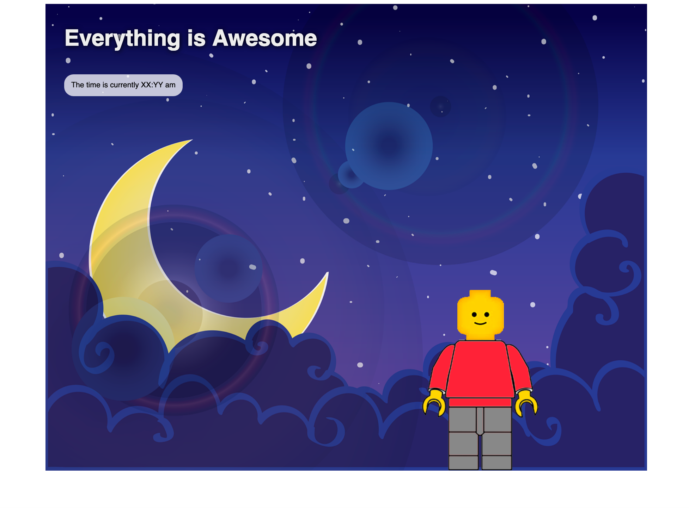
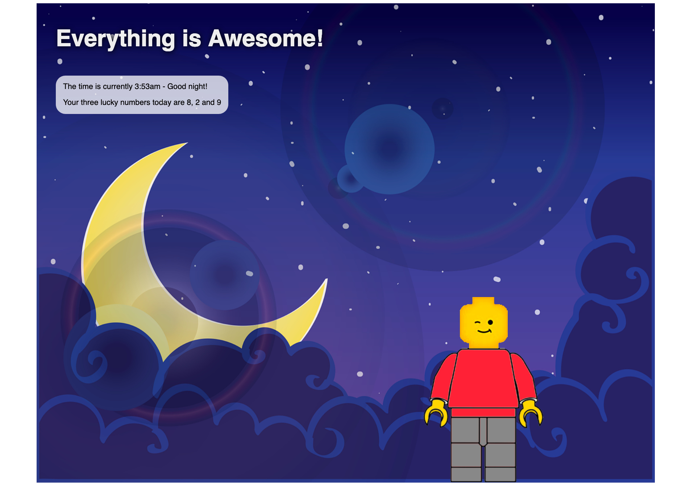
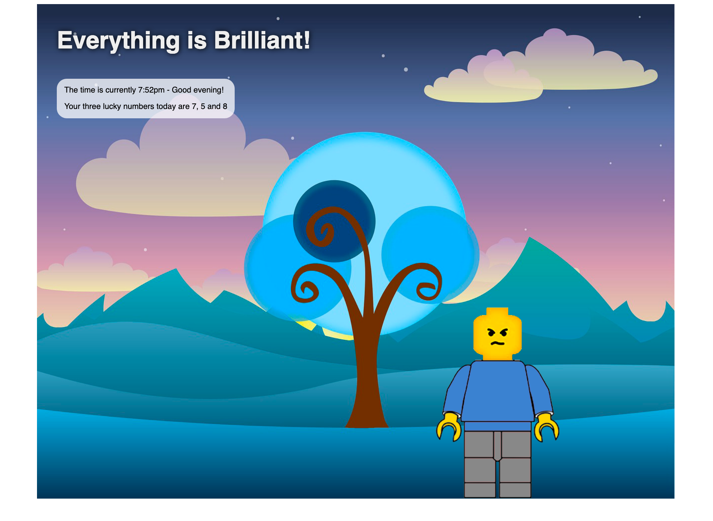
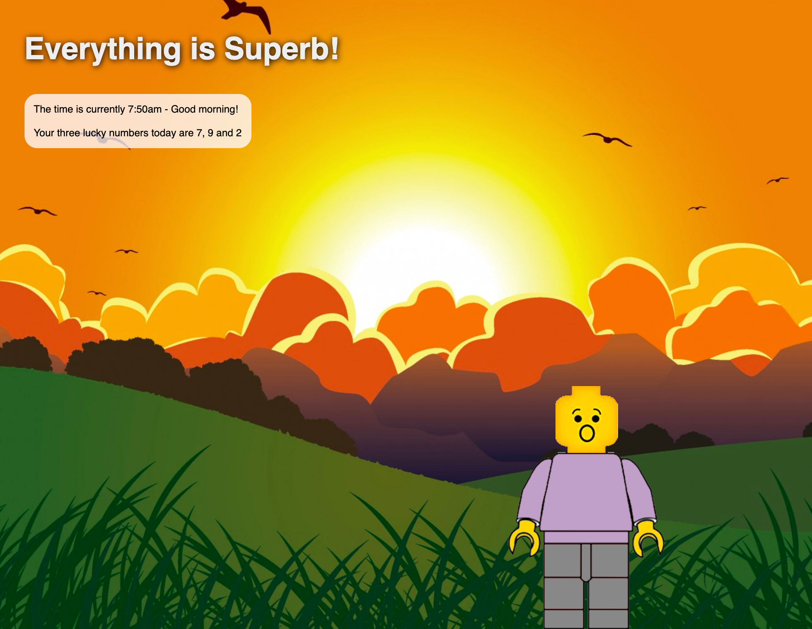
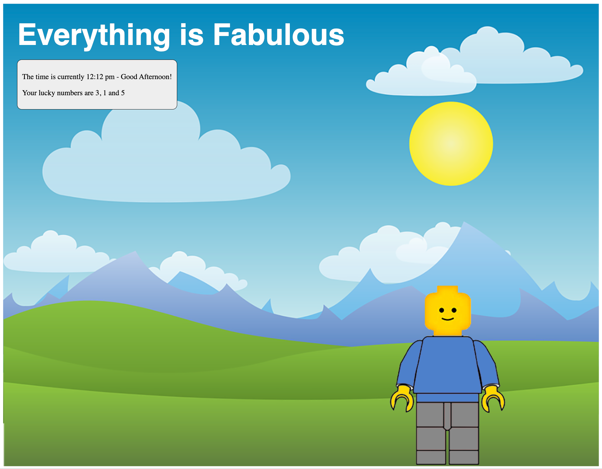

For this assignment you will be creating a randomized dynamic web page that will give the user information that they can use in order to help their day progress in a more positive way.

> 在这项作业中，你将创建一个随机的动态网页，为用户提供他们可以使用的信息，以帮助他们以更积极的方式进行日常工作。

This assignment focuses on your ability to write a simple JavaScript program that adds elements to an HTML page. In order to make this as simple as possible, focus on using the `document.write` method to add new elements to a page (i.e `document.write('<p>Welcome to my page!</p>')` will literally write a new `p` tag to your page). Note that this is certainly NOT the best way to add content to a page - we will learn better, more robust techniques in the near future. But for now stick with this and try and focus on the main idea of how we can dynamically add new content to a page using JavaScript.

> 这次作业的重点是你写一个简单的 JavaScript 程序，向 HTML 页面中添加元素的能力。为了使这个过程尽可能简单，请将重点放在使用文档上。方法来添加新元素到页面(即文档)。写('`<p>`欢迎来到我的页面!`</p>`')将字面上写一个新的 p 标签到你的页面)。请注意，这当然不是向页面添加内容的最佳方式——我们将在不久的将来学习更好、更健壮的技术。但是现在，我们还是要继续讨论这个问题，并将重点放在如何使用 JavaScript 动态地向页面添加新内容上。

::: info

Note: This assignment is being assigned before we cover how to isolate DOM elements using the various DOM query functions (i.e. `document.getElementById()` and `document.querySelector()`). At the very beginning of the semester the only way we have to write content to the page is to use `document.write()`, which essentially appends text to the `<body>` tag of the page.

> 注意:在我们讨论如何使用各种 DOM 查询函数(即 `document.getElementById()` 和 `document.querySelector()` )隔离 DOM 元素之前，已经分配了这个赋值。在本学期开始时，我们向页面写入内容的唯一方法是使用 `document.write()` ，它本质上是将文本追加到 `<body>`页面的标签。

You are welcome to use DOM queries here instead of `document.write` if you have read ahead and know what you're doing. DOM queries are more "correct" anyway - using `document.write()` is a very 'hard-coded' way of approaching this assignment, but it's the only tool we have access to at the beginning of the semester!

> 欢迎您在这里使用DOM查询而不是文档。如果你提前读过，知道自己在做什么，就写下来。DOM 查询更“正确”——使用 `document.write()` 是一种非常“硬编码”的方式来处理这个作业，但它是我们在学期开始时唯一可以使用的工具!

:::

Your website should do the following:

> 你的网站应该做到以下几点:

- Begin by downloading the following set of images: [Macro Assignment 02 Images](https://cs.nyu.edu/courses/spring23/CSCI-UA.0061-001/images/assignment02/assignment02_images.zip)/[assignment02_images.zip](/1v1/06-KAI/17-Macro-Assignment02-Everything-is-Awesome/assignment02_images.zip)

> 首先下载以下一组图像:宏分配02图像

- Construct a "static" page that creates a layout that looks like the following. This portion of the assignment won't require any JavaScript - instead this can be done using HTML & CSS only (hint: use absolute positioning and the `z-index` property to layer images on top of one another). Ensure that your layout is horizontally centered. [We will create a mock-up of this in class as well](https://cs.nyu.edu/courses/spring23/CSCI-UA.0061-001/assignment02_inclass.txt).

> 构造一个“静态”页面，创建如下所示的布局。这部分作业不需要任何JavaScript -相反，这可以只用HTML和CSS完成(提示:使用绝对定位和z-index属性将图像层层叠加)。确保你的布局水平居中。我们也会在课堂上创建一个模型。

```html
<!doctype html>
<html>
    <head>
        <title>Assignment 02</title>
        <style>

            #container {
                width: 800px;
                height: 600px;
                margin: auto;
                border: 5px solid black;
                position: relative;
            }
            #background {
                width: 100%;
                position: absolute;
                top: 0px;
                left: 0px;
                z-index: 0;
            }

            #title {
                position: absolute;
                top: 20px;
                left: 20px;
                z-index: 1;
            }
            #infopanel {
                position: absolute;
                top: 100px;
                left: 20px;
                z-index: 1;
            }
            #body {
                position: absolute;
                bottom: 0px;
                right: 200px;
                z-index: 1;
            }
            #head {
                position: absolute;
                bottom: 300px;
                right: 250px;
                z-index: 1;
            }

        </style>
    </head>
    <body>

        <div id="container">
            <script>
                const words = ['Awesome', 'Fantastic', 'Fabulous', 'Superb', 'Perfect', 'Brilliant', 'Coming up Roses'];

                // pick a word at random
                let i = parseInt( Math.random() * words.length );
                let word = words[i];

                // write out the H1 tag to use that word
                document.write(`<h1 id="title">Everything is ${word}!</h1>`);


                
                let rightNow = new Date();
                let hour = rightNow.getHours();
                let minute = rightNow.getMinutes();

                document.write(`<div id="infopanel">The current time is ${hour}:${minute} - welcome!</div>`);
            </script>


            
            
            
        </div>        

    </body>
</html>
```



- Next, we are going to set up the page so that it dynamically updates itself every time the page loads.

> 接下来，我们将设置页面，以便每次页面加载时它都会动态更新自己。

- Begin by asking the user for a positive number greater than or equal to 3. Ensure that the value entered is a number and that it is positive - if it is not, re-prompt the user. Hint: use the `prompt` function to do this. The `isNaN` function can be used to determine if a value qualifies as a "non-number" (i.e. `isNaN("apple")` would return `true`.

> 首先向用户询问一个大于或等于3的正数。确保输入的值是一个数字，并且是正数——如果不是，请重新提示用户。提示:使用prompt函数来完成此操作。isNaN函数可用于确定一个值是否符合“非数字”(即isNaN(“apple”)将返回true)。

After the user has successfully supplied a positive number that meets the criteria you should set up the page so that the last word of the heading changes randomly every time the page reloads. Valid greetings are as follows:

> 在用户成功地提供了一个满足条件的正数之后，您应该设置页面，以便每次页面重新加载时，标题的最后一个词都会随机更改。有效的问候语如下:

- Everything is Awesome

> 一切都很棒

- Everything is Fantastic

> 一切都很美好

- Everything is Fabulous

> 一切都很美好

- Everything is Superb

> 一切都是极好的

- Everything is Perfect

> 一切都很完美

- Everything is Brilliant

> 一切都是辉煌的

- Everything is Coming up Roses

> 一切都很顺利

- Hint: It might be helpful to use an array here! `const words = ['Awesome', 'Fantastic', 'Fabulous', 'Superb', 'Perfect', 'Brilliant', 'Coming up Roses'];`

> 提示:在这里使用数组可能会有所帮助!const words = ['Awesome'， 'Fantastic'， 'Fabulous'， 'Superb'， 'Perfect'， 'Brilliant'， 'Coming up Roses'];

- Next, we are going to tell the user the current time of day in 12 hour format (i.e. 9:05am, 1:27pm). This information will be displayed in the box that is below the heading ("Everything is _____"). Hint: use a `Date` object to get the current date and time. You might need to use some of the date methods that are attached to this object (`getHours`, `getMinutes`, etc.). More information about using the `Date` object can be found [here](https://cs.nyu.edu/courses/spring22/CSCI-UA.0061-001/wrapup_03_javascript_functions_and_objects.php)

> 接下来，我们将以12小时格式告诉用户当前时间(即上午9:05，下午1:27)。该信息将显示在标题(“Everything is _____”)下方的框中。提示:使用Date对象获取当前日期和时间。您可能需要使用附加到该对象的一些日期方法(getHours、getMinutes等)。关于使用Date对象的更多信息可以在这里找到

- Greets the user based on the time of day. The greetings to be used are as follows:

> 根据一天中的时间向用户打招呼。常用的问候语如下:

- 12:00am - 5:59am: "Good Night!"

> 12:00 - 5:59:“晚安!”

- 6:00am - 11:59am: "Good Morning!"

> 早上6:00 - 11:59:“早上好!”

- 12:00pm - 5:59pm: "Good Afternoon!"

> 下午12:00 - 5:59:“下午好!”

- 6:00pm - 11:59pm: "Good Evening!"

> 晚上6:00 - 11:59:“晚上好!”

- The page should also change the background image based on the time of day. Hint: use `document.write` to write the HTML tag for this element based on the time of day.

> 页面还应该根据一天中的时间更改背景图像。提示:使用' document。write '根据一天中的时间为该元素编写HTML标记。

- Next, the page should pick three lucky numbers between 1 and the number the user selected at the beginning of the program and displays those numbers. For example, the numbers 1, 7 and 8 could be selected if the number supplied was 10. Note that the same number cannot be picked twice (i.e. 1, 1 and 5 is an invalid set of lucky numbers since the number 1 was selected twice). Display those lucky numbers inside of the info box.

> 接下来，页面应该在1和用户在程序开始时选择的数字之间选择三个幸运数字，并显示这些数字。例如，如果提供的数字是10，则可以选择数字1、7和8。注意，同一个数字不能被选中两次(即1,1和5是无效的幸运数字集，因为数字1被选中了两次)。在信息框中显示这些幸运数字。

- Finally, randomize the lego mini figure (pick a random head and a random body). An array might be helpful here as well!

> 最后，随机化乐高迷你人物(随机挑选一个头部和身体)。数组在这里也可能有帮助!

- Pick at least one of these two extra features to implement (implement both for a small amount of extra credit)

> 至少从这两个额外的功能中选择一个来实现(为了获得少量的额外学分而实现两个功能)

- Create a series of "decals" that can be placed on top of the mini figure. Randomize those decals when the page loads

> 创建一系列的“贴纸”，可以放在迷你人物的顶部。随机这些贴花时，页面加载

- Display the user's lucky numbers using something other than text (i.e. find some graphics online or come up with another creative way to convey these numbers to the user)

> 使用文字以外的方式展示用户的幸运数字(例如，在网上找到一些图形或想出另一种创造性的方式向用户传达这些数字)

Thoroughly test your work and make sure that it meets the requirements set forth above. When you are finished, post your project to the i6 server and link it from your main menu page. We should be able to visit your 'webdev' folder and click on the link associated with this macro assignment to visit your project. Also create a ZIP archive of your work and submit it to Brightspace under the 'Macro Assignment 02' category.

> 彻底测试你的工作，并确保它满足上述要求。完成后，将项目发布到i6服务器，并从主菜单页面链接它。我们应该能够访问您的“webdev”文件夹，并点击与此宏分配相关的链接来访问您的项目。也可以创建一个ZIP文件，并将其提交到Brightspace的“Macro Assignment 02”目录下。

Here are some sample screenshots of what your website could look like. Note that you are welcome to take creative liberty in terms of layout, color choices, etc.

> 这里有一些你的网站的截图样本。请注意，欢迎您在布局、颜色选择等方面自由发挥创意。










`zq2076/694996797Qzy2140`

欢迎关注我公众号：AI悦创，有更多更好玩的等你发现！


::: details 公众号：AI悦创【二维码】


:::

::: info AI悦创·编程一对一

AI悦创·推出辅导班啦，包括「Python 语言辅导班、C++ 辅导班、java 辅导班、算法/数据结构辅导班、少儿编程、pygame 游戏开发」，全部都是一对一教学：一对一辅导 + 一对一答疑 + 布置作业 + 项目实践等。当然，还有线下线上摄影课程、Photoshop、Premiere 一对一教学、QQ、微信在线，随时响应！微信：Jiabcdefh

C++ 信息奥赛题解，长期更新！长期招收一对一中小学信息奥赛集训，莆田、厦门地区有机会线下上门，其他地区线上。微信：Jiabcdefh

方法一：[QQ](http://wpa.qq.com/msgrd?v=3&uin=1432803776&site=qq&menu=yes)

方法二：微信：Jiabcdefh

:::

