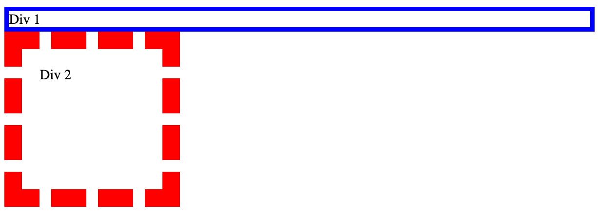
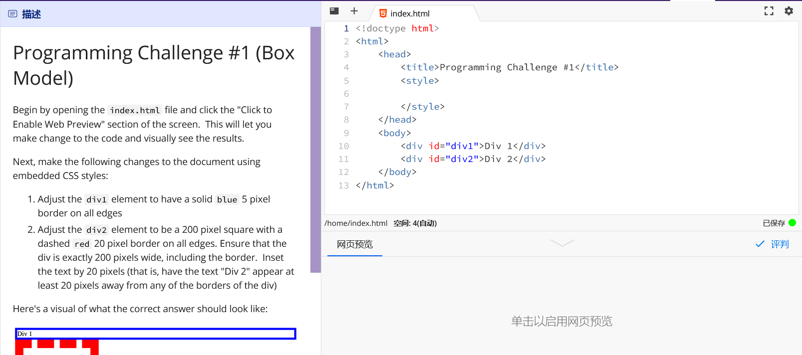
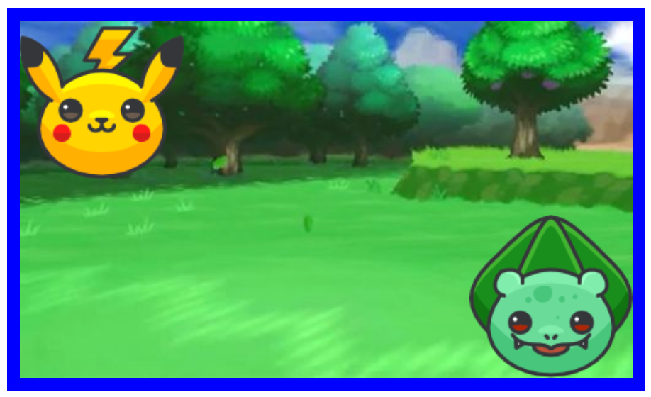
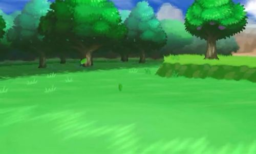
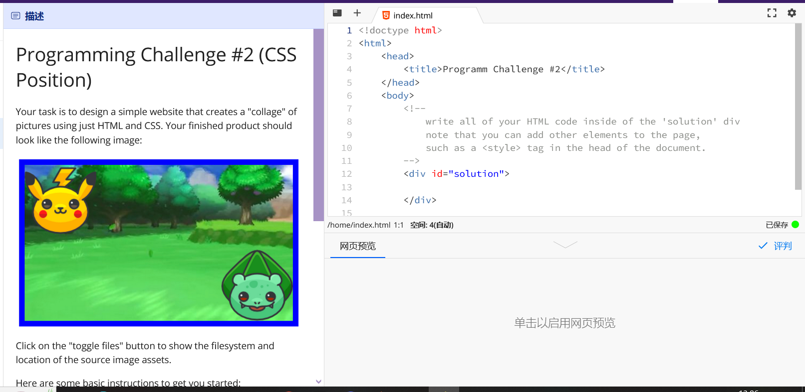

## 1. Programming Challenge #1 (Box Model)

> 编程挑战#1(盒子模型)

Begin by opening the index.html file and click the "Click to Enable Web Preview" section of the screen. This will let you make change to the code and visually see the results.

> 首先打开 index.html 文件，点击屏幕上的“点击启用 Web 预览”部分。这将允许您更改代码并可视化地查看结果。

Next, make the following changes to the document using embedded CSS styles:

> 接下来，使用嵌入式 CSS 样式对文档进行以下更改:

Adjust the div1 element to have a solid blue 5 pixel border on all edges Adjust the div2 element to be a 200 pixel square with a dashed red 20 pixel border on all edges. Ensure that the div is exactly 200 pixels wide, including the border. Inset the text by 20 pixels (that is, have the text "Div 2" appear at least 20 pixels away from any of the borders of the div)

> 调整div1元素为一个200像素的正方形，所有边缘上都有一个20像素的红色虚线。确保div的宽度为200像素，包括边框。将文本插入20个像素(也就是说，让文本“Div 2”出现在距离Div任何边界至少20个像素的地方)

Here's a visual of what the correct answer should look like:

> 下面是正确答案的视觉效果:

You can test your work by clicking the "Mark" button. If your code works as expected you will see a green checkmark indicating that you passed that particular test; if not, you will see a red "X" along with feedback describing why your code does not perform as expected.

> 你可以通过点击“标记”按钮来测试你的工作。如果您的代码按预期工作，您将看到一个绿色的复选标记，表明您通过了特定的测试;如果没有，您将看到一个红色的“X”，以及描述为什么您的代码不能按预期执行的反馈。





```html
<!doctype html>
<html>
    <head>
        <title>Programming Challenge #1</title>
        <style>

        </style>
    </head>
    <body>
        <div id="div1">Div 1</div>
        <div id="div2">Div 2</div>
    </body>
</html>
```

---

## Answer 01

```css
#div1 {
  border: 5px solid blue;
}

#div2 {
  width: 200px;
  height: 200px;
  border: 20px dashed red;
  box-sizing: border-box;
  padding: 20px;
  text-align: center;
}
```

这将使 div1 元素具有蓝色实线 5 像素宽度的边框，并使 div2 元素具有红色虚线 20 像素宽度的边框，并且大小为 200 像素，包括边框。 `box-sizing` 属性确保 div 的宽度恰好为 200 像素，包括边框，`padding` 属性将文本内缩 20 像素。`text-align` 属性将文本水平居中。

请确保将此 CSS 代码添加到 HTML 文档的 `<head>` 部分中。

```html
<!doctype html>
<html>

<head>
    <title>Programming Challenge #1</title>
    <style>
        #div1 {
            border: 5px solid blue;
        }

        #div2 {
            width: 200px;
            height: 200px;
            border: 20px dashed red;
            box-sizing: border-box;
            padding: 20px;
            text-align: center;
        }
    </style>
</head>

<body>
    <div id="div1">Div 1</div>
    <div id="div2">Div 2</div>
</body>

</html>
```


## 2. Programming Challenge #2 (CSS Position)

> 编程挑战#2 (CSS职位)

Your task is to design a simple website that creates a "collage" of pictures using just HTML and CSS. Your finished product should look like the following image:

> 你的任务是设计一个简单的网站，只使用HTML和CSS创建一个图片的“拼贴画”。你的成品应该如下图所示:



Click on the "toggle files" button to show the filesystem and location of the source image assets.

> 单击“toggle files”按钮，显示源图像资产的文件系统和位置。[images.zip](/1v1/06-KAI/19-Lab01-web/images.zip)

::: tabs

@tab bg.png



@tab bulbasaur.png


@tab pikachu.png


:::

Here are some basic instructions to get you started:

> 这里有一些基本的指导来帮助你开始:

Add three img elements to the solution div. These tags should display the three graphics for this project, and should be given id properties of background, pikachu and bulbasaur. 

> 在解决方案div中添加三个img元素。这些标签应该显示这个项目的三个图形，并且应该被赋予背景、皮卡丘和bulbasaur的id属性。

Set up the solution div to be exactly 500 pixels wide, 300 pixels high, with a 10 pixel solid blue border along each edge. Ensure that the div never grows beyond 500x300 pixels, including the border.

> 设置解决方案div为500像素宽，300像素高，每条边都有10像素的实心蓝色边框。确保div的大小不超过500x300像素，包括边框。

Set up the background image so that it scales to fill the entire solution div, and does not grow beyond the edge of the solution div (hint: use the width property)

> 设置背景图像，使其缩放以填充整个解决方案div，并且不会超出解决方案div的边缘(提示:使用width属性)

Set up the pikachu graphic to appear at the top-left side of the solution div, and the bulbasaur graphic to appear at the bottom right side. Hint: think about how you can layer an element on top of another element. Using the CSS position rule will be useful here.

> 设置皮卡丘图形出现在解决方案div的左上角，bulbasaur 图形出现在右下角。提示:考虑一下如何将一个元素叠加到另一个元素之上。使用 CSS 位置规则在这里很有用。

```html
<!doctype html>
<html>
    <head>
        <title>Programm Challenge #2</title>
    </head>
    <body>
        <!-- 
            write all of your HTML code inside of the 'solution' div 
            note that you can add other elements to the page,
            such as a <style> tag in the head of the document.
        -->
        <div id="solution">

        </div>

    </body>
</html>
```



## Answer 02

```html
<!doctype html>
<html>

<head>
    <title>Programm Challenge #2</title>
    <style>
        #solution {
            width: 500px;
            height: 300px;
            border: 10px solid blue;
            box-sizing: border-box;
        }

        #background {
            width: 100%;
            height: 100%;
            object-fit: cover;
        }

        #pikachu {
            position: absolute;
            top: 10px;
            left: 16px;
        }

        /* #bulbasaur {
            position: absolute;
            bottom: 0;
            right: 0;
        } */
        #bulbasaur {
            position: absolute;
            /* bottom: 100px; */
            top: 166px;
            /* right: 10px; */
            left: 366px;
            width: 130px;
        }
    </style>
</head>

<body>
    <!-- 
            write all of your HTML code inside of the 'solution' div 
            note that you can add other elements to the page,
            such as a <style> tag in the head of the document.
        -->
    <div id="solution">
        
        
        
    </div>

</body>

</html>
```


1. 在 `solution` div 中添加三个 `img` 元素，并将它们的 `id` 属性设置为 `background`、`pikachu` 和 `bulbasaur`。每个图像元素的 `src` 属性应指向适当的图像文件。

```html
<div id="solution">
  
  
  
</div>
```

2. 设置 `solution` div 的宽度为 500 像素，高度为 300 像素，并在每条边上设置 10 像素的实线蓝色边框。为确保 div 从未超过 500x300 像素，包括边框，我们可以将 `box-sizing` 属性设置为 `border-box`。

```css
#solution {
  width: 500px;
  height: 300px;
  border: 10px solid blue;
  box-sizing: border-box;
}
```

3. 设置 `background` 图像以填充整个 `solution` div，并且不超出 `solution` div 的边缘。我们可以通过将 `background` 图像的 `width` 和 `height` 属性设置为 `100％`，并将 `object-fit` 属性设置为 `cover` 来实现此目的。

```css
#background {
  width: 100%;
  height: 100%;
  object-fit: cover;
}
```

4. 设置 `pikachu` 图形出现在 `solution` div 的左上方，`bulbasaur` 图形出现在右下方。我们可以通过将每个图形的 `position` 属性设置为 `absolute`，然后设置 `top`、`left`、`bottom` 和 `right` 属性来将图形定位到所需的位置。

```css
#pikachu {
  position: absolute;
  top: 0;
  left: 0;
}

#bulbasaur {
  position: absolute;
  bottom: 0;
  right: 0;
}
```

完成了！您的最终产品应该看起来像挑战中的图像一样。记得在项目目录中包含适当的图像文件，并调整 `img` 元素的 `src` 属性中的文件路径以指向正确的文件。

欢迎关注我公众号：AI悦创，有更多更好玩的等你发现！


::: details 公众号：AI悦创【二维码】


:::

::: info AI悦创·编程一对一

AI悦创·推出辅导班啦，包括「Python 语言辅导班、C++ 辅导班、java 辅导班、算法/数据结构辅导班、少儿编程、pygame 游戏开发」，全部都是一对一教学：一对一辅导 + 一对一答疑 + 布置作业 + 项目实践等。当然，还有线下线上摄影课程、Photoshop、Premiere 一对一教学、QQ、微信在线，随时响应！微信：Jiabcdefh

C++ 信息奥赛题解，长期更新！长期招收一对一中小学信息奥赛集训，莆田、厦门地区有机会线下上门，其他地区线上。微信：Jiabcdefh

方法一：[QQ](http://wpa.qq.com/msgrd?v=3&uin=1432803776&site=qq&menu=yes)

方法二：微信：Jiabcdefh

:::

