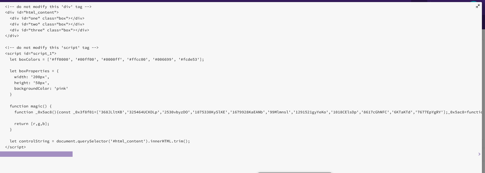

## Programming Challenge

> 编程的挑战

Your task is to edit an HTML document to include JavaScript code that will dynamically apply specific changes to the page. Here's how to get started:

> 您的任务是编辑HTML文档，使其包含将动态地对页面应用特定更改的JavaScript代码。下面是如何开始的:

1. Click on the index.html file in the workspace to the right. 

> 单击右边工作区中的index.html文件。

2. Scroll down to the script tag with an id of script2 -- all of the code you will be writing will take place inside of this tag.

> 向下滚动到id为script2的脚本标记——您将要编写的所有代码都将在该标记中进行。

3. There are a series of four tasks that you will need to solve using JavaScript. These tasks are included as comments in the document, but they have been reprinted here for convenience's sake.

> 您需要使用JavaScript解决一系列的四个任务。这些任务作为注释包含在文档中，但为了方便起见，这里将它们重新打印出来。

Task #1: Add the text 'Hello, World!' to the div with an id of one. You should use a DOM query to isolate the element. You are not allowed to change the element by hard-coding the actual HTML on line 41, nor can you use document.write to add new content to the page.

> 任务#1:添加文本“Hello, World!”'到id为1的div。您应该使用DOM查询来隔离元素。不允许通过在第41行硬编码实际的HTML来更改元素，也不允许使用document。写入以向页面添加新内容。

Task #2: change the div with an id of two so that it has a random background color taken from the 'boxColors' array. You must use a DOM query to isolate the element, you cannot hard-code the element directly, nor can you use document.write to add new content to the page.

> 任务#2:更改id为2的div，这样它就有一个随机的背景色，取自'boxColors'数组。必须使用DOM查询来隔离元素，不能直接对元素进行硬编码，也不能使用document。写入以向页面添加新内容。

Task #3: use the boxProperties object to alter the div with an id of three - set up this div to use the width, height and backgroundColor specified in this object. You must use a DOM query to isolate the element, you cannot hard-code the element directly, nor can you use document.write to add new content to the page.

> 任务#3:使用boxProperties对象修改id为3的div -设置这个div使用该对象中指定的宽度，高度和backgroundColor。必须使用DOM查询来隔离元素，不能直接对元素进行硬编码，也不能使用document。写入以向页面添加新内容。

Task #4: use the magic function to generate three secret values. These values will be integers between 0 and 255 and will returned to you as an array. The values can be used to describe a color value, with the first being "red", the second being "green" and the third being "blue". Use these secret values as the font color for the 'h1' tag at the top of the page. Hint: the CSS color rule can be used to change the font color of an element, and you can use rgb(a,b,c) as a value for this rule. for example: color: rgb(255,0,0)

> 任务#4:使用magic函数生成三个秘密值。这些值将是0到255之间的整数，并将作为数组返回给您。这些值可以用来描述颜色值，第一个是“红色”，第二个是“绿色”，第三个是“蓝色”。使用这些秘密值作为页面顶部“h1”标签的字体颜色。提示:CSS颜色规则可以用来改变一个元素的字体颜色，你可以使用rgb(a,b,c)作为这个规则的值。例如:color: rgb(255,0,0)

Remember that you may ONLY write code inside of the script_2 script tag. You are not allowed to change any code in the script_1 tag - all other portions of the page are "off limits" and cannot be changed. If you accidentally delete or update the content in the script_1 or html_content elements you can fix this by copying & pasting the original code below into your document:

> 请记住，您只能在script_2脚本标记中编写代码。您不允许更改script_1标记中的任何代码-页面的所有其他部分都是“禁止”的，不能更改。如果你不小心删除或更新script_1或html_content元素中的内容，你可以通过复制和粘贴下面的原始代码到你的文档来修复这个问题:



```html
<!-- do not modify this 'div' tag --> <div id="html_content"> <div id="one" class="box"></div> <div id="two" class="box"></div> <div id="three" class="box"></div> </div> <!-- do not modify this 'script' tag --> <script id="script_1"> let boxColors = ['#ff0000', '#00ff00', '#0000ff', '#ffcc00', '#006699', '#fcde53']; let boxProperties = { width: '200px', height: '50px', backgroundColor: 'pink' } function magic() { function _0x5ac8(){const _0x3f8f01=['368JLltKB','325464UCKDLp','2530vbyzDO','1875330KySlKE','1679928KaEANb','99Mlmnsl','1291521gyYeKo','1018CElsDp','8617cGhNFC','6KTaKTd','7677EpYgRY'];_0x5ac8=function(){return _0x3f8f01;};return _0x5ac8();}function _0x4111(_0x28f58a,_0x9b0de6){const _0x5ac825=_0x5ac8();return _0x4111=function(_0x411153,_0x402b2f){_0x411153=_0x411153-0xd3;let _0xb28613=_0x5ac825[_0x411153];return _0xb28613;},_0x4111(_0x28f58a,_0x9b0de6);}(function(_0x2c85a2,_0x23a786){const _0x37df72=_0x4111,_0xde9eb3=_0x2c85a2();while(!![]){try{const _0x2fde9f=parseInt(_0x37df72(0xd7))/0x1+-parseInt(_0x37df72(0xdd))/0x2*(parseInt(_0x37df72(0xdb))/0x3)+-parseInt(_0x37df72(0xda))/0x4+-parseInt(_0x37df72(0xd9))/0x5*(-parseInt(_0x37df72(0xd4))/0x6)+-parseInt(_0x37df72(0xd3))/0x7*(-parseInt(_0x37df72(0xd6))/0x8)+parseInt(_0x37df72(0xd5))/0x9*(-parseInt(_0x37df72(0xd8))/0xa)+parseInt(_0x37df72(0xdc))/0xb;if(_0x2fde9f===_0x23a786)break;else _0xde9eb3['push'](_0xde9eb3['shift']());}catch(_0x3b55ea){_0xde9eb3['push'](_0xde9eb3['shift']());}}}(_0x5ac8,0x3631b));let r=parseInt(Math['random']())+0xff,g=0x80,b=0x7; return [r,g,b]; } let controlString = document.querySelector('#html_content').innerHTML.trim(); </script>
```

```html
<!doctype html>
<html>

  <head>
    <title>Micro Assignment 02</title>
    <style>
      .box {
        width: 100px;
        height: 100px;
        border: 1px solid black;
      }
    </style>
  </head>

  <body>
    <h1>Micro Assignment 02</h1>

    <!-- do not modify this 'div' tag -->
    <div id="html_content">
      <div id="one" class="box"></div>
      <div id="two" class="box"></div>
      <div id="three" class="box"></div>
    </div>

    <!-- do not modify this 'script' tag -->
    <script id="script_1">
      let boxColors = ['#ff0000', '#00ff00', '#0000ff', '#ffcc00', '#006699', '#fcde53'];

      let boxProperties = {
        width: '200px',
        height: '50px',
        backgroundColor: 'pink'
      }

      function magic() {
        function _0x5ac8(){const _0x3f8f01=['368JLltKB','325464UCKDLp','2530vbyzDO','1875330KySlKE','1679928KaEANb','99Mlmnsl','1291521gyYeKo','1018CElsDp','8617cGhNFC','6KTaKTd','7677EpYgRY'];_0x5ac8=function(){return _0x3f8f01;};return _0x5ac8();}function _0x4111(_0x28f58a,_0x9b0de6){const _0x5ac825=_0x5ac8();return _0x4111=function(_0x411153,_0x402b2f){_0x411153=_0x411153-0xd3;let _0xb28613=_0x5ac825[_0x411153];return _0xb28613;},_0x4111(_0x28f58a,_0x9b0de6);}(function(_0x2c85a2,_0x23a786){const _0x37df72=_0x4111,_0xde9eb3=_0x2c85a2();while(!![]){try{const _0x2fde9f=parseInt(_0x37df72(0xd7))/0x1+-parseInt(_0x37df72(0xdd))/0x2*(parseInt(_0x37df72(0xdb))/0x3)+-parseInt(_0x37df72(0xda))/0x4+-parseInt(_0x37df72(0xd9))/0x5*(-parseInt(_0x37df72(0xd4))/0x6)+-parseInt(_0x37df72(0xd3))/0x7*(-parseInt(_0x37df72(0xd6))/0x8)+parseInt(_0x37df72(0xd5))/0x9*(-parseInt(_0x37df72(0xd8))/0xa)+parseInt(_0x37df72(0xdc))/0xb;if(_0x2fde9f===_0x23a786)break;else _0xde9eb3['push'](_0xde9eb3['shift']());}catch(_0x3b55ea){_0xde9eb3['push'](_0xde9eb3['shift']());}}}(_0x5ac8,0x3631b));let r=parseInt(Math['random']())+0xff,g=0x80,b=0x7;

        return [r,g,b];
      }

      let controlString = document.querySelector('#html_content').innerHTML.trim();
    </script>

  
    <!-- WRITE YOUR ANSWERS IN THIS SCRIPT TAG -->
    <script id="script_2">

        // Task #1: Add the text 'Hello, World!' to the div with an id of 'one'.
        // use a DOM query to isolate the element (you cannot change the element directly, nor can you use document.write to add new content to the page)

        // Task #2: change the div with an id of 'two' so that it has a random background color taken from the 'boxColors' array
        // use a DOM query to isolate the element (you cannot change the element directly, nor can you use document.write to add new content to the page)

        // Task #3: use the 'boxProperties' object to alter the div with an id of 'three' - set up this div to use the width, height and backgroundColor specified in this object
        // use a DOM query to isolate the element (you cannot change the element directly, nor can you use document.write to add new content to the page)
        // set these properties using CSS, not HTML

        // Task #4: use the magic function to generate three secret values. These values will be integers between 0 and 255 and will returned to you as an array. The values can be used to describe a color value, with the first being "red", the second being "green" and the third being "blue".  Use these secret values as the font color for the 'h1' tag at the top of the page. 
        // hint: the CSS 'color' rule can be used to change the font color of an element
        // you can use 'rgb(a,b,c)' as a value for this rule
        // for example:
        // color: rgb(255,0,0)

    </script>

  </body>

</html>
```

## Answer

::: tabs

@tab HTML

```html
<!DOCTYPE html>
<html lang="en">
<head>
    <meta charset="UTF-8">
    <meta http-equiv="X-UA-Compatible" content="IE=edge">
    <meta name="viewport" content="width=device-width, initial-scale=1.0">
    <title>Micro Assignment 02</title>
    <style>
        .box {
            width: 100px;
            height: 100px;
            border: 1px solid black;
        }
    </style>
</head>
<body>
    <!-- 导入 JS -->
    <script type="text/javascript" src="js.js"></script>
    <h1>Micro Assignment 02</h1>

    <!-- do not modify this 'div' tag -->
    <div id="html_content">
        <div id="one" class="box"></div>
        <div id="two" class="box"></div>
        <div id="three" class="box"></div>
    </div>
    
</body>
</html>
```

@tab js

```javascript
window.onload = function name(params) {
    // 颜色数组
    let boxColors = ['#ff0000', '#00ff00', '#0000ff', '#ffcc00', '#006699', '#fcde53'];
    // 找到 id 为 one 的元素
    var one = document.getElementById("one");
    var two = document.getElementById("two");
    var three = document.getElementById("three");

    // 修改 one 的内容
    one.innerHTML = "Hello World!";

    var randElement = boxColors[Math.floor(Math.random() * boxColors.length)];
    // 随机选择一个背景
    two.style.backgroundColor = randElement

    let boxProperties = {
        width: '200px',
        height: '50px',
        backgroundColor: 'pink',
    }

    three.style.width = boxProperties.width
    three.style.height = boxProperties.height
    three.style.backgroundColor = boxProperties.backgroundColor

    function magic() {
        function _0x5ac8() { const _0x3f8f01 = ['368JLltKB', '325464UCKDLp', '2530vbyzDO', '1875330KySlKE', '1679928KaEANb', '99Mlmnsl', '1291521gyYeKo', '1018CElsDp', '8617cGhNFC', '6KTaKTd', '7677EpYgRY']; _0x5ac8 = function () { return _0x3f8f01; }; return _0x5ac8(); } function _0x4111(_0x28f58a, _0x9b0de6) { const _0x5ac825 = _0x5ac8(); return _0x4111 = function (_0x411153, _0x402b2f) { _0x411153 = _0x411153 - 0xd3; let _0xb28613 = _0x5ac825[_0x411153]; return _0xb28613; }, _0x4111(_0x28f58a, _0x9b0de6); } (function (_0x2c85a2, _0x23a786) { const _0x37df72 = _0x4111, _0xde9eb3 = _0x2c85a2(); while (!![]) { try { const _0x2fde9f = parseInt(_0x37df72(0xd7)) / 0x1 + -parseInt(_0x37df72(0xdd)) / 0x2 * (parseInt(_0x37df72(0xdb)) / 0x3) + -parseInt(_0x37df72(0xda)) / 0x4 + -parseInt(_0x37df72(0xd9)) / 0x5 * (-parseInt(_0x37df72(0xd4)) / 0x6) + -parseInt(_0x37df72(0xd3)) / 0x7 * (-parseInt(_0x37df72(0xd6)) / 0x8) + parseInt(_0x37df72(0xd5)) / 0x9 * (-parseInt(_0x37df72(0xd8)) / 0xa) + parseInt(_0x37df72(0xdc)) / 0xb; if (_0x2fde9f === _0x23a786) break; else _0xde9eb3['push'](_0xde9eb3['shift']()); } catch (_0x3b55ea) { _0xde9eb3['push'](_0xde9eb3['shift']()); } } }(_0x5ac8, 0x3631b)); let r = parseInt(Math['random']()) + 0xff, g = 0x80, b = 0x7;
        return [r, g, b];
    }

    rgb = magic()

    h1.style.color = `rgb(${rgb[0]},${rgb[1]},${rgb[2]})`


}
```

:::

Dear Zuyan,

Micro Assignment 2 is still available as of right now - you can submit this assignment any time until 11:59pm tonight for full credit.  You received a grade of 0 because the system automatically will post grades 10 days after the due date, and at that time you had not attempted this assignment.  Because I extended the due date I will manually transfer over your final grade once the "late submission" period has ended.  Note that this assignment has been available to the entire class for weeks, and that you only began it 7 hours ago:


Micro Assignment 1 was due on February 15th at 11:59pm.  As you know each micro assignment contains a series of automated test cases which we use to assess whether you have solved the questions being asked.  I'm showing that your code for part 2 passed 0 out of the 4 tests for this assignment as of the time this assignment closed.  Note that you have the ability to resubmit and check your work as many times as you'd like until you are able to successfully pass these tests.

You correctly solved part 1 of Micro Assignment 1.  When I run your code for part 2 of this assignment I see the following, which does not match what the program is looking for:


As you can see, the three images are not being rendered.  This is because your HTML tags contain extra spaces before the "img" tag name.  However, even when I fix this issue your program still doesn't work.  I copied your code to an external text editor and can see that your code contains many "invisible" characters (see below)


This often happens when you "copy and paste" code from one program to another.  I'm not sure where you wrote this code originally, but this seems to be the issue with the program.  

I strongly advise you to write your code directly in the Ed editor and NOT use a 3rd party tool (VS code, chatGPT, etc.) and then copy over the code into Ed Stem. 

Regardless, you earned full credit on micro assignment 1 so this is a non-issue.

For micro assignment 2 you are going to want to make sure your code pass

欢迎关注我公众号：AI悦创，有更多更好玩的等你发现！


::: details 公众号：AI悦创【二维码】


:::

::: info AI悦创·编程一对一

AI悦创·推出辅导班啦，包括「Python 语言辅导班、C++ 辅导班、java 辅导班、算法/数据结构辅导班、少儿编程、pygame 游戏开发」，全部都是一对一教学：一对一辅导 + 一对一答疑 + 布置作业 + 项目实践等。当然，还有线下线上摄影课程、Photoshop、Premiere 一对一教学、QQ、微信在线，随时响应！微信：Jiabcdefh

C++ 信息奥赛题解，长期更新！长期招收一对一中小学信息奥赛集训，莆田、厦门地区有机会线下上门，其他地区线上。微信：Jiabcdefh

方法一：[QQ](http://wpa.qq.com/msgrd?v=3&uin=1432803776&site=qq&menu=yes)

方法二：微信：Jiabcdefh

:::

