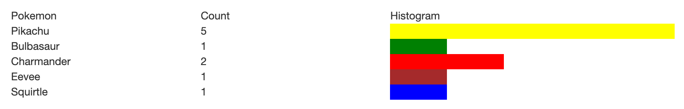

## Macro Assignment 03: Gotta Catch 'em All!

> 宏观作业03:必须把他们都抓起来!

[Code written in class as a group](https://cs.nyu.edu/courses/spring23/CSCI-UA.0061-001/assignment03_inclass.txt)

::: details 作为一个组在类中编写的代码

```html
<!DOCTYPE html>
<html>
    <head>
        <title>In class Day 06</title>
        <style>
            #left {
                float: left;
                width: 800px;
                height: 600px;
                position: relative;
                margin-right: 20px;
            }
            #background {
                position: absolute;
                top: 0px;
                left: 0px;
                width: 100%;
            }
            #grass1 {
                position: absolute;
                left: 0px;
                bottom: 0px;
            }
            #grass2 {
                position: absolute;
                left: 275px;
                bottom: 0px;
            }
            #grass3 {
                position: absolute;
                right: 0px;
                bottom: 0px;
            }
            .grass:hover {
                background-color: rgba(255, 255, 0, 0.5);
            }
        </style>
    </head>
    <body>
        <div id="left">
            
            
            
            
        </div>
        <div id="right">
            <h1>Gotta Catch 'em All!</h1>
            <p>Instructions</p>
            <h2 id="status">Click a grass</h2>
            <div id="pokemon_caught_div">Caught: 0</div>
            <div id="pokeballs_left_div">Pokeballs: 5</div>
            <button id="play_again_button" style="display: none;">Play Again!</button>
        </div>

        <script>
            // set up DOM queries for all the things we plan on using
            const grass1 = document.getElementById('grass1');
            const grass2 = document.getElementById('grass2');
            const grass3 = document.getElementById('grass3');
            const pokemon_caught_div = document.getElementById('pokemon_caught_div');
            const pokeballs_left_div = document.getElementById('pokeballs_left_div');
            const play_again_button = document.getElementById('play_again_button');

            // create some variables to keep track of our game state logic
            let pokeballsRemaining = 5;

            // grass 1 - handle user clicks
            grass1.onclick = function() {

                // reduce the # of pokeballs
                pokeballsRemaining -= 1;

                // generate a chance variable
                let chance = parseInt( Math.random() * 3 ); // 0, 1 or 2

                // more pokeballs
                if (chance == 0) {
                    grass1.src = 'images/pokeballs.png';
                    pokeballsRemaining += 2;
                }
                // nothing happens
                else if (chance == 1) {
                    grass1.src = '';
                }
                // it's a pokemon
                else {
                    grass1.src = 'images/pikachu.png';
                }

                // round is over, update the pokeballs left indicator
                pokeballs_left_div.innerHTML = 'Pokeballs: ' + pokeballsRemaining;

                // make the play agian button visible
                play_again_button.style.display = 'block';
            }

            // when the user clicks on the play again button
            play_again_button.onclick = function() {
                // make all the grass transition back to their original graphic
                grass1.src = 'images/grass.png';

                // hide the play agian button
                play_again_button.style.display = 'none';
            }

        </script>
    </body>
</html>
```

:::

For this assignment you will be creating a Pokemon hunting game the user can play in their browser. The rules for the game are as follows:

> 对于这个作业，你将创建一个用户可以在浏览器中玩的精灵宝可梦狩猎游戏。游戏规则如下:

- The user starts with 5 Pokeballs and 0 Pokemon.

> 用户开始时拥有 5 个 pokeball 和 0 个 Pokemon。

- The user is presented with three grassy patches. Behind one of the patches is hidden a random Pokemon, behind another is hidden 2 additional Pokeballs, and behind the third is nothing.

> 用户会看到三个草地。在一个补丁后面隐藏着一个随机的口袋妖怪，在另一个补丁后面隐藏着另外两个口袋妖怪球，而在第三个补丁后面什么都没有。

- The user is asked to select one of three grassy patches by clicking their mouse on the desired patch. Every time they click on a patch the user will use 1 of their Pokeballs.

> 用户被要求从三个草地补丁中选择一个，在想要的补丁上单击鼠标。每次他们点击一个补丁，用户就会使用1个pokeball。

- If they find a Pokemon the number of caught Pokemon increases. If they find the 2 Pokeballs their number of Pokeballs increases by 2. If they do not find anything then nothing happens.

> 如果他们发现了精灵宝可梦，被抓到的精灵宝可梦的数量就会增加。如果他们找到2个pokeball，他们的pokeball数量增加2。如果他们什么都没发现，那就什么都不会发生。

- In all cases the data displays are updated to reflect the user's current inventory (# of Pokeballs and # of Pokemon caught)

> 在所有情况下，数据显示都会更新以反映用户当前的库存(pokeball的数量和抓到的Pokemon数量)

- The user can then click a "Play Again" button to try another round in which the Pokemon and Pokeballs will be randomly moved to a different patch. At the end of the round all of the grassy patches should be "locked" and un-clickable (i.e. the user should be prevented from selecting two different grassy patches during the same round) - hint: perhaps you need a global variable to keep track of the "state" of your game?

> 然后，用户可以点击“Play Again”按钮，尝试下一轮，口袋妖怪和口袋球将随机移动到不同的补丁。在回合结束时，所有的草地都应该是“锁定”且不可点击的(游戏邦注:即用户不能在同一回合中选择两个不同的草地)——提示:也许你需要一个全局变量来跟踪游戏的“状态”?

- The user can continue to play as long as they have Pokeballs left. If the user runs out of Pokeballs your program should not allow them to select another grassy patch. Display some kind of "game over" message when this happens. Hint: test your program with a lower initial Pokeball amount to make sure this feature works correctly!

> 只要玩家还有pokeball，他们就可以继续玩游戏。如果用户用完了Pokeballs，你的程序不应该允许他们选择另一个草地补丁。当这种情况发生时，显示某种“游戏结束”消息。提示:用较低的初始Pokeball量测试您的程序，以确保此功能正确工作!

Here is a video example of how the game is played. Note that you may redesign your game to use your own colors and layout, but the overall gameplay logic should be the same. [The graphics being used in the video (background, grass, Pokemon and Pokeballs) can be found here.](https://cs.nyu.edu/courses/spring23/CSCI-UA.0061-001/images/assignment03/assignment03_images.zip)

- [assignment03_images.zip](/1v1/06-KAI/22-Macro-Assignment-03-Gotta-Catch-em-All/assignment03_images.zip)

<VidStack src="/1v1/06-KAI/22-Macro-Assignment-03-Gotta-Catch-em-All/yt1s.com-webdev-assignment03-2021_1080p.mp4" />

Here are some overarching hints to help you get started:

> 这里有一些重要的提示可以帮助你开始:

- Start off by building your HTML & CSS interface. Ensure that you give the items that you will be accessing via JavaScript a class or ID to make it easy to access them using a DOM query

> 从构建HTML和CSS界面开始。确保您为将通过JavaScript访问的项目提供了一个类或ID，以便使用DOM查询访问它们

- When writing your JavaScript code begin by setting up your DOM queries so that you have easy access to the elements on the page that will need to be changed.

> 在编写JavaScript代码时，首先设置DOM查询，以便轻松访问页面上需要更改的元素。

- Also think about what kinds of global variables you will need in order to keep track of things throughout your game. Set these up at the beginning of your program as well.

> 同时也要考虑你需要什么样的全局变量来跟踪游戏进程。在程序开始时也要设置这些。

- What elements on your page need to respond to the mouse? All of the grass elements will need to be clicked at some point. For debugging purposes start with just prototyping one of the grass elements. Once you're happy with how that one element works you can expand your program to support all three elements.

> 页面上的哪些元素需要响应鼠标?所有的草元素都需要在某个时刻被点击。出于调试的目的，首先对grass元素中的一个进行原型化。一旦您对一个元素的工作方式感到满意，您就可以扩展您的程序以支持所有三个元素。

- The easiest way to "reveal" what is below a grass element is by randomly selecting one of three possibilities - a Pokemon, the Pokeballs or nothing. There should be an equal chance of either of these events happening (i.e. 33.3% of a Pokemon, 33.3% of the Pokeballs, and 33.3% chance of nothing) - perhaps a random number would be useful here?

> “揭示”草元素下面是什么最简单的方法是随机选择三种可能性之一——口袋妖怪，口袋球或什么都没有。这两个事件发生的概率应该是相等的(即33.3%的精灵宝可梦，33.3%的精灵球，以及33.3%的什么都没有的概率)-也许一个随机数在这里会有用?

- When a particular event occurs you will need to update your variables (i.e. the user found a Pokemon) as well as the DOM elements on the page to visually show the user their progress.

> 当一个特定的事件发生时，你需要更新你的变量(例如，用户发现了一个口袋妖怪)以及页面上的DOM元素，以直观地向用户显示他们的进度。

- Don't be afraid to create new variables to keep track of things throughout your program. Remember that variables created inside of a function are local to only that function. If you need to share data between functions perhaps a global variable would be more appropriate.

> 不要害怕创建新变量来跟踪整个程序中的内容。记住，在函数内部创建的变量只对该函数是局部的。如果需要在函数之间共享数据，也许全局变量会更合适。

- The following array of objects may be useful as you try and get your Pokemon images & titles to display correctly:

> 下面的对象数组可能是有用的，因为你试图让你的口袋妖怪图像和标题显示正确

```javascript
// possible pokemon
const pokemon = [
    {name:'Pikachu', image:'images/pikachu.png'}, 
    {name:'Bulbasaur', image:'images/bulbasaur.png'},
    {name:'Charmander', image:'images/charmander.png'},
    {name:'Eevee', image:'images/eevee.png'},
    {name:'Squirtle', image:'images/squirtle.png'}
]
```

Next, select **at least two** of the following features to add to your game. For extra credit you can add in more than two features:

> 接下来，至少选择以下两个功能添加到你的游戏中。为了获得额外的学分，你可以添加两个以上的功能:

- **Feature #1 (Result history & start over)**: display all previous results of the game (i.e. Bulbasaur found, Pikachu found, Pokeballs found, Nothing found, etc.) - present this in reverse chronological order. Also allow the user the option to clear the result history using a newly created button. Also add a "start over" button to allow the user to reset the game (deleting their result history, resetting their pokemon caught and giving them the initial 5 pokeballs)

> 功能#1(结果历史&重新开始):显示游戏之前的所有结果(即找到Bulbasaur，找到Pikachu，找到Pokeballs，什么都没有找到等)-以倒序时间顺序呈现。还允许用户选择使用新创建的按钮来清除结果历史记录。同时添加一个“重新开始”按钮，允许用户重置游戏(删除他们的结果历史，重置他们抓到的口袋妖怪，并给他们最初的5个口袋妖怪球)

- **Feature #2 (Pokedex)**: display a detailed listing of how many Pokemon **of each type** have been caught. For example, 3 Pikachu, 2 Bulbasaur, 0 Charmander, etc. Present some kind of special message when the user catches at least 1 of each type. Include a histogram showing the pokemon caught in a graphical manner. Hint: create a table for this data with a `div` inside of it with a background color. You can manipulate the `width` property of this element to create the bar chart. Make sure the element has at least a single character inside of it (use ` ` to add a single 'non-breaking space' to the div). For example:

> 功能#2 (Pokedex):显示每种类型的宝可梦被捕获的数量的详细列表。例如，3个皮卡丘，2个Bulbasaur, 0个Charmander等等。当用户捕获每种类型的至少1个时，呈现某种特殊的消息。包括一个直方图，以图形化的方式显示捕获的口袋妖怪。提示:为这些数据创建一个表格，其中包含一个背景色的div。您可以操作此元素的width属性来创建条形图。确保元素中至少有一个字符(使用&nbsp;为div添加一个“不间断空格”)。例如:



- **Feature #3 ("Super item"):**: periodically hide some highly valuable items behind one of the grassy areas, such as +4 Pokeballs or a very rare Pokemon. Create at least 3 different kinds of "super items" that should each use their own graphic (you can't use one of the graphics that were provided for the assignment). Don't let the "super item" show up every round (randomly select when you're in "super item" mode). When you are in "super item" mode let the user know through a message that gets displayed (i.e. "You're in 'Super Item' mode!")

> 特征3(“超级道具”):定期将一些非常有价值的道具藏在草地后面，例如+4个pokeball或非常稀有的Pokemon。创建至少3种不同的“超级项目”，每一种都应该使用自己的图形(你不能使用作业中提供的图形之一)。不要让“超级物品”每一轮都出现(当你处于“超级物品”模式时随机选择)。当你在“超级项目”模式，让用户知道通过显示的消息(即。“你正处于‘超级道具’模式!”)

- **Feature #4 (Reveal the other grassy areas)**: after selecting a grassy area reveal what was behind the other two areas that you did not click. Visually identify these missed items using the CSS "opacity" property to slightly fade them out (more info: [https://www.w3schools.com/css/css_image_transparency.asp](https://www.w3schools.com/css/css_image_transparency.asp))

> 功能#4(显示其他草地区域):在选择一个草地区域后，显示其他两个你没有点击的区域后面的内容。使用CSS的“不透明度”属性直观地识别这些遗漏的项目，使其略微淡出(更多信息:https://www.w3schools.com/css/css_image_transparency.asp)

Thoroughly test your work and make sure that it meets the requirements set forth above. When you are finished, post your project to the i6 server and link it from your main menu page. We should be able to visit your 'webdev' folder and click on the link associated with this macro assignment to visit your project. Also create a ZIP archive of your work and submit it to Brightspace under the 'Assignment 03' category.

> 彻底测试你的工作，并确保它满足上述要求。完成后，将项目发布到i6服务器，并从主菜单页面链接它。我们应该能够访问您的“webdev”文件夹，并点击与此宏分配相关的链接来访问您的项目。同时创建一个ZIP文件，并将其提交到Brightspace的“Assignment 03”目录下。

## Grading Rubric (25 points)

> 评分标准(25分)

| **Criteria**<br />标准                                       | **Points**<br />点 |
| ------------------------------------------------------------ | ------------------ |
| Student has set up a new webpage for assignment #3. This webpage is accessible from their main portfolio address.<br />学生为第三次作业建立了一个新网页。此网页可从他们的主要投资组合地址访问。 | 2                  |
| Page visually contains the necesary elements to play the "find the pokemon" game (play area, 3 grasses, instructions, box to hold current pokeball & pokemon caught amount, status container (i.e. Nothing here! You caught a `___`!), and the 'play again' button which should appear at the end of a round)<br />页面视觉上包含了玩“找到口袋妖怪”游戏的必要元素(游戏区域，3草，说明，盒子，以容纳当前口袋妖怪和口袋妖怪捕获数量，状态容器(即这里没有!你抓住了一个`___`!)，以及“再玩一次”按钮，应该出现在一个回合的结束) | 2                  |
| User can select a grass, and when this happens the grass should dissappear or lighten in opacity.<br />用户可以选择一个草，当这种情况发生时，草应该消失或在不透明度中变亮。 | 2                  |
| An option is randomly selected each time a grass is clicked. Options include extra pokeballs, a pokemon (selected from an array of choices) or nothing.<br />每次单击草时，都会随机选择一个选项。选项包括额外的口袋妖怪球，口袋妖怪(从选项数组中选择)或什么都没有。 | 5                  |
| Program successfull reports whether the user's choice yielded a result (+2 pokeballs, or +1 to pokemon caught) and reports this accordingly.<br />程序成功报告用户的选择是否产生结果(+2口袋妖怪球，或+1口袋妖怪被捕获)，并相应地报告。 | 3                  |
| Program allows the user to play again, if they have a positve amount of pokeballs left. If they choose to play again the grasses should switch back to their original images and the game should reset itself.<br />程序允许用户再次玩，如果他们有一个正数的口袋球离开。如果他们选择再次玩，草应该切换回原来的图像，游戏应该重置。 | 3                  |
| When the user runs out of pokeballs the game is over, and they are prevented from playing. You can test this by opening up the JavaScript console and updating their pokeball value to a lower number (i.e. if their pokeball variable is called 'pokeball' you can type pokeball =1 into the console to force them down)<br />当玩家用光口袋球时，游戏就结束了，他们就不能继续玩下去了。你可以通过打开JavaScript控制台并将它们的pokeball值更新到一个更低的数字来测试这一点(例如，如果它们的pokeball变量名为“pokeball”，你可以在控制台中输入pokeball =1来强制它们下降)。 | 3                  |
| Grass cannot be clicked a second time until the round is reset<br />在重置回合之前，草不能被第二次点击 | 2                  |
| At least two feature was implemented from the following list: result history, pokedex, "Super Item" or revealing other grassy areas. See website for description. (1.5 points for each feature)<br />至少实现了以下列表中的两个功能:结果历史，pokedex，“超级物品”或显示其他草地区域。详见网站。(每个特征1.5分) | 3                  |
| Extra credit: 3 or 4 features in the column to the left were attempted (+0.5 for each)<br />额外的分数:在左边的栏中尝试了3或4个功能(每个+0.5) |                    |


欢迎关注我公众号：AI悦创，有更多更好玩的等你发现！


::: details 公众号：AI悦创【二维码】


:::

::: info AI悦创·编程一对一

AI悦创·推出辅导班啦，包括「Python 语言辅导班、C++ 辅导班、java 辅导班、算法/数据结构辅导班、少儿编程、pygame 游戏开发」，全部都是一对一教学：一对一辅导 + 一对一答疑 + 布置作业 + 项目实践等。当然，还有线下线上摄影课程、Photoshop、Premiere 一对一教学、QQ、微信在线，随时响应！微信：Jiabcdefh

C++ 信息奥赛题解，长期更新！长期招收一对一中小学信息奥赛集训，莆田、厦门地区有机会线下上门，其他地区线上。微信：Jiabcdefh

方法一：[QQ](http://wpa.qq.com/msgrd?v=3&uin=1432803776&site=qq&menu=yes)

方法二：微信：Jiabcdefh

:::

