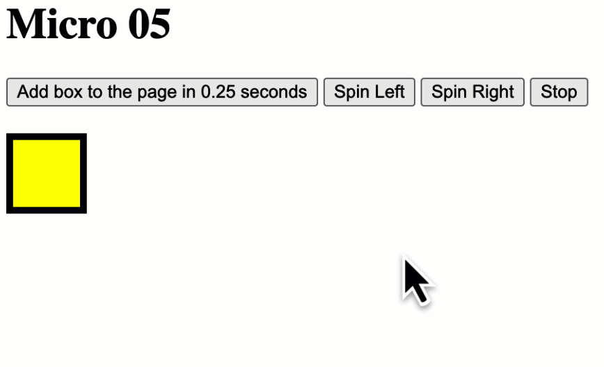

## Programming Challenge

::: info

Please read the directions below and write a program that implements the described features. Please do not add any additional features beyond what is being described here. You can check your work at any time by clicking the "Mark" button, which will trigger a series of automated tests. Your program must pass all of these tests to earn full credit. Note that you should not add in any "DOM Content Loaded" event listeners as this will interfere with the automated tests - instead, write your code inside the script tag set up for this purpose.

> 请阅读下面的说明，并编写一个程序来实现所描述的功能。请不要添加任何超出此处描述的功能。您可以随时通过点击“标记”按钮检查您的工作，这将触发一系列自动化测试。您的课程必须通过所有这些测试才能获得全额学分。注意，您不应该添加任何“DOM Content Loaded”事件监听器，因为这将干扰自动化测试——相反，在为此目的设置的脚本标记中编写代码。

:::

Your task is to edit the index.html HTML document and build a system that allows the user to manipulate a series of boxes using the various timing functions that were covered in this micro assignment.

> 您的任务是编辑 `index.html` HTML 文档并构建一个系统，该系统允许用户使用本微作业中介绍的各种定时函数来操作一系列框。

The HTML interface has been set up for you. Your job is to add JavaScript to the page that does the following:

> HTML 界面已经为您设置好了。你的工作是向页面添加 JavaScript，完成以下任务:

- Clicking on the add_box button should add a div with a class of box to the box_container div after 0.25 seconds has elapsed. Do not add the boxes immediately - instead, do this after a delay of 0.25 seconds (250 milliseconds)

> 单击 add_box 按钮应该在 0.25 秒后将一个带有 box 类的 div 添加到 box_container div 中。不要立即添加方框-而是在 0.25 秒(250毫秒)的延迟后进行此操作

- The boxes should be randomized in some way so they are visually distinct from one another (you can choose how to do this, I'm not super worried about the visuals - I'm mainly concerned that you can create the boxes after a delay)

> 这些盒子应该以某种方式随机化，这样它们在视觉上彼此不同(你可以选择如何做到这一点，我不太担心视觉效果-我主要关心的是你可以在延迟后创建盒子)

- Add functionality to the spin_right, spin_left and stop buttons so that they control the rotation of the spin_box element. The spin_box element should initially be set up so that it is not moving, but but when the spin_left or spin_right buttons it should begin spinning slowly in that direction. The box should spin by 2 degrees to the left or right every 50 milliseconds.

    > 向spin_right、spin_left和stop按钮添加功能，以便它们控制spin_box元素的旋转。spin_box元素最初应该设置为不移动，但是当spin_left或spin_right按钮时，它应该开始向那个方向缓慢旋转。盒子应该每50毫秒向左或向右旋转2度。

    - Hint 1: use the CSS `transform` rule to do this. For example, to rotate a box by 45 degrees you could use this rule: `transform: rotate(45deg) `

    - > 提示1:使用CSS ' transform '规则来做到这一点。例如，要将一个盒子旋转45度，可以使用下面的规则:' transform: rotate(45deg)｀

    - Hint 2: use a variable to keep track of the current angle of your box. Update this angle every few milliseconds and change the CSS rule on the box to show this.
    - > 提示2:使用一个变量来跟踪您的盒子的当前角度。每隔几毫秒更新这个角度，并更改框上的CSS规则来显示这个角度。
    - Hint 3: if you're using `setInterval` to do this make sure you clear your interval before you try spinning or stopping!
    - > 提示3:如果你使用' setInterval '来做这件事，确保你在尝试旋转或停止之前清空了你的间隔!

Here's an example of how your page should work:

> 这里有一个你的页面应该如何工作的例子:



::: tabs

@tab style.css

```css
#controls {
    margin-bottom: 20px;
}

#box_container {
    clear: both;
    margin-top: 100px;
}

#spin_box {
    background-color: yellow;
    border: 5px solid black;
    width: 50px;
    height: 50px;
}

.box {
    float: left;
    width: 50px;
    height: 50px;
    background-color: #ccc;
}
```

@tab index.html

```html
<!doctype html>
<html>

<head>
    <title>Micro 05</title>
    <link rel="stylesheet" href="styles.css">
</head>

<body>
    <h1>Micro 05</h1>

    <div id="controls">
        <button id="add_box">Add box to the page in 1 second</button>
        <button id="spin_left">Spin Left</button>
        <button id="spin_right">Spin Right</button>
        <button id="stop">Stop</button>
    </div>

    <div id="spin_box" class="box"></div>

    <div id="box_container"></div>

    <!-- write your answer in the 'student_answer' script tag -->
    <script id="student_answer">

    </script>

</body>

</html>
```

:::

## Answer

::: tabs

@tab 1.0

未实现延迟 0.25

```html
<!doctype html>
<html>

<head>
    <title>Micro 05</title>
    <link rel="stylesheet" href="styles.css">
</head>

<body>
    <h1>Micro 05</h1>

    <div id="controls">
        <button id="add_box">Add box to the page in 1 second</button>
        <button id="spin_left">Spin Left</button>
        <button id="spin_right">Spin Right</button>
        <button id="stop">Stop</button>
    </div>

    <div id="spin_box" class="box"></div>

    <div id="box_container"></div>

    <!-- write your answer in the 'student_answer' script tag -->
    <script id="student_answer">
        // select the elements
        const addBoxBtn = document.querySelector('#add_box');
        const spinLeftBtn = document.querySelector('#spin_left');
        const spinRightBtn = document.querySelector('#spin_right');
        const stopBtn = document.querySelector('#stop');
        const spinBox = document.querySelector('#spin_box');
        const boxContainer = document.querySelector('#box_container');

        // set initial angle
        let angle = 0;

        // function to create a new box
        function createBox() {
            // create a new div element
            const box = document.createElement('div');
            // add a class to the box
            box.classList.add('box');
            // set a random background color for the box
            const randomColor = '#' + Math.floor(Math.random() * 16777215).toString(16);
            box.style.backgroundColor = randomColor;
            // add the box to the box container after 0.25 seconds
            setTimeout(() => {
                boxContainer.appendChild(box);
            }, 250);
        }

        // add event listeners for the buttons
        addBoxBtn.addEventListener('click', createBox);

        spinLeftBtn.addEventListener('click', () => {
            // clear any existing interval
            clearInterval(intervalId);
            // start spinning left
            intervalId = setInterval(() => {
                angle = (angle - 2) % 360;
                spinBox.style.transform = `rotate(${angle}deg)`;
            }, 50);
        });

        spinRightBtn.addEventListener('click', () => {
            // clear any existing interval
            clearInterval(intervalId);
            // start spinning right
            intervalId = setInterval(() => {
                angle = (angle + 2) % 360;
                spinBox.style.transform = `rotate(${angle}deg)`;
            }, 50);
        });

        stopBtn.addEventListener('click', () => {
            // clear any existing interval
            clearInterval(intervalId);
        });

        // set initial intervalId to null
        let intervalId = null;

    </script>


</body>

</html>
```

@tab 2.0

缺少延迟 0.25s

```html
<!doctype html>
<html>

<head>
    <title>Micro 05</title>
    <link rel="stylesheet" href="styles.css">
</head>

<body>
    <h1>Micro 05</h1>

    <div id="controls">
        <button id="add_box">Add box to the page in 1 second</button>
        <button id="spin_left">Spin Left</button>
        <button id="spin_right">Spin Right</button>
        <button id="stop">Stop</button>
    </div>

    <div id="spin_box" class="box"></div>

    <div id="box_container"></div>

    <!-- write your answer in the 'student_answer' script tag -->
    <script id="student_answer">
        const boxContainer = document.getElementById('box_container');
        const spinBox = document.getElementById('spin_box');
        let spinIntervalId = null;
        let spinAngle = 0;

        // function to add a box after a delay of 0.25s
        function addBox() {
            setTimeout(() => {
                const box = document.createElement('div');
                box.className = 'box';
                box.style.backgroundColor = `#${Math.floor(Math.random() * 16777215).toString(16)}`;
                boxContainer.appendChild(box);
            }, 250);
        }

        // function to spin the box
        function spinBoxFunc(direction) {
            clearInterval(spinIntervalId);

            spinIntervalId = setInterval(() => {
                spinAngle = (spinAngle + (direction === 'left' ? -2 : 2)) % 360;
                spinBox.style.transform = `rotate(${spinAngle}deg)`;
            }, 50);
        }

        // add event listeners to buttons
        document.getElementById('add_box').addEventListener('click', addBox);
        document.getElementById('spin_left').addEventListener('click', () => spinBoxFunc('left'));
        document.getElementById('spin_right').addEventListener('click', () => spinBoxFunc('right'));
        document.getElementById('stop').addEventListener('click', () => clearInterval(spinIntervalId));

    </script>


</body>

</html>
```

@tab 3.0

实现延迟 0.25s

```html
<!doctype html>
<html>

<head>
    <title>Micro 05</title>
    <link rel="stylesheet" href="styles.css">
</head>

<body>
    <h1>Micro 05</h1>

    <div id="controls">
        <button id="add_box">Add box to the page in 1 second</button>
        <button id="spin_left">Spin Left</button>
        <button id="spin_right">Spin Right</button>
        <button id="stop">Stop</button>
    </div>

    <div id="spin_box" class="box"></div>

    <div id="box_container"></div>

    <!-- write your answer in the 'student_answer' script tag -->
    <script id="student_answer">
        // Get DOM elements
        const addBoxButton = document.getElementById('add_box');
        const boxContainer = document.getElementById('box_container');
        const spinBox = document.getElementById('spin_box');
        const spinLeftButton = document.getElementById('spin_left');
        const spinRightButton = document.getElementById('spin_right');
        const stopButton = document.getElementById('stop');

        // Add box with delay
        function addBox() {
            const box = document.createElement('div');
            box.classList.add('box');
            box.style.backgroundColor = getRandomColor();
            boxContainer.appendChild(box);
        }

        function getRandomColor() {
            const red = Math.floor(Math.random() * 256);
            const green = Math.floor(Math.random() * 256);
            const blue = Math.floor(Math.random() * 256);
            return `rgb(${red},${green},${blue})`;
        }

        let intervalId = null;
        let angle = 0;

        function spinLeft() {
            if (intervalId !== null) {
                clearInterval(intervalId);
            }
            intervalId = setInterval(() => {
                angle -= 2;
                spinBox.style.transform = `rotate(${angle}deg)`;
            }, 50);
        }

        function spinRight() {
            if (intervalId !== null) {
                clearInterval(intervalId);
            }
            intervalId = setInterval(() => {
                angle += 2;
                spinBox.style.transform = `rotate(${angle}deg)`;
            }, 50);
        }

        function stop() {
            clearInterval(intervalId);
            intervalId = null;
        }

        // Add box with delay
        addBoxButton.addEventListener('click', () => {
            setTimeout(addBox, 250);
        });

        // Spin box buttons
        spinLeftButton.addEventListener('click', spinLeft);
        spinRightButton.addEventListener('click', spinRight);
        stopButton.addEventListener('click', stop);


    </script>


</body>

</html>
```

@tab 完整代码

```html
<!doctype html>
<html>

<head>
    <title>Micro 05</title>
    <link rel="stylesheet" href="styles.css">
</head>

<body>
    <h1>Micro 05</h1>

    <div id="controls">
        <button id="add_box">Add box to the page in 0.25 seconds</button>
        <button id="spin_left">Spin Left</button>
        <button id="spin_right">Spin Right</button>
        <button id="stop">Stop</button>
    </div>

    <div id="spin_box" class="box"></div>

    <div id="box_container"></div>

    <!-- write your answer in the 'student_answer' script tag -->
    <script id="student_answer">
        let spinBox = document.getElementById('spin_box');
        let boxContainer = document.getElementById('box_container');
        let addBoxBtn = document.getElementById('add_box');
        let spinLeftBtn = document.getElementById('spin_left');
        let spinRightBtn = document.getElementById('spin_right');
        let stopBtn = document.getElementById('stop');
        let boxCount = 0;
        let angle = 0;
        let spinInterval;

        addBoxBtn.addEventListener('click', function () {
            setTimeout(function () {
                let box = document.createElement('div');
                let size = Math.floor(Math.random() * 50 + 50);
                box.style.width = `${size}px`;
                box.style.height = `${size}px`;
                box.style.backgroundColor = `rgb(${Math.floor(Math.random() * 256)},${Math.floor(Math.random() * 256)},${Math.floor(Math.random() * 256)})`;
                box.classList.add('box');
                boxContainer.appendChild(box);
                boxCount++;
            }, 250);
        });

        spinLeftBtn.addEventListener('click', function () {
            clearInterval(spinInterval);
            spinInterval = setInterval(function () {
                angle -= 2;
                spinBox.style.transform = `rotate(${angle}deg)`;
            }, 50);
        });

        spinRightBtn.addEventListener('click', function () {
            clearInterval(spinInterval);
            spinInterval = setInterval(function () {
                angle += 2;
                spinBox.style.transform = `rotate(${angle}deg)`;
            }, 50);
        });

        stopBtn.addEventListener('click', function () {
            clearInterval(spinInterval);
        });
    </script>

</body>

</html>
```

@tab 语法说明

```javascript
// 获取 HTML 元素
const addBoxButton = document.getElementById('add_box');
const spinBox = document.getElementById('spin_box');
const spinLeftButton = document.getElementById('spin_left');
const spinRightButton = document.getElementById('spin_right');
const stopButton = document.getElementById('stop');
const boxContainer = document.getElementById('box_container');
const colors = ['#f94144', '#f3722c', '#f8961e', '#f9844a', '#90be6d', '#43aa8b', '#4d908e', '#577590', '#277da1', '#264653'];
const boxSize = ['30px', '40px', '50px', '60px', '70px', '80px', '90px', '100px', '110px', '120px'];

// 点击 add_box 按钮，延迟 0.25 秒添加一个颜色块到页面上
addBoxButton.addEventListener('click', () => {
  setTimeout(() => {
    const newBox = document.createElement('div');
    newBox.classList.add('box');
    newBox.style.backgroundColor = colors[Math.floor(Math.random() * colors.length)];
    newBox.style.width = boxSize[Math.floor(Math.random() * boxSize.length)];
    newBox.style.height = newBox.style.width;
    boxContainer.appendChild(newBox);
  }, 250);
});

let angle = 0; // 初始角度

// 点击 spin_left 按钮，让颜色块向左旋转
spinLeftButton.addEventListener('click', () => {
  clearInterval(intervalId); // 清除之前的定时器
  angle = angle - 2; // 调整角度
  spinBox.style.transform = `rotate(${angle}deg)`; // 旋转
  intervalId = setInterval(() => { // 设置定时器，不断旋转
    angle = angle - 2;
    spinBox.style.transform = `rotate(${angle}deg)`;
  }, 50);
});

// 点击 spin_right 按钮，让颜色块向右旋转
spinRightButton.addEventListener('click', () => {
  clearInterval(intervalId); // 清除之前的定时器
  angle = angle + 2; // 调整角度
  spinBox.style.transform = `rotate(${angle}deg)`; // 旋转
  intervalId = setInterval(() => { // 设置定时器，不断旋转
    angle = angle + 2;
    spinBox.style.transform = `rotate(${angle}deg)`;
  }, 50);
});

let intervalId = null; // 定时器的 ID

// 点击 stop 按钮，停止颜色块的旋转
stopButton.addEventListener('click', () => {
  clearInterval(intervalId); // 清除定时器
});
```

以下是一些常见的 JavaScript 语法说明：

1. 变量声明：使用 `var`、`let` 或 `const` 关键字来声明变量，其中 `var` 是旧版的语法，`let` 和 `const` 是新版的语法。`let` 和 `const` 是块级作用域，而 `var` 是函数级作用域。
2. 数据类型：JavaScript 中的基本数据类型包括数字、字符串、布尔值、null 和 undefined。还有一些复杂数据类型，如对象、数组、函数等。
3. 运算符：JavaScript 支持各种运算符，包括算术运算符（加、减、乘、除等）、比较运算符（大于、小于、等于等）、逻辑运算符（与、或、非等）等。
4. 条件语句：使用 `if` 语句来实现条件判断，还可以使用 `switch` 语句来实现多重条件分支。
5. 循环语句：使用 `for`、`while`、`do...while` 等语句来实现循环。
6. 函数：使用 `function` 关键字来定义函数，也可以使用箭头函数来定义函数。函数可以接受参数，并可以返回值。
7. 对象：JavaScript 中的对象是一种复杂数据类型，用于存储数据和方法。对象由属性和方法组成，属性是一些键值对，方法是对象的函数。
8. 数组：数组是一种特殊的对象，用于存储一组数据。数组的元素可以是任意类型的数据。
9. DOM 操作：JavaScript 可以通过操作文档对象模型（DOM）来实现动态的网页效果。常见的 DOM 操作包括获取元素、添加元素、修改元素属性等。
10. 异步编程：JavaScript 是一种单线程语言，但是可以通过异步编程实现非阻塞式的程序执行。异步编程包括回调函数、Promise 和 async/await 等技术。

:::

欢迎关注我公众号：AI悦创，有更多更好玩的等你发现！


::: details 公众号：AI悦创【二维码】


:::

::: info AI悦创·编程一对一

AI悦创·推出辅导班啦，包括「Python 语言辅导班、C++ 辅导班、java 辅导班、算法/数据结构辅导班、少儿编程、pygame 游戏开发」，全部都是一对一教学：一对一辅导 + 一对一答疑 + 布置作业 + 项目实践等。当然，还有线下线上摄影课程、Photoshop、Premiere 一对一教学、QQ、微信在线，随时响应！微信：Jiabcdefh

C++ 信息奥赛题解，长期更新！长期招收一对一中小学信息奥赛集训，莆田、厦门地区有机会线下上门，其他地区线上。微信：Jiabcdefh

方法一：[QQ](http://wpa.qq.com/msgrd?v=3&uin=1432803776&site=qq&menu=yes)

方法二：微信：Jiabcdefh

:::

