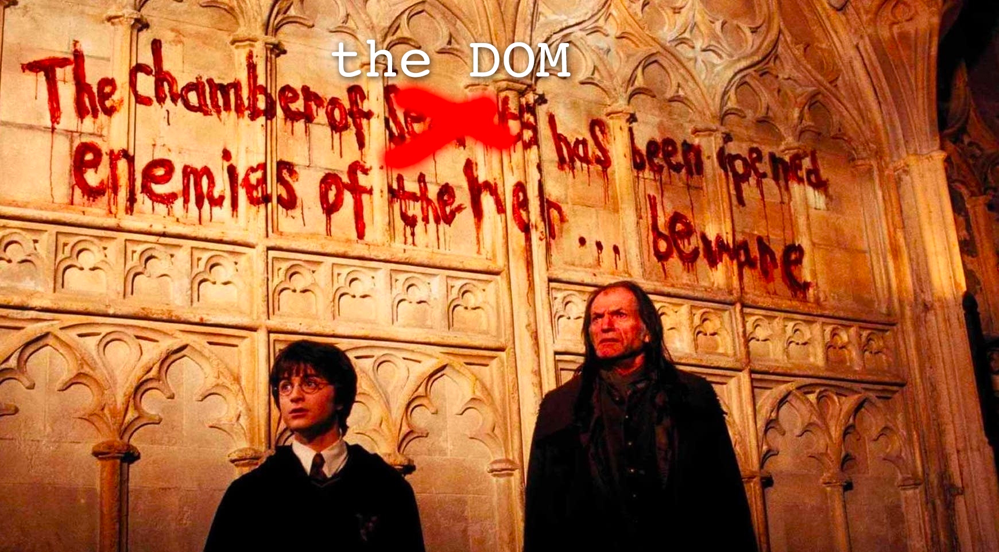
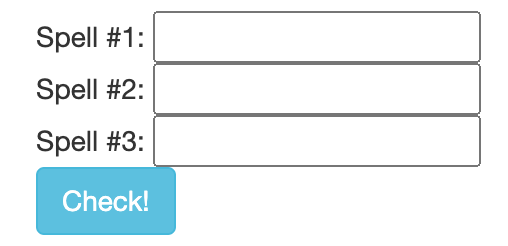
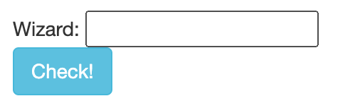
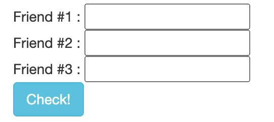
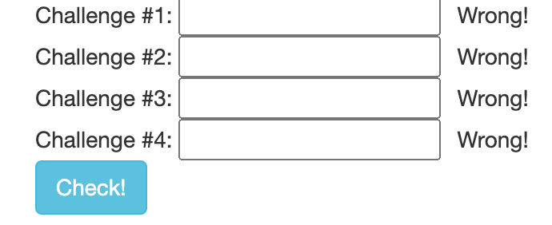

## Macro Assignment #04: Harry Potter and the Chamber of the DOM!

> 宏观作业#04:哈利·波特与DOM密室!

The wizards at Hogwarts need your help! Voldemort has apparently been taking a web development class and is creating havoc by casting a wide array of dangerous JavaScript spells!

> 霍格沃茨的巫师需要你的帮助!伏地魔显然在上网络开发课，并通过施放各种危险的 JavaScript 咒语造成了严重破坏!

Your mission is to work through five challenges (4 'starter' challenges and a final one.) Each challenge is based on a single HTML file. Read through the comments in the HTML file to determine your task, and then solve it using your HTML, CSS and JavaScript skills! When you solve a challenge you can come back here and input any magical results that appear by using the buttons below. Finishing a challenge will reward you with a password. If you collect all four passwords you can open up the final challenge. [The source code for the first four challenges can be downloaded here](https://cs.nyu.edu/courses/spring23/CSCI-UA.0061-001/assignment04/assignment04-harry_potter_challenges.zip).

- [24-assignment04](/1v1/06-KAI/24-assignment04/assignment04-harry_potter_challenges.zip)

> 你的任务是完成五个挑战(4个“初始”挑战和一个最终挑战)。每个挑战都基于一个 HTML 文件。阅读 HTML 文件中的注释来确定您的任务，然后使用您的 HTML, CSS 和 JavaScript 技能来解决它!当你解决了一个挑战，你可以回到这里，输入任何神奇的结果出现使用下面的按钮。完成一个挑战将奖励你一个密码。如果你收集到所有四个密码，你就可以开始最后的挑战了。前四项挑战的源代码可以在这里下载。

When you are finished you should create a new webpage called `assignment04.html` in your webdev folder. This page should link to the four challenges you worked on here. Also zip up your work and submit it to Brightspace, as usual.

> 当你完成后，你应该在你的webdev文件夹中创建一个名为assignment04.html的新网页。这个页面应该链接到你在这里进行的四个挑战。和往常一样，把你的作品压缩并提交给Brightspace。

:::: tabs

@tab Challenge #1

## Pixel Spells!

> 像素的法术!

Cast a series of spells to cause the names of familiar Harry Potter words to appear. Instructions on how to get started can be found in the file 01.html. To check your work type your answers into the blanks below. When you successfully cast all of the spells you will be given a password to prove that you have mastered this challenge!

> 施放一系列咒语，使熟悉的哈利波特单词的名字出现。关于如何开始的说明可以在文件01.html中找到。为了检查你的作业，把你的答案打在下面的空格里。当你成功施放所有咒语时，你将获得一个密码，以证明你已经掌握了这个挑战!

@tab Challenge #2

## Wizard Summoning!

> 巫师召唤!

Dumbledore needs your help to summon a wizard to Hogwarts! Solve the challenge described in the file 02.html. To check your work type your answer into the blank below. When you successfully cast the spell you will be given a password to prove that you have mastered this challenge!

> 邓布利多需要你帮忙召唤一名巫师到霍格沃茨!解决文件02.html中描述的挑战。在下面的空白处输入你的答案，检查你的作业。当你成功施放咒语时，你将获得一个密码，以证明你已经掌握了这个挑战!

@tab Challenge #3

## Disentanglement!

> 解开纠结!

A powerful ally of Voldemorte has trapped some of Harry's friends in a magical force field. Use your JavaScript skills to disentangle his friends and redirect the spell to Azkaban!

> 伏地魔的一个强大盟友将哈利的一些朋友困在了一个魔法力场中。用你的JavaScript技巧解开他的朋友们，把咒语重定向到阿兹卡班!

@tab Challenge #4

## Locked Potions Cabinet!

> 魔药柜上锁了!

Professor Snape has locked his potions cabinet and he can't get it open! Solve the challenge described in the file to help Snape break the lock that prevents him from opening the cabinet. To check your work type what was found in the cabinet into the blank below. When you successfully open the cabinet you will be given a password to prove that you have mastered this challenge!

> 斯内普教授把他的魔药柜锁上了，打不开!解决文件中描述的挑战，帮助斯内普打破阻止他打开柜子的锁。要检查你的工作类型，在柜子里找到什么放进下面的空白处。当你成功地打开柜子时，你会得到一个密码来证明你已经掌握了这个挑战!

@tab Final Challenge

## Final Challenge!

> 最后的挑战!

Type in the four passwords you have obtained throughout your journey. You will then be presented with the final challenge!

> 输入你在旅途中获得的四个密码。然后你将面临最后的挑战!

::::

## Grading Rubric (25 points)

- Challenge 1: 3 points
- Challenge 2: 3 points
- Challenge 3: 3 points
- Challenge 4: 3 points
- Final Challenge: 13 points

欢迎关注我公众号：AI悦创，有更多更好玩的等你发现！

::: details 公众号：AI悦创【二维码】

:::

::: info AI悦创·编程一对一

AI悦创·推出辅导班啦，包括「Python 语言辅导班、C++ 辅导班、java 辅导班、算法/数据结构辅导班、少儿编程、pygame 游戏开发」，全部都是一对一教学：一对一辅导 + 一对一答疑 + 布置作业 + 项目实践等。当然，还有线下线上摄影课程、Photoshop、Premiere 一对一教学、QQ、微信在线，随时响应！微信：Jiabcdefh

C++ 信息奥赛题解，长期更新！长期招收一对一中小学信息奥赛集训，莆田、厦门地区有机会线下上门，其他地区线上。微信：Jiabcdefh

方法一：[QQ](http://wpa.qq.com/msgrd?v=3&uin=1432803776&site=qq&menu=yes)

方法二：微信：Jiabcdefh

:::

