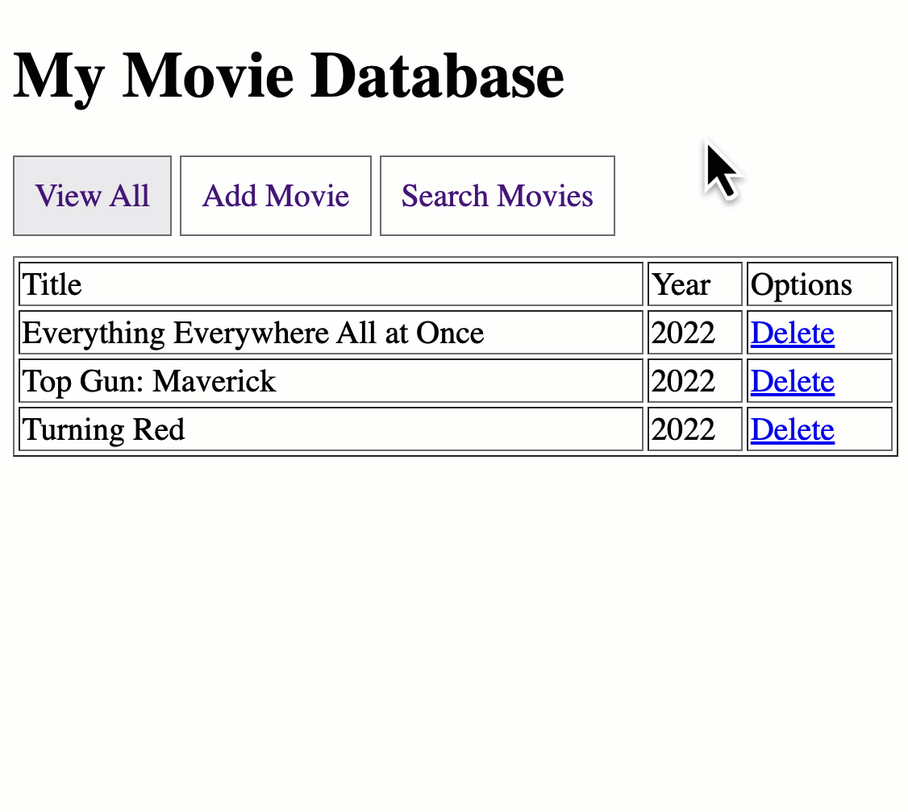

[In class code (ZIP)](https://cs.nyu.edu/courses/spring23/CSCI-UA.0061-001/assignment08.zip)

[In class code (ZIP)](/1v1/06-KAI/34-Assignment-08-Interactive-Database/assignment08.zip)

Note: The majority of this assignment uses only HTML, CSS and PHP - very little (if any) JavaScript is necessary  to solve this problem.  I've outlined the technologies needed for each  feature below.

> 注意:这个作业的大部分只使用HTML, CSS和PHP -很少(如果有的话)需要 JavaScript 来解决这个问题。我在下面概述了每个特性所需的技术。

For this assignment you will be creating a website that will allow  your users to interact with a database.  For the basic version of the  system the user should be able to do the following:

> 对于这项作业，你将创建一个网站，将允许你的用户与数据库进行交互。对于系统的基本版本，用户应该能够做到以下几点:

- View all records in a table「查看表中的所有记录」
- Add new records to a table「向表中添加新记录」
- Delete records from a table「从表中删除记录」
- Search for records from a table「从表中搜索记录」

Here's a quick video that shows the basic features of the system:

> 这里有一个简短的视频，展示了该系统的基本功能:

Web 结构如下：

```html
<h1>My Movie Database</h1>
View All  Add Movie  Search Movies

View All 按钮下表格为：
显示一个表格，表格结构从左到右依次为：Title、Year、Option。Title 下显示 Add Movie 的 Title 数据，Year 下显示的数据是 Add Movie 添加的 Year。「其实就是读取 Add Movie 保存在数据库中的数据。」Option 下有显示 Delete 删除该条数据。删除显示 Movie was deleted successfully!

Add Movie 按钮下具有：Title 和 Year 的输入框（也就是表单），并有 Save 按钮保存到 Sqlite 数据库。添加成功后，在新的表单上面显示 Movie was added successfully!

Search Movies 这个按钮下实现了查找功能，可以实现标题查找和日期查找，不一定需要完完全全一样。符合日期的都显示在下面；符合部分标题或者全部标题的都返回显示。
```





```
Assignment 08: Interactive Database
Note: The majority of this assignment uses only HTML, CSS and PHP - very little (if any) JavaScript is necessary to solve this problem. I've outlined the technologies needed for each feature below.
For this assignment you will be creating a website that will allow your users to interact with a database. For the basic version of the system the user should be able to do the following:
- View all records in a table
- Add new records to a table
- Delete records from a table
- Search for records from a table

Here's a quick gif that shows the basic features of the system:
<h1>My Movie Database</h1>
View All  Add Movie  Search Movies

View All 按钮下表格为：
显示一个表格，表格结构从左到右依次为：Title、Year、Option。Title 下显示 Add Movie 的 Title 数据，Year 下显示的数据是 Add Movie 添加的 Year。「其实就是读取 Add Movie 保存在数据库中的数据。」Option 下有显示 Delete 删除该条数据。删除显示 Movie was deleted successfully!

Add Movie 按钮下具有：Title 和 Year 的输入框（也就是表单），并有 Save 按钮保存到 Sqlite 数据库。添加成功后，在新的表单上面显示 Movie was added successfully!

Search Movies 这个按钮下实现了查找功能，可以实现标题查找和日期查找，不一定需要完完全全一样。符合日期的都显示在下面；符合部分标题或者全部标题的都返回显示。
```


## Answer 

```php
<?php
$db = new PDO('sqlite:movie_database.sqlite');

function get_all_movies($db)
{
    $stmt = $db->prepare("SELECT * FROM movies");
    $stmt->execute();
    return $stmt->fetchAll(PDO::FETCH_ASSOC);
}


function add_movie($db, $title, $year)
{
    $stmt = $db->prepare("INSERT INTO movies (title, year) VALUES (:title, :year)");
    $stmt->bindParam(':title', $title);
    $stmt->bindParam(':year', $year);
    return $stmt->execute();
}

function delete_movie($db, $id)
{
    $stmt = $db->prepare("DELETE FROM movies WHERE id = :id");
    $stmt->bindParam(':id', $id);
    return $stmt->execute();
}

function search_movies($db, $search_title, $search_year)
{
    $search_title = empty($search_title) ? "%" : "%$search_title%";
    $search_year = empty($search_year) ? "%" : "%$search_year%";
    $stmt = $db->prepare("SELECT * FROM movies WHERE title LIKE :search_title AND year LIKE :search_year");
    $stmt->bindParam(':search_title', $search_title);
    $stmt->bindParam(':search_year', $search_year);
    $stmt->execute();
    return $stmt->fetchAll(PDO::FETCH_ASSOC);
}

$db->exec("CREATE TABLE IF NOT EXISTS movies (id INTEGER PRIMARY KEY AUTOINCREMENT, title TEXT NOT NULL, year INTEGER NOT NULL)");

$message = '';
//$add_success = isset($_GET['add_success']);
//$delete_success = isset($_GET['delete_success']);
$add_success = isset($_GET['add_success']) && isset($_GET['show_section']) && $_GET['show_section'] === 'add_movie';
$delete_success = isset($_GET['delete_success']) && isset($_GET['show_section']) && $_GET['show_section'] === 'view_all';

$search_results = [];
$show_search_movies = false;
if ($_SERVER['REQUEST_METHOD'] == 'POST') {
    if (isset($_POST['add_movie'])) {
        add_movie($db, $_POST['title'], $_POST['year']);
        $message = "Movie was added successfully!";
//        header('Location: index.php?add_success=1');
        header('Location: index.php?add_success=1&show_section=add_movie');
        exit;
    } elseif (isset($_POST['delete_movie'])) {
        delete_movie($db, $_POST['movie_id']);
        $message = "Movie was deleted successfully!";
//        header('Location: index.php?delete_success=1');
        header('Location: index.php?delete_success=1&show_section=view_all');
        exit;
    } elseif (isset($_POST['search_movies'])) {
        $search_results = search_movies($db, $_POST['search_title'], $_POST['search_year']);
        $show_search_movies = true;
    }
}

$all_movies = get_all_movies($db);
?>
<!DOCTYPE html>
<html>
<head>
    <style>
        /* Add your CSS styles here */
        .hidden {
            display: none;
        }

        table {
            border-collapse: collapse;
            width: 100%;
        }

        th, td {
            border: 1px solid black;
            padding: 8px;
            text-align: left;
        }

        th {
            background-color: #f2f2f2;
        }

        /*按钮*/
        .option-btn {
            display: inline-block;
            padding: 10px 20px;
            border: 1px solid #ccc;
            background-color: #f2f2f2;
            text-align: center;
            cursor: pointer;
            margin-right: 10px;
        }

        .option-btn:hover {
            background-color: #e0e0e0;
        }

        .option-btn.selected {
            background-color: #d0d0d0;
            border-color: #aaa;
        }

        .success-message {
            background-color: #dff0d8;
            color: #3c763d;
            padding: 10px;
            margin-bottom: 10px;
            border: 1px solid #d6e9c6;
            border-radius: 4px;
        }

        .added-success {
            background-color: #d9edf7;
            color: #31708f;
            padding: 10px;
            margin-bottom: 10px;
            border: 1px solid #bce8f1;
            border-radius: 4px;
        }

        .deleted-success {
            background-color: #f2dede;
            color: #a94442;
            padding: 10px;
            margin-bottom: 10px;
            border: 1px solid #ebccd1;
            border-radius: 4px;
        }

    </style>
    <script type="module"></script>

    <script>
        function hideMessage() {
            const messages = document.querySelectorAll('.added-success, .deleted-success');
            messages.forEach(message => message.style.display = 'none');
        }

        // function showSection(sectionId) {
        //     const sections = ['add_movie', 'view_all', 'search_movies'];
        //     const buttons = ['view_all_btn', 'add_movie_btn', 'search_movies_btn'];
        //     sections.forEach((id) => {
        //         document.getElementById(id).style.display = (id === sectionId) ? 'block' : 'none';
        //     });
        //     buttons.forEach((id) => {
        //         document.getElementById(id).classList.toggle('selected', id === (sectionId + '_btn'));
        //     });
        //
        //     // 移除 URL 参数
        //     removeURLParameters(['add_success', 'delete_success']);
        // }
        function showSection(sectionId) {
            hideMessage();  // 添加这一行来隐藏消息
            const sections = ['add_movie', 'view_all', 'search_movies'];
            const buttons = ['view_all_btn', 'add_movie_btn', 'search_movies_btn'];
            sections.forEach((id) => {
                document.getElementById(id).style.display = (id === sectionId) ? 'block' : 'none';
            });
            buttons.forEach((id) => {
                document.getElementById(id).classList.toggle('selected', id === (sectionId + '_btn'));
            });

            // 移除 URL 参数
            removeURLParameters(['add_success', 'delete_success']);
        }


        // Show "Search Movies" section after form submission
        //document.addEventListener('DOMContentLoaded', function () {
        //    < ?php //if ($show_search_movies): ?>
        //    showSection('search_movies');
        //    < ?php //endif; ?>
        //});
        document.addEventListener('DOMContentLoaded', function () {
            const urlParams = new URLSearchParams(window.location.search);

            if (urlParams.has('show_section')) {
                showSection(urlParams.get('show_section'));
            } else {
                showSection('view_all');
            }

            <?php if ($show_search_movies): ?>
            showSection('search_movies');
            <?php endif; ?>

            // 显示成功消息
            <?php if ($add_success): ?>
            document.querySelector('.added-success').style.display = 'block';
            <?php endif; ?>

            <?php if ($delete_success): ?>
            document.querySelector('.deleted-success').style.display = 'block';
            <?php endif; ?>
        });


        function removeURLParameters(paramsToRemove) {
            const url = new URL(window.location.href);
            paramsToRemove.forEach(param => url.searchParams.delete(param));
            window.history.replaceState({}, document.title, url.toString());
        }

    </script>
</head>
<body>
<h1>My Movie Database</h1>

<?php if ($message): ?>
    <p><?= $message ?></p>
<?php endif; ?>


<div id="view_all_btn" class="option-btn" onclick="showSection('view_all')">View All</div>
<div id="add_movie_btn" class="option-btn" onclick="showSection('add_movie')">Add Movie</div>
<div id="search_movies_btn" class="option-btn" onclick="showSection('search_movies')">Search Movies</div>
<?php if ($add_success): ?>
    <p class="added-success">Movie was added successfully!</p>
<?php endif; ?>

<?php if ($delete_success): ?>
    <p class="deleted-success">Movie was deleted successfully!</p>
<?php endif; ?>


<div id="add_movie" class="hidden">
    <!--<div id="add_movie">-->
    <h2>Add Movie</h2>
    <form method="post">
        <label for="title">Title:</label>
        <input type="text" name="title" id="title" required><br>
        <label for="year">Year:</label>
        <input type="number" name="year" id="year" min="1900" max="9999" required>
        <input type="submit" name="add_movie" value="Save">
    </form>
</div>

<div id="view_all" class="hidden">
    <!--<div id="view_all">-->
    <h2>View All Movies</h2>
    <table border="1">
        <tr>
            <th>Title</th>
            <th>Year</th>
            <th>Option</th>
        </tr>
        <?php foreach ($all_movies as $movie): ?>
            <tr>
                <td><?= htmlspecialchars($movie['title']) ?></td>
                <td><?= htmlspecialchars($movie['year']) ?></td>
                <td>
                    <form method="post">
                        <input type="hidden" name="movie_id" value="<?= $movie['id'] ?>">
                        <input type="submit" name="delete_movie" value="Delete">
                    </form>
                </td>
            </tr>
        <?php endforeach; ?>
    </table>
</div>

<div id="search_movies" class="hidden">
    <h2>Search Movies</h2>
    <form method="post">
        <label for="search_title">Search by Title:</label>
        <input type="text" name="search_title" id="search_title"><br>
        <label for="search_year">Search by Year:</label>
        <input type="number" name="search_year" id="search_year" min="1900" max="9999">
        <input type="submit" name="search_movies" value="Search">
    </form>
    <?php if (isset($search_results)): ?>
        <h3>Search Results</h3>
        <ul>
            <?php foreach ($search_results as $result): ?>
                <li><?= htmlspecialchars($result['title']) ?> (<?= htmlspecialchars($result['year']) ?>)</li>
            <?php endforeach; ?>
        </ul>
    <?php endif; ?>
</div>

</body>
</html>
```

欢迎关注我公众号：AI悦创，有更多更好玩的等你发现！


::: details 公众号：AI悦创【二维码】


:::

::: info AI悦创·编程一对一

AI悦创·推出辅导班啦，包括「Python 语言辅导班、C++ 辅导班、java 辅导班、算法/数据结构辅导班、少儿编程、pygame 游戏开发」，全部都是一对一教学：一对一辅导 + 一对一答疑 + 布置作业 + 项目实践等。当然，还有线下线上摄影课程、Photoshop、Premiere 一对一教学、QQ、微信在线，随时响应！微信：Jiabcdefh

C++ 信息奥赛题解，长期更新！长期招收一对一中小学信息奥赛集训，莆田、厦门地区有机会线下上门，其他地区线上。微信：Jiabcdefh

方法一：[QQ](http://wpa.qq.com/msgrd?v=3&uin=1432803776&site=qq&menu=yes)

方法二：微信：Jiabcdefh

:::

