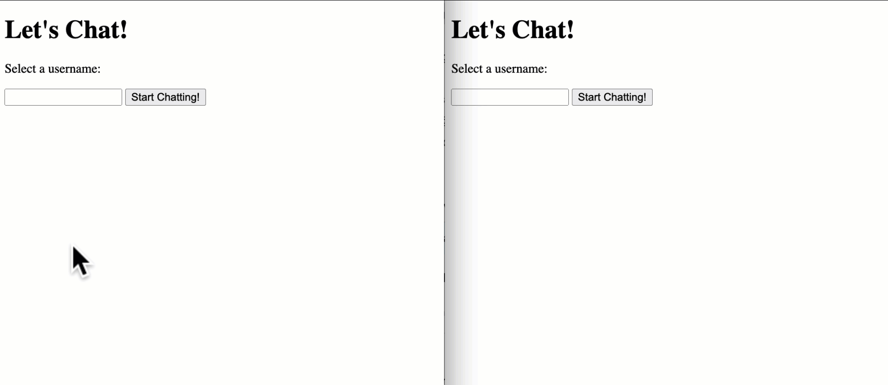

```php
"messages.db" (database)

CREATE TABLE chats (id integer primary key autoincrement, nickname text, message text);


"index.html"

<!DOCTYPE html>
<html>
    <head>
        <title>Let's Chat!</title>
        <style>
            #previous_messages {
                width: 100%;
                height: 300px;
                resize: none;
            }
            .hidden {
                display: none;
            }
        </style>
        <script src="helpers.js"></script>
    </head>
    <body>
        <h1>Let's Chat!</h1>

        <div id="panel_nickname">
            <input type="text" id="nickname">
            <button id="button_savenickname">Save Nickname & Chat</button>
        </div>

        <div id="panel_chat" class="hidden">
            <textarea id="previous_messages" readonly></textarea>
            <input type="text" id="message">
            <button id="button_sendmessage">Send Message</button>
        </div>

        <script>
            // global variables
            let userNickname;

            // figure out when the user saves their nickname
            document.querySelector('#button_savenickname').onclick = function(e) {

                // store the nickname for future use
                userNickname = document.querySelector('#nickname').value;

                // hide the nickname panel
                document.querySelector('#panel_nickname').classList.add('hidden');

                // show the chat panel
                document.querySelector('#panel_chat').classList.remove('hidden');
            }

            // when the user types in a new chat message
            document.querySelector('#button_sendmessage').onclick = function(e) {

                // contact the server with our message AND our nickname
                performFetch({
                    url: 'api.php?command=save',
                    method: 'post',
                    data: {
                        nickname: userNickname,
                        message: document.querySelector('#message').value
                    },
                    success: function(data) {
                        console.log("SUCCESS");
                        console.log(data);
                        if (data != "MISSINGDATA") {
                            document.querySelector('#previous_messages').value += data + "\n";
                        }
                    },
                    error: function(error) {
                        console.log("ERROR");
                    }
                })

            }

            function getAllMessages() {

                performFetch({
                    url: 'api.php',
                    method: 'get',
                    data: {
                        command: 'get_all_messages'
                    },
                    success: function(data) {
                        console.log(data);


                        // take what the server gave us and turn it into a JS object
                        data = JSON.parse( data );

                        console.log(data);

                        document.querySelector('#previous_messages').value = '';

                        for (let i = 0; i < data.length; i++) {
                            document.querySelector('#previous_messages').value += data[i] + "\n";
                        }
                    },
                    error: function(error) {
                        console.log(error);
                    }
                })
            }

            setInterval(
                getAllMessages,
                3000
            );


        </script>

    </body>

</html>


"helpers.js"

function performFetch(args) {
    /* args is an object that is formatted as follows:

        {
            // the URL to contact on the server
            url: url_to_contact

            // request method ('get' or 'post')
            method: 'get',

            // object of variables to send to the server
            data: {
                var1: value1,
                var2: value2,
                var3: value3 // ... etc
            },

            // function to run if request succeeds, should accept a single argument which is the data returned by the server
            success: function(data), 

            // function to run if request fails, should accept a single argument which is the error message
            error: function(error) 
        }
        
    */

    // GET requests
    if (args.method && args.method.toLowerCase() == 'get') {

        // package up the data to send to the server
        const params = new URLSearchParams();
        for (const varName in args.data) {
            params.append(varName, args.data[varName]);
        }

        // append variables to URL
        args.url += '?' + params.toString();

        // perform the fetch request
        fetch(args.url)
            .then(function(response) {
                if (response.ok) {
                    return response.text();
                }
                else {
                    let error = new Error("server error");
                    throw error;
                }
            })
            
            // call the provided success callback function
            .then(function(text) {
                args.success(text);
            })
            
            // call the provided error callback function
            .catch(function(error) {
                args.error(error);
            });

    } // end GET request

    // POST requests
    else if (args.method && args.method.toLowerCase() == 'post') {

        // package up the data to send to the server
        // note that this is designed specifically to contact a PHP script
        // we will use a slightly different approach when we contact
        // node.js scripts in the next unit
        const formData = new FormData();
        for (const key in args.data) {
            if (args.data.hasOwnProperty(key)) {
                formData.append(key, args.data[key]);
            }
        }

        // perform the fetch request
        fetch(args.url, {
            method: "POST",
            body: formData,
        })
        .then(function(response) {
            if (response.ok) {
                return response.text();
            }
            else {
                let error = new Error("server error");
                throw error;
            }
        })
        
        // call the provided success callback function        
        .then(function(text) {
            args.success(text);
        })
        
        // call the provided error callback function        
        .catch(function(error) {
            args.error(error);
        });

    } // end POST request

}


"api.php"

<?php

    // get command
    $command = $_GET['command'];


    // command: save
    // inputs:  a nickname and a message
    // outputs: a copy of the message, or 'error'
    if ($command == 'save') {

        $nickname = $_POST['nickname'];
        $message  = $_POST['message'];

        // basic validation
        if ($nickname && $message) {
            // save this message into our database
            $db = new SQLite3(  getcwd() . '/database/messages.db'  );
            $sql = "INSERT INTO messages (nickname, message) VALUES (:nick, :msg)";
            $statement = $db->prepare($sql);
            $statement->bindParam(':nick', $nickname);
            $statement->bindParam(':msg', $message);
            $statement->execute();

            print $nickname . ": " . $message;
        }

        else {
            print "MISSINGDATA";
        }

        $db->close();
        unset($db);

    }
    
    // command: get_all_messages
    // inputs:  none
    // output:  all previous messages, formatted as a JSON array
    if ($command == 'get_all_messages') {
        $db = new SQLite3(  getcwd() . '/database/messages.db'  );
        $sql = "SELECT nickname, message FROM messages";
        $statement = $db->prepare($sql);
        $result = $statement->execute();

        $return_array = array();
        while ($temp_array = $result->fetchArray()) {


            array_push( $return_array, $temp_array['nickname'] . ": " . $temp_array['message']);

        }

        $db->close();
        unset($db);

        print json_encode($return_array);
       
    }


?>
```

For this program you'll be creating a basic chat room that will  support multiple participants.  Here's a quick video to show how the  basic functionality of the site should work (the video depicts two  different browser windows running the same program):

> 对于这个程序，你将创建一个支持多个参与者的基本聊天室。这里有一个快速的视频展示网站的基本功能应该如何工作（视频展示了运行同一程序的两个不同浏览器窗口）：




- HTML & CSS 	        	

    - A content panel that asks the user to provide a  nickname. This panel should  include a button that can be used to save  the nickname. This panel should be visible when the page loads.

        > 一个要求用户提供昵称的内容面板。这个面板应该包括一个按钮，可以用来保存昵称。这个面板在页面加载时应该可见。

    - A content panel that displays the previous chat history, a text box for new chat messages and a button. This panel should be  invisible when the page loads.

        > 一个内容面板，显示先前的聊天历史记录，有一个文本框用于发送新的聊天消息和一个按钮。这个面板在页面加载时应该是不可见的。

    - Format your page so that it's visually appealing, though you don't need to go too crazy with this.

        > 将您的页面格式化，使其在视觉上具有吸引力，但您不需要过于疯狂。

- Back-end setup

    「后端设置」 	        	

    - You can choose to use either databases or  text files as a data storage mechanism for this project. You don't have  to use both techniques - just choose the one you feel most comfortable  using. 

        >  你可以选择使用数据库或文本文件作为这个项目的数据存储机制。你不必同时使用这两种技术——只需要选择你感觉最舒适的一种即可。                          

        - Text files

            >  文本文件。                                   

            - Set up a 'data' folder -  make sure you have full permissions to read and write to this folder.  You will want your 'data' folder stored inside of your 'public_html'  folder so that a client's browser can access it directly using a fetch  request.

                > 建立一个名为"data"的文件夹，并确保你具有对该文件夹的读写完全权限。你希望将"data"文件夹存储在"public_html"文件夹内，这样客户端浏览器可以使用fetch请求直接访问它。

            - Set up a 'config.php' file that contains a path variable that points to this folder.  You can use the `getcwd()` function in PHP to easily identify the full path to the folder.

                > 建立一个名为“config.php”的文件，其中包含一个路径变量，指向这个文件夹。您可以在PHP中使用`getcwd()`函数轻松地识别文件夹的完整路径。

        - Database                                    

            - Set up a 'database' folder - make sure you have full permissions to read and write to this folder.  You can choose where you want to store this folder, but the safest place to store it would be outside of your 'public_html' folder so users  can't directly access your database file from a web browser

                > 创建一个“数据库”文件夹 - 确保您具有读写此文件夹的完全权限。您可以选择要将此文件夹存储在哪里，但最安全的存储位置应该在您的“public_html”文件夹之外，以便用户无法直接从Web浏览器访问您的数据库文件。

            - Set up a new SQLite database in this folder with a table that will store your chat messages.  The  table can be organized as follows:

                > 在这个文件夹中设置一个新的SQLite数据库，其中包含一个将存储聊天消息的表。该表可以组织如下：                                           

                - `id`: INTEGER PRIMARY KEY AUTOINCREMENT

                    > `id`：整数主键自动递增。

                - `name`: TEXT

                - `message`: TEXT

            - Set up a 'config.php' file that contains a path variable that points to this folder.  If the folder is stored inside of your `public_html` folder you can use the `getcwd()` function in PHP to  identify the full path to the folder.

                > 建立一个名为“config.php”的文件，其中包含一个路径变量，该变量指向此文件夹。如果文件夹存储在您的“public_html”文件夹内，则可以使用PHP中的“getcwd（）”函数来识别文件夹的完整路径。

- Application Logic

    > 应用逻辑	        	

    - "Nickname" panel: When the user supplies a nickname the  program should check save it and show the "chat room" panel. Note that  you don't have to do any checks here (e.g. ensuring that the nickname  isn't in use by another user) - this feature can be attempted as one of  the advanced features below.

        > “昵称”面板：当用户提供昵称时，程序应该检查并保存它，并显示“聊天室”面板。请注意，您无需在此处进行任何检查（例如，确保昵称未被其他用户使用）-此功能可以尝试作为以下高级功能之一。

    - "Chat room" panel: When the user types in a message and  clicks submit / hits enter a fetch request should be generated to a PHP  script (your API) - you will need to send the message they typed and  their nickname to  this script.

        > “Chat room”面板：当用户输入一条消息并点击提交/按下回车键时，应该生成一个获取请求到一个PHP脚本（你的API）- 你需要将他们输入的消息和昵称发送到该脚本。

    - This script should accept this information and ensure  that a valid message was sent (1 character or more can be considered a  valid message).  If the message is valid it should be stored in some way (either in your text file or in your database). Ensure that the user's  name is stored along with the message.  If the message is not valid send some message back to the client and display an appropriate error  message to the user (i.e. "message too short")

        > 这个脚本应该接受这些信息，并确保发送了有效的消息（一个或多个字符可以被视为有效的消息）。如果消息有效，它应该以某种方式存储（可以在您的文本文件或数据库中）。确保用户的姓名与消息一起存储。如果消息无效，请向客户端发送一些消息，并向用户显示适当的错误消息（例如“消息太短”）。

    - After a message has been sent successfully your program should clear the input box.

        > 发送成功消息后，您的程序应清除输入框。

    - Set up another JavaScript function called  'getChatMessages'  - this function should initiate a fetch request to  the server to obtain all previously stored chat messages.  Use this  information to populate the textarea with the previous chat history.

        > 设置另一个名为“getChatMessages”的JavaScript函数 - 此函数应启动一个fetch请求到服务器，以获取先前存储的所有聊天消息。使用这些信息来填充文本区域，以显示之前的聊天记录。

    - Set up some kind of callback structure (`setTimeout` or `setInterval`) to repeatedly check for new chat messages.  You can do this every 3  seconds (don't go any faster than this).  If you are using text files  and you are directly accessing your file via a fetch request you may  need to prevent your browser from caching the response. You can also do  this by appending a random number as a GET variable to the URL to make  the browser think that you are making a different request to the server  (e.g. `chatlog.txt?nocache=12345`)

        > 建立某种回调结构（`setTimeout`或`setInterval`），以重复检查新的聊天消息。您可以每3秒执行一次此操作（不要更快）。如果您正在使用文本文件，并且通过获取请求直接访问文件，则可能需要防止浏览器缓存响应。您也可以通过将随机数附加为GET变量到URL来执行此操作，以使浏览器认为您正在向服务器发出不同的请求（例如，`chatlog.txt?nocache=12345`）。

    - Set up the textarea so that when new data  comes in it automatically scrolls to the bottom of the box so the user  can see the most recent message. You can look up how to do this online  (it will require some CSS) - not shown in the video above

        > 设置文本区域，以便在新数据进入时自动滚动到框的底部，以便用户可以看到最近的消息。 您可以在网上查找如何执行此操作（需要一些CSS）- 在上面的视频中未显示。

    - If the user is currently scrolling inside of the textarea to read previous messages you should prevent the  auto-scroll feature from happening, otherwise the user's textarea will  "jump". Hint - detect if the user is currently hovering over the textbox - if so, prevent the textbox from scrolling down to the bottom of the  element - not shown in the video above

        > 如果用户当前正在滚动文本区域以阅读先前的消息，则应防止自动滚动功能的发生，否则用户的文本区域将会出现“跳动”的情况。提示-检测用户当前是否悬停在文本框上-如果是，则防止文本框向底部滚动-如上视频中未显示。

    ## Advanced Features (pick 1, not shown in the video above)

    > 高级功能（选择1个，以上视频中未显示）

    Note that these are not all represented in the video above.

    > 请注意，这些并非都在上面的视频中展示。

    1. Nickname management: 	     

        >  昵称管理：  	

        - Let the user sign up for an account before they can chat.  To do this they will need to supply a username and a password.

            > 让用户在聊天之前注册一个账户。为此，他们需要提供一个用户名和密码。

        - Send this information to a PHP script which will save this information into a database.

            > 将这些信息发送给一个 PHP 脚本，该脚本将把这些信息保存到数据库中。

        - Next, write a feature that lets the user log in.  To do this they will need to supply a username and a password.   This information should be sent to the server to be validated.

            > 接下来，编写一个功能，允许用户登录。为此，他们需要提供用户名和密码。这些信息应该被发送到服务器进行验证。

        - If the login credentials are correct the user should be sent to the chatroom, otherwise an error message should appear.

            > 如果登录凭据正确，用户应该被发送到聊天室，否则应该出现错误消息。

    2. Multiple Chatrooms + Admin Panel: 

        >  多个聊天室 + 管理面板：	        	

        - Have your program support multiple chat  rooms - the user can select which chat room they want to use through a  drop down menu on the chat interface. If you are using text files this  will require you to have multiple text files to manage each chat room.   If you are using databases this will requires you to update your table  to include a field for the room ID.

            > 让您的程序支持多个聊天室 - 用户可以通过聊天界面上的下拉菜单选择要使用的聊天室。如果您正在使用文本文件，这将要求您拥有多个文本文件来管理每个聊天室。如果您正在使用数据库，则需要更新您的表以包括房间ID字段。

        - Build in an admin page (

            > 构建一个管理员页面 (

            ```
            admin.html
            ```

             which lets you:            

            > "让你能够"               

            - Log in using the username `pikachu` and the password `pokemon`

                > 使用用户名`pikachu`和密码`pokemon`登录。

            - Provide a button that lets you clear the contents of any chat room

                > 提供一个按钮，让你清除任何聊天室的内容。

            - Provide a display of the system usage logs (who's used the chat room, when they used it, their IP addresses, etc.)

                > 提供系统使用日志的显示（谁使用了聊天室、何时使用、他们的IP地址等）。

    3. Integrate a 3rd party API into your chat room. 

        >  将第三方API集成到您的聊天室中。                  

        - For example, you can use the [Pexels API](https://pexels.com/api/) or [Giphy API](https://developers.giphy.com/docs/api/endpoint/#search) to obtain images in the chatroom.  Perhaps you can design this so the user can provide a special command, such as `@image search_query` to perform a request to your 3rd party API.

            > 例如，您可以使用[Pexels API](https://pexels.com/api/)或[Giphy API](https://developers.giphy.com/docs/api/endpoint/#search)在聊天室中获取图像。也许您可以设计这样的功能，让用户提供一个特殊命令，比如`@image search_query`，以执行对第三方API的请求。

        - Note that some APIs limit how many requests  you can make, so read the docs and pricing details before you commit to  using an API. You shouldn't need to pay for anything to complete this  assignment.

            > 请注意，一些API有请求次数的限制，因此在使用API之前，请阅读文档和定价细节。完成此任务不应需要支付任何费用。

        - Refer to the source code on APIs for  examples of how to do this (either using a client-side request, or  request through a proxy server if the API doesn't support requests from  clients directly).

            > 请参考API的源代码，以获取如何实现此操作的示例（无论是使用客户端请求，还是通过代理服务器请求，如果API不支持直接从客户端请求）。

        - Note that this feature needs to be  non-trivial, and you can't just copy and paste code from my samples to  make this work.  Pick an API that we haven't covered yet, unless you  want to try doing something using Open AI's APIs (Chat GPT, DALL-E,  etc.)

            > 请注意，此功能需要是非平凡的，您不能只是从我的示例中复制粘贴代码来使其工作。请选择一个我们尚未涵盖的 API，除非您想尝试使用 Open AI 的 API（如 Chat GPT、DALL-E 等）进行操作。

    Thoroughly test your work and make sure that it meets the  requirements set forth above.  When you are finished, post your project  to the i6 server and link it from your main menu page.  We should be  able to visit your 'webdev' folder and click on the link to the fourth  assignment and visit your page.  Also create a ZIP archive of your work  and submit it to Brightspace under the 'Macro Assignment 09' category.  **In addition, please submit a link to your 'admin' panel and any password  that may be necessary to access this tool if you attempted this feature.**

    > 请彻底测试您的工作，并确保它符合上述要求。完成后，请将您的项目发布到i6服务器并从主菜单页面链接它。我们应该能够访问您的“webdev”文件夹并单击第四个作业的链接以访问您的页面。此外，请创建您的工作的ZIP归档文件并将其提交到Brightspace的“宏任务09”类别下。另外，请提交您的“管理”面板的链接以及访问此工具可能需要的任何密码（如果您尝试使用此功能）。

## Grading Rubric (25 points + 2 EC)

| **Note**                                                     | **Criteria**                                                 | **Points**                                    |
| ------------------------------------------------------------ | ------------------------------------------------------------ | --------------------------------------------- |
| Completed in class - minimal points<br />完成课堂任务 - 最低分数 | Layout:         * A content panel that asks the user to provide a nickname. This panel should include a button that can be used to save the nickname.  This panel should be visible when the page loads.         * A content panel that displays the previous chat history, a  text box for new chat messages and a button. This panel should be  invisible when the page loads.         * Format your page so that it's visually appealing, though you don't need to go too crazy with this.<br />页面布局：<br/>* 内容面板要求用户提供昵称。该面板应包括一个按钮，用于保存昵称。该面板应在页面加载时可见。<br/>* 显示以前聊天记录的内容面板，一个用于新聊天消息的文本框和一个按钮。该面板应在页面加载时不可见。<br/>* 格式化页面使其外观美观，虽然您不需要过度夸张。 | 0                                             |
| Completed in class - minimal points<br />完成课堂任务 - 最低分数 | When the user types in a message and clicks submit / hits enter a fetch  request should be generated to a PHP script - you will need to send the  message they typed and their nickname to this script. | 0                                             |
| Completed in class - minimal points                          | This script should accept this information and validate it (at least 1  character long). Store the user's name and message in a file called  'messages.txt' in your 'data' folder' or in a database (students can  choose which method they want to use for this assignment) | 0                                             |
| Completed in class - minimal points                          | Set up another JavaScript function called 'getChatMessages' - this function should initiate a fetch request to the server and attempt to access the 'messages.txt' file directly, or a script that accesses the database.  Use this information to populate the textarea with the previous chat  history. | 0                                             |
| Completed in class - minimal points                          | Set up some kind of callback structure (setTimeout, setInterval) to  repeatedly check for new chat messages. You can do this every 1-2  seconds (don't go any faster than this) | 0                                             |
|                                                              | Set up the textarea so that when new data comes in it automatically scrolls to the bottom of the box so the user can see the most recent message.  However, if the user is currently scrolling inside of the textarea you  should prevent this from happening (otherwise the user's textarea will  "jump") | 5                                             |
|                                                              | If the user is currently scrolling inside of the textarea you should  prevent this from happening (otherwise the user's textarea will "jump") | 5                                             |
| EXTRA FEATURES - 1 required for standard credit, additional for extra credit | Nickname management:         * Let the user sign up for an account before they can chat. To  do this they will need to supply a username and a password.         * Send this information to a PHP script which will save this information into a database.         * Next, write a feature that lets the user log in. To do this  they will need to supply a username and a password. This information  should be sent to the server to be validated.         * If the login credentials are correct the user should be sent  to the chatroom, otherwise an error message should appear. | 15 for standard credit, or 2 for extra credit |
| EXTRA FEATURES - 1 required for standard credit, additional for extra credit | Multiple Chatrooms + Admin Panel:         * Have your program support multiple chat rooms - the user can  select which chat room they want to use through a drop down menu on the  chat interface. If you are using text files this will require you to  have multiple text files to manage each chat room. If you are using  databases this will requires you to update your table to include a field for the room ID.         * Build in an admin page (admin.html which lets you:         - Log in using the username pikachu and the password pokemon         - Provide a button that lets you clear the contents of any chat room         - Provide a display of the system usage logs (who's used the chat room, when they used it, their IP addresses, etc.) | 15 for standard credit, or 2 for extra credit |
| EXTRA FEATURES - 1 required for standard credit, additional for extra credit | Integrate a 3rd party API into your chat room.         * For example, you can use the Pexels API or Giphy API to obtain images in the chatroom. Perhaps you can design this so the user can  provide a special command, such as @image search_query to perform a  request to your 3rd party API.         * Note that some APIs limit how many requests you can make, so  read the docs and pricing details before you commit to using an API. *  You shouldn't need to pay for anything to complete this assignment.         * Refer to the source code on APIs for examples of how to do  this (either using a client-side request, or request through a proxy  server if the API doesn't support requests from clients directly).         * Note that this feature needs to be non-trivial, and you can't  just copy and paste code from my samples to make this work. Pick an API  that we haven't covered yet, unless you want to try doing something  using Open AI's APIs (Chat GPT, DALL-E, etc.) | 15 for standard credit, or 2 for extra credit |


```
- HTML & CSS 	        	
    - A content panel that asks the user to provide a  nickname. This panel should  include a button that can be used to save  the nickname. This panel should be visible when the page loads.
    - A content panel that displays the previous chat history, a text box for new chat messages and a button. This panel should be  invisible when the page loads.
    - Format your page so that it's visually appealing, though you don't need to go too crazy with this.
- Back-end setup 	        	
    - You can choose to use either databases or  text files as a data storage mechanism for this project. You don't have  to use both techniques - just choose the one you feel most comfortable  using.                            
        - Text files                                    
            - Set up a 'data' folder -  make sure you have full permissions to read and write to this folder.  You will want your 'data' folder stored inside of your 'public_html'  folder so that a client's browser can access it directly using a fetch  request.
            - Set up a 'config.php' file that contains a path variable that points to this folder.  You can use the `getcwd()` function in PHP to easily identify the full path to the folder.
        - Database                                    
            - Set up a 'database' folder - make sure you have full permissions to read and write to this folder.  You can choose where you want to store this folder, but the safest place to store it would be outside of your 'public_html' folder so users  can't directly access your database file from a web browser
            - Set up a new SQLite database in this folder with a table that will store your chat messages.  The  table can be organized as follows:                                            
                - `id`: INTEGER PRIMARY KEY AUTOINCREMENT
                - `name`: TEXT
                - `message`: TEXT
            - Set up a 'config.php' file that contains a path variable that points to this folder.  If the folder is stored inside of your `public_html` folder you can use the `getcwd()` function in PHP to  identify the full path to the folder.
- Application Logic 	        	
    - "Nickname" panel: When the user supplies a nickname the  program should check save it and show the "chat room" panel. Note that  you don't have to do any checks here (e.g. ensuring that the nickname  isn't in use by another user) - this feature can be attempted as one of  the advanced features below.
    - "Chat room" panel: When the user types in a message and  clicks submit / hits enter a fetch request should be generated to a PHP  script (your API) - you will need to send the message they typed and  their nickname to  this script.
    - This script should accept this information and ensure  that a valid message was sent (1 character or more can be considered a  valid message).  If the message is valid it should be stored in some way (either in your text file or in your database). Ensure that the user's  name is stored along with the message.  If the message is not valid send some message back to the client and display an appropriate error  message to the user (i.e. "message too short")
    - After a message has been sent successfully your program should clear the input box.
    - Set up another JavaScript function called  'getChatMessages'  - this function should initiate a fetch request to  the server to obtain all previously stored chat messages.  Use this  information to populate the textarea with the previous chat history.
    - Set up some kind of callback structure (`setTimeout` or `setInterval`) to repeatedly check for new chat messages.  You can do this every 3  seconds (don't go any faster than this).  If you are using text files  and you are directly accessing your file via a fetch request you may  need to prevent your browser from caching the response. You can also do  this by appending a random number as a GET variable to the URL to make  the browser think that you are making a different request to the server  (e.g. `chatlog.txt?nocache=12345`)
    - Set up the textarea so that when new data  comes in it automatically scrolls to the bottom of the box so the user  can see the most recent message. You can look up how to do this online  (it will require some CSS) - not shown in the video above
    - If the user is currently scrolling inside of the textarea to read previous messages you should prevent the  auto-scroll feature from happening, otherwise the user's textarea will  "jump". Hint - detect if the user is currently hovering over the textbox - if so, prevent the textbox from scrolling down to the bottom of the  element - not shown in the video above
```


欢迎关注我公众号：AI悦创，有更多更好玩的等你发现！


::: details 公众号：AI悦创【二维码】


:::

::: info AI悦创·编程一对一

AI悦创·推出辅导班啦，包括「Python 语言辅导班、C++ 辅导班、java 辅导班、算法/数据结构辅导班、少儿编程、pygame 游戏开发」，全部都是一对一教学：一对一辅导 + 一对一答疑 + 布置作业 + 项目实践等。当然，还有线下线上摄影课程、Photoshop、Premiere 一对一教学、QQ、微信在线，随时响应！微信：Jiabcdefh

C++ 信息奥赛题解，长期更新！长期招收一对一中小学信息奥赛集训，莆田、厦门地区有机会线下上门，其他地区线上。微信：Jiabcdefh

方法一：[QQ](http://wpa.qq.com/msgrd?v=3&uin=1432803776&site=qq&menu=yes)

方法二：微信：Jiabcdefh

:::

