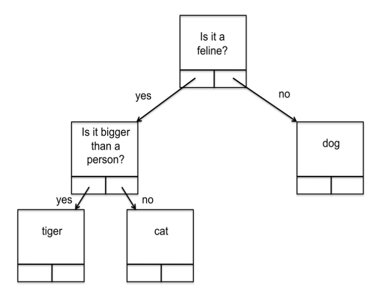
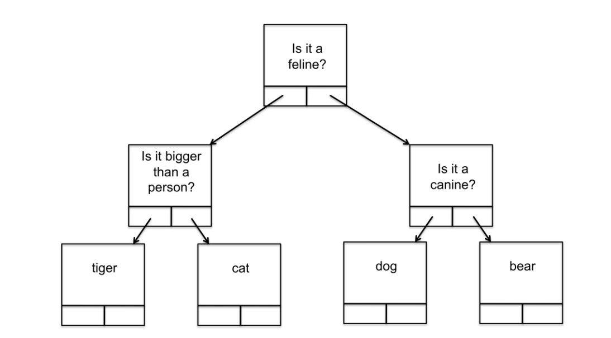

## Programming Assignment 1

**Due Tuesday, October 10 at 11:55pm**

This assignment gives you practice working with pointers, trees, and dynamic allocation. The program will be to implement the “Animal Guessing Game”. This game is a version of “20 Questions” where the only category is animals. You think of an animal and your program will try to guess the animal by asking you a series of “yes or no” questions.

The program uses a tree to represent its knowledge about animals. Each leaf node contains the name of an animal, and each interior node contains a question. For example, the tree,



would cause the program to ask if the animal you are thinking of is a feline. If you respond “yes”, it will ask you if it is bigger than a person. If you respond “no”, it will guess that you are thinking of a cat.

If you had responded “no” when asked if it is a feline, it will guess dog. If that is not correct, the program will augment the tree with the animal you were thinking of by asking you what your animal was and asking for a question to distinguish your animal from a dog. Suppose you indicate that your animal was a bear and the question to distinguish a bear from a dog is “Is it canine?”. The program will ask you what the answer for “bear” is and, when you say “no”, it will add a “bear” node to the tree as follows:




Note that two new nodes have been created, one for dog and one for bear. The old dog node has been overwritten with the question. Note that the tree is always a strictly binary tree, meaning that every node is either a leaf or has exactly two children.

I have provided some of the code and the skeleton of the program. Your job is to provide missing code and comments. Here are the steps to perform:

1. Download one of the following compressed files from the Programming Assignment 1 folder on Brightspace. Pick the one that corresponds to your computer,
    - assignment1_cygwin.tgz for Windows/Cygwin.
    - assignment1_macos.tgz for macOS.
    - assignment1_linux.tgz for Linux.

Save and uncompress the downloaded file in the directory where you want to work on and compile your program. For example, in your home directory (in macOS, Linux, or Cygwin), in a shell, type

```bash
mkdir assignment1
```

to create a directory called assignment1. Then type

```bash
cd assignment1
```

to change the current working directory to assignment1. Then download the compressed file to this directory (in Cygwin, this will likely correspond to `c:\cygwin64\home\username\assignment1`).

To uncompress the file, in a shell, type

```bash
tar -xzvf filename
```

where *filename* is the name of the file that you downloaded.

2. The five files that are extracted from the compressed file are:

    - animals.c, a C file that you will be adding code and comments to. Important: This is the only file you will be modifying.
    - node_utils.c, a C file I wrote that contains auxiliary procedures to use.
    - node_utils.h, the header file for node_utils.c.
    - data.dat, a file containing data that will be read in by the code that I wrote (you don't have write code that reads this file).
    - An executable file, either ben (on Mac OS X or Linux) or ben.exe (Cygwin), which was compiled from my version of the assignment. You can use this to see how your code should behave.

3. You should fill in the procedure definitions missing in the animals.c. I have also indicated where I want you to put a comment, to show that you understand the code I have written.

4. To compile your program in a shell, type

    `gcc -o animals animals.c node_utils.c`

    Then, to run your program, type

    `./animals`

    Note that you only need to type the above “gcc -o ...” command the first time within the shell. Afterwards, you can either simply type “!gcc” or use the up-arrow key to go back through the prior commands until you see the above “gcc -o ...” command again – and then hit enter.

5. To compare the ouput of your program to that of mine, you can run my program by typing

    `./ben`

6. When you are finished, upload your version of animals.c (only) to Brightspace.

As I stated in class, you should write your own code. You may work with other students to figure out how to approach the problem, you can even ask other students for help (but not for their code). However, if you don’t write your own code then you will not be able to do well enough on the exams to get a decent grade in this course.

::: details zh

## 编程作业 1

**截止日期：10 月 10 日，晚上 11:55**

本次作业让您练习指针、树和动态分配。你需要实现“动物猜猜看”游戏。这个游戏是“20 个问题”的变种，唯一的分类是动物。你想到一个动物，你的程序会尝试通过向你提出一系列“是或否”的问题来猜测这个动物。

程序使用一棵树来表示它关于动物的知识。每个叶子节点包含一个动物的名称，每个内部节点包含一个问题。例如，如下的树，


会让程序询问你所想的动物是否是猫科动物。如果你回答“是”，它会问你它是否比人大。如果你回答“不是”，它会猜你想的是猫。

如果你在被问及是否是猫科动物时回答“不是”，它会猜狗。如果这是不正确的，程序将通过询问您的动物是什么并询问一个问题来区分您的动物和狗来增强这棵树。假设你指出你的动物是熊，区分熊和狗的问题是“它是犬科动物吗？”。程序会询问你“熊”的答案是什么，当你说“不是”时，它会按如下方式将一个“熊”的节点添加到树中：


注意，已经创建了两个新的节点，一个为狗，一个为熊。旧的狗节点已被问题覆盖。注意，树始终是一个严格的二叉树，这意味着每个节点要么是叶子，要么有两个子节点。

我已经提供了部分代码和程序的框架。您的任务是提供缺失的代码和注释。以下是要执行的步骤：

1. 从 Brightspace 的编程作业 1 文件夹中下载以下压缩文件之一。选择与您的计算机相对应的文件，
    - assignment1_cygwin.tgz 适用于 Windows/Cygwin。
    - assignment1_macos.tgz 适用于 macOS。
    - assignment1_linux.tgz 适用于 Linux。

在您希望工作和编译程序的目录中保存并解压下载的文件。例如，在您的主目录（在 macOS、Linux 或 Cygwin 中），在 shell 中输入

```bash
mkdir assignment1
```

以创建一个名为 assignment1 的目录。然后键入

```bash
cd assignment1
```

将当前工作目录更改为 assignment1。然后将压缩文件下载到此目录（在 Cygwin 中，这可能对应于 `c:\cygwin64\home\username\assignment1`）。

要解压文件，在 shell 中键入

```bash
tar -xzvf filename
```

其中 *filename* 是您下载的文件的名称。

2. 从压缩文件中提取的五个文件是：

    - animals.c，一个您将添加代码和注释的 C 文件。重要提示：这是您将修改的唯一文件。
    - node_utils.c，我编写的包含要使用的辅助过程的 C 文件。
    - node_utils.h，node_utils.c 的头文件。
    - data.dat，包含由我编写的代码读取的数据的文件（您不必编写读取此文件的代码）。
    - 一个可执行文件，Mac OS X 或 Linux 上的 ben 或 Cygwin 上的 ben.exe，从我的作业版本中编译而来。您可以使用此文件查看您的代码应如何运行。

3. 您应该

在 animals.c 中填写缺失的过程定义。我还指出了我希望您放置注释的地方，以显示您理解了我编写的代码。

4. 要在 shell 中编译您的程序，键入

    `gcc -o animals animals.c node_utils.c`

    然后，要运行您的程序，键入

    `./animals`

    注意，您只需要在 shell 中键入上述“gcc -o ...”命令一次。之后，您可以简单地键入“!gcc”，或使用上箭头键返回之前的命令，直到您再次看到上述“gcc -o ...”命令 - 然后按回车。

5. 要将您的程序的输出与我的输出进行比较，您可以通过键入以下命令来运行我的程序

    `./ben`

6. 完成后，只需将您的 animals.c 版本上传到 Brightspace。

正如我在课堂上所说，您应该编写自己的代码。您可以与其他学生合作以确定如何处理问题，甚至可以向其他学生求助（但不能要求他们的代码）。但是，如果您不编写自己的代码，那么您将无法在考试中取得足够好的成绩，从而在这门课程中获得一个体面的成绩。

:::


欢迎关注我公众号：AI悦创，有更多更好玩的等你发现！


::: details 公众号：AI悦创【二维码】


:::

::: info AI悦创·编程一对一

AI悦创·推出辅导班啦，包括「Python 语言辅导班、C++ 辅导班、java 辅导班、算法/数据结构辅导班、少儿编程、pygame 游戏开发」，全部都是一对一教学：一对一辅导 + 一对一答疑 + 布置作业 + 项目实践等。当然，还有线下线上摄影课程、Photoshop、Premiere 一对一教学、QQ、微信在线，随时响应！微信：Jiabcdefh

C++ 信息奥赛题解，长期更新！长期招收一对一中小学信息奥赛集训，莆田、厦门地区有机会线下上门，其他地区线上。微信：Jiabcdefh

方法一：[QQ](http://wpa.qq.com/msgrd?v=3&uin=1432803776&site=qq&menu=yes)

方法二：微信：Jiabcdefh

:::

