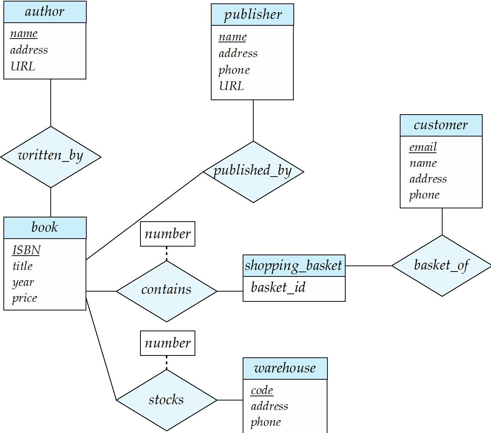

Shanghai New York University

Engineering and Computer Science Department CSCI-SHU 213

Homework No. : 02

Total points: 100.

Please submit electronically as either PDF or image file(s) using NYU Brightspace. One PDF file having all the solutions is preferable. If you would like to do on paper, you can scan or take pictures of your solutions and then submit using NYU Brightspace. You can use drawing tools from the website https://www.draw.io. Homework#2 needs to be done individually.

## HOMEWORK #2

### Problem 1:

Suppose you’re designing a database for a railroad company. The manager says they want to keep track of customers, train routes (e.g. “New Haven line”), and how many times the customer purchased a ticket for that route. A customer has a phone number and an address. No two customers have the same phone number. Each train route has a unique name, a line color, and a ticket price. (Note: Different train routes may have different ticket prices.) The database will keep track of how many of which route a customer purchased tickets for, along with the trip status (e.g. “on time”, “delayed”, “ahead of schedule”).

1. Draw an ER diagram modeling this information. It should have an entity set representing customers, an entity set representing routes, and one relationship set.

2. While reviewing this ER diagram with you, the store manager realizes that it would be a better idea to charge people based on how far they’re going on each line in terms of number of stops (e.g., “New Haven line for 2 stops is \$5.00” and “Hudson line for 3 stops is \$8.00”). Modify the ER diagram to deal with this.

    Hint: Use a weak entity set.

3. And after further thought, the manager decides that they should also keep track of the date, time, and method of payment (e.g. “cash”, “credit card”) when each ticket was purchased and keep historical data, so that they’ll know which customers have purchased which tickets in the past. Modify the ER diagram to allow this. Note that adding date and time attributes to the ordered relationship set is not sufficient, as this still will not allow a customer to purchase the same tickets at different date/times. (Why not?).

    **Hint:** One approach is to use a ternary relationship set, involving an additional entity set representing dates/time.

### Problem 2

Consider the bookstore E-R on the last page of this assignment sheet. You may submit one E-R diagram with all of these modifications. (Hint: You can use cardinality limits like l....h).

1. Modify the E-R diagram to indicate that a customer can have at most one shopping basket.
2. Modify the E-R diagram to indicate that each book is stocked in at least one warehouse.

### Problem 3

A theatre has hired you to design a database to represent information about their plays, tickets, actors, and directors. Each person (actor or director) has a unique ID, a name, and an email address. An actor also has an age, which is derived from their date of birth. There are several categories of plays, each with a unique name and a description. Each play falls into one category. Each play has a unique identification number within its category and one unique color. Each play consists of between five and twenty actors. An actor can perform in at most three plays, a play has at least one director, and a director cannot direct more than one play. Draw an E-R diagram for the theatre.

### Problem 4

Consider the E-R diagram at the bottom of this assignment sheet (before the modifications from Problem 2). Make the following changes:

- Omit the warehouse entity set and the stocks relationship set.
- Omit the publisher entity set and the published by relationship set
- Change the cardinality constraints on the written_by relationship set to indicate that every book is published by exactly one author.
- Change the phone number attribute of customer to a multi-valued attribute.
- Change the address attribute of the customer entity set and the author entity set to a composite attribute with components “building number”, “street”, “city”, “state”, and “zip code”.

Part-1: Draw the modified E-R diagram.

Part-2: Following the rules we have studied, derive the corresponding relational schema from the E-R diagram. Show your answer in the form of a schema diagram, in the style of figure 2.8 of text book (Schema diagram of the university database). (That is, for each relation, draw a rectangle that lists the relation’s attributes; underline the primary key(s); draw arrows to indicate foreign key constraints

**E-R Diagram for Problems 2 and 4:**

欢迎关注我公众号：AI悦创，有更多更好玩的等你发现！

::: details 公众号：AI悦创【二维码】

:::

::: info AI悦创·编程一对一

AI悦创·推出辅导班啦，包括「Python 语言辅导班、C++ 辅导班、java 辅导班、算法/数据结构辅导班、少儿编程、pygame 游戏开发」，全部都是一对一教学：一对一辅导 + 一对一答疑 + 布置作业 + 项目实践等。当然，还有线下线上摄影课程、Photoshop、Premiere 一对一教学、QQ、微信在线，随时响应！微信：Jiabcdefh

C++ 信息奥赛题解，长期更新！长期招收一对一中小学信息奥赛集训，莆田、厦门地区有机会线下上门，其他地区线上。微信：Jiabcdefh

方法一：[QQ](http://wpa.qq.com/msgrd?v=3&uin=1432803776&site=qq&menu=yes)

方法二：微信：Jiabcdefh

:::

