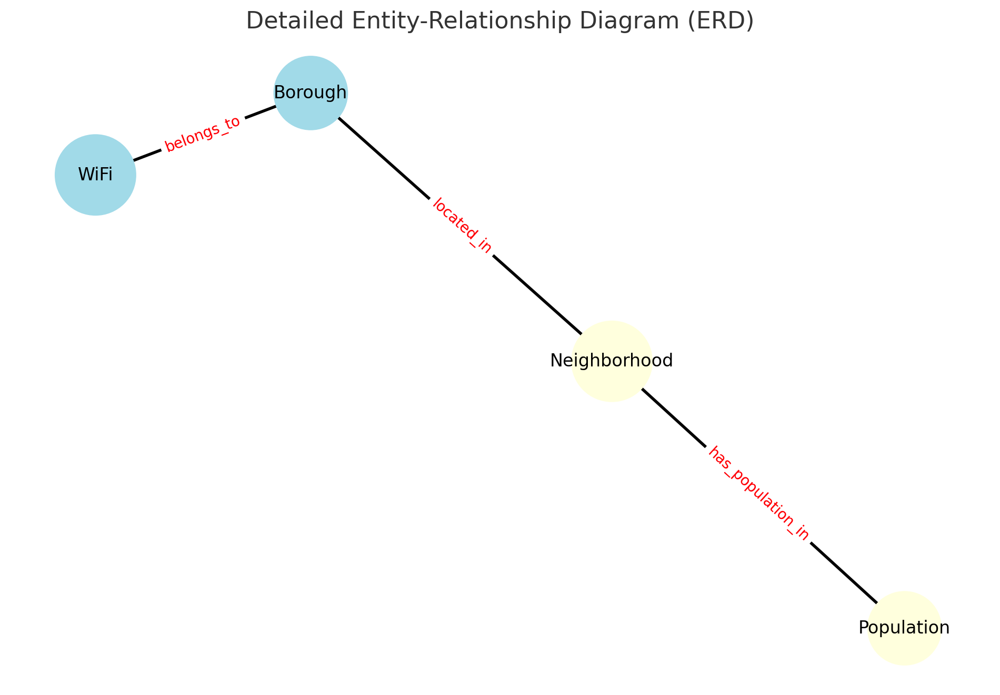
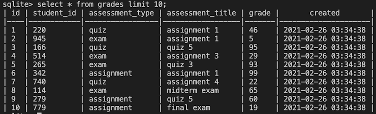
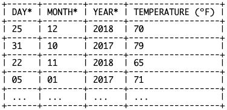
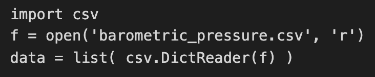

Update the solution contents of this file according to the instructions.

## Solutions

The following sections contain a report on the solutions to each of the required components of this exam.

### Data munging

The code in the Python program, solution.py, contains the solutions to the **data munging** part of this exam.

### Spreadsheet analysis

The spreadsheet file, wifi.xslx, contains the solutions to the **spreadsheet analysis** part of this exam. In addition, the formulas used in that spreadsheet are indicated below:

1. Total number of free Wi-Fi hotspots in NYC

```
Place your formula here.
```

2. Number of free Wi-Fi hotspots in each of the 5 boroughs of NYC.

```
Place your formulas here - one on each line.
```

3. Number of free Wi-Fi hotspots provided by the LinkNYC - Citybridge in each of the zip codes of Manhattan.

```
Place your formula for just the zip code 10001 here.
```

4. The percent of all hotspots in Manhattan that are provided by LinkNYC - Citybridge.

```
Place your formula here.
```

### SQL queries

This section shows the SQL queries that you determined solved each of the given problems.

1. Write two SQL commands to create two tables named `hotspots` and `populations`.

```sql
CREATE TABLE hotspots (
    id INTEGER PRIMARY KEY,
    borough_id INTEGER,
    type TEXT,
    provider TEXT,
    name TEXT,
    location TEXT,
    latitude REAL,
    longitude REAL,
    x REAL,
    y REAL,
    location_t TEXT,
    remarks TEXT,
    city TEXT,
    ssid TEXT,
    source_id TEXT,
    activated TEXT,
    borocode INTEGER,
    borough_name TEXT,
    nta_code TEXT,
    nta TEXT,
    council_district INTEGER,
    postcode INTEGER,
    boro_cd INTEGER,
    census_tract INTEGER,
    bctcb2010 INTEGER,
    bin INTEGER,
    bbl INTEGER,
    doitt_id INTEGER,
    lat_lng TEXT
);

----
CREATE TABLE hotspots_text (
    id TEXT,
    borough_id TEXT,
    type TEXT,
    provider TEXT,
    name TEXT,
    location TEXT,
    latitude TEXT,
    longitude TEXT,
    x TEXT,
    y TEXT,
    location_t TEXT,
    remarks TEXT,
    city TEXT,
    ssid TEXT,
    source_id TEXT,
    activated TEXT,
    borocode TEXT,
    borough_name TEXT,
    nta_code TEXT,
    nta TEXT,
    council_district TEXT,
    postcode TEXT,
    boro_cd TEXT,
    census_tract TEXT,
    bctcb2010 TEXT,
    bin TEXT,
    bbl TEXT,
    doitt_id TEXT,
    lat_lng TEXT
);

```

```sql
CREATE TABLE populations (
    borough TEXT,
    year INTEGER,
    fips_county_code INTEGER,
    nta_code TEXT PRIMARY KEY,
    nta TEXT,
    population INTEGER
);
```

2. Import the data in the `wifi.csv` and `neighborhood_populations.csv` CSV files into these two tables.

```sql
.mode csv
.separator ","
.header on
.import wifi.csv hotspots
```

```sql
.mode csv
.separator ","
.header on
.import neighborhood_populations.csv populations
```

3. Display the five zip codes with the most Wi-Fi hotspots and the number of Wi-Fi-hotspots in each in descending order of the number of Wi-Fi-hotspots.

```sql
SELECT postcode, COUNT(*) as hotspot_count 
FROM hotspots 
GROUP BY postcode 
ORDER BY hotspot_count DESC 
LIMIT 5;
```

4. Display a list of the name, location, and zip code for all of the free Wi-Fi locations provided by `ALTICEUSA` in Bronx, in descending order of zip code.

```sql
SELECT name, location, postcode
FROM hotspots
WHERE provider = 'ALTICEUSA' AND borough_name = 'Bronx' AND type = 'Free'
ORDER BY postcode DESC;
---
SELECT name, location as address, postcode 
FROM hotspots 
WHERE provider = 'ALTICEUSA' AND borough_id = 2 AND type = 'Free' 
ORDER BY postcode DESC;
```

5. Display the names of each of the boroughs of NYC, and the number of free Wi-Fi hotspots in each.

```sql
SELECT 
    CASE 
        WHEN borough_id = 1 THEN 'Manhattan'
        WHEN borough_id = 2 THEN 'Bronx'
        WHEN borough_id = 3 THEN 'Brooklyn'
        WHEN borough_id = 4 THEN 'Queens'
        WHEN borough_id = 5 THEN 'Staten Island'
        ELSE 'Unknown'
    END AS borough_name,
    COUNT(*) as hotspot_count 
FROM hotspots 
WHERE type = 'Free' 
GROUP BY borough_id 
ORDER BY hotspot_count DESC;
---
SELECT borough_name, COUNT(*) as hotspot_count 
FROM hotspots 
WHERE type = 'Free' 
GROUP BY borough_name;
```

6. Display the number of wifi hotspots in Bay Ridge, Brooklyn along with the population of Bay Ridge, Brooklyn.

```sql
SELECT 
    (SELECT COUNT(*) FROM hotspots WHERE nta = 'Bay Ridge') as hotspot_count,
    (SELECT population FROM populations WHERE nta = 'Bay Ridge' AND year = (SELECT MAX(year) FROM populations WHERE nta = 'Bay Ridge')) as population
FROM hotspots 
WHERE nta = 'Bay Ridge' 
LIMIT 1;


---
WITH HotspotsCount AS (
    SELECT COUNT(*) as hotspot_count
    FROM hotspots
    WHERE nta = 'Bay Ridge' AND borough_name = 'Brooklyn'
),
LatestPopulation AS (
    SELECT population
    FROM populations
    WHERE nta = 'Bay Ridge' AND borough = 'Brooklyn'
    ORDER BY year DESC
    LIMIT 1
)
SELECT hotspot_count, population
FROM HotspotsCount, LatestPopulation;
```

7. Display the number of **Free** wifi hotspots in each of the 5 NYC boroughs, along with the population of each borough.

```sql
SELECT 
    CASE 
        WHEN borough_id = 1 THEN 'Manhattan'
        WHEN borough_id = 2 THEN 'Bronx'
        WHEN borough_id = 3 THEN 'Brooklyn'
        WHEN borough_id = 4 THEN 'Queens'
        WHEN borough_id = 5 THEN 'Staten Island'
        ELSE 'Unknown'
    END AS borough_name,
    COUNT(*) as free_hotspot_count,
    (SELECT SUM(population) 
     FROM populations p 
     WHERE p.borough = borough_name 
     AND year = (SELECT MAX(year) FROM populations WHERE borough = borough_name)) as population
FROM hotspots 
WHERE type = 'Free' 
GROUP BY borough_id 
ORDER BY free_hotspot_count DESC;
```

8. Display the names of each of the neighborhoods in which there exist Wi-Fi hotspots, but for which we do not have population data.

```sql
SELECT DISTINCT h.nta 
FROM hotspots h 
LEFT JOIN populations p ON h.nta = p.nta 
WHERE p.nta IS NULL;
```

9. Write an additional SQL query of your choice using Sqlite with this table; then describe the results

Write a description of the query here.

```sql
SELECT name, location as address, postcode 
FROM hotspots 
WHERE postcode IN (11201, 10011) 
ORDER BY postcode, name;
```

```sql
该查询列出了位于Brooklyn Heights (邮政编码11201) 和Chelsea, Manhattan (邮政编码10011) 的所有Wi-Fi热点的名称和地址。以下是一些关键发现：

- 在Chelsea, Manhattan (邮政编码10011)：
  - 我们可以看到许多不带具体名称的Wi-Fi热点，它们通常由其位置来描述，如"9th and 15th"、"8th and 16th"等。
  - 也有一些特定的机构或场所提供Wi-Fi热点，例如"Andrew Heiskell Braille & Talking Book Library"位于"40 WEST 20 STREET"，"Jefferson Market"位于"425 AVENUE OF AMERICAS"。

- 在Brooklyn Heights (邮政编码11201)：
  - 类似地，有一些Wi-Fi热点的位置是通过街道名称来描述的，例如"160 Schermerhorn St."。
  - 一些公共场所如"Brooklyn Heights - Brooklyn Public Library"和"Fort Greene Park"也提供了Wi-Fi热点。

总的来说，该查询为用户提供了在Brooklyn Heights和Chelsea两个地区找到可用Wi-Fi热点的具体位置和名称。这些数据对于需要在这两个地区上网的用户来说非常有用。
```


### Normalization and Entity-relationship diagramming

This section contains responses to the questions on normalization and entity-relationship diagramming.

1. Is the data in `wifi.csv` in fourth normal form?

```
不能确定。
```

2. Explain why or why not the `wifi.csv` data meets 4NF.

```
从提供的数据预览中，我们不能确定是否存在多值依赖，因为我们没有足够的数据来评估。但是，考虑到该数据集主要是描述 WiFi 热点的位置和属性，我们可以假设它可能满足 4NF。除非某些字段（例如供应商或位置）在给定的 borough_id 下有多个值，否则这个假设是成立的。
```

3. Is the data in `neighborhood_populations.csv` in fourth normal form?

```
是。
```

4. Explain why or why not the `neighborhood_populations.csv` data meets 4NF.

```
从 `neighborhood_populations.csv` 的预览中，我们可以看到这些字段：borough, year, fips_county_code, nta_code, nta 和 population。这些字段描述了特定年份的特定邻里的人口。因为我们没有看到任何字段有多个值（例如，一个邻里在同一年有多个人口值），所以我们可以说这个数据满足 4NF。
```

5. Use [draw.io](https://draw.io) to draw an Entity-Relationship Diagram showing a 4NF-compliant form of this data, including primary key field(s), relationship(s), and cardinality.



1. `wifi.csv` 是否满足第四范式 (4NF)?
答：不能确定。

2. 为什么 `wifi.csv` 数据满足或不满足 4NF？
答：从提供的数据预览中，我们不能确定是否存在多值依赖，因为我们没有足够的数据来评估。但是，考虑到该数据集主要是描述 WiFi 热点的位置和属性，我们可以假设它可能满足 4NF。除非某些字段（例如供应商或位置）在给定的 borough_id 下有多个值，否则这个假设是成立的。

3. `neighborhood_populations.csv` 是否满足第四范式 (4NF)?
答：是。

4. 为什么 `neighborhood_populations.csv` 数据满足或不满足 4NF？
答：从 `neighborhood_populations.csv` 的预览中，我们可以看到这些字段：borough, year, fips_county_code, nta_code, nta 和 population。这些字段描述了特定年份的特定邻里的人口。因为我们没有看到任何字段有多个值（例如，一个邻里在同一年有多个人口值），所以我们可以说这个数据满足 4NF。


## 选择题

1. When a file is named with a .csv extension, does that mean that the data within the file is by necessity in CSV format?

A. YES

B. NO✅

2. With any two related tables: table1 and table2, related by a standard primary key / foreign key relationship, the order in which the tables are mentioned in a LEFT JOIN query is not important.  In other words, the following two queries will always return the same data in the results:  « SELECT * from table1 LEFT JOIN table2 ON table1.table2_id = [table2.id](http://table2.id/)»  and « SELECT * from table2 LEFT JOIN table1 ON table1.table2_id = [table2.id](http://table2.id/)»

A. True

B. False✅

3. In which cases must « f.close( ) » be called in order for a file operation, using a variable f to refer to the file, to successfully complete?

A. After reading data from a file

B. After writing data to a file

C. After appending data to a file

4. Table A has 100 rows and Table B has 200 rows. There exists a standard Primary Key - Foreign Key relationship between them, where Table A has a foreign key that references the Primary key of Table B. How many rows can an INNER JOIN on the Primary  - Foreign key relationship of these two tables have?

A. Between 101 and 200

B. Less than or equal to 100✅

C. Greater than 200

D. Exactly 300

5. If Entity-Relationship Diagramming data about Student grades in a university - where an existing data set contained separate fields for a unique id for the record (the primary key), the student's email address, phone number, a unique id of the course, the assessment type, and score - would the student whose grades are being represented in the data be considered an attribute or an entity?

A. Attribute

B. Entity✅

C. \* None - the normal forms do not apply to data with fixed schema *

6. If storing 20,000 records about Student grades in a university - where each record contained separate fields for a unique id for the record (the primary key), the student's email address, phone number, a unique id of a course, the assessment type, and score - which format would have the least data redundancy?

A. CSV

B. JSON

C. XML

D. HTML

E. Fixed-width text columns✅

F. \* None - they would all have the same level of redundancy *

7. Imagine you had a table named 'grades', as shown below.  Assuming the 'student_id' field holds a foreign key that refers to records in a 'students' table, which query will show the maximum grade, broken down by the assessment being graded?  You can imagine that another table named 'students' exists, which is referred to by the 'student_id' field.



A. SELECT assessment_title, MAX(grade) FROM grades GROUP BY grade ORDER BY MAX(grade) DESC;

B. SELECT assessment_title, MAX(grade) FROM grades GROUP BY assessment_title ORDER BY MAX(grade) DESC;✅

C. SELECT assessment_title, MAX(grade) FROM grades INNER JOIN students ON students.id=grades.student_id GROUP BY student_id ORDER BY grade DESC;

D. SELECT assessment_title, MAX(grade) FROM grades LEFT JOIN students ON students.id=grades.student_id ORDER BY grade DESC;

8. All joins must link two tables by their primary key / foreign key relationships and no other fields.

A. True

B. False✅

9. How many times is the print statement executed in the code above (not counting the print ('Done!') statement?)


A. Once

B. Twice

C. As many times as there are lines in the file✅

D. As many times as there are commas in the file

C. \* infinitely *

D. \* never *

9. You have two tables: 'Student' table and 'Exam Submissions' table. The Student table contains information about the students in a school, and the Exam Submissions table has a record for each exam submission by a student. If I want to count the number of exams each student has taken for all students, including those who have not taken any exams, which of the following JOINS would I use?

A. Inner Join

B. Left Join✅

C. Any of the options

D. None of the options

10. Which of the following data formats allow nested value (i.e. a hierarchical organization of data)? (Select all that apply.)

A. CSV

B. XML✅

C. JSON✅

D. None of the options

11. Spreadsheets generally support nested values, i.e. values within values.

A. True

B. False✅

12. Imagine the variable « bla » was assigned a String, such as « bla = ‘Hello World\n’ ». Which of the following expressions would evaluate to the list « [‘Hello’, ‘World’] »

A. bla[0 : 12: 4]

B. bla[11 : 3 : -1]

C. bla.strip(‘\n’).split(‘ ’)✅

D. bla.split(‘ ’).strip(‘\n’)

E. bla[11 : 3: -1].split(‘.\n’).strip(‘\n’)

13. In CSV format, which character acts as separator between two records? i.e. Which separates series of related values?

A. ',' (a comma)

B. ', ' (a comma and a space)

C. ';' (a semi-colon)

D. ':' (a colon)

E. '\n' (a line break)✅

14. Google Sheets can hold a larger number of records, because it is hosted on Google servers, than MS Excel and is the ideal choice for large datasets.

A. True

B. False✅

15. Imagine you are working on studying weather patterns and record real-time data everyday. You want to maintain a single file of the data like a journal. Which of the following modes should you open the file in to add the current day's data to this file?

A. Write mode

B. Append mode✅

C. It doesn't make a difference

D. None of the options

16. You have a 'Tournament' table with fields as shown below. Which of the following Normal Forms does it satisfy? Assume all values are singular. ('*' indicate the primary key field(s)) (Select all that apply.)


A. 1NF✅

B. 2NF✅

C. 3NF✅

D. 4NF✅

E. None of the options

17. I have a table of 'Temperatures' in the following format. Which of the following queries will return me the maximum temperature each year? (* indicates the primary key field(s).)



A. SELECT TEMPERATURE, YEAR, FROM Temperatures;

B. SELECT MAX(TEMPERATURE), YEAR FROM Temperatures;

C. SELECT MAX(TEMPERATURE), YEAR FROM Temperatures GROUP BY YEAR;✅

D. SELECT SUM(TEMPERATURE)/COUNT(TEMPERATURE), YEAR FROM Temperatures GROUP BY YEAR;

E. This is an impossible query.

18. In the example below, in which data structure is the data in the variable named « data » stored?



A. a string

B. a list containing strings

C. a dictionary with keys and values that are strings

D. a list containing dictionaries with keys and values that are strings✅

E. a file object

19. Why does the following table not satisfy the Second Normal Form? (The * indicate the primary key.)


A. Each record does not contain the same set of fields.

B. Each field does not contain only a singular value.

C. One or more of the non-key fields represent facts about only part of the primary key, and not the whole primary key.✅

D. The non-key fields do not all represent facts about the entity represented by the primary key.


欢迎关注我公众号：AI悦创，有更多更好玩的等你发现！


::: details 公众号：AI悦创【二维码】


:::

::: info AI悦创·编程一对一

AI悦创·推出辅导班啦，包括「Python 语言辅导班、C++ 辅导班、java 辅导班、算法/数据结构辅导班、少儿编程、pygame 游戏开发」，全部都是一对一教学：一对一辅导 + 一对一答疑 + 布置作业 + 项目实践等。当然，还有线下线上摄影课程、Photoshop、Premiere 一对一教学、QQ、微信在线，随时响应！微信：Jiabcdefh

C++ 信息奥赛题解，长期更新！长期招收一对一中小学信息奥赛集训，莆田、厦门地区有机会线下上门，其他地区线上。微信：Jiabcdefh

方法一：[QQ](http://wpa.qq.com/msgrd?v=3&uin=1432803776&site=qq&menu=yes)

方法二：微信：Jiabcdefh

:::

