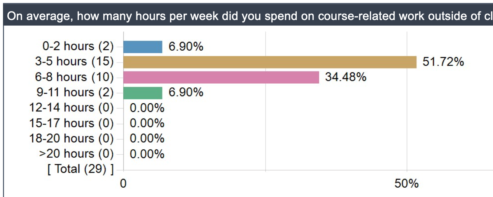
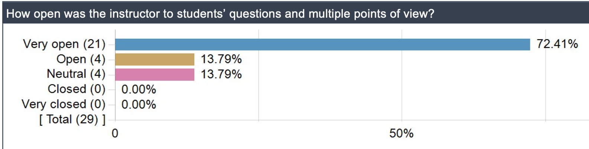
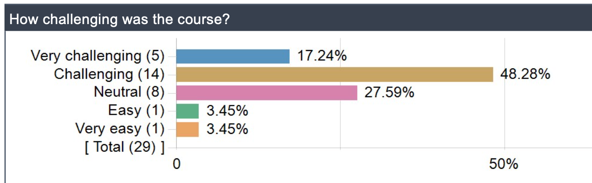
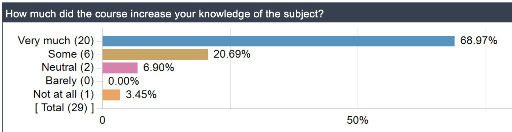

Database Design

1. [Welcome](https://knowledge.kitchen/content/courses/database-design/notes/course-intro/#welcome)
2. [Who you are](https://knowledge.kitchen/content/courses/database-design/notes/course-intro/#you)
3. [Topics](https://knowledge.kitchen/content/courses/database-design/notes/course-intro/#topics)
4. [Structure](https://knowledge.kitchen/content/courses/database-design/notes/course-intro/#structure)
5. [Software](https://knowledge.kitchen/content/courses/database-design/notes/course-intro/#software)
6. [What Others Say](https://knowledge.kitchen/content/courses/database-design/notes/course-intro/#evaluations)
7. [Conclusions](https://knowledge.kitchen/content/courses/database-design/notes/course-intro/#conclusions)

# Welcome

## Course description

Introduces principles and applications of databases.

We survey a variety of common database systems, starting with *plain text data formats* and *spreadsheets*, and moving into *relational databases*, *document-oriented databases*, with a light touch of more advanced topics like *application programming interfaces (APIs)* and *blockchains* (i.e. cryptocurrencies)

Students explore principles of database design and apply those principles to computer systems in general and in their respective fields of interest.

## What is a database anyway?

A database is any system or tool used for storing data.

- usually stores *structured* data, although *unstructured* data sets certainly do exist
- usually makes it *fast* to find data you are looking for…
- … especially data that meet *criteria* you indicate
- usually easily-integrated into computer programs

## Conventions

While there might be, in theory, many different kinds of database systems, in practice only a few kinds dominate in today’s workplace.

We will explore a few representatives of the most popular kinds.

# Who you are

## Profile

Who are you, really?

- trying to get through college
- doing what your parents and advisors tell you to do
- interested in programming
- interested in data analysis and statistics
- hoping to find a decent-paying job
- just having fun
- here for some other reason…. it doesn’t matter!

**Welcome!**

## What you know

- some computer programming
- how to save a file to your hard drive
- how to find a file that you have saved to your hard drive
- what a file extension is
- the difference between uppercase and lowercase letters

# Topics

## Database systems

We will look in some detail at a few database systems:

- Text-based data formats (e.g. *CSV*, *JSON*, *XML*)
- Spreadsheets (e.g. Microsoft *Excel*, Google *Sheets*, Apple *Numbers*, OpenOffice *Calc*)
- *SQL*ite (an example of a *relational database*)
- *MongoDB* (an example of a document-oriented database)
- *Pandas* (a Python module for data analysis)

## Teasers into other topics

We will take **brief looks** at a few exciting topics that might lead you towards future directions that interest you:

- Connecting databases to *web apps*
- Application programming interfaces (*APIs*)
- *Data visualization*
- Blockchain, *bitcoin*, and other cryptocurrencies

## Skills we will develop

You cannot do contemporary work with data and databases without honing a few skills:

- *Python* programming
- *Jupyter Notebooks*
- *SQL* programming
- Version control (i.e. `git`)

## Questions we will answer

There are common questions we will aim to answer:

- How do I set up my computer so I can work on data problems effectively?
- What are the most common problems that databases are designed to solve?
- How do you solve those problems?
- What are some of the considerations when choosing one database over another?
- How do I set up a database properly in a well-organized fashion?
- My internship requires me to know SQL…. what is that?
- My friend is making mad money at a start-up using MongoDB… can I learn that?

# Structure

## Overview

This course involves each of the following:

- Lectures
- Readings & watchings
- Quizzes
- Exercises (mostly individual, some group)
- Exams (two)

## Grading

Grading is broken down as follows:

- 15%: Quizzes
- 35%: Assignments
- 25%: Midterm exam
- 25%: Final exam

## Texts

No single textbook is necessary nor sufficient for this course. A few useful textual resources we will refer to as-needed:

- [Python for Everybody: Exploring Data Using Python 3 by Charles Severance](https://www.py4e.com/html3/)
- [Bad Data Handbook by Q. Ethan McCallum](https://bobcat.library.nyu.edu/primo-explore/fulldisplay?docid=nyu_aleph005835927&context=L&vid=NYU&lang=en_US)
- [Using SQLite by Jay A. Kreibich](https://bobcat.library.nyu.edu/primo-explore/fulldisplay?docid=nyu_aleph007031845&context=L&vid=NYU&lang=en_US)
- [Database Design by Adrienne Watt (primary author)](https://opentextbc.ca/dbdesign01/)
- [MongoDB Manual](https://docs.mongodb.com/manual/introduction/)

# Software

## Install these now

You will be required to have access to a computer set up for Python development. Install the following:

- [Anaconda](https://www.anaconda.com/products/individual)
- Git - [for Mac](https://git-scm.com/downloads) or [Git Bash](https://gitforwindows.org/) (part of Git for Windows)
- an account set up on [GitHub.com](https://github.com/)
- [Visual Studio Code](https://code.visualstudio.com/)
- [Python extension for Visual Studio Code](https://marketplace.visualstudio.com/items?itemName=ms-python.python)
- a file transfer program, such as [Cyberduck](https://cyberduck.io/)

## Using Bash on Windows

WINDOWS USERS - you should use Git Bash or Windows Subsystem for Linux (WSL) rather than Windows’ default Powershell or other command line shell program. To set Git Bash or WSL as the default terminal shell within Visual Studio Code, you can try to follow the instructions in [the second answer here](https://stackoverflow.com/questions/42606837/how-do-i-use-bash-on-windows-from-the-visual-studio-code-integrated-terminal) by **Mahade Walid** and edited by **FruityOatyBar** (ignore the first answe, which is outdated).

# What Others Say

## The Good

A sample of comments left by former students:

> Overall, I thought this course did a phenomenal job of introducing me to a variety of new skills, concepts, and techniques with which I had no prior experience.

> Assignments were definitely time–consuming, but learned a lot about a lot of different databases which I know will be useful down the road.

> Lectures were great—Prof. Bloomberg has a quiet but palpable confidence and delivered the material effectively. He’s open to questions and discussion and his graders give relatively timely feedback. Assignments were also helpful in learning the content.

> Really nicely structured course. Professor Bloomberg definitely knows his stuff. Good balance between new content and interesting exercises to reinforce the material.

## The Bad

A sample of comments left by former students:

> I personally wasn’t a huge fan of the quizzes, even though I did well on all of them. I thought they often had unclear/vague questions and weren’t the best way to reinforce the material. Given that there needs to be some quiz–like structure in the class, though, I’m not really sure if there’s an alternative. So maybe clearer and less ambiguous questions on the quizzes would be nice.

> I wish it wasn’t so monotonous. The information in lecture was all in the slides – there were only a few times that live coding occurred, and even then only for a few minutes.

> Speed up a little bit on the powerpoint (knowledge), and slow down a little bit on teaching the practical abilities.

> I would add smaller projects in between larger biweekly projects to help enhance material.

## The Ugly

> I learned more from the tutors than I did from Amos. Avoid his as a teacher at all costs.

> Learned nothing much from the course. Also; the course name is pretty baffling. What I expected was to learn some inner mechanisms of relational databases. However; the actual course was more like getting the feet wet for different tools like MongoDB; web apps; and even Pandas. Some might have enjoyed the course but at least I didn’t because I don’t think this is something that is supposed to be taught in college.

## Time commitment

## Openness

## Challenge

## Knowledge increase

# Conclusions

Thank you. Bye.

## Copyright

All content herein is copyrighted, shared under the [GNU General Public License, Version 3](https://github.com/bloombar/knowledge-kitchen/blob/main/LICENSE).

欢迎关注我公众号：AI悦创，有更多更好玩的等你发现！

::: details 公众号：AI悦创【二维码】

:::

::: info AI悦创·编程一对一

AI悦创·推出辅导班啦，包括「Python 语言辅导班、C++ 辅导班、java 辅导班、算法/数据结构辅导班、少儿编程、pygame 游戏开发」，全部都是一对一教学：一对一辅导 + 一对一答疑 + 布置作业 + 项目实践等。当然，还有线下线上摄影课程、Photoshop、Premiere 一对一教学、QQ、微信在线，随时响应！微信：Jiabcdefh

C++ 信息奥赛题解，长期更新！长期招收一对一中小学信息奥赛集训，莆田、厦门地区有机会线下上门，其他地区线上。微信：Jiabcdefh

方法一：[QQ](http://wpa.qq.com/msgrd?v=3&uin=1432803776&site=qq&menu=yes)

方法二：微信：Jiabcdefh

:::

