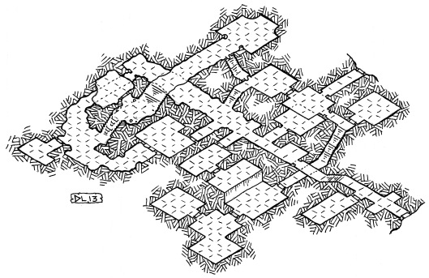

## 资料

-   [coursework2_woz.pdf](/1v1/09-liujiahui/02-Coursework2-World-of-Zuul/coursework2_woz.pdf)
-   [zuul-better.zip](/1v1/09-liujiahui/02-Coursework2-World-of-Zuul/zuul-better.zip)
-   [zuul-better_chinese.zip](/1v1/09-liujiahui/02-Coursework2-World-of-Zuul/zuul-better_chinese.zip)

## Coursework 2: World of Zuul

> 课程作业2:Zuul的世界

Michael Ko ̈lling and Jeffery Raphael Questions? 

programming@kcl.ac.uk

Your task is to invent and implement an adventure game. Along with this document, you have been given a simple framework (zuul-better) that lets you walk through a few rooms. You can use this as a starting point.

> 你的任务是创造并执行一款冒险游戏。除了这个文档之外，还提供了一个简单的框架(zuul-better)，可以让您浏览几个房间。您可以将此作为起点。

## Getting started

> 开始

The first step is to read the code! Reading code is an important skill that you need to practice. Your first task is to read some of the existing code and try to understand what it does.

> 第一步是阅读代码!阅读代码是一项需要练习的重要技能。您的第一个任务是阅读一些现有的代码，并尝试理解它的功能。

As a little exercise to get warmed up, make some changes to the code. For example:

> 作为热身的小练习，对代码进行一些更改。例如:

- change the name of a location

> 更改位置的名称

- change the exits – pick a room that currently is to the west of another room and put it to the north

> 改变出口——选择一个现在在另一个房间西面的房间，把它放在北面

- add a room (or two, or three, ...)

> 增加一个房间(或两个，或三个，……)

## Designing your game

> 设计游戏

First, you should decide what the setting, goal, and story of your game is going to be. It could be something along the lines of:

> 首先，你应该决定游戏的背景、目标和故事。它可能是这样的:

- “You are at Bush House, King’s College London. You have to find out where your program- ming lab is. To find this, you have to find the department office and ask. At the end, you need to find the exam room. If you get there on time, and you have found your textbook somewhere along the way, and you have also been to the lab, then you win. And if you’ve been to the student bar to have a drink more than five times during the game, your exam mark halves.”

> “你在伦敦国王学院布什学院。你必须找到你的编程实验室在哪里。要找到这个，你必须找到系里的办公室并询问。最后，你需要找到检查室。如果你准时到达，并且在路上找到了课本，并且去了实验室，那么你就赢了。如果你在比赛期间到学生酒吧喝酒超过五次，你的考试分数减半。”

Or:

- “You are lost in a dungeon. You meet a dwarf. If you find something to eat that you can give to the dwarf, then the dwarf tells you where to find a magic wand. If you use the magic wand in the big cave, the exit opens, you get out and win.”

> “你在地牢里迷路了。你遇到一个侏儒。如果你找到了可以给小矮人吃的东西，小矮人就会告诉你去哪里找魔杖。如果你在大洞穴中使用魔杖，出口就会打开，你就能出去并获胜。”

It can be anything, really — so be creative. Think about the scenery you want to use (a dungeon, a city, a building, etc) and decide what your locations (rooms) are. Make it interesting, but don’t make it too complicated. (I would suggest no more than 12 rooms.) Put objects in the scenery, maybe people, monsters, etc. Decide what task the player has to master.

> 它可以是任何东西，真的-所以要有创意。想想你想要使用的场景(地牢，城市，建筑等)，然后决定你的位置(房间)。让它变得有趣，但不要太复杂。(我建议不要超过12个房间。)在场景中放置物体，比如人、怪物等。决定玩家需要掌握什么任务。

## Base tasks

> 基本任务

The base functionality that you have to implement is:

> 你必须实现的基本功能是:

- The game has at least 6 locations/rooms; (5 pts)

> 游戏至少有6个地点/房间;(5分)

- There are items in some rooms. Every room can hold any number of items. Some items can be picked up by the player, others can’t; (10 pts)

> 有些房间里有些东西。每个房间都可以容纳任意数量的物品。有些道具可以由玩家拾取，有些则不能;(10分)

- The player can carry some items with them. Every item has a weight. The player can carry items only up to a certain total weight; (10 pts)

> 玩家可以随身携带一些道具。每件物品都有重量。玩家只能携带一定总重量的物品;(10分)

- The player can win. There has to be some situation that is recognised as the end of the game where the player is informed that they have won. Furthermore, the player has to visit at least two rooms to win; (5 pts)

> 玩家可以赢。在游戏结束时，玩家会被告知自己已经获胜。此外，玩家必须访问至少两个房间才能获胜;(5分)

- Implement a command “back” that takes you back to the last room you’ve been in. The “back” command should keep track of every move made, allowing the player to eventually return to it’s starting room; (10 pts) and

> 执行一个“返回”命令，将你带回你最后待过的房间。“返回”命令应该记录玩家的每一步行动，允许玩家最终返回起始房间;(10分)

- Add at least four new commands (in addition to those that are present in the base code) (10 pts)

> 添加至少四个新命令(除了基本代码中出现的命令之外)(10点)

## Challenge tasks

> 挑战的任务

- Add at least three characters to your game. Characters are people or animals or monsters – anything that moves, really. Characters are also in rooms (like the player and the items). Unlike items, characters can move around by themselves; (10 pts)

> 在游戏中添加至少3个角色。角色是人、动物或怪物——任何会动的东西。角色也在房间里(就像玩家和道具)。与道具不同的是，角色可以自己移动;(10分)

- Extend the parser to recognise three-word commands. You could, for example, have a command give bread dwarf to give some bread (which you are carrying) to the dwarf; (10 pts) and

> 扩展解析器以识别三个字的命令。例如，你可以让一个命令给面包侏儒给一些面包(你正在携带)侏儒;(10分)

- Add a magic transporter room – every time you enter it you are transported to a random room in your game (10 pts)

> 添加一个魔法传送室-每次你进入它，你会被传送到游戏中的一个随机房间(10分)

## The report (20 pts)

> 报告(20分)

You must also write a report (less than four pages) describing your game. The report should contain the following.

> 你还必须写一份报告(少于4页)描述你的游戏。该报告应包含以下内容。

- The name and a short description of your game.

> 你的游戏名称和简短的描述。

- The description should include at least a user level description (what does the game do?) and a brief implementation description (what are the important features?).

> 描述至少应该包括用户级别描述(游戏是做什么的?)和简单的执行描述(重要功能是什么?)

- A bullet point list of each base task you completed and how you completed it.

> 列出你完成的每项基本任务以及你是如何完成的。

- A bullet point list of each challenge task you completed and how you completed it.

> 列出你完成的每项挑战任务以及你是如何完成的。

- For each of the following code quality considerations, give and explain an example in your project where you considered it: coupling, cohesion, responsibility-driven design, maintain- ability.

> 对于以下每一个代码质量考虑因素，给出并解释一个您在项目中考虑到它的例子:耦合、内聚、责任驱动设计、维护能力。

- A walk-through of your game, consisting of the commands that need to be entered to com- plete/win the game.

> 游戏的演练，包括完成/赢得游戏所需要输入的命令。

## Submission and Deadline

> 提交及截止日期

- You must submit on Gradescope via KEATS by Friday, Dec. 2nd, 16:00 (4pm). You’ll submit a zip file containing the following

> 您必须在12月2日(星期五)16:00(下午4点)通过KEATS在Gradescope上提交。您将提交一个包含以下内容的zip文件

1. A Jar file of your BlueJ project.

> BlueJ项目的Jar文件。

- You can create a Jar from within BlueJ by going to Project, and then “Create Jar File...”.

> 你可以在BlueJ中创建一个Jar文件，点击Project，然后点击create Jar File…

- You do not need to change any of the default options, and so you should just click the “Continue” button.

> 您不需要更改任何默认选项，因此只需单击“Continue”按钮。

2. A report (pdf file)

> 报告(pdf档案)

3. All of your Java files

> 所有的Java文件

- The Jar file must contain your source code, i.e., the *.java files, and it must run on BlueJ.

> Jar文件必须包含您的源代码，即*.java文件，并且它必须在BlueJ上运行。

- Click the ‘Assignment 2 Submission Link’ to submit your work. Follow all instructions in the ‘Student Submission Guide’. If you have any trouble submitting your work, email Jeffery Raphael as soon as possible. Do not wait until the last hour to attempt your first submission.

> 点击“作业2提交链接”提交作业。遵循“学生提交指南”中的所有说明。如果你投稿有任何问题，请尽快给Jeffery Raphael发邮件。不要等到最后一小时才尝试第一次提交。

- Marking details can be found in the ‘Marking Rubric’.

> 评分的细节可在“评分规则”中找到。

## Late Submission Policy.

> 延迟提交政策。

All coursework must be submitted on time. If you submit coursework late and have not applied for an extension or have not had a mitigating circumstances claim upheld, you will have an automatic penalty applied. If you submit late, but within 24 hours of the stated deadline, the work will be marked, and 10 raw marks will be deducted. If this deduction brings your mark for the assessment below the usual pass mark (40%), your assessment mark will be capped at the pass mark. **All work submitted more than 24 hours late will receive a mark of zero.**

> 所有的课程作业必须按时提交。如果你提交课程作业晚了，没有申请延期，或者没有获得支持的减轻情节索赔，你将自动被处以罚款。如果你提交晚了，但在规定的截止时间24小时内，作品将被扣分，并扣除10分原始分数。如果扣分使你的评核分数低于通常的及格分数(40%)，你的评核分数将以及格分数为上限。所有逾期24小时以上提交的作品将被扣零分。

欢迎关注我公众号：AI悦创，有更多更好玩的等你发现！

::: details 公众号：AI悦创【二维码】

:::

::: info AI悦创·编程一对一

AI悦创·推出辅导班啦，包括「Python 语言辅导班、C++ 辅导班、java 辅导班、算法/数据结构辅导班、少儿编程、pygame 游戏开发」，全部都是一对一教学：一对一辅导 + 一对一答疑 + 布置作业 + 项目实践等。当然，还有线下线上摄影课程、Photoshop、Premiere 一对一教学、QQ、微信在线，随时响应！微信：Jiabcdefh

C++ 信息奥赛题解，长期更新！长期招收一对一中小学信息奥赛集训，莆田、厦门地区有机会线下上门，其他地区线上。微信：Jiabcdefh

方法一：[QQ](http://wpa.qq.com/msgrd?v=3&uin=1432803776&site=qq&menu=yes)

方法二：微信：Jiabcdefh

:::

