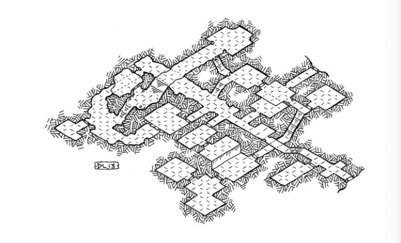

## 资料

-   [coursework2_woz.pdf](/1v1/09-liujiahui/02-Coursework2-World-of-Zuul/coursework2_woz.pdf)
-   [zuul-better.zip](/1v1/09-liujiahui/02-Coursework2-World-of-Zuul/zuul-better.zip)
-   [zuul-better_chinese.zip](/1v1/09-liujiahui/02-Coursework2-World-of-Zuul/zuul-better_chinese.zip)
-   [zuul-better_chinese-Plus.zip](/1v1/09-liujiahui/02-Coursework2-World-of-Zuul/zuul-better_chinese-Plus.zip)

## PPA02A

Class: Programming Practice & Applications

Created: November 22, 2022 1:45 PM

Type: Assignment

## World of Zuul 祖尔的世界

你的任务是发明和实现一个冒险游戏。与这份文件一起，你已经得到了一个简单的框架（zuul-better），它可以让你走过几个房间。你可以把它当作一个起点。

### 开始行动

**第一步是阅读代码!**  阅读代码是你需要练习的一项重要技能。你的第一个任务是阅读一些现有的代码，并尝试理解它的作用。
作为一个热身的小练习，对代码做一些修改。比如说

- 改变一个地点的名称
- 改变出口 - 选择一个目前在另一个房间西边的房间，把它放在北边
- 增加一个房间（或两个，或三个，...）。



### 设计你的游戏

首先，你应该决定你的游戏的设定、目标和故事是什么。它可以是这样的内容。

- "你在伦敦国王学院的布什宫。你必须找出你的编程实验室在哪里。要找到这一点，你必须找到系里的办公室并询问。在最后，你需要找到考试室。如果你准时到达那里，并且在路上找到了你的课本以及去过编程实验室，那么你就赢了。而如果你在比赛期间去学生酒吧喝酒超过五次，你的考试分数就减半。”

或者：

- "你在一个地牢里迷路了。你遇到一个侏儒。如果你找到可以给小矮人吃的东西，那么小矮人就会告诉你在哪里可以找到一根魔法棒。如果你在大山洞里使用魔法棒，出口就会打开，你就能出去，并获得胜利。”

它可以是任何东西，真的。所以要有创意。想一想你想使用的场景（地牢、城市、建筑等），并决定你的地点（房间）是什么。让它变得有趣，但不要让它太复杂。(我建议不超过12个房间。)在场景中放置 objects，也许是人、怪物等等。决定玩家要掌握什么任务。

### 基础任务（50分）

你必须实现的基本功能是：

- 该游戏 **至少有 6 个** 地点 / 房间；（5分）
- 一些房间里有物品。每个房间都可以容纳任何数量的物品。有些物品可以被玩家拿起，有些则不能；（10分）
- 玩家可以随身携带一些物品。每件物品都有一个重量。玩家可以携带的物品只能达到一定的总重量；（10分）
- 玩家可以赢。必须有某种情况被认为是游戏的结束，并玩家被告知他们已经赢了。此外，玩家必须访问至少两个房间才能获胜；（5分）
- 实施一个 “**back”** 命令，使你回到你所处的最后一个房间。后退 "命令应该记录每一次移动，使玩家最终能够返回到开始的房间；（10分）
- 添加 **至少四个** 新的命令（除了基本代码中存在的命令之外）（10分）

### 挑战任务（30分）

- 在你的游戏中至少添加三个角色。角色是人或动物或怪物 - 任何能动的东西。角色也在房间里（像玩家和物品）。与物品不同，角色可以自己移动；（10分）
- 扩展解析器以识别 **三个字** 的命令。例如，你可以有一个 “**give bread dwarf”** 命令，把一些面包（你携带的）给矮人；（10分）
- 增加一个魔法传送室 - 每次你进入它，你就会被传送到你游戏中的一个随机房间（10分）

### 报告（20分）

你还必须写一份报告（不超过四页），描述你的游戏。该报告应包含以下内容。

- 你的游戏的名称和简短的描述。
- 描述应该至少包括一个用户层面的描述（游戏是做什么的？）
    和一个简短的实施描述（有哪些重要的功能）。
- 你完成的每项基础任务的要点清单，以及你如何完成的。
- 对于以下每一项代码质量的考虑，请给出并解释你在项目中考虑的例子：耦合、内聚、责任驱动的设计、维护能力。
- 你的游戏指南，包括完成 / 赢得游戏所需输入的命令。

---

### 提交和截止日期

- 你必须在英国时间 **12月2日（星期五）16:00（下午4点）** 之前在提交以下内容：
    - 你的 BlueJ 项目的一个 Jar 文件
    - 你可以在BlueJ内部通过进入 Project，然后 "创建Jar文件..." 来创建一个Jar。
    - 你不需要改变任何默认选项，因此你应该直接点击 "继续" 按钮。
    - 一份报告（pdf文件）
    - 你所有的 Java 文件

- **Jar 文件必须包含你的源代码，即 `*.java` 文件，而且必须在BlueJ上运行。**
- 迟到的提交。如果你延迟提交，但在截止日期前24小时内提交，作品将被评分，并被扣除10分原始分。如果这一扣分使你的分数低于合格分数（40%），你的分数将被限制在40%。

## 备课

### 1. 该游戏 至少有 6 个 地点 / 房间；（5分）

:::: details 代码

::: code-tabs#java

@tab Game.java

```java
/**
     * Create all the rooms and link their exits together.
     * 创建所有的房间，并将它们的出口连接在一起。
     */
    private void createRooms() {
        Room entrance, roomTwo, roomThree, roomFour, roomFive, roomSix, roomSeven, roomEight, roomNine, roomTen, roomEleven, roomTwelve, roomThirteen, roomFourteen, roomFifteen, roomSixteen, roomSeventeen, roomEighteen, roomNineteen, roomTwenty, roomTwentyone, roomTwentytwo, roomTwentythree, roomTwentyfour;

        //create the rooms
        entrance = new Room("你来到了黑咒岛外围，岛屿四周都是悬崖峭壁，只有北面有一座破败，残损的古朴石雕大门。里面似乎有人在召唤着你，你早已去意已决。");
        roomTwo = new Room("你进入了无凯旋者的庭院，你知道自己已无退路，神已经离开你的家园很久了，");
        roomThree = new Room("你进入了羡月楼，你现在必须找到众神以拯救自己的家园");
        roomFour = new Room("你进入了怨嗟之监房");
        roomFive = new Room("你进入了逢魔的螺旋,神秘碑文：黑咒岛被黑暗笼罩无法成为锚", new Item("诅咒之物", 29, 0));
        roomSix = new Room("你进入了混入虚实的仓库，这世间唯一与神有关的，只有这传说中被神万世诅咒永堕黑暗的的黑咒岛");
        roomSeven = new Room("你进入了悲叹的水脉，");
        roomEight = new Room("你进入了战士的休息所,神秘碑文：没有锚，众神的摩天巨轮无法在这个世界停泊", new Item("神秘碑文一", 17, 0));
        roomNine = new Room("你进入了知晓虚假的真理的祠");
        roomTen = new Room("你进入了虚心回廊");
        roomEleven = new Room("你进入了追忆之城砦");
        roomTwelve = new Room("你进入了行者的炎道，神秘碑文：黑咒岛不是死物，它会为自己挑选主人", new Item("神秘碑文二", 17, 0));
        roomThirteen = new Room("你进入了背叛者处刑塔");
        roomFourteen = new Room("你进入了充满瘴气的圣堂，你发现了神秘碑文。", new Item("神秘碑文六", 17, 0));
        roomFifteen = new Room("你进入了墓碑铭回廊,墓碑上写着：我要那诸神，烟消云散！", new Item("神秘碑文三", 17, 0));
        roomSixteen = new Room("你进入了腐朽的贮藏库");
        roomSeventeen = new Room("你进入了被遗忘的厂间");
        roomEighteen = new Room("你进入了血液干涸之狱舍");
        roomNineteen = new Room("你进入了觉者的隐蔽之家,神秘碑文：神会侵蚀人的人性，扶植人的奴性", new Item("神秘碑文四", 17, 0));
        roomTwenty = new Room("你进入了无退路的修炼所");
        roomTwentyone = new Room("你进入了异邦之落都，你在这里发现了一位形如枯骨的老人，他向你阐述当年神与人的渊源。眼前这座古都曾是神在这世间的落脚之地，人的贪婪想索取神的一切，神的傲慢想奴役人的一切。当人发现第一个死去的神的时候，野心便在心底疯狂滋长，神也发现曾经的下等生命翅膀变硬了。战争爆发了，最终古都被灭国，神也失去了这个世界的坐标，古都的居民遭到神的诅咒四处流亡，这诅咒便是你的家园现今遭受的苦难。", new Item("古都秘史", 0, 10));
        roomTwentytwo = new Room("你进入了黑咒之祭坛,祭坛之下的碑文写着：将诅咒之物奉献，可永远得到神的祝福。做出你的选择。结局视你通过使用物品获得的最后的分数而定");
        roomTwentythree = new Room("你进入了畏惧之天穹，神秘碑文：黑咒岛是众神的锚", new Item("神秘碑文五", 17, 0));
        roomTwentyfour = new Room("你进入了魔伽蓝,神秘碑文：这是陷阱！", new Trap("腐龙", 100, 100));


        entrance.setExit("north", roomTwo);  // 黑咒岛>>>无凯旋者的庭院 north: 北方
        entrance.setExit("west", roomFifteen);  // 黑咒岛>>>墓碑铭回廊 west：西方
        entrance.setExit("east", roomTen);   // 黑咒岛>>>虚心回廊 east：东方
        roomTwo.setExit("north", roomThree);  // roomTwo 无凯旋者的庭院>>>羡月楼
        roomTwo.setExit("south", entrance);  // south：南方
        roomThree.setExit("east", roomFour);
        roomThree.setExit("south", roomTwo);
        roomThree.setExit("west", roomTwentythree);
        roomThree.setExit("north", roomSix);
        roomFour.setExit("north", roomFive);
        roomFour.setExit("west", roomThree);
        roomFive.setExit("south", roomFour);
        roomSix.setExit("north", roomSeven);
        roomSix.setExit("south", roomThree);
        roomSeven.setExit("west", roomEight);
        roomSeven.setExit("south", roomSix);
        roomSeven.setExit("north", roomNine);
        roomEight.setExit("east", roomSeven);
        roomNine.setExit("west", roomTen);
        roomNine.setExit("south", roomSeven);
        roomTen.setExit("west", roomEleven);
        roomTen.setExit("north", entrance);
        roomTen.setExit("east", roomNine);
        roomEleven.setExit("south", roomThirteen);
        roomEleven.setExit("west", roomTwentyfour);
        roomEleven.setExit("north", roomTwelve);
        roomEleven.setExit("east", roomTen);
        roomTwelve.setExit("south", roomEleven);
        roomThirteen.setExit("south", roomFourteen);
        roomThirteen.setExit("north", roomEleven);
        roomFourteen.setExit("north", roomThirteen);
        roomFourteen.setExit("south", roomFifteen);
        roomFifteen.setExit("west", roomSixteen);
        roomFifteen.setExit("north", roomFourteen);
        roomFifteen.setExit("south", entrance);
        roomSixteen.setExit("south", roomSeventeen);
        roomSixteen.setExit("east", roomFifteen);
        roomSeventeen.setExit("north", roomSixteen);
        roomSeventeen.setExit("south", roomEighteen);
        roomEighteen.setExit("south", roomTwenty);
        roomEighteen.setExit("east", roomNineteen);
        roomEighteen.setExit("north", roomSeventeen);
        roomNineteen.setExit("west", roomEighteen);
        roomTwenty.setExit("north", roomEighteen);
        roomTwenty.setExit("east", roomTwentyone);
        roomTwentyone.setExit("west", roomTwenty);
        roomTwentyone.setExit("east", roomTwentytwo);
        roomTwentytwo.setExit("west", roomTwentyone);
        roomTwentytwo.setExit("east", entrance);
        roomTwentythree.setExit("east", roomThree);
        roomTwentyfour.setExit("east", roomEleven);

        currentRoom = entrance;  // start game outside
    }
```

@tab Rom.java

```java
import java.util.Set;
import java.util.HashMap;

/**
 * Room（房间）类 - 冒险游戏中的一个房间。
 * 这个类 是 "祖尔的世界" 应用程序的一部分。
 * "祖尔的世界" 是一个非常简单的、基于文本的冒险游戏。
 * 一个 "Room"（"房间"）代表游戏场景中的一个位置。
 * 它通过出口与其他房间相连。
 * 对于每一个现有的出口，房间都会存储一个对邻近房间的引用。
 *
 * @author Michael Kölling and David J. Barnes
 * @version 2016.02.29
 */

public class Room {
    private String description;
    private HashMap<String, Room> exits;        // 储存这个房间的出口们
    //    private Map<String, Room> exits = new HashMap<>();
    // ----------添加的代码 1 Start----------
    private Item item = null;
    private Trap trap = null;
    // ----------添加的代码 1 End----------
    /**
     * 创建一个描述 "description"（"描述"） 的房间。
     * 最初，它没有出口。"description" 是 "一个厨房" 或 "一个开放的庭院" 之类的东西。
     *
     * @param description 该房间的描述。
     */
    public Room(String description) {
        this.description = description;
        exits = new HashMap<>();
    }
    // ----------添加的代码 2 Start----------
    public Room(String description, Item item) {
        this(description);
        this.item = item;
    }

    //    public Room(String description, Item thing, Trap trap) {
    public Room(String description, Item item, Trap trap) {
        this(description);
        this.item = item;
        this.trap = trap;
    }

    public Room(String description, Trap trap) {
        this(description);
        this.trap = trap;
    }
    // ----------添加的代码 2 End----------

    /**
     * 定义这个房间的一个出口。
     *
     * @param direction 出口的方向。
     * @param neighbor  出口所通往的房间。
     */
    public void setExit(String direction, Room neighbor) {
        exits.put(direction, neighbor);
    }

    /**
     * @return 房间的简短描述
     * （就是在构造函数中定义的那个）。
     */
    public String getShortDescription() {
        return description;
    }

    /**
     * 以此格式返回对房间的描述：
     * 你正在厨房。
     * 出口：北西
     *
     * @return 这个房间的长篇描述
     */
    public String getLongDescription() {
        return "You are " + description + ".\n" + getExitString();
    }

    /**
     * 返回一个描述房间出口的字符串，例如
     * "出口：北西"。
     *
     * @return 房间出口的详细信息。
     */
    private String getExitString() {
        String returnString = "出口：";
        Set<String> keys = exits.keySet();
        for (String exit : keys) {
            returnString += " " + exit;
        }
        return returnString;
    }

    /**
     * 返回如果我们从这个房间向方向 "direction" 走，就会到达的这个房间。
     * 如果在这个方向上没有房间，则返回 null。
     *
     * @param direction 出口的方向。
     * @return 指定方向的房间。
     */
    public Room getExit(String direction) {
        return exits.get(direction);
    }

    // ----------添加的代码 3 Start----------
    public void printExits() {
        System.out.print("方向： ");
        exits.keySet().stream().forEach(key -> System.out.print(key + " "));
        System.out.println();
    }

    public Room goNext(String direction) {
        return exits.get(direction);
    }

    public Item getItem() {
        return this.item;

    }

    public void removeItem() {
        this.item = null;
    }

    public Trap getTrap() {
        return this.trap;
    }

    public void removeTrap() {
        this.trap = null;
    }
    // ----------添加的代码 3 End----------
}


```

@tab Item.java

```java
public class Item {
    private String name;
    private int score;
    private int life;

    public Item(String name, int score, int life) {
        this.name = name;
        this.score = score;
        this.life = life;
    }

    public int getScore() {
        return this.score;
    }

    public String getName() {
        return this.name;
    }

    public String toString() {
        return "[名称：" + name + "，分数：" + score + "，生命：" + life + "]";
    }

    public int getLife() {
        return this.life;
    }
}
```

@tab Trap.java

```java
public class Trap {
    private String name;
    private int strengthDown;
    private int lifeDown;

    public Trap(String name, int strengthDown, int lifeDown) {
        this.name = name;
        this.strengthDown = strengthDown;
        this.lifeDown = lifeDown;
    }

    public int getStrengthDown() {
        return this.strengthDown;
    }

    public int getLifeDown() {
        return this.lifeDown;
    }

    public String getName() {
        return this.name;
    }
}
```

@tab this tip

```markdown
1、引用成员变量；
2、在自身构造方法内部引用其它构造方法；
3、代表自身类的对象；
4、引用成员方法；
this.name=name 是不能去掉的
一个是类的成员变量
一个是形参
这里的 this 代表的是当前类的对象
```

:::

::::

### 2. 一些房间里有物品。每个房间都可以容纳任何数量的物品。有些物品可以被玩家拿起，有些则不能；（10分）

::: details Game.java

```java
```

:::

### 3. 玩家可以随身携带一些物品。每件物品都有一个重量。玩家可以携带的物品只能达到一定的总重量；（10分）

### 4. 玩家可以赢。必须有某种情况被认为是游戏的结束，并玩家被告知他们已经赢了。此外，玩家必须访问至少两个房间才能获胜；（5分）

### 5. 实施一个 “**back”** 命令，使你回到你所处的最后一个房间。后退 "命令应该记录每一次移动，使玩家最终能够返回到开始的房间；（10分）


### 7. 在你的游戏中至少添加三个角色。角色是人或动物或怪物 - 任何能动的东西。角色也在房间里（像玩家和物品）。与物品不同，角色可以自己移动；（10分）

### 8. 扩展解析器以识别 **三个字** 的命令。例如，你可以有一个 “**give bread dwarf”** 命令，把一些面包（你携带的）给矮人；（10分）

### 9. 增加一个魔法传送室 - 每次你进入它，你就会被传送到你游戏中的一个随机房间（10分）


### 6. 添加 **至少四个** 新的命令（除了基本代码中存在的命令之外）（10分）

:::: details 代码

::: code-tabs#java

@tab CommandWords.java

```java
/**
 * 这个类 是 "祖尔的世界" 应用程序的一部分。
 * "祖尔的世界" 是一个非常简单的、基于文本的冒险游戏。
 * <p>
 * 该类持有游戏中已知的所有命令字的枚举。
 * 它用于识别输入的命令。
 *
 * @author Michael Kölling and David J. Barnes
 * @version 2016.02.29
 */

public class CommandWords {
    // -----------注释掉 Start-----------
    // 一个常量数组，用于保存所有有效的命令字
//    private static final String[] validCommands = {
//            "去", "退出", "帮助"
//            // TODO:>>> 也需要添加命令的地方
//    };
    // -----------注释掉 End-----------
//    // -----------添加 Start-----------
//    private static Word[] words = Word.values();
//    // -----------添加 End-----------

    /**
     * Constructor 构造函数 - 初始化命令字。
     */
    public CommandWords() {
        // 目前无事可做...
    }

    // -----------修改 Start-----------

    /**
     * 检查一个特定 String 是否是一个有效的命令字。
     *
     * @return true 如果是，false 如果不是。
     */
    public boolean isCommand(String aString) {
        Word[] words = Word.values();
        for (int i = 0; i < words.length; i++) {
            if (words[i].getCommandWord().equals(aString))
                return true;
        }
        // 如果我们到了这里，就说明在命令中没有找到这个字符串。
        return false;
    }

    /**
     * 打印所有有效的命令到 System.out
     */
    public void showAll() {
        Word[] words = Word.values();
        for (Word command : words) {
            System.out.print(command + "  ");
        }
        System.out.println();
    }

    // -----------修改 End-----------
    // 测试调用
    public static void main(String[] args) {
        CommandWords CW = new CommandWords();
        System.out.println(CW.isCommand("go"));
        CW.showAll();
    }
}
```

@tab Command.java

```java
/**
 * 这个类是 "祖尔的世界" 应用程序的一部分。
 * "祖尔的世界" 是一个非常简单的、基于文本的冒险游戏。
 * <p>
 * 该类持有关于用户发布的一项命令的信息。
 * 一个命令目前由两个字符串组成：一个命令字和第二个字
 * （例如，如果命令是 "take map" ("采取地图")，那么这两个字符串显然是 "take" 和 "map"）。
 * <p>
 * 其使用方法是：命令已经被检查为有效的命令字。
 * 如果用户输入了一个无效的命令（一个不知道的字），那么这个命令字就是<null>。
 * <p>
 * 如果该命令只有一个字，那么第二个字就是<null>。
 *
 * @author Michael Kölling and David J. Barnes
 * @version 2016.02.29
 */

public class Command {
    // ------------修改1 Start------------
//    private String commandWord;  // 命令字
    private Word commandWord;  // 命令字
    // ------------修改1 End------------
    private String secondWord;  // 第二个单词

    // -----------修改代码2 Start---------------------------------------
    /**
     * 创建一个命令对象。必须提供第一个和第二个字，但其中一个（或两个）可以是 null 的。
     *
     * @param firstWord  命令的第一个字。Null 如果该命令是未被识别。
     * @param secondWord 命令的第二个字。
     */
    public Command(String firstWord, String secondWord) {
//        commandWord = firstWord;
//        this.secondWord = secondWord;
        commandWord = Enum.valueOf(Word.class, firstWord.toUpperCase());
        this.secondWord = secondWord;
    }
    // -----------修改代码2 End---------------------------------------

    // -----------修改代码3 Start---------------------------------------
    /**
     * 返回该命令的命令字（第一个字）。
     * 如果该命令未被理解，则结果为 null。
     *
     * @return 命令字
     */
//    public String getCommandWord() {
//        return commandWord;
//    }
    public Word getCommandWord() {
        return commandWord;
    }
    // -----------修改代码3 End---------------------------------------

    /**
     * @return 这个命令的第二个字。
     * 如果没有第二个词，则返回 null。
     */
    public String getSecondWord() {
        return secondWord;
    }

    /**
     * @return true，如果这个命令不被理解。
     */
    public boolean isUnknown() {
        return (commandWord == null);
    }

    /**
     * @return true，如果该命令有第二个字。
     */
    public boolean hasSecondWord() {
        return (secondWord != null);
    }
}
```

@tab Player.java

```java
/**
 * @ClassName: Player
 * @Description: TODO
 * @Author: AndersonHJB
 * @date: 2022/11/30 21:20
 * @Version: V1.0
 * @Blog: https://bornforthis.cn
 */

import java.util.*;

public class Player {
    private int strength = 160;
    private int life = 100;
    private Map<String, Item> bag = new HashMap<>();

    public int getLife() {
        return life;
    }

    public void step() {
        strength -= 5;
        System.out.println("你消耗了5点体力。");
        System.out.println("你现在有" + strength + "点体力。");
    }

    private void decideEnd() {
        if (strength % 10 == 2) {
            System.out.println("你使用了所有石碑，放弃了拯救家园的机会。成为了黑咒岛新一任的主人。");
            System.out.println("恭喜你，游戏通关，达成结局一");
        } else if (strength % 10 == 9) {
            System.out.println("你献祭了诅咒之物。作为交换，神会解除对你的族人诅咒");
            System.out.println("恭喜你，游戏通关，达成结局二");
        }
    }

    public void pick(Item item) {
        bag.put(item.getName(), item);
    }

    public void use(String name) {
        Item item = bag.get(name);
        bag.remove(name);
        if (item != null) {
            System.out.println("你使用了" + name + "。");
            if (item.getScore() != 0) {
                int lastStrength = strength;
                strength += item.getScore();
                if (strength > 100) {
                    strength = 100;
                }
                if (strength - lastStrength < 0)
                    System.out.println("你失去了" + (lastStrength - strength) + "点体力。");
                else
                    System.out.println("你获得了" + (strength - lastStrength) + "点体力。");
                System.out.println("你现在有" + strength + "点体力。");
            }
            if (item.getLife() != 0) {
                int lastLife = life;
                life += item.getLife();
                if (life > 100) {
                    life = 100;
                }
                if (life - lastLife < 0)
                    System.out.println("你失去了" + (lastLife - life) + "点生命。");
                else
                    System.out.println("你获得了" + (life - lastLife) + "点生命。");
                System.out.println("你现在有" + life + "点生命。");
            }
        } else {
            System.out.println("你没有" + name + "这样物品。");
        }
    }

    public boolean isDead() {
        if (strength <= 0) {
            System.out.println("你体力耗尽了！随着一阵晕眩，你昏倒在地。");
            System.out.println("黑暗很快将筋疲力尽的你彻底吞没了");
            return true;
        } else if (life <= 0) {
            System.out.println("你受到了重创！");
            System.out.println("黑暗很快将奄奄一息的你彻底吞没了");
            return true;
        } else return false;
    }

    public void lookItem() {
        System.out.print("你有");
        bag.keySet().stream().forEach(key -> System.out.println(key + "【分数：" + bag.get(key).getScore() + ",生命：" + bag.get(key).getLife() + "】 "));
    }

    public void harm(Trap trap) {
        System.out.println("你受到了" + trap.getName() + "的攻击。");
        if (trap.getStrengthDown() != 0) {
            strength -= trap.getStrengthDown();
            System.out.println("你失去了" + trap.getStrengthDown() + "点体力。");
            System.out.println("你现在有" + strength + "点体力。");
        }

        if (trap.getLifeDown() != 0) {
            life -= trap.getLifeDown();
            System.out.println("你失去了" + trap.getLifeDown() + "点生命。");
            System.out.println("你现在有" + life + "点生命。");
        }

    }
}
```

@tab Game.java

```java
/**
 * 该类是 "祖尔的世界" 应用程序的主类。
 * "祖尔的世界" 是一个非常简单的、基于文本的冒险游戏。
 * 用户可以在一些场景中散步。这就是全部。它真的应该被扩展，以使其更有趣!
 * 要玩这个游戏，需要创建这个类的一个实例，并调用 "play" 方法。
 * 这个主类创建并初始化所有其他的类：
 * 它创建所有的房间，创建解析器并启动游戏。
 * 它还评估和执行解析器返回的命令。
 *
 * @author Michael Kölling and David J. Barnes
 * @version 2016.02.29
 */

public class Game {
    private Parser parser;  // parser 中文为：解析器
    private Room currentRoom;  // 当前房间
    private Player player;  // 添加玩家

    /**
     * 创建游戏并初始化其内部地图。
     */
    public Game() {
        createRooms();
        parser = new Parser();
        player = new Player();  // 实例化玩家
    }

    /**
     * 创建所有的房间并将它们的出口连接在一起。
     */
    private void createRooms() {
        Room entrance, roomTwo, roomThree, roomFour, roomFive, roomSix, roomSeven, roomEight, roomNine, roomTen, roomEleven, roomTwelve, roomThirteen, roomFourteen, roomFifteen, roomSixteen, roomSeventeen, roomEighteen, roomNineteen, roomTwenty, roomTwentyone, roomTwentytwo, roomTwentythree, roomTwentyfour;

        //create the rooms
        entrance = new Room("你来到了黑咒岛外围，岛屿四周都是悬崖峭壁，只有北面有一座破败，残损的古朴石雕大门。里面似乎有人在召唤着你，你早已去意已决。");
        roomTwo = new Room("你进入了无凯旋者的庭院，你知道自己已无退路，神已经离开你的家园很久了，");
        roomThree = new Room("你进入了羡月楼，你现在必须找到众神以拯救自己的家园");
        roomFour = new Room("你进入了怨嗟之监房");
        roomFive = new Room("你进入了逢魔的螺旋,神秘碑文：黑咒岛被黑暗笼罩无法成为锚", new Item("诅咒之物", 29, 0));
        roomSix = new Room("你进入了混入虚实的仓库，这世间唯一与神有关的，只有这传说中被神万世诅咒永堕黑暗的的黑咒岛");
        roomSeven = new Room("你进入了悲叹的水脉，");
        roomEight = new Room("你进入了战士的休息所,神秘碑文：没有锚，众神的摩天巨轮无法在这个世界停泊", new Item("神秘碑文一", 17, 0));
        roomNine = new Room("你进入了知晓虚假的真理的祠");
        roomTen = new Room("你进入了虚心回廊");
        roomEleven = new Room("你进入了追忆之城砦");
        roomTwelve = new Room("你进入了行者的炎道，神秘碑文：黑咒岛不是死物，它会为自己挑选主人", new Item("神秘碑文二", 17, 0));
        roomThirteen = new Room("你进入了背叛者处刑塔");
        roomFourteen = new Room("你进入了充满瘴气的圣堂，你发现了神秘碑文。", new Item("神秘碑文六", 17, 0));
        roomFifteen = new Room("你进入了墓碑铭回廊,墓碑上写着：我要那诸神，烟消云散！", new Item("神秘碑文三", 17, 0));
        roomSixteen = new Room("你进入了腐朽的贮藏库");
        roomSeventeen = new Room("你进入了被遗忘的厂间");
        roomEighteen = new Room("你进入了血液干涸之狱舍");
        roomNineteen = new Room("你进入了觉者的隐蔽之家,神秘碑文：神会侵蚀人的人性，扶植人的奴性", new Item("神秘碑文四", 17, 0));
        roomTwenty = new Room("你进入了无退路的修炼所");
        roomTwentyone = new Room("你进入了异邦之落都，你在这里发现了一位形如枯骨的老人，他向你阐述当年神与人的渊源。眼前这座古都曾是神在这世间的落脚之地，人的贪婪想索取神的一切，神的傲慢想奴役人的一切。当人发现第一个死去的神的时候，野心便在心底疯狂滋长，神也发现曾经的下等生命翅膀变硬了。战争爆发了，最终古都被灭国，神也失去了这个世界的坐标，古都的居民遭到神的诅咒四处流亡，这诅咒便是你的家园现今遭受的苦难。", new Item("古都秘史", 0, 10));
        roomTwentytwo = new Room("你进入了黑咒之祭坛,祭坛之下的碑文写着：将诅咒之物奉献，可永远得到神的祝福。做出你的选择。结局视你通过使用物品获得的最后的分数而定");
        roomTwentythree = new Room("你进入了畏惧之天穹，神秘碑文：黑咒岛是众神的锚", new Item("神秘碑文五", 17, 0));
        roomTwentyfour = new Room("你进入了魔伽蓝,神秘碑文：这是陷阱！", new Trap("腐龙", 100, 100));


        entrance.setExit("north", roomTwo);  // 黑咒岛>>>无凯旋者的庭院 north: 北方
        entrance.setExit("west", roomFifteen);  // 黑咒岛>>>墓碑铭回廊 west：西方
        entrance.setExit("east", roomTen);   // 黑咒岛>>>虚心回廊 east：东方
        roomTwo.setExit("north", roomThree);  // roomTwo 无凯旋者的庭院>>>羡月楼
        roomTwo.setExit("south", entrance);  // south：南方
        roomThree.setExit("east", roomFour);
        roomThree.setExit("south", roomTwo);
        roomThree.setExit("west", roomTwentythree);
        roomThree.setExit("north", roomSix);
        roomFour.setExit("north", roomFive);
        roomFour.setExit("west", roomThree);
        roomFive.setExit("south", roomFour);
        roomSix.setExit("north", roomSeven);
        roomSix.setExit("south", roomThree);
        roomSeven.setExit("west", roomEight);
        roomSeven.setExit("south", roomSix);
        roomSeven.setExit("north", roomNine);
        roomEight.setExit("east", roomSeven);
        roomNine.setExit("west", roomTen);
        roomNine.setExit("south", roomSeven);
        roomTen.setExit("west", roomEleven);
        roomTen.setExit("north", entrance);
        roomTen.setExit("east", roomNine);
        roomEleven.setExit("south", roomThirteen);
        roomEleven.setExit("west", roomTwentyfour);
        roomEleven.setExit("north", roomTwelve);
        roomEleven.setExit("east", roomTen);
        roomTwelve.setExit("south", roomEleven);
        roomThirteen.setExit("south", roomFourteen);
        roomThirteen.setExit("north", roomEleven);
        roomFourteen.setExit("north", roomThirteen);
        roomFourteen.setExit("south", roomFifteen);
        roomFifteen.setExit("west", roomSixteen);
        roomFifteen.setExit("north", roomFourteen);
        roomFifteen.setExit("south", entrance);
        roomSixteen.setExit("south", roomSeventeen);
        roomSixteen.setExit("east", roomFifteen);
        roomSeventeen.setExit("north", roomSixteen);
        roomSeventeen.setExit("south", roomEighteen);
        roomEighteen.setExit("south", roomTwenty);
        roomEighteen.setExit("east", roomNineteen);
        roomEighteen.setExit("north", roomSeventeen);
        roomNineteen.setExit("west", roomEighteen);
        roomTwenty.setExit("north", roomEighteen);
        roomTwenty.setExit("east", roomTwentyone);
        roomTwentyone.setExit("west", roomTwenty);
        roomTwentyone.setExit("east", roomTwentytwo);
        roomTwentytwo.setExit("west", roomTwentyone);
        roomTwentytwo.setExit("east", entrance);
        roomTwentythree.setExit("east", roomThree);
        roomTwentyfour.setExit("east", roomEleven);

        currentRoom = entrance;  // start game outside
    }

    /**
     * 主要的游戏程序。 循环，直到游戏结束。
     */
    public void play() {
        printWelcome();  // 游戏开场白

        // 进入主命令循环。
        // 在这里，我们反复读取命令并执行它们，直到游戏结束。

        boolean finished = false;
        while (!finished) {
            Command command = parser.getCommand();
            finished = processCommand(command);
        }
        System.out.println("谢谢您的游玩。 再见。");
    }

    // -------------修改1 Start----------------------

    /**
     * 打印出给玩家的开场白。
     */
    private void printWelcome() {
        System.out.println();
        System.out.println("经过漫长的旅行，");
        System.out.println("你终于找到了传说中冒险者的禁地——黑咒岛");
        System.out.println("岛如其名，整座岛屿被笼罩在黑暗的诅咒当中");
        System.out.println("即使在阳光之下，你也伸手不见五指");
        System.out.println();
        System.out.println(currentRoom.getLongDescription());
        currentRoom.printExits();
    }
    // -------------修改1 End----------------------

    // -------------修改2 Start----------------------

    /**
     * 给出一条命令，处理（即：执行）该命令。
     *
     * @param command 要处理的命令。
     * @return true 如果该命令结束游戏，否则 return false
     */
    private boolean processCommand(Command command) {
        boolean wantToQuit = false;
        boolean gameOver = false; // 游戏结束

        if (command.isUnknown()) {
            System.out.println("我不知道你什么意思。o(╯□╰)o");
            return false;
        }

//        String commandWord = command.getCommandWord();
        Word commandWord = command.getCommandWord();
        switch (commandWord) {
            case HELP:
                printHelp();
                break;
            case GO:
                goRoom(command);
                wantToQuit = gameOver();
                break;
            case QUIT:
                wantToQuit = quit(command);
                break;
            case LOOK:
                look();
                break;
            case PICK:
                pickThing();
                break;
            case CHECK:
                check();
                break;
            case USE:
                use(command);
                wantToQuit = gameOver();
                break;
        }
//        // else 命令不被识别。
//        return wantToQuit;
        if (gameOver || wantToQuit) {
            return true;
        } else return false;
    }

    // 用户命令的实现：

    /**
     * 打印出一些帮助信息。
     * 在这里，我们打印一些愚蠢的、隐秘的信息和一个包含着命令字的列表。
     */
//    private void printHelp() {
//        System.out.println("你迷失了。你是孤独的。你徘徊着");
//        System.out.println("在大学里四处奔波。");
//        System.out.println();
//        System.out.println("你的命令字是：");
//        parser.showCommands();
//    }
    private void printHelp() {
        System.out.println("你迷路了。你孤身一人徘徊在迷宫中。");
        System.out.println();
        System.out.println("你可以输入的命令词有：");
        System.out.println("   go quit help look pick check use");
    }

    /**
     * 尝试向一个方向进入。如果有一个出口，就进入新的房间，否则就打印一个错误信息。
     */
    private void goRoom(Command command) {
        if (!command.hasSecondWord()) {
            // 如果没有第二个字，我们就不知道该去哪里了...
            System.out.println("去哪？");
            return;
        }

        String direction = command.getSecondWord(); // 获取第二个字

        // 试着离开目前的房间。
        Room nextRoom = currentRoom.getExit(direction);

        if (nextRoom == null) {
            System.out.println("没有门!");
        } else {
            currentRoom = nextRoom;
            System.out.println(currentRoom.getLongDescription());
            currentRoom.printExits();
            player.step();
            if (currentRoom.getTrap() != null) {
                player.harm(currentRoom.getTrap());
                currentRoom.removeTrap();
//            }
            }
        }
    }

    private void look() {
        Item item = currentRoom.getItem();
        if (item != null) {
            System.out.println("你找到了" + item.getName() + "。");
        } else {
            System.out.println("你什么也没找到。");
        }
    }

    private void pickThing() {
        Item item = currentRoom.getItem();
        if (item != null) {
            player.pick(item);
            currentRoom.removeItem();
            System.out.println("你获得了" + item.getName() + "。" + item.toString());
        } else {
            System.out.println("这里没有什么东西。");
        }
    }

    private void check() {
        player.lookItem();
    }

    private void use(Command command) {
        if (!command.hasSecondWord()) {
            System.out.println("吃什么？");
            return;
        }

        String name = command.getSecondWord();
        player.use(name);
    }
    /*
     * 游戏结束
     * */

    private boolean gameOver() {
        if (player.isDead()) {
            return true;
        } else return false;
    }


    /**
     * 输入了 "Quit"（"退出"）。检查命令的其余部分，看看我们是否真的退出了游戏。
     *
     * @return true 如果这个命令退出游戏，否则 return false。
     */
    private boolean quit(Command command) {
        if (command.hasSecondWord()) {
            System.out.println("冒险者！你要放弃了吗？");
            return false;
        } else {
            return true;  // 我们想退出的信号
        }
    }

    // 运行代码
    public static void main(String[] args) {
        Game game = new Game();
        game.play();
    }
}
```


@tab Word.java

```java
public enum Word {
    GO("go"), QUIT("quit"), HELP("help"), LOOK("look"), PICK("pick"), CHECK("check"), USE("use");

    private String commandWord;

    private Word(String commandWord) {
        this.commandWord = commandWord;
    }

    public String getCommandWord() {
        return this.commandWord;
    }
}
```

@tab Game.java

```java
/**
     * Given a command, process (that is: execute) the command.
     * 给定一个命令，处理(即:执行)该命令。
     *
     * @param command The command to be processed.
     * @return true If the command ends the game, false otherwise.
     */
    private boolean processCommand(Command command) {
        boolean wantToQuit = false;
        boolean gameOver = false;

        if (command.isUnknown()) {
            System.out.println("我不知道你什么意思。o(╯□╰)o");
            return false;
        }

        Word commandWord = command.getCommandWord();
        switch (commandWord) {
            case HELP:
                printHelp();
                break;
            case GO:
                goRoom(command);
                wantToQuit = gameOver();
                break;
            case QUIT:
                wantToQuit = quit(command);
                break;
            case LOOK:
                look();
                break;
            case PICK:
                pickThing();
                break;
            case CHECK:
                check();
                break;
            case USE:
                use(command);
                wantToQuit = gameOver();
                break;
        }
        if (gameOver || wantToQuit) {
            return true;
        } else return false;
    }
```

::::


## 部分代码单独运行

```java
/**
 * @ClassName: Item
 * @Description: TODO
 * @Author: AndersonHJB
 * @date: 2022/11/29 16:34
 * @Version: V1.0
 * @Blog: https://bornforthis.cn
 */
public class Item {
    private String name;
    private int score;
    private int life;

    public Item(String name, int score, int life) {
        this.name = name;
        this.score = score;
        this.life = life;
    }

    public int getScore() {
        return this.score;
    }

    public String getName() {
        return this.name;
    }

    public String toString() {
        return "[名称：" + name + "，分数：" + score + "，生命：" + life + "]";
//        return "[名称：" + this.name + "，分数：" + this.score + "，生命：" + this.life + "]";
    }

    public int getLife() {
        return this.life;
    }

    public static void main(String[] args) {
        Item im = new Item("aiyc", 99, 100000);
        System.out.println(im.getLife());
        System.out.println(im.toString());
    }
}
```

输出：

```java
100000
[名称：aiyc，分数：99，生命：100000]
```


## 版本研究

::: code-tabs#java

@tab Command.java

```java
/**
 * 这个类是 "祖尔的世界" 应用程序的一部分。
 * "祖尔的世界" 是一个非常简单的、基于文本的冒险游戏。
 * <p>
 * 该类持有关于用户发布的一项命令的信息。
 * 一个命令目前由两个字符串组成：一个命令字和第二个字
 * （例如，如果命令是 "take map" ("采取地图")，那么这两个字符串显然是 "take" 和 "map"）。
 * <p>
 * 其使用方法是：命令已经被检查为有效的命令字。
 * 如果用户输入了一个无效的命令（一个不知道的字），那么这个命令字就是<null>。
 * <p>
 * 如果该命令只有一个字，那么第二个字就是<null>。
 *
 * @author Michael Kölling and David J. Barnes
 * @version 2016.02.29
 */

public class Command {
    private String commandWord;
    private String secondWord;
    // -----------添加1 Start-----------
    private String thirdWord;
    // -----------添加1 End-----------

    /**
     * 创建一个命令对象。必须提供第一个和第二个字，但其中一个（或两个）可以是 null 的。
     *
     * @param firstWord  命令的第一个字。Null 如果该命令是未被识别。
     * @param secondWord 命令的第二个字。
     */
    // -----------添加2 Start-----------
    public Command(String firstWord, String secondWord, String thirdWord) {
        commandWord = firstWord;
        this.secondWord = secondWord;
        this.thirdWord = thirdWord;
    }
    // -----------添加2 End-----------

    /**
     * 返回该命令的命令字（第一个字）。
     * 如果该命令未被理解，则结果为 null。
     *
     * @return 命令字
     */
    public String getCommandWord() {
        return commandWord;
    }

    /**
     * @return 这个命令的第二个字。
     * 如果没有第二个词，则返回 null。
     */
    public String getSecondWord() {
        return secondWord;
    }

    // -----------添加3 Start-----------

    /***
     *这个命令的第三个字。
     * 如果没有第三个词，则返回 null。
     */
    public String getThirdWord() {
        return thirdWord;
    }
    // -----------添加3 End-----------

    /**
     * @return true，如果这个命令不被理解。
     */
    public boolean isUnknown() {
        return (commandWord == null);
    }

    /**
     * @return true，如果该命令有第二个字。
     */
    public boolean hasSecondWord() {
        return (secondWord != null);
    }

    // -----------添加4 Start-----------

    /**
     * @return true，如果该命令有第三个字。
     */
    public boolean hasThirdWord() {
        return (thirdWord != null);
    }
    // -----------添加4 End-----------
}
```

@tab CommandWords.java

```java
/**
 * 这个类 是 "祖尔的世界" 应用程序的一部分。
 * "祖尔的世界" 是一个非常简单的、基于文本的冒险游戏。
 * 
 * 该类持有游戏中已知的所有命令字的枚举。
 * 它用于识别输入的命令。
 *
 * @author  Michael Kölling and David J. Barnes
 * @version 2016.02.29
 */

public class CommandWords
{
    // 一个常量数组，用于保存所有有效的命令字
    private static final String[] validCommands = {
        "去", "退出", "帮助" , "go" ,"拿"
    };

    /**
     * Constructor 构造函数 - 初始化命令字。
     */
    public CommandWords()
    {
        // 目前无事可做...
    }

    /**
     * 检查一个特定 String 是否是一个有效的命令字。
     * @return true 如果是，false 如果不是。
     */
    public boolean isCommand(String aString)
    {
        for(int i = 0; i < validCommands.length; i++) {
            if(validCommands[i].equals(aString))
                return true;
        }
        // 如果我们到了这里，就说明在命令中没有找到这个字符串。
        return false;
    }

    /**
     * 打印所有有效的命令到 System.out
     */
    public void showAll() 
    {
        for(String command: validCommands) {
            System.out.print(command + "  ");
        }
        System.out.println();
    }
}
```

@tab Parser.java

```java
import java.util.Scanner;

/**
 * 这个类 是 "祖尔的世界" 应用程序的一部分。
 * "祖尔的世界" 是一个非常简单的、基于文本的冒险游戏。
 * <p>
 * 这个分析器读取用户的输入，并试图将其解释为一个 "Adventure"（"冒险"）命令。
 * 每次它被调用时，它从终端读取一行，并试图将该行解释为一个两个字的命令。
 * 它将命令作为一个Command类的对象返回。
 * <p>
 * 解析器有一套已知的命令字。
 * 它根据已知的命令检查用户的输入,
 * 如果输入的命令不是已知的命令之一，它就会返回一个被标记为未知命令的命令对象。
 *
 * @author Michael Kölling and David J. Barnes
 * @version 2016.02.29
 */
public class Parser {
    private CommandWords commands;  // 持有所有有效的命令字
    private Scanner reader;         // 命令输入的来源

    /**
     * 创建一个分析器，从终端窗口读取信息。
     */
    public Parser() {
        commands = new CommandWords();
        reader = new Scanner(System.in);
    }

    /**
     * @return 用户的下一个命令。
     */
    public Command getCommand() {
        String inputLine;   // 将持有完整的输入行
        String word1 = null;
        String word2 = null;
        String word3 = null;

        System.out.print("> ");     // 打印提示

        inputLine = reader.nextLine();

        // 在行中找出最多两个字。
        Scanner tokenizer = new Scanner(inputLine);
        if (tokenizer.hasNext()) {
            word1 = tokenizer.next();      // 获得第一个字
            if (tokenizer.hasNext()) {
                word2 = tokenizer.next();      // 获得第二个字
                // 注意：我们只是忽略了输入行的其余部分。
                if (tokenizer.hasNext()) {
                    word3 = tokenizer.next();
                }
            }
        }

        // 现在检查这个词是否是已知的。
        // 如果是，就用它创建一个命令。如果不是，则创建一个 "null" 命令（对于未知命令）。
        if (commands.isCommand(word1)) {
            return new Command(word1, word2, word3);
        } else {
            return new Command(null, word2, word3);
        }
    }

    /**
     * 打印出一个包含有效的命令字列表。
     */
    public void showCommands() {
        commands.showAll();
    }
}
```


:::

欢迎关注我公众号：AI悦创，有更多更好玩的等你发现！

::: details 公众号：AI悦创【二维码】


:::

::: info AI悦创·编程一对一

AI悦创·推出辅导班啦，包括「Python 语言辅导班、C++ 辅导班、java 辅导班、算法/数据结构辅导班、少儿编程、pygame 游戏开发」，全部都是一对一教学：一对一辅导 + 一对一答疑 + 布置作业 + 项目实践等。当然，还有线下线上摄影课程、Photoshop、Premiere 一对一教学、QQ、微信在线，随时响应！微信：Jiabcdefh

C++ 信息奥赛题解，长期更新！长期招收一对一中小学信息奥赛集训，莆田、厦门地区有机会线下上门，其他地区线上。微信：Jiabcdefh

方法一：[QQ](http://wpa.qq.com/msgrd?v=3&uin=1432803776&site=qq&menu=yes)

方法二：微信：Jiabcdefh

:::

