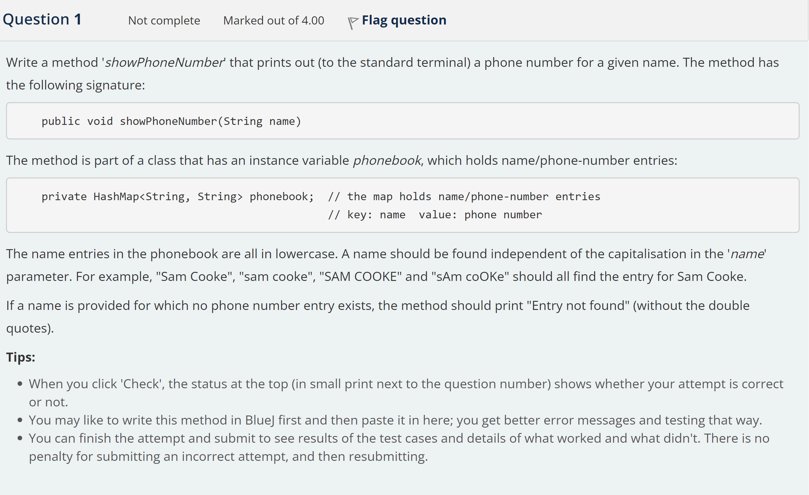

Write a method 'showPhoneNumber' that prints out (to the standard terminal) a phone number for a given name. The method has the following signature:

> 编写一个方法'showPhoneNumber'，用于打印(到标准终端)给定姓名的电话号码。该方法具有以下签名:

```java
{  public void showPhoneNumber(String name)  }
```

The method is part of a class that has an instance variable phonebook, which holds name/phone-number entries:

> 该方法是一个类的一部分，该类有一个实例变量phonebook，其中包含姓名/电话号码条目:

```java
{  private HashMap<String, String> phonebook;  // the map holds name/phone-number entries
                                                // key: name  value: phone number   }
```

The name entries in the phonebook are all in lowercase. A name should be found independent of the capitalisation in the 'name' parameter. For example, "Sam Cooke", "sam cooke", "SAM COOKE" and "sAm coOKe" should all find the entry for Sam Cooke.

> 电话簿中的姓名条目都是小写的。名称应该独立于“name”参数中的大小写。例如，“Sam Cooke”，“Sam Cooke”，“Sam Cooke”和“Sam Cooke”都应该找到Sam Cooke的条目。

If a name is provided for which no phone number entry exists, the method should print "Entry not found" (without the double quotes).

> 如果提供的名称没有电话号码条目，则该方法应该打印“条目未找到”(不包含双引号)。

## 提示：

When you click 'Check', the status at the top (in small print next to the question number) shows whether your attempt is correct or not.

> 当你点击“检查”时，顶部的状态(在问题编号旁边的小字体)会显示你的尝试是否正确。

You may like to write this method in BlueJ first and then paste it in here; you get better error messages and testing that way.

> 你可以先在BlueJ中编写这个方法，然后将它粘贴到这里;这样可以得到更好的错误消息和测试。

You can finish the attempt and submit to see results of the test cases and details of what worked and what didn't. There is no penalty for submitting an incorrect attempt, and then resubmitting.

> 您可以完成尝试并提交，以查看测试用例的结果，以及哪些有效、哪些无效的细节。提交错误的尝试，然后重新提交不会受到惩罚。

```txt
Write a method 'showPhoneNumber' that prints out (to the standard terminal) a phone number for a given name. The method has the following signature:


{  public void showPhoneNumber(String name)  }


The method is part of a class that has an instance variable phonebook, which holds name/phone-number entries:


{  private HashMap<String, String> phonebook;  // the map holds name/phone-number entries
                                                // key: name  value: phone number   }


The name entries in the phonebook are all in lowercase. A name should be found independent of the capitalisation in the 'name' parameter. For example, "Sam Cooke", "sam cooke", "SAM COOKE" and "sAm coOKe" should all find the entry for Sam Cooke.

If a name is provided for which no phone number entry exists, the method should print "Entry not found" (without the double quotes).


提示：
When you click 'Check', the status at the top (in small print next to the question number) shows whether your attempt is correct or not.

You may like to write this method in BlueJ first and then paste it in here; you get better error messages and testing that way.

You can finish the attempt and submit to see results of the test cases and details of what worked and what didn't. There is no penalty for submitting an incorrect attempt, and then resubmitting.
```



```java
import java.util.HashMap;
import java.util.Iterator;
import java.util.Scanner;
import java.util.Set;

public class Test {

    private HashMap<String, String> phonebook;

    public static void main(String[] args) {
        Scanner scanner = new Scanner(System.in);
        Test test = new Test();
        test.savePhoneNumber();
        System.out.print("请输入要查找的姓名：");
        String name1 = scanner.nextLine();
        String name = "";
        String[] strings = name1.split(" ");
        for (int i = 0; i < strings.length; i++) {
            strings[i] = strings[i].toLowerCase();
            if (i == strings.length - 1){
                name = name + strings[i];
            }
            else {
                name = name + strings[i] + " ";
            }
        }
        test.showPhoneNumber(name);
    }

    public void showPhoneNumber(String name){

        boolean a = true;
        Set<String> strings = phonebook.keySet();
        Iterator<String> iterator = strings.iterator();
        while (iterator.hasNext()) {
            String next =  iterator.next();
            String phone_number = phonebook.get(next);
            if (name.equals(next)){
                System.out.println(name + ":" + phone_number);
                a = false;
            }

        }
        if (a){
            System.out.println("未找到！");
        }
    }

    public void savePhoneNumber(){

        phonebook = new HashMap<>();
        phonebook.put("tom cat","123456");
        phonebook.put("my sql","1234567");
        phonebook.put("key value","12345678");
    }

}
```


::: details 公众号：AI悦创【二维码】


:::

::: info AI悦创·编程一对一

AI悦创·推出辅导班啦，包括「Python 语言辅导班、C++ 辅导班、java 辅导班、算法/数据结构辅导班、少儿编程、pygame 游戏开发、Web、Linux」，全部都是一对一教学：一对一辅导 + 一对一答疑 + 布置作业 + 项目实践等。当然，还有线下线上摄影课程、Photoshop、Premiere 一对一教学、QQ、微信在线，随时响应！微信：Jiabcdefh

C++ 信息奥赛题解，长期更新！长期招收一对一中小学信息奥赛集训，莆田、厦门地区有机会线下上门，其他地区线上。微信：Jiabcdefh

方法一：[QQ](http://wpa.qq.com/msgrd?v=3&uin=1432803776&site=qq&menu=yes)

方法二：微信：Jiabcdefh

:::


