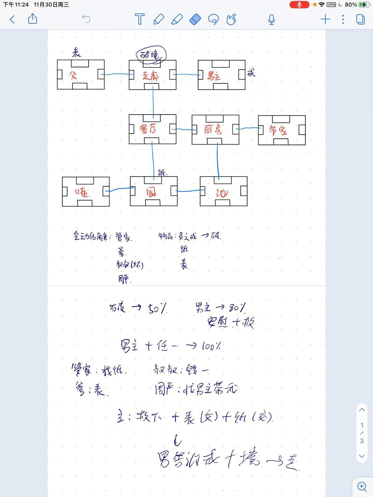

## 开始：

读码，对代码做出一些改变。比如：

1. 改变一个位置的名字。
2. 改变出口——选择一个当前位于另一个房间西面的房间，将它改变到北面。
3. 加几个房间。

## 设计你的房间：

首先需要决定游戏的设定（背景），目标和故事走向。

### 可能是这样的：

你在 XXX（我们学校）地。你需要找到实验室在哪。为了找到它，你需要找到办公室去去询问。

最后，你需要找到考试房间。如果你准时到达，并且在路上找到了课本，而且你也去过了实验室，你就成功了。

如果期间你去过学生酒吧超过五次，你的考试成绩就会减半。

### 或者：

你在地牢里迷路了。你遇到了一个侏儒。如果你找了一些吃的给侏儒，他会告诉你在哪里可以找到魔杖。
如果你在洞穴里使用魔杖，打开出口，就成了。

它可以是任何情况，所以要有创意。想想我使用的风景（地牢，城市，建筑......），然后决定你的位置。
让它有趣些，不要太复杂。（个人建议不超过12个房间）在风景中放置物体，它可能是人，怪兽......
决定玩家需要完成的任务。

### 基础任务：

1. 这个游戏最少有六个位置/房间。
2. 有些房间里有物品。每个房间可以容纳任意数量的物品，有些物品可以被玩家拾起，其他的物品不可以。
3. 玩家可以携带一些道具，每个道具都有重量，玩家携带的物品总重不能超过一个值。
4. 玩家可以成功。一定会有一个结束场景然后玩家被告知已经成功了。玩家至少需要通过两个房间才能赢。
5. 完成 `'back'` 指令，他将把玩家带回上一个房间。`'back'` 指令应该全程追踪，能够做到把玩家一步一步带回起点。
6. 增加至少四个新指令。

## 挑战任务：

1. 添加最少三个角色，可以是人，怪兽或其他任意可以动的东西。这些角色也在房间里（就跟物品一样），但是这些角色会动。
2. 拓展解析器让他能识别 `three-word` 指令。例如： `'give bread dwarf'` 指令，给侏儒（现在跟随我的）面包。
3. 添加一个 magic transporter room，每次玩家进入它就会被随机传送到一个房间。

## 报告：

少于四页，且包含以下内容:

1. 游戏名称和简介。
2. 简介应该包括 这个游戏是干啥的 和 简单的执行描述（重要功能是啥）
3. 完成的每项基本任务以及我是怎么完成的。
4. 完成的每项挑战任务和我咋做到的。
5. 解释一个例子（耦合，内聚，负责驱动设计，维护能力)
6. 游戏的演练，包括完成游戏所输入的指令。

::: details 公众号：AI悦创【二维码】

:::

::: info AI悦创·编程一对一

AI悦创·推出辅导班啦，包括「Python 语言辅导班、C++ 辅导班、java 辅导班、算法/数据结构辅导班、少儿编程、pygame 游戏开发、Web、Linux」，全部都是一对一教学：一对一辅导 + 一对一答疑 + 布置作业 + 项目实践等。当然，还有线下线上摄影课程、Photoshop、Premiere 一对一教学、QQ、微信在线，随时响应！微信：Jiabcdefh

C++ 信息奥赛题解，长期更新！长期招收一对一中小学信息奥赛集训，莆田、厦门地区有机会线下上门，其他地区线上。微信：Jiabcdefh

方法一：[QQ](http://wpa.qq.com/msgrd?v=3&uin=1432803776&site=qq&menu=yes)

方法二：微信：Jiabcdefh

:::

