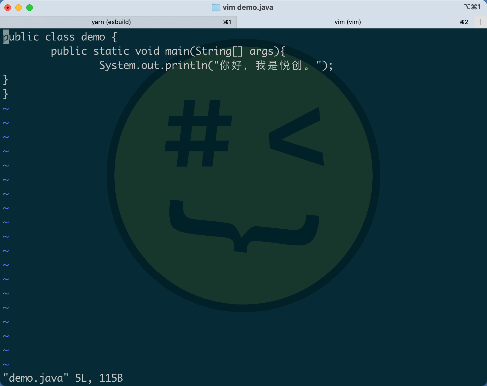
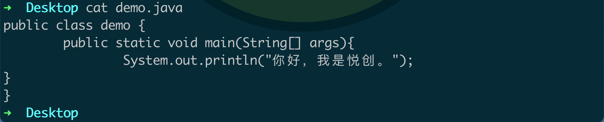

## 命令行运行

::: tabs

@tab 编写代码

```java
➜  Desktop vim demo.java
```



1. 按下 ESC
2. 输入：`:wq`

@tab 运行流程

1. javac demo.java 「编译」
2. java demo

我们可以使用 cat 快速查看我们的文件内容：



:::

1. 程序要用英文字符来编写；
2. 大小写要和我敲的一样；
3. 程序的所有标点符号一律要用英文；
4. 缩进，为了让代码整洁一致；
5. 保存的文件名称，一定要和我们的**类**名称是一致的；「大小写都要一样哦！」
6. 后缀名一定要 `.java`；
7. 输出的字符呢，可以是任意字符；「也就是，我们用输入法可以输入的字符，都可以放在**双引号**里面」

| 转换符 | 类型                              | 示例         | 转换符 | 类型               | 示例    |
| ------ | --------------------------------- | ------------ | ------ | ------------------ | ------- |
| d      | 十进制整数                        | 159          | s      | 字符串             | hello   |
| x      | 十六进制整数                      | 9f           | c      | 字符               | H       |
| o      | 八进制整数                        | 237          | b      | 布尔               | true    |
| f      | 定点浮点数                        | 1.59e+01     | h      | 散列码             | 42628b2 |
| e      | 通用浮点数（e 和 f 中较短的一个） | `——`         | %      | 百分号             | %       |
| a      | 16进制浮点数                      | `0x1.fccdp3` | n      | 与平台有关的换行符 | `——`    |


::: details 公众号：AI悦创【二维码】


:::

::: info AI悦创·编程一对一

AI悦创·推出辅导班啦，包括「Python 语言辅导班、C++ 辅导班、java 辅导班、算法/数据结构辅导班、少儿编程、pygame 游戏开发、Web、Linux」，全部都是一对一教学：一对一辅导 + 一对一答疑 + 布置作业 + 项目实践等。当然，还有线下线上摄影课程、Photoshop、Premiere 一对一教学、QQ、微信在线，随时响应！微信：Jiabcdefh

C++ 信息奥赛题解，长期更新！长期招收一对一中小学信息奥赛集训，莆田、厦门地区有机会线下上门，其他地区线上。微信：Jiabcdefh

方法一：[QQ](http://wpa.qq.com/msgrd?v=3&uin=1432803776&site=qq&menu=yes)

方法二：微信：Jiabcdefh

:::


