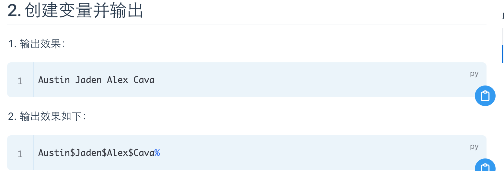
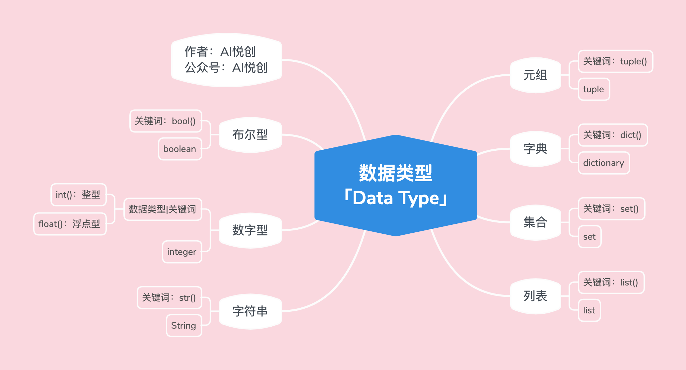
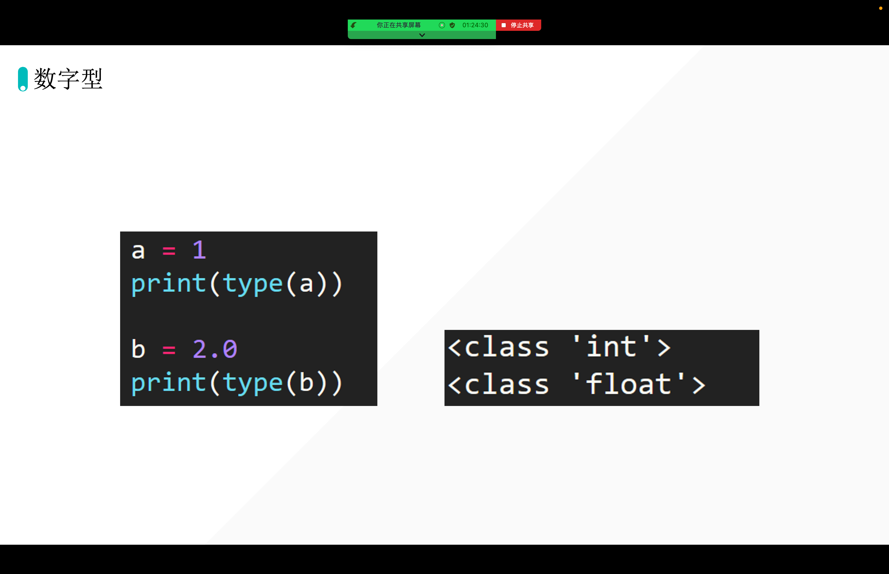
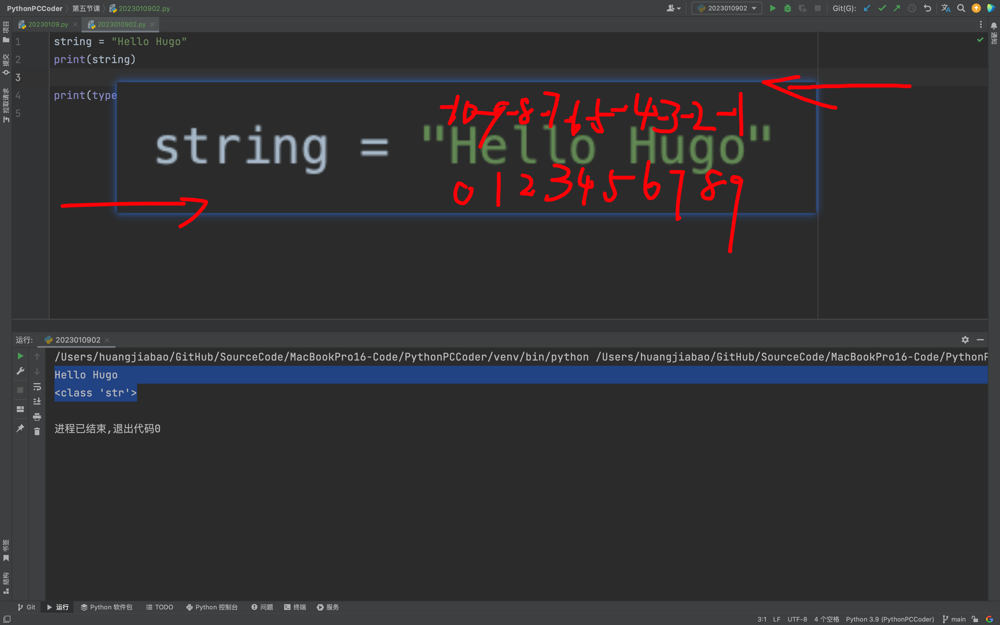
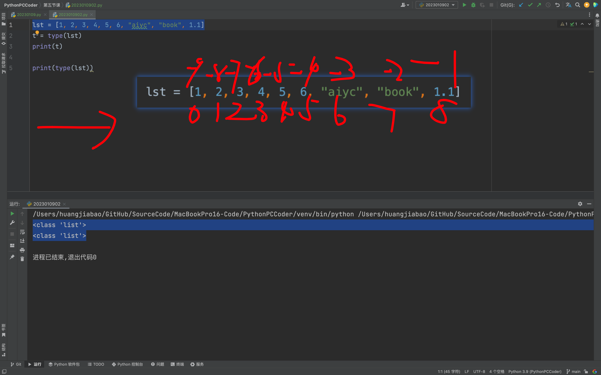
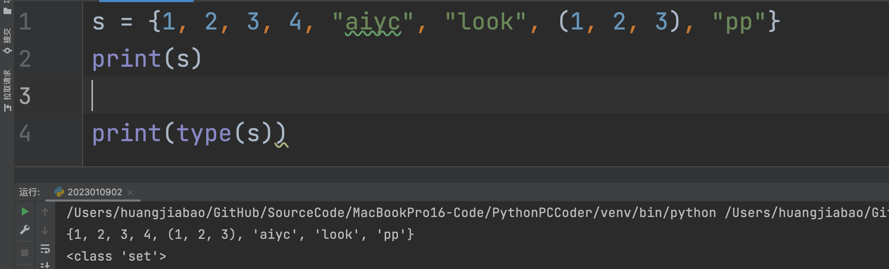
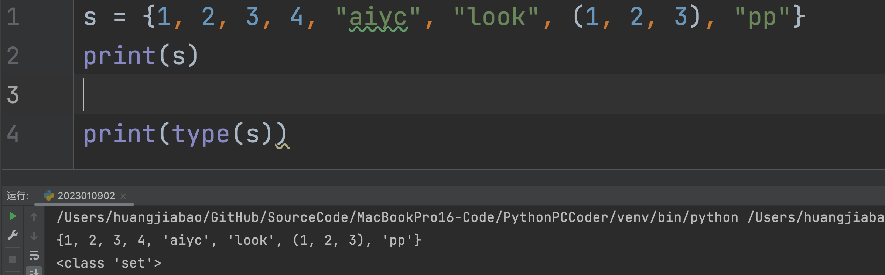
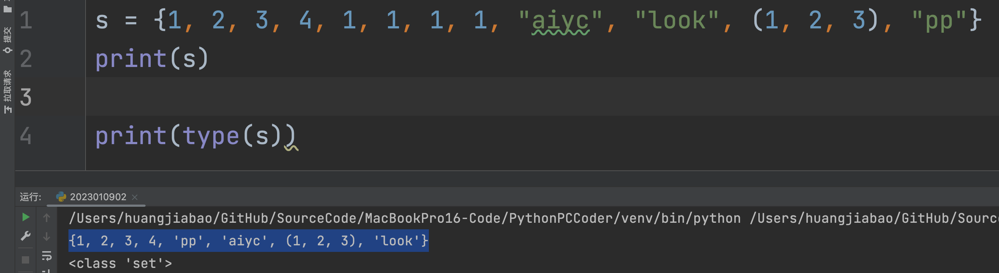
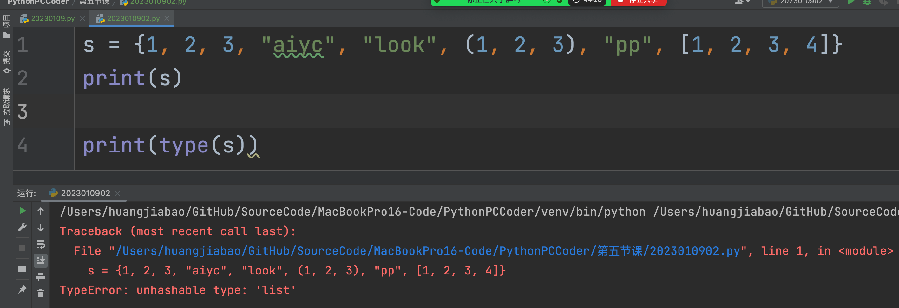
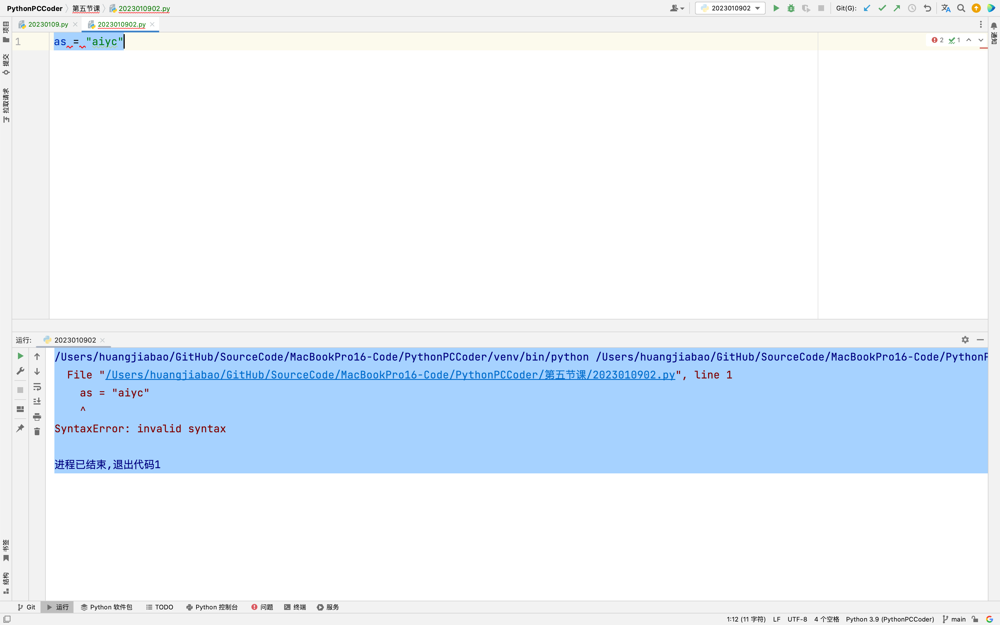

## 1. 变量的练习



1. Answer 1

```python
name1 = "Austin"
name2 = "Jaden"
name3 = "Alex"
name4 = "Cava"
# xxxx
print(name1, name2, name3, name4)  # 同时输出多个变量
```

输出：

```python
Austin Jaden Alex Cava
```

## 2. sep、end

```python
name1 = "Austin"
name2 = "Jaden"
name3 = "Alex"
name4 = "Cava"
# xxxx
print(name1, name2, name3, name4, sep="间隔", end="*")  # 同时输出多个变量
# sep="间隔" 设置间隔，默认是空格为间隔
# end="\n" 控制换行\n 换行
print("Hugo")
```

```python
Austin间隔Jaden间隔Alex间隔Cava*Hugo
```

## 3. 初识数据类型




:::: tabs

@tab 数字型



- type: 检测数据类型

@tab 整型✅

```python
num = 1
t = type(num)
print(t)
print(type(num))
print(num)
```

输出：

```python
<class 'int'>
<class 'int'>
1
```

@tab 浮点型✅

```python
num = 1.0
t = type(num)
print(t)

print(type(num))
```

输出：

```python
<class 'float'>
<class 'float'>
```

@tab 字符串

```python
string = "Hello Hugo"
print(string)

print(type(string))
```

输出：

```python
Hello Hugo
<class 'str'>
```

## 字符串三大特性

1. 有序性：从左到右 0 开始，从右到左 -1 开始。
2. 不可变性
3. 任意数据类型

### 1. 有序性✅



### 2. 不可变性✅

::: tip 说明

不可变性就是：字符串在**运行**的过程当中，是不可以被修改「改变」

:::

### 3. 任意数据类型

你键盘上，可以输入的字符，都可以放进我们的字符串当中。

@tab 列表

```python
lst = [1, 2, 3, 4, 5, 6, "aiyc", "book", 1.1]
t = type(lst)
print(t)

print(type(lst))
```

输出：

```python
<class 'list'>
<class 'list'>
```

## 三大特性

### 1. 有序性



@tab 元组

```python
tup = (1, 2, 3, "aiyc", 1.1)
print(tup)

print(type(tup))
```

## 三大特性

1. 有序性
2. 任意数据类型
3. 不可变性

@tab 集合

```python
s = {1, 2, 3, 4, "aiyc", "look"}
print(s)

print(type(s))
```

## 三大特性

1. 无序性
2. 互异性
3. 确定性

### 无序性





### 互异性



### 确定性

列表可变，所以造成，不确定。那不确定的话，会出现什么问题呢？——未知。而我们的集合要求是数据必须是确定的。



### 集合是可变的

@tab 字典

```python
d = {"key": "value", "name": "lilei", "age": 19}
print(d)
print(type(d))
```

## 字典的特点

- key：不可变，不能使用可变的数据类型当作 key。
    - 列表可以做 key 吗？——不能做
    - 集合可以做 key 吗？——集合可变的，所以不能做 key
    - 元组可以做 key 吗？——元组不可变，所以可以做 key
    - 字符串可以做 key 吗？——字符串不可变，所以可以做 Key
    - 数字型可以做 key 吗？——可以
- 

::::


## 评价

- 之前的知识点有些遗忘；

- 变量不能用关键词命名：



- 感觉有些不在状态


::: details 公众号：AI悦创【二维码】


:::

::: info AI悦创·编程一对一

AI悦创·推出辅导班啦，包括「Python 语言辅导班、C++ 辅导班、java 辅导班、算法/数据结构辅导班、少儿编程、pygame 游戏开发、Web、Linux」，全部都是一对一教学：一对一辅导 + 一对一答疑 + 布置作业 + 项目实践等。当然，还有线下线上摄影课程、Photoshop、Premiere 一对一教学、QQ、微信在线，随时响应！微信：Jiabcdefh

C++ 信息奥赛题解，长期更新！长期招收一对一中小学信息奥赛集训，莆田、厦门地区有机会线下上门，其他地区线上。微信：Jiabcdefh

方法一：[QQ](http://wpa.qq.com/msgrd?v=3&uin=1432803776&site=qq&menu=yes)

方法二：微信：Jiabcdefh

:::


