## 1. 新建目录

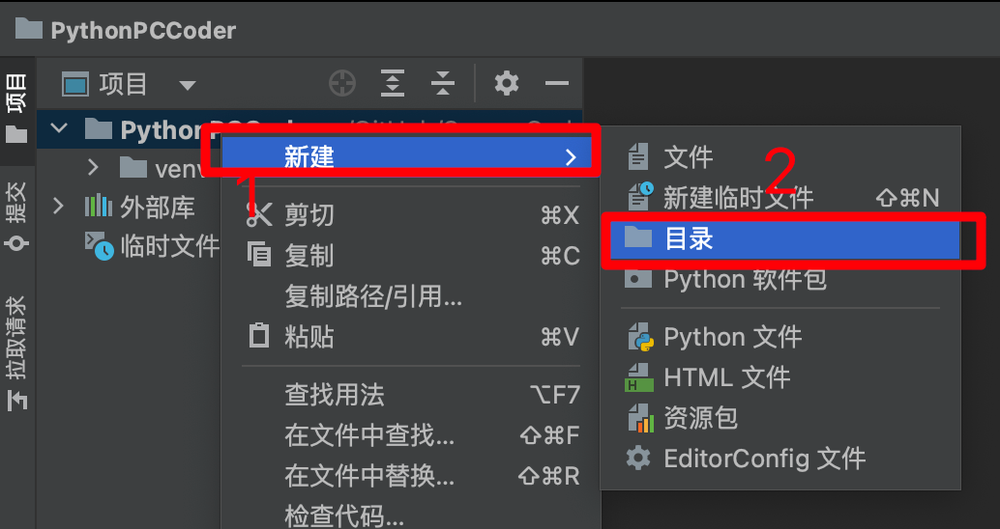

> 为我们的目录「文件夹」命名。

::: tip

推荐命名方法：英文、下划线、不要用空格

现阶段可以先用：中文命名文件夹或者是用中文的拼音拼写。

:::

输入好名称后，回车。

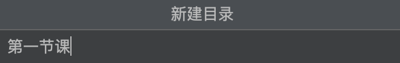

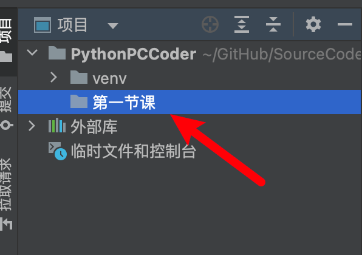

## 2. 新建 Python 代码

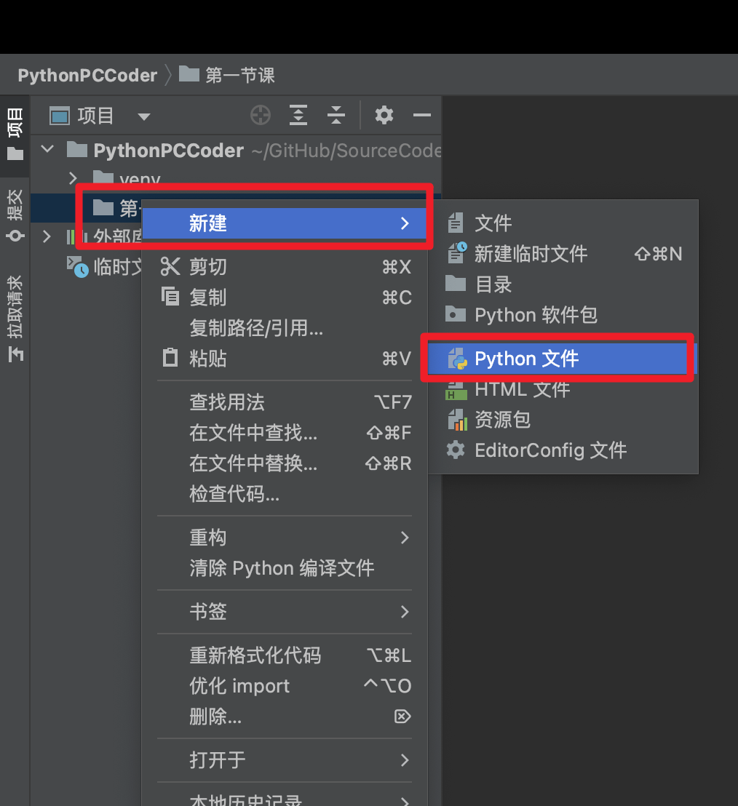

输入文件名称后，回车创建。

::: tip

文件名称先使用日期创建：2022112401

**解析：**

- 20221124：日期（2022年11月24日）
- 01：今天上课创建的第几个文件。

以后还是用英文比较好哦！不要带有空格创建 Python 文件。

:::

## 3. 初探 print() 函数

```python
print("静夜思")
print("床前明月光，疑是地上霜。")
print("举头望明月，低头思故乡。")

print("jing ye shi")
print("chuang qian ming yue guang，yi shi di shang shuang。")
print("ju tou wang ming yue，di tou si gu xiang。")
```


## 4. 变量「Variable」

### 4.1 从字面意思去理解变量

- 变：变化
- 量：有大小的

### 4.2 从生活中来理解变量

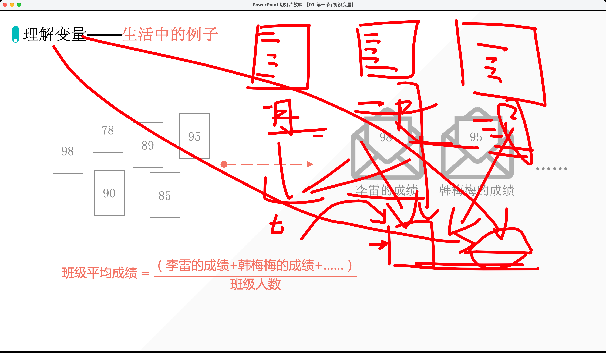

::: tip

**变量就是在计算机的内存上开辟空间。**

ps：信封在当前空间中，开辟了一个空间叫做：信封，来装东西；冰箱也是如此。

:::

### 4.3 变量的特点「覆盖」

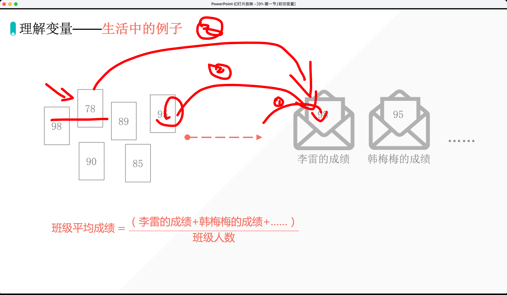

**代码实例：**

```python
var = 98
var = 95
var = 78
print(var)
```

输出：

```python
78
```

```python
var = 98
print(var)
var = 95
print(var)
var = 78
print(var)
```

输出：

```python
98
95
78
```

```python
var = 98
print(var)
var = 95
print(var)
var = 78
print(var)
b = var + 10  # 78 + 10
print(b)
```

输出：

```python
98
95
78
```

## 5. 赋值语句

### 5.1 变量名 = 表达式

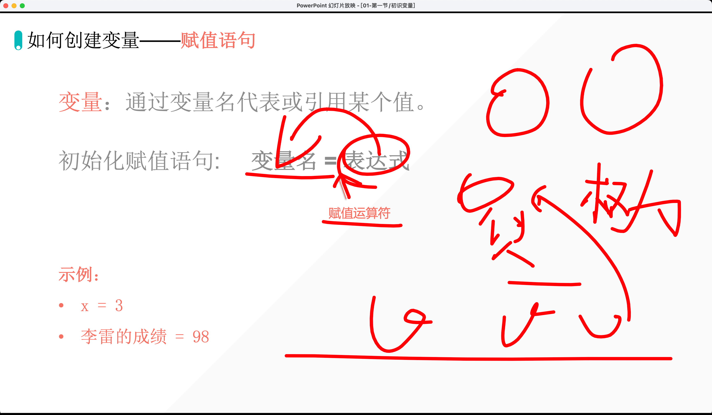

### 5.2 变量的运行顺序

::: tip

变量的运行顺序：从上到下，从左到右

:::

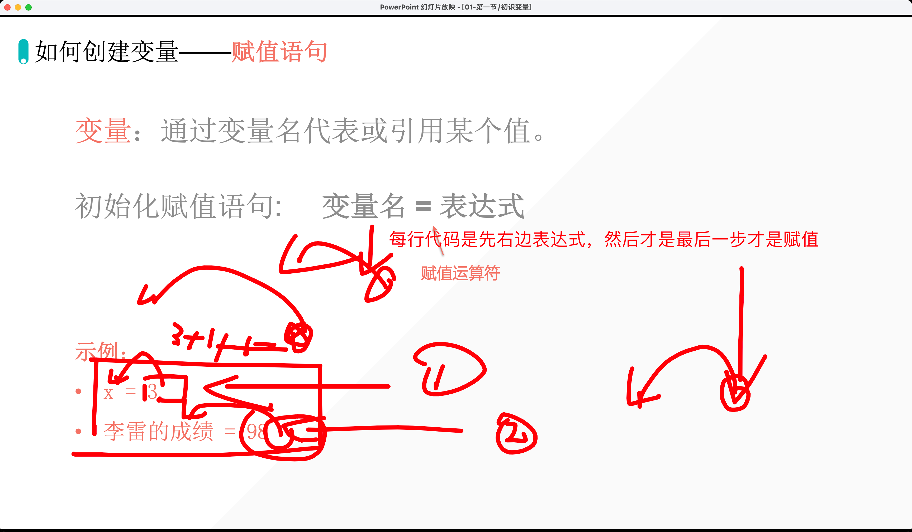

## 6. 作业输出三角形

```python
    *
  *****
*********
```

## 7. 变量的赋值过程「2022年11月30日」

```python
x = 1
x = x + 10
print(x)  # 11

name1 = "Hugo"
name2 = name1
print(name2)  # Hugo

name1 = "aiyc"
name1 = "Hugo"
print(name1)  # Hugo
```

输出：

```python
11
Hugo
Hugo
```

## 8. 进阶赋值的方法

### 8.1 普通赋值方法

```python
a = 1
b = 1
c = 1
print(a)
print(b)
print(c)
```

输出：

```python
1
1
1
```

### 8.2 并排输出

```python
a = 1
b = 1
c = 1
# print(a)
# print(b)
# print(c)
print(a, b, c)  # 并排输出，默认空格间隔
```

输出：

```java
1 1 1
```

### 8.3 多个变量赋值相同的值

```python
a = b = c = 1
print(a, b, c)  # 并排输出，默认空格间隔
```

输出：

```java
1 1 1
```

### 8.4 同时给多个变量赋予不同的值

```python
a, b, c = 1, 2, 3
print(a, b, c)  # 并排输出，默认空格间隔
```

输出：

```python
1 2 3
```

## 9. 变量的命名规则

### 9.1 区分大小写

```python
a = 10
A = 1
print(a)
```

输出：

```python
10
```

### 9.2 数字不能开头

```python
1a = 10
print(a)
```

报错信息：

```python
  File "/Users/huangjiabao/GitHub/SourceCode/MacBookPro16-Code/PythonPCCoder/第二节课/2022113001.py", line 1
    1a = 10
     ^
SyntaxError: invalid syntax
```

::: tip 数字不能开头

会报错！

除了开头，其他位置都可以放。

:::

```python
a112121 = 10

print(a112121)
```

输出：

```python
10
```

### 9.3 变量名，不能有空格

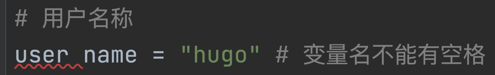

**怎么解决呢？**

我们使用下划线 `_`：

```python
# 用户名称
user_name = "hugo"  # 变量名不能有空格
print(user_name)
```

输出：

```python
hugo
```

### 9.4 关键词不能做变量名

```python
help("keywords")
```

输出：

```python
Here is a list of the Python keywords.  Enter any keyword to get more help.

False               break               for                 not
None                class               from                or
True                continue            global              pass
__peg_parser__      def                 if                  raise
and                 del                 import              return
as                  elif                in                  try
assert              else                is                  while
async               except              lambda              with
await               finally             nonlocal            yield
```

### 9.5 不要使用 Python 的内置函数名称做变量名

```python
print = "Hugo"
print(print)
```

报错代码：

```python
Traceback (most recent call last):
  File "/Users/huangjiabao/GitHub/SourceCode/MacBookPro16-Code/PythonPCCoder/第二节课/2022113001.py", line 2, in <module>
    print(print)
TypeError: 'str' object is not callable
```

## 10. 作业

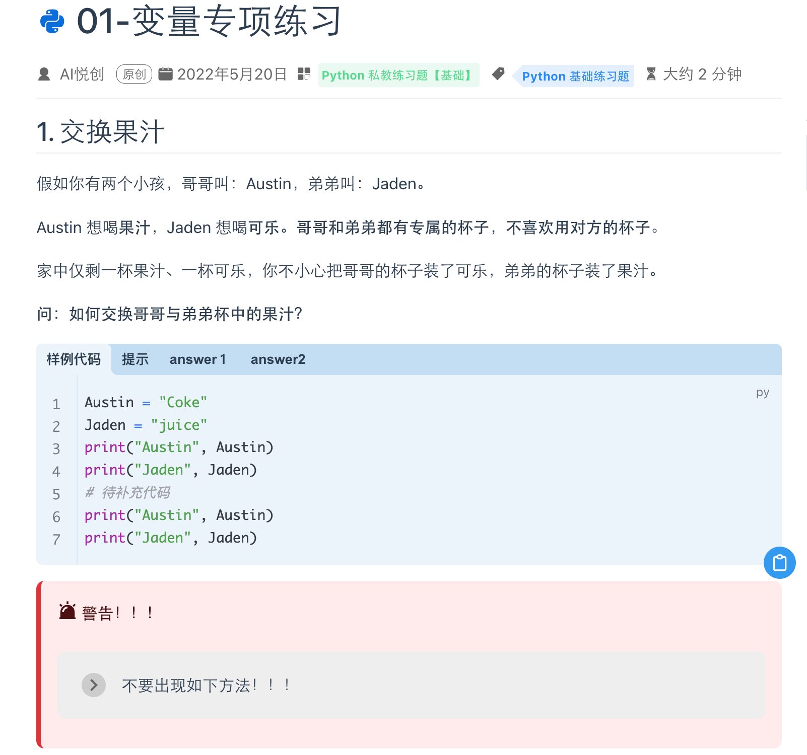


## 11. 作业讲解

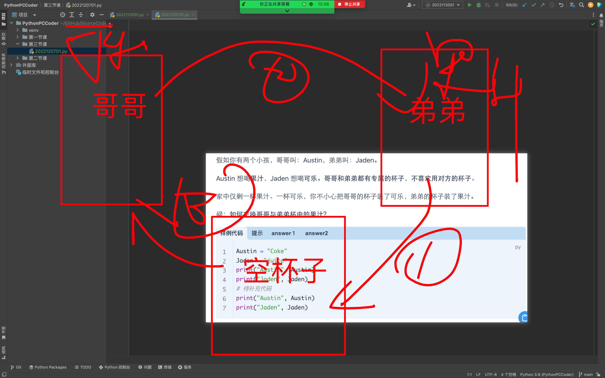

编程如何实现呢？

```python
Austin = "Coke"  # 哥哥 Coke
Jaden = "Juice"  # 弟弟 Juice
print("Austin：", Austin)
print("Jaden：", Jaden)
# 是不是要创建一个空杯子
cup = Jaden
Jaden = Austin
Austin = cup
print("Austin：", Austin)
print("Jaden：", Jaden)
```

```python
a = 1
b = 2
c = 3

# a = 3
# b = 1
# c = 2
```

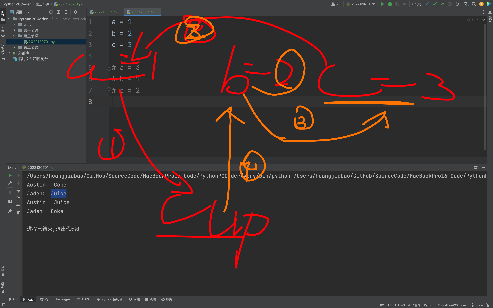

```python
a = 1
b = 2
c = 3
d = 4

# a = 4
# b = 1
# c = 2
# d = 3
```

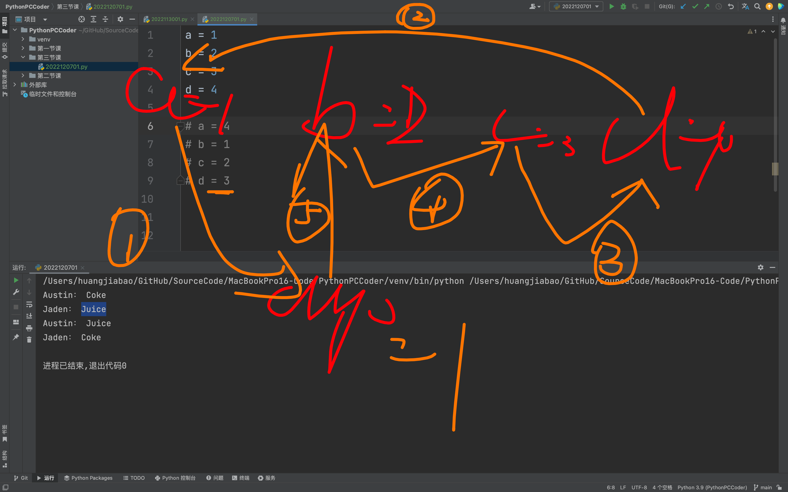

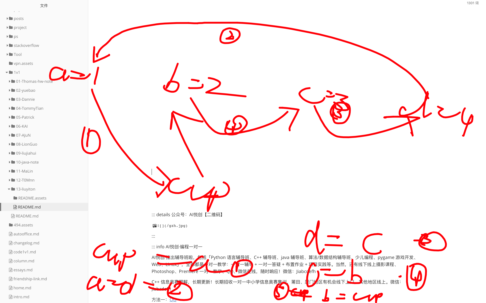

::: details 注意⚠️

从上到下，从右到左执行的

::: 


## 注意点⚠️

1. 括号必须是英文括号

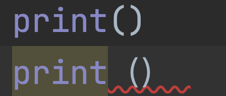

2. 必须是英文双引号

3. 变量创建当中是下划线，不是减号

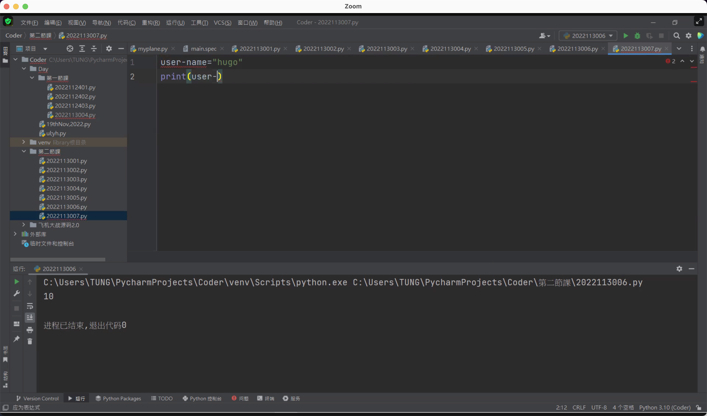

[https://video.aiyc.top/GuGO/](https://video.aiyc.top/GuGO/)

::: details 公众号：AI悦创【二维码】


:::

::: info AI悦创·编程一对一

AI悦创·推出辅导班啦，包括「Python 语言辅导班、C++ 辅导班、java 辅导班、算法/数据结构辅导班、少儿编程、pygame 游戏开发、Web、Linux」，全部都是一对一教学：一对一辅导 + 一对一答疑 + 布置作业 + 项目实践等。当然，还有线下线上摄影课程、Photoshop、Premiere 一对一教学、QQ、微信在线，随时响应！微信：Jiabcdefh

C++ 信息奥赛题解，长期更新！长期招收一对一中小学信息奥赛集训，莆田、厦门地区有机会线下上门，其他地区线上。微信：Jiabcdefh

方法一：[QQ](http://wpa.qq.com/msgrd?v=3&uin=1432803776&site=qq&menu=yes)

方法二：微信：Jiabcdefh

:::


