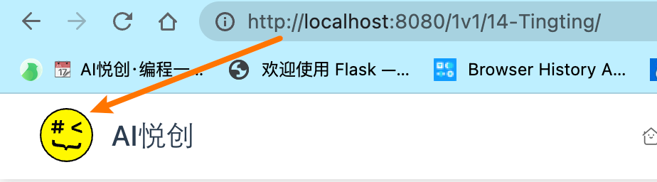
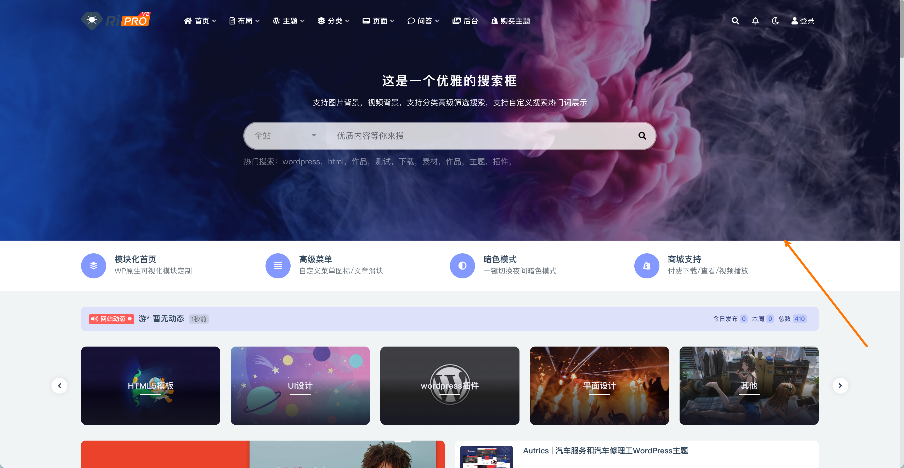
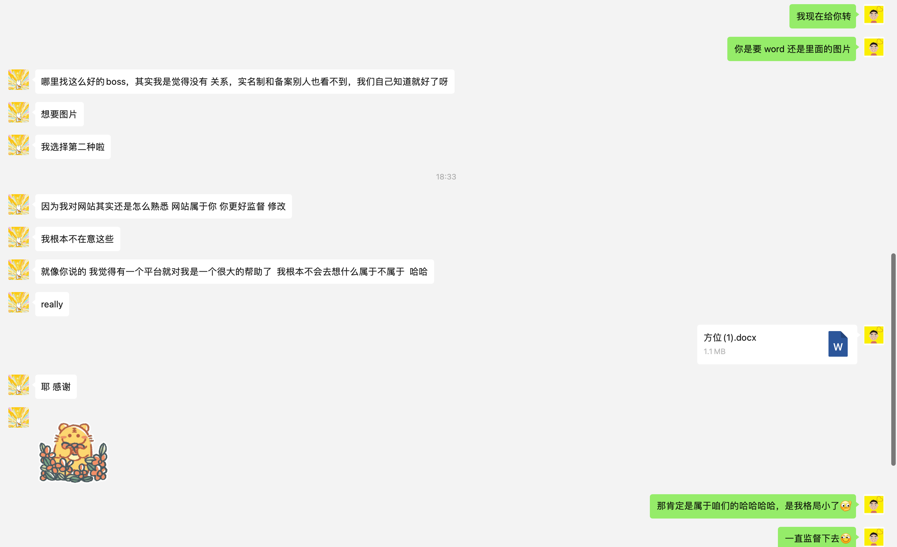

## About

待书写......✍️

## Link

This is a future designer's website, if you want to access immediately, please click [https://taoyao.art](https://taoyao.art).

## Part 1: Plan

### 0. 进展表

| 序号 | 名称                | 内容               | 完成情况 | 开始日期                                                     | 完成日期              | 费用   | 有效期   | 说明                                                         |
| ---- | ------------------- | ------------------ | -------- | ------------------------------------------------------------ | --------------------- | ------ | -------- | ------------------------------------------------------------ |
| 01   | 域名购买            | taoyao.art         | ✅        | 2022年12月11日                                               | 2022年12月11日        | xx元   | 1年      | 首年、阿里合作作者优惠，稳定后，长期购买                     |
| 02   | 服务器购买          | IPxxxxx            | ✅        | 2022年12月11日                                               | 2022年12月11日        | xxk    | 5年      | 无                                                           |
| 03   | 域名模版            | Tingting           | ✅        | 2022年12月11日                                               | 2022年12月14日        | 0      | 永久     | 无                                                           |
| 04   | 域名过户            | Jiabao to Tingting | ✅        | 2022年12月14日                                               | 2022年12月14日        | 0      | 永久     | 无                                                           |
| 05   | 域名 + 网站「备案」 | ICP 工信部         | ✅        | 提交初审：2022年12月14日 初审通过：2022年12月15日 短信核验：2022年12月15日 备案通过：2022-12-24 14:25 | 2022年12月24日 14:25  | 0      | 永久     | 1. 系统检查：通过工信部系统未核实到taoyao.art的实名认证信息，请在域名注册商完成[域名实名认证ⓘ](https://help.aliyun.com/knowledge_detail/36904.html?spm=a2cmq.17630029.icp_beian.9.532b79fe7PX2CZ)后2-3天再提交备案，域名注册商非阿里云请咨询其[域名注册商ⓘ ](https://whois.aliyun.com/whois/domain/taoyao.art)。 |
| 05   | 部署上线网站        | 部署               | ✅        | 2022年1月2日                                                 | 2022年1月2日-23:30:36 | 0      | 永久     | 敏捷开发                                                     |
| 06   | 提升网站性能        | 加快用户访问速度等 |          | 2022年1月3日                                                 |                       | 未计算 | 持续优化 | 1. CDN 云存储✅ 2. 服务器配置 3. 缓存配置      |
| 07   | QQ                  | QQ 登陆开发        | ✅        | 2022年1月2日                                                 | 2022年1月3日          | 0      | 永久     | ~~已经提交~~ 已经上线 修复 SSL 加密回调            |
| 08   | 公安备案            | 公安备案           | ✅        | 2022年1月3日                                                 | 2023-01-11 08:00:58   | 0      | 永久     | 已经提交 2023年1月09日，被驳回。当日改版，重新提交。2023-01-11 08:00:58 通过✅ |
| 09   |                     |                    |          |                                                              |                       |        |          |                                                              |
| 06   | 镜像网站开发        |                    |          |                                                              |                       |        |          |                                                              |
| 07   | 教学主理人          |                    |          |                                                              |                       |        |          |                                                              |
| 08   | 主理人设计网站      |                    |          |                                                              |                       |        |          |                                                              |
| 09   | QQ 登陆开发         |                    |          |                                                              |                       |        |          |                                                              |

::: tip 说明

上表仅为计划与记录，费用仅用来记录，保证数据的完备性。

:::

### 1. 域名购买「✅」

- Date：December 11, 2022

### 2. 域名模版认证

- Date：December 11, 2022「✅」
- 已申请，待通过 「」

### 3. 素材设计

| 序号 | 内容        | 格式                 | 推荐格式 | 位置「点击放大」                                             | 尺寸「参考」 | 完成日期 | 完成情况 | 参考链接                                                     |
| ---- | ----------- | -------------------- | -------- | ------------------------------------------------------------ | ------------ | -------- | -------- | ------------------------------------------------------------ |
| 01   | Logo        | png/jpge             | png      |  | 487x128      |          |          |                                                              |
| 02   | favicon.ico | ico/png/gif/jpge/svg | ico/svg  |  | 32*32像素    |          |          |                                                              |
| 03   | Banner      | png/mp4/jpge         | png/jpge |  | 1920x60      |          |          | [https://yunsheji.cc/wp-content/themes/riplus/assets/img/bg.jpg](https://yunsheji.cc/wp-content/themes/riplus/assets/img/bg.jpg) [https://ripro.rizhuti.com/wp-content/uploads/2022/01/1642923665-7b0d6f7dc161eaf.mp4](https://ripro.rizhuti.com/wp-content/uploads/2022/01/1642923665-7b0d6f7dc161eaf.mp4) |

::: tip 提示

图片尺寸，在研发时，均要进行调整，所以尺寸仅供参考，后期共同调节。

:::

### 4. 开发计划

总共会有两个网站，一个是主线路网站。一个是备份且长期稳定的网站，适合做网站镜像。

- [ ] 主网站
- [ ] 镜像网站
- [ ] 图片存储解决方案 [https://github.com/niqingyang/wp-github-gos](https://github.com/niqingyang/wp-github-gos)
- [ ] 视频存储解决方案
- [ ] 备份解决方案

## Part 2: Change log

### [Domain name Purchase](https://wanwang.aliyun.com/?spm=5176.19720258.J_3207526240.34.e93976f4lDXgPt) (2022-12-11)

- 域名购买&模版填写认证

## Part 3: Tool

快速裁剪尺寸

| 序号 | 网站名称                                                     | 链接                                                         |
| ---- | ------------------------------------------------------------ | ------------------------------------------------------------ |
| 01   |  | [https://www.iloveimg.com/zh-cn](https://www.iloveimg.com/zh-cn) |
|      |                                                              |                                                              |
|      |                                                              |                                                              |
|      |                                                              |                                                              |

---

:::: details 闲言碎语

::: tabs

@tab 悦创&桃夭

现在遇到的问题，我描述一下：我的阿里云账号，主体「实名制」是我的名字，域名实名制是你的话，就不好备案。
现在，我想到的两种方法：

1. 需要把域名转给你，重新购买服务器。这样就可以备案，时间会更长；
2. 域名用我的实名制，这样不用重新买服务器，可以加快进度；

1. 优点：全部都是你的实名制；
缺点：多花些 money，和时间会长一点；
2. 优点：省去服务器的费用，服务器我之前买了五年。
缺点：但是网站实名制不是你，备案信息也不是你。

我个人其实挺想把实名制、备案给咱们婷婷的，因为这算是一种归属吧和拥有吧。不要因为钱💰而做出违背内心的选择，钱我来负责[呲牙]你负责理想。想好了跟我说哦

@tab .

看啥呢，啥都没有呢......

:::

::::
