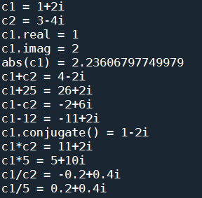
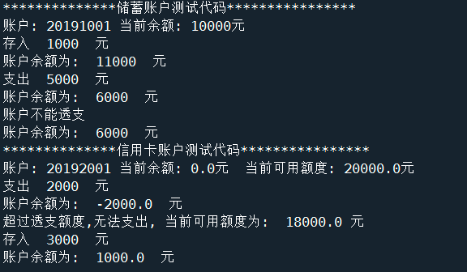

:::: tabs

@tab:active Question 1

## Question 1

请在超星学习平台“章节”的第12讲下找到文本文件 [**mid_score.txt**](/1v1/15-Lantern_Fs/README/mid_score.txt) ，该文本文件包含四列数据，第一列为学号，第二、三、四列分别为语文、数学和英语课程的分数。请编写 Python 程序，实现以下功能。

- 读取该文本文件，计算每个学生的总分；
- 将学生学号和总分输出到一个文本文件 `score_rank.txt`，并将总分按**从高到低**排序。也就是说，在你最后得到的文本文件`score_rank.txt` 里，包含两列数据，第一列是学生的学号，第二列是该学生的总分，且数据是按照总分从高到低排列的。

提示与注意：

- 由于 matrix 平台不支持测试文件读写的代码，所以当你在答题栏填入代码后，可能会出现编译错误的信息，请无视之，此题会进行人工判分。
- 请回忆，如何逐行阅读文件，以及如何对每一行的字符串进行拆分？
- 排序可能要用到之前课件里提到的 sorted 函数，请自行查看课件，将一组数字从大到小排列，需要将 sorted 函数里 reverse 参数设成 True。
- 测试你的代码时，**请将要读取的文本文件和你的代码文件放在同一个文件目录下**，这样无需指定文本文件路径，否则会给我们批改带来麻烦。

::: details Answer

答案1

```python
# -*- coding: utf-8 -*-
# @Time    : 2022/12/13 10:49
# @Author  : AI悦创
# @FileName: q1.py
# @Software: PyCharm
# @Blog    ：https://bornforthis.cn/
# head data: 学号 语文 数学 英语
# 学号和总分 save to score_rank.txt 排序：从高到低
from pprint import pprint


def file_opt(filename, model=None, content=""):
    """
    read file
    :return: contents type: list
    """
    _model = "r"
    if model:
        _model = model
    with open(filename, _model) as f:
        if _model == "r":
            contents = f.readlines()  # list
            return contents
        else:
            f.write(content)
    # print(contents)


def parse(contents: list):
    """
    :param contents:
    :return:
    """
    result_lst = []
    str_to_float = lambda x: float(x)
    for con in contents:
        # print(con.strip().split())
        str_to_float_lst = list(map(str_to_float, con.strip().split()))
        student_id, discipline = str_to_float_lst[0], sum(str_to_float_lst[1:])
        # print(student_id)
        # print(discipline)
        result_lst.append((student_id, discipline))
    # pprint(result_lst)
    return sorted(result_lst, reverse=True, key=lambda x: x[1])


if __name__ == '__main__':
    contents = file_opt("mid_score.txt")
    result_lst = parse(contents)
    # pprint(result_lst)
    for student_id, total in result_lst:
        TEMPLATE = f"{student_id}\t{total}\n"
        file_opt("score_rank.txt", model="a+", content=TEMPLATE)
```

答案2

```python
# encoding: utf-8
"""
@file: assigment 1_2.py
@time: 2022/12/13 10:52
@desc:作业 1 -4
"""


# 作业1
def calc_total_score():
    with open('asserts/mid_score.txt', encoding='utf-8', mode='r') as f:
        txt = f.read().splitlines()
    score_list = []
    for item in txt:
        if len(item.split(' ')) >= 4:
            student_id = item.split(' ')[0]
            yuwen = item.split(' ')[1]
            shuxue = item.split(' ')[2]
            yingyu = item.split(' ')[3]
            total_score = int(yuwen) + int(shuxue) + int(yingyu)  # 计算总分
            score_list.append((student_id, total_score))

    # 对总分进行排序
    sort_score_list = sorted(score_list, key=lambda s: s[1], reverse=True)
    with open('score_rank.txt', mode='a', encoding='utf-8') as f:
        for item in sort_score_list:
            f.write(item[0] + ' ' + str(item[1]) + '\n')

if __name__ == '__main__':
    calc_total_score()
```

:::

@tab Question 2

## Question 2

请在超星学习平台“章节”的第 12 讲下找到两个文本文件："[**name_score.txt**](/1v1/15-Lantern_Fs/README/name_score.txt)"这个文件包含了每个人的中文姓名和对应的成绩；"[**name_pinyin.txt**](/1v1/15-Lantern_Fs/README/name_pinyin.txt)"文件包含了每个人的中文姓名和对应的拼音。

请编写 Python 程序，读取这两个文件，然后生成一个名为 `pinyin_score.txt` 的文本文件，要求新的文本文件中第一列为每个人姓名所对应的拼音，第二列为这个人的成绩，并且每个人的姓名和他对应的成绩是按照成绩**从高到低**排列的。

提示及注意事项

- 由于 matrix 平台不支持测试文件读写的代码，所以当你在答题栏填入代码后，可能会出现编译错误的信息，请无视之，此题会进行人工判分。
- 如果文件中每行对应字符串中存在换行符'`\n`', 但在处理时又不需要字符串中的换行符'`\n`', 可以使用字符串方法中的 strip 去掉换行符，比如

```python
t=s.strip('\n')   #去掉字符串s中的换行符,赋值给字符串t
```

- 测试你的代码时，**请将要读取的文本文件和你的代码文件放在同一个文件目录下**，这样无需指定文本文件路径，否则会给我们批改带来麻烦。
- 这道题有多种实现方式，这里提供一种思路：在读取了"`name_pinyin.txt`"文件后，你可以建立一个包含中文姓名和对应的拼音的字典；在对"`name_score.txt`"的数据进行排序后，可以借助刚才的字典来获得人名对应的拼音。

::: details Answer

答案1

```python
# -*- coding: utf-8 -*-
# @Time    : 2022/12/13 11:36
# @Author  : AI悦创
# @FileName: q2.py
# @Software: PyCharm
# @Blog    ：https://bornforthis.cn/
# new file: pinyin 成绩
from pprint import pprint


def file_opt(filename, model=None, content=""):
    """
    read file or save
    :return: contents type: list
    """
    _model = "r"
    if model:
        _model = model
    with open(filename, _model, encoding="gbk") as f:
        if _model == "r":
            contents = f.readlines()  # list
            return contents
        else:
            f.write(content)


# def generate_dict(contents: list):
#     # for con in contents:
#     #     print(con.strip().split(","))
#     lst = dict([con.strip().split(",") for con in contents])
#     print(lst)
generate_dict = lambda contents, sp: dict([con.strip().split(sp) for con in contents])


def parse(name_score_dict: dict, name_pinyin_dict: dict):
    r_lst = []
    for key, value in name_score_dict.items():
        # print(key, value)
        r_lst.append(
            (name_pinyin_dict.get(key, "NoSearch"), value)
        )
    sorted_by_value_lst = sorted(r_lst, reverse=True, key=lambda x: x[1])
    # pprint(sorted_by_value_lst)
    return sorted_by_value_lst


if __name__ == '__main__':
    name_score = file_opt("name_score.txt")
    name_pinyin = file_opt("name_pinyin.txt")
    # print(name_pinyin)
    # print(name_score)
    name_score_dict = generate_dict(name_score, sp=" ")
    name_pinyin_dict = generate_dict(name_pinyin, sp=",")
    # print(len(name_score_dict))
    # print(len(name_pinyin_dict))
    # print(name_score_dict)
    # print(name_pinyin_dict)
    sorted_by_value_lst = parse(name_score_dict, name_pinyin_dict)
    for student, score in sorted_by_value_lst:
        TEMPLATE = f"{student}\t{score}\n"
        file_opt("pinyin_score.txt", model="a+", content=TEMPLATE)
```

答案2

```python
# encoding: utf-8
"""
@file: assigment 1_2.py
@time: 2022/12/13 10:52
@desc:作业 1 -4
"""

# 作业2
def name_to_score():
    with open('asserts/name_score.txt', encoding='gbk', mode='r') as f:
        name_score = f.read().splitlines()
    with open('asserts/name_pinyin.txt', encoding='gbk', mode='r') as f:
        name_pinyin = f.read().splitlines()
    name_score_map = {}
    name_pinyin_map = {}
    pinyin_score = {}
    for index in range(0, len(name_score)):
        name = name_score[index].split(' ')[0]
        name_fenshu = name_score[index].split(' ')[1]
        name_score_map[name] = name_fenshu

        name_pinyin_wenzhi = name_pinyin[index].split(',')[0]
        name_pinyin_ = name_pinyin[index].split(',')[1]
        name_pinyin_map[name_pinyin_wenzhi] = name_pinyin_
    for key in name_score_map.keys():
        if name_pinyin_map.get(key):
            pinyin_score[name_pinyin_map.get(key)] = name_score_map.get(key)
    sort_score_list = sorted(pinyin_score.items(), key=lambda score: score[1], reverse=True)
    with open('pinyin_score.txt', mode='a', encoding='utf-8') as f:
        for item in sort_score_list:
            f.write(item[0] + ' ' + str(item[1]) + '\n')


if __name__ == '__main__':
    name_to_score()
```

:::

@tab Question 3

## Question 3

请用代码实现一个表示复数的类

定义一个叫做 `complex_number` 的类，用来描述复数 a+bi (为了避免与 Python 内置的 complex 类型冲突，这里使用 a+bi 而非 a+bj 的形式)。这个类应该包括以下实例方法(函数)和属性

1. 构造函数，用于初始化复数的实部和虚部
2. real 和 imag 属性, 分别用于获取复数的实部和虚部
3. 重载的 str() 函数,返回以 a+bi 形式输出的字符串
4. 重载的"+"运算符, 用于计算两个复数 a+bi 与 c+di 之和,或者复数 (a+bi) 与某个实数之和
5. 重载的"-"运算符, 用于计算两个复数 a+bi 与 c+di 之差,或者复数 (a+bi) 与某个实数之差
6. conjugate 方法, 返回该复数的共轭复数
7. 重载的 abs() 函数, 用于计算该复数的模
8. 重载的"*"运算符, 用于计算两个复数 a+bi 与 c+di 之积,或者复数 (a+bi) 与某个实数之积
9. 重载的"/"运算符, 用于计算两个复数 a+bi 与 c+di 之商,或者复数 (a+bi) 与某个实数之商

请把以下测试代码复制到答题栏，在测试代码上方答题：

```python
# 请在以下测试代码上方完成代码
# 以下为测试代码,请勿修改
c1 = complex_number(1, 2)
c2 = complex_number(3, -4)
print("c1 =", c1)
print("c2 =", c2)
print("c1.real =", c1.real)
print("c1.imag =", c1.imag)
print("abs(c1) =", abs(c1))
print("c1+c2 =", c1 + c2)
print("c1+25 =", c1 + 25)
print("c1-c2 =", c1 - c2)
print("c1-12 =", c1 - 12)
print("c1.conjugate() =", c1.conjugate())
print("c1*c2 =", c1 * c2)
print("c1*5 =", c1 * 5)
print("c1/c2 =", c1 / c2)
print("c1/5 =", c1 / 5)
```

本题预期输出效果如下图，你无需刻意追求与下图效果的完全一致



---

### 补充知识点：

复数，是数的概念扩展。

我们把形如 `z = a + bi`（a、b 均为实数）的数称为复数。其中，a 称为[实部](https://baike.baidu.com/item/实部/53626919?fromModule=lemma_inlink)，b 称为虚部，i 称为虚数单位。

- 当 z 的虚部 b＝0 时，则 z 为实数；

- 当 z 的[虚部](https://baike.baidu.com/item/虚部/5231815?fromModule=lemma_inlink) `b≠0` 时，实部 `a ＝ 0` 时，常称 z 为[纯虚数](https://baike.baidu.com/item/纯虚数/3386848?fromModule=lemma_inlink)。

复数域是实数域的代数闭包，即任何复系数多项式在复数域中总有根。

复数是由[意大利](https://baike.baidu.com/item/意大利/148336?fromModule=lemma_inlink)米兰学者卡当在16世纪首次引入，经过达朗贝尔、[棣莫弗](https://baike.baidu.com/item/棣莫弗/2763026?fromModule=lemma_inlink)、欧拉、高斯等人的工作，此概念逐渐为数学家所接受。

::: details Answer

```python
# encoding: utf-8
"""
@file: complex_number.py
@time: 2022/12/13 13:58
@desc: 第二题：复数
"""


class complex_number(complex):

    def __init__(self, real, imag):
        super(complex_number, self).__init__()
        # 保存一个实数，用户格式化输出
        self._real = real
        # 保存一个虚数，用户格式化输出
        self._imag = imag

    def __str__(self):
        """
        格式化输出复数
        :return:
        """
        signal = '+' if self._imag > 0 else ''
        return str(self._real) + signal + str(self._imag) + 'i'

    def get_real(self):
        """
        获取实数
        :return:
        """
        return self.real

    def get_imag(self):
        """
        获取虚数
        :return:
        """
        return self.imag

    def __add__(self, other):
        """
        复数加法运算
        :param other:
        :return:
        """
        if isinstance(other, int):
            # 只加实数部分
            self._real = int(self.get_real() + other)
            return self.__str__()
        else:
            # 有虚数
            imag = int(self.get_imag() + other.get_imag())
            signal = '+' if imag > 0 else ''
            return str(int(self.get_real() + other.get_real())) + signal + str(imag) + "i"

    def __sub__(self, other):
        """
        复数乘法运算
        :param other:
        :return:
        """
        if isinstance(other, int):
            self._real = int(self.get_real() - other)
            return self.__str__()
        else:
            # 有虚数
            imag = int(self.get_imag() - other.get_imag())
            signal = '+' if imag > 0 else ''
            return str(int(self.get_real() - other.get_real())) + signal + str(imag) + "i"

    def conjugate(self) -> str:
        """
        复数的共轭
        :return:
        """
        if self._imag != 0:
            self._imag = self.get_imag() * -1
        self._real = self.get_real()
        return self.__str__()

    def __abs__(self):
        """
        复数的绝对值
        :return:
        """
        num = self.get_real() * self.get_real() + self.get_imag() + self.get_imag()
        # 平方根
        return num ** 0.5

    def __mul__(self, other):
        """
        复数的乘法
        :param other:
        :return:
        """
        if isinstance(other, int):
            self._real = int(self.get_real() * other)
            self._imag = int(self.get_imag() * other)
            return self.__str__()
        else:
            # 有虚数
            # (ac－bd)+(bc+ad)i
            first = int(self.get_real() * other.get_real() - self.get_imag() * other.get_imag())
            second = int(self.get_imag() * other.get_real() + self.get_real() * other.get_imag())
            return str(first) + '+' + str(second) + "i"

    def __truediv__(self, other):
        """
        复数的除法
        :param other:
        :return:
        """
        if isinstance(other, int):
            self._real = float(self.get_real() / other)
            self._imag = float(self.get_imag() / other)
            return self.__str__()
        else:
            # a+bi(a，b∈R)，除以c+di(c，d∈R)
            left_top = self.get_real() * other.get_real() + self.get_imag() * other.get_imag()
            bottom = other.get_real() * other.get_real() + other.get_imag() * other.get_imag()
            left = float(left_top / bottom)
            right_top = self.get_imag() * other.get_real() - self.get_real() * other.get_imag()
            right = float(right_top / bottom)
            return str(left) + '+' + str(right) + 'i'


if __name__ == '__main__':
    c1 = complex_number(1, 2)
    c2 = complex_number(3, -4)
    print("c1 =", c1)
    print("c2 =", c2)
    print("c1.real =", c1.real)
    print("c1.imag =", c1.imag)
    print("abs(c1) =", abs(c1))
    print("c1+c2 =", c1 + c2)
    print("c1+25 =", c1 + 25)
    print("c1-c2 =", c1 - c2)
    print("c1-12 =", c1 - 12)
    print("c1.conjugate() =", c1.conjugate())
    print("c1*c2 =", c1 * c2)
    print("c1*5 =", c1 * 5)
    print("c1/c2 =", c1 / c2)
    print("c1/5 =", c1 / 5)
```

:::

@tab Question 4

## Question 4

类的继承

以下给出了给出了类 account 的代码，用来描述银行账户。类 account 有两个实例属性: accnum (账号)和 balance (账户余额)。

类 account 同时有几个实例方法

- GetBalance: 用于输出账户余额
- `_str_`: 用于 print 对象
- deposit: 用于存入金额(存入金额不能为负数),存入金额后输出账户余额

请编写两个类 SavingsAccount 和 CreditCard ,分别代表储蓄账户和信用卡账户,这两个类均**继承**自基类 account。

请自行决定两个派生类 SavingsAccount 和 CreditCard 中需要添加的实例属性和实例方法,你定义的派生类应该至少具有以下功能：

派生类 SavingsAccount

- 添加实例方法withdraw,用于支出一定金额。由于储蓄账户不能透支(即金额不能为负数),
    如果支出的金额大于账户余额,则取消该笔交易,并告知当前账户余额。

派生类 CreditCard

- 添加实例属性 overdraftlimit，用于描述信用卡可以透支的额度
- 添加实例方法 withdraw，用于支出一定金额。如果支出的金额超出了账户余额+透支额度，则取消该笔交易，并告知当前账户可用额度
- 在用 print 函数打印派生类 CreditCard 的对象时,除了输出账号和账户余额，同时输出当前可用额度(即账户余额与透支额度之和)

请将以下基类的代码和测试代码复制至答题栏，然后在基类代码下方作答：

```python
#基类代码，请勿修改
class account:
    def __init__(self,accnum,balance=0.0):
        self.accnum=accnum  #账号
        self.balance=balance  #账号初始金额
	  
    def GetBalance(self):
        print("账户余额为: ", self.balance, " 元")
        return self.balance
		  
    def __str__(self):
       return "账户: "+str(self.accnum)+" 当前余额: "+str(self.balance)+"元"
	  
    def deposit(self,dep):
        if dep>0:
           self.balance+=dep
           print("存入 ",dep," 元")
           self.GetBalance()
        else:
           print("存入金额不能为负数")   
            
            
#请在下面完成你定义派生类的代码
               
               


               
#以下为测试代码,请勿修改 
print("**************储蓄账户测试代码****************")     
acc1=SavingsAccount(20191001,10000) #储蓄账户账号为20191001,初始金额为10000元
print(acc1)
acc1.deposit(1000)
acc1.withdraw(5000)
acc1.withdraw(8000)

print("**************信用卡账户测试代码****************") 
acc2=CreditCard(20192001,20000) #储蓄账户账号为20191001,初始金额为0元,透支额度为20000元
print(acc2)
acc2.withdraw(2000) 
acc2.withdraw(30000)   
acc2.deposit(3000)
```

本题测试代码的输出示范效果见下图，你无需追求与示范效果的完全一致



::: details Answer

```python
# encoding: utf-8
"""
@file: account.py
@time: 2022/12/13 14:22
@desc: 银行账户类
"""


class account:
    def __init__(self, accnum, balance=0.0):
        self.accnum = accnum  # 账号
        self.balance = balance  # 账号初始金额

    def GetBalance(self):
        print("账户余额为: ", self.balance, " 元")
        return self.balance

    def __str__(self):
        return "账户: " + str(self.accnum) + " 当前余额: " + str(self.balance) + "元"

    def deposit(self, dep):
        if dep > 0:
            self.balance += dep
            print("存入 ", dep, " 元")
            self.GetBalance()
        else:
            print("存入金额不能为负数")


class SavingsAccount(account):
    def __init__(self, accnum, balance=0.0):
        super(SavingsAccount, self).__init__(accnum, balance)

    def GetBalance(self):
        print("账户余额为: ", self.balance, " 元")

    # 支出
    def withdraw(self, num):
        if self.balance > 0:
            if self.balance - num > 0:
                self.balance = self.balance - num
                print('支出 ' + str(num) + ' 元')
                super(SavingsAccount, self).GetBalance()
            else:
                print('账户不能透支')
                super(SavingsAccount, self).GetBalance()


class CreditCard(account):
    def __init__(self, accnum, overdraftlimit):
        super(CreditCard, self).__init__(accnum, 0.0)
        self._init_overdraftlimit = overdraftlimit  # 保存初始化额度信息
        self._overdraftlimit = overdraftlimit  # 记录额度变化信息

    def __str__(self):
        return "账户: " + str(self.accnum) + " 当前余额: " + str(
            self.balance) + "元  " + "当前可用额度 " + str(self._overdraftlimit) + "元"

    def deposit(self, dep):
        """
        存钱之后，额度和余额都增加
        :param dep:
        :return:
        """
        if dep > 0:
            if self._overdraftlimit + dep > self._init_overdraftlimit:
                self._overdraftlimit = self._init_overdraftlimit
            self.balance += dep
            print("存入 ", dep, " 元")
            self.GetBalance()
        else:
            print("存入金额不能为负数")

    def withdraw(self, num):
        if self.balance + self._overdraftlimit > 0:
            # 先从余额扣（余额够支付）
            if self.balance > 0 and self.balance - num >= 0:
                self.balance = self.balance - num
                print('支出 ' + str(num) + ' 元')
                super(CreditCard, self).GetBalance()
            elif self.balance > 0 and self.balance - num < 0:
                # 余额不够支付，需要使用一部分额度
                self.balance = self.balance - num
                self._overdraftlimit = self._overdraftlimit - num - self.balance
                print('支出 ' + str(num) + ' 元')
                self.GetBalance()

            elif self._overdraftlimit - num > 0:
                # 从额度里扣除
                self._overdraftlimit = self._overdraftlimit - num
                # 减少余额
                self.balance = self.balance - num
                print('支出 ' + str(num) + ' 元')
                self.GetBalance()
            else:
                print('超出透支额度，无法支出，当前可用额度为： ' + str(self._overdraftlimit) + "元")


if __name__ == '__main__':
    print('=' * 10 + "储蓄卡账户测试代码" + '=' * 10)
    acc1 = SavingsAccount(20191001, 10000)  # 储蓄账户账号为20191001,初始金额为10000元
    print(acc1)
    acc1.deposit(1000)
    acc1.withdraw(5000)
    acc1.withdraw(8000)
    print('\n')
    print('=' * 10 + "信用卡账户测试代码" + '=' * 10)
    acc2 = CreditCard(20192001, 20000)  # 储蓄账户账号为20191001,初始金额为0元,透支额度为20000元
    print(acc2)
    acc2.withdraw(2000)
    acc2.withdraw(30000)
    acc2.deposit(3000)
```

:::

::::


::: details 公众号：AI悦创【二维码】


:::

::: info AI悦创·编程一对一

AI悦创·推出辅导班啦，包括「Python 语言辅导班、C++ 辅导班、java 辅导班、算法/数据结构辅导班、少儿编程、pygame 游戏开发、Web、Linux」，全部都是一对一教学：一对一辅导 + 一对一答疑 + 布置作业 + 项目实践等。当然，还有线下线上摄影课程、Photoshop、Premiere 一对一教学、QQ、微信在线，随时响应！微信：Jiabcdefh

C++ 信息奥赛题解，长期更新！长期招收一对一中小学信息奥赛集训，莆田、厦门地区有机会线下上门，其他地区线上。微信：Jiabcdefh

方法一：[QQ](http://wpa.qq.com/msgrd?v=3&uin=1432803776&site=qq&menu=yes)

方法二：微信：Jiabcdefh

:::


