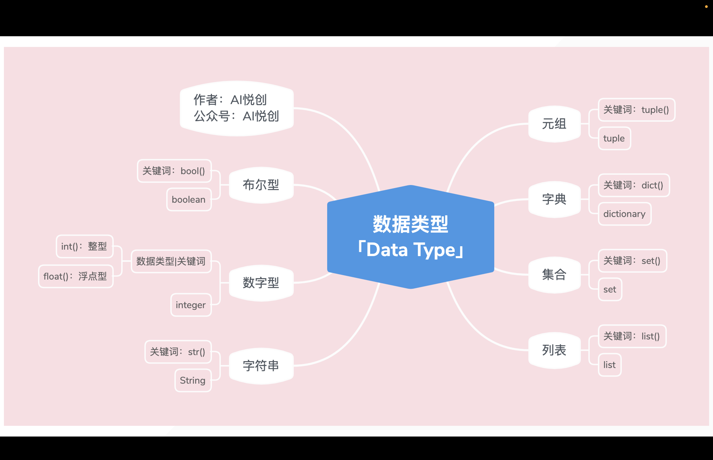
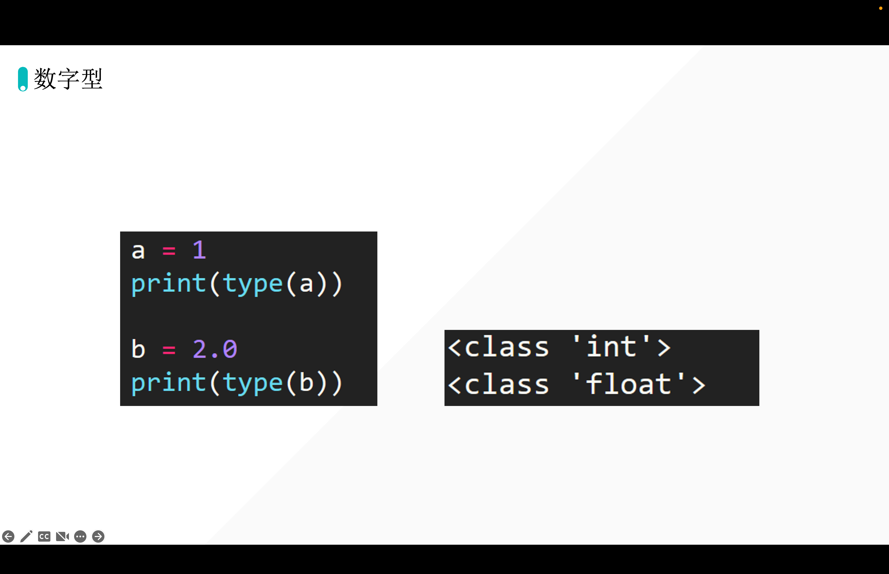
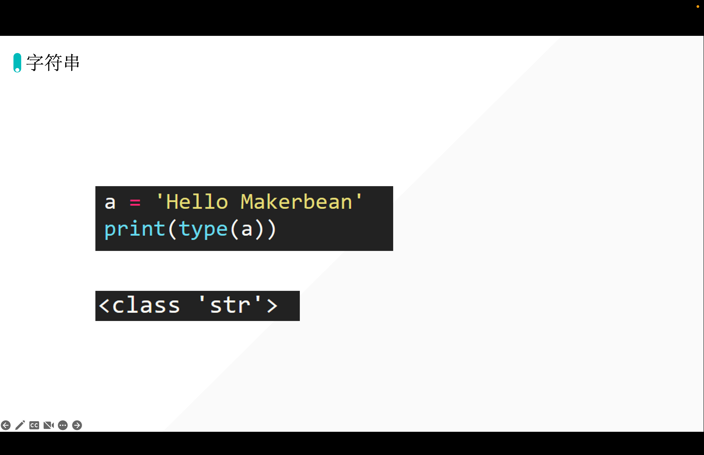
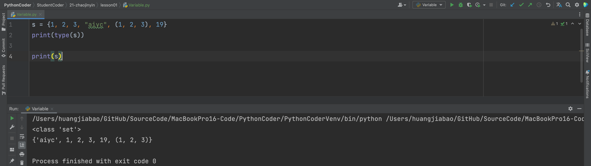
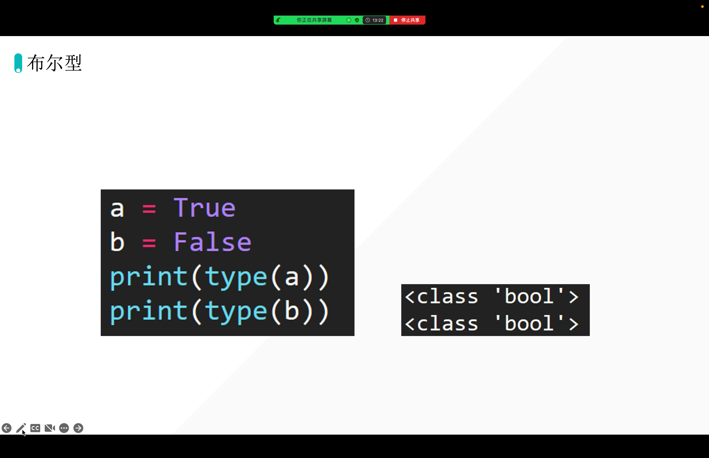

回放云盘链接：[https://www.aliyundrive.com/s/7CVjni4oR8P](https://www.aliyundrive.com/s/7CVjni4oR8P)

```bash
66-明轩
https://www.aliyundrive.com/s/7CVjni4oR8P
点击链接保存，或者复制本段内容，打开「阿里云盘」APP ，无需下载极速在线查看，视频原画倍速播放。
```

你好，我是悦创。



## 数字型「int」

::: tabs

@tab 代码示例



```python
a = 1
t = type(a)
print(t)

print(type(a))
```

```python
<class 'int'>
<class 'int'>
```

```python
a = 1.1
t = type(a)
print(t)

print(type(a))
```

```python
<class 'float'>
<class 'float'>
```

:::

## 字符串「str」

::: tabs

@tab 代码示例



```python
s = "Hello AndersonHJB"
t = type(s)
print(t)

print(type(s))
```

@tab 字符串的三大特性

1. 有序性「从左到右0开始，从右到左-1开始」


2. 任意数据类型：你键盘能输入的，都可以放进字符串中。

3. 不可变性： 字符串在程序运行当中，字符串不能被改变。

:::

## 列表「list」

::: tabs

@tab 代码示例

```python
lst = [1, 2, 3, 4, 1.1, "aiyc"]
print(lst)

print(type(lst))
```

输出：

```python
[1, 2, 3, 4, 1.1, 'aiyc']
<class 'list'>
```

@tab 列表三大特性

1. 有序性：从左到右 0 开始，从右往左 -1 开始。
2. 任意数据类型：就是 Python 的所有数据类型，都可以放入列表当中。
3. 可变性：列表在运行的过程中，可以被改变。

:::

## 元祖「tuple」

::: tabs

@tab 代码示例

```python
tup = (1, 2, 3, 4, 1.1, "aiyc", "look")
print(tup)

print(type(tup))
```

输出：

```python
(1, 2, 3, 4, 1.1, 'aiyc', 'look')
<class 'tuple'>
```

@tab 三大特性

1. 有序性
2. 任意数据类型
3. 不可变性

:::

## 字典「dict」

::: tabs

@tab 代码示例

```python
d = {"name": "Mingxuan", "age": 18, "gender": "M", 19: "lll"}
print(type(d))

print(d)
```

输出：

```python
<class 'dict'>
{'name': 'Mingxuan', 'age': 18, 'gender': 'M', 19: 'lll'}
```

@tab 字典的特性

1. 字典是由一系列的 key、value 组成的。`{key1: value1, key2: value2, key3: value3, key4: value}`
2. key 的特点：
    1. 不可变性：列表可以做自己的 key 吗？——因为，列表可变，导致列表不确定，所以不能做字典的 key。集合也不能做字典的 key。
3. value 的特点：
    1. 任意数据类型
4. 字典无序性
5. 可变性

:::

## 集合「set」

::: tabs

@tab 代码示例

```python
s = {1, 2, 3, "aiyc", (1, 2, 3), 19}
print(type(s))

print(s)
```

输出：

```python
<class 'set'>
{1, 2, 3, 19, 'aiyc', (1, 2, 3)}
```

@tab 集合的三大特性

1. 确定性：每一个值都必须是确定的；「列表可以做集合的值吗？——不能做集合的值。字典也不行
2. 无序性：没有顺序



3. 互异性：去重

```python
s = {1, 2, 3, "aiyc", (1, 2, 3), 19, 1, 1, 1, 1, 1, 1, 1}
print(type(s))

print(s)
```

输出：

```python
<class 'set'>
{1, 2, 3, 19, (1, 2, 3), 'aiyc'}
```

@tab 强制转换

```python
lst = [1, 2, 3, 4, 1, 1, 1, 1, 1, 1, (1, 2, 3, 4)]
print(lst)
print(type(lst))

s = set(lst)
print(s)
print(type(s))
```

输出：

```python
[1, 2, 3, 4, 1, 1, 1, 1, 1, 1, (1, 2, 3, 4)]
<class 'list'>
{1, 2, 3, 4, (1, 2, 3, 4)}
<class 'set'>
```

:::

## 布尔型「bool」

::: tabs

@tab 代码示例



:::


::: details 公众号：AI悦创【二维码】


:::

::: info AI悦创·编程一对一

AI悦创·推出辅导班啦，包括「Python 语言辅导班、C++ 辅导班、java 辅导班、算法/数据结构辅导班、少儿编程、pygame 游戏开发、Web、Linux」，全部都是一对一教学：一对一辅导 + 一对一答疑 + 布置作业 + 项目实践等。当然，还有线下线上摄影课程、Photoshop、Premiere 一对一教学、QQ、微信在线，随时响应！微信：Jiabcdefh

C++ 信息奥赛题解，长期更新！长期招收一对一中小学信息奥赛集训，莆田、厦门地区有机会线下上门，其他地区线上。微信：Jiabcdefh

方法一：[QQ](http://wpa.qq.com/msgrd?v=3&uin=1432803776&site=qq&menu=yes)

方法二：微信：Jiabcdefh

:::


